你经常会听说软件开发和部署将变得更美好。这一趋势的当前轮回是 Heroku。不要误会我的意思，Heroku 令人难以置信，它带来了一种编写 Web 应用和部署分布式系统的新方法。他们肯定做对了很多。即使10年之后的今天，我们仍在努力实现同样的开发便利性。

Heroku 的联合创始人 Adam Wiggins 有一篇著名文章， 12 因素应用方法，它总结了许多有用并且我确信使得构建 Heroku 更有趣和有益的想法。

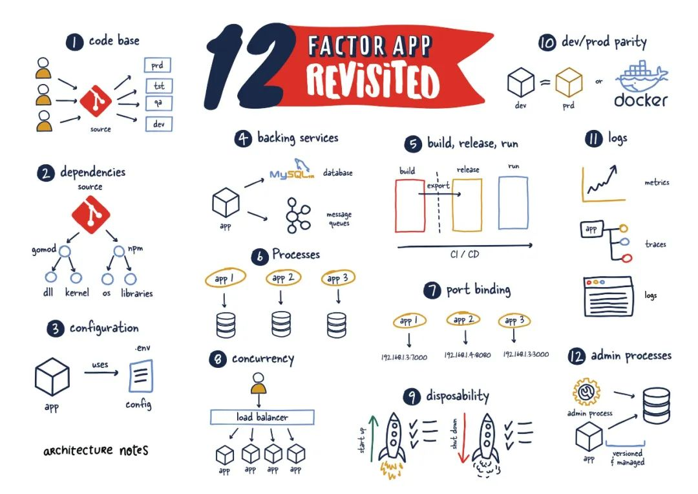

在这篇文章中，我想回顾一下 Adam 所涵盖的 12 个因素中的每一个，它们是如何演变的，我们今天可以从它们身上学到什么，以及它们如何改变了过去的状态。

## 1. **代码库**

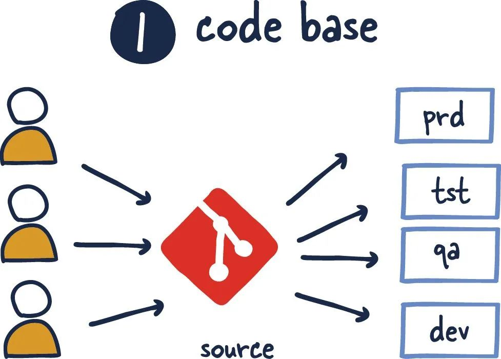

这个建议刚提出时，类似 GitHub 这样的东西才刚刚起步，代码版本控制也并不常见。这可能看起来很残酷，但这是事实。我记得刚开始时必须处理 Subversion 的问题。

代码库与其应用之间的关系显著增长，包括从测试到部署的所有内容。然而，仍然存在高度争议的一点是是否需要单仓。

如果有多个代码库，它就不是一个应用——它是一个分布式系统。分布式系统中的每个组件都是一个应用，每个组件都可以单独遵守十二因素。

尤其是在以微服务为中心的世界中，维护多个代码库所需的所有开销都可能令人厌烦。

## **
2. 依赖项**

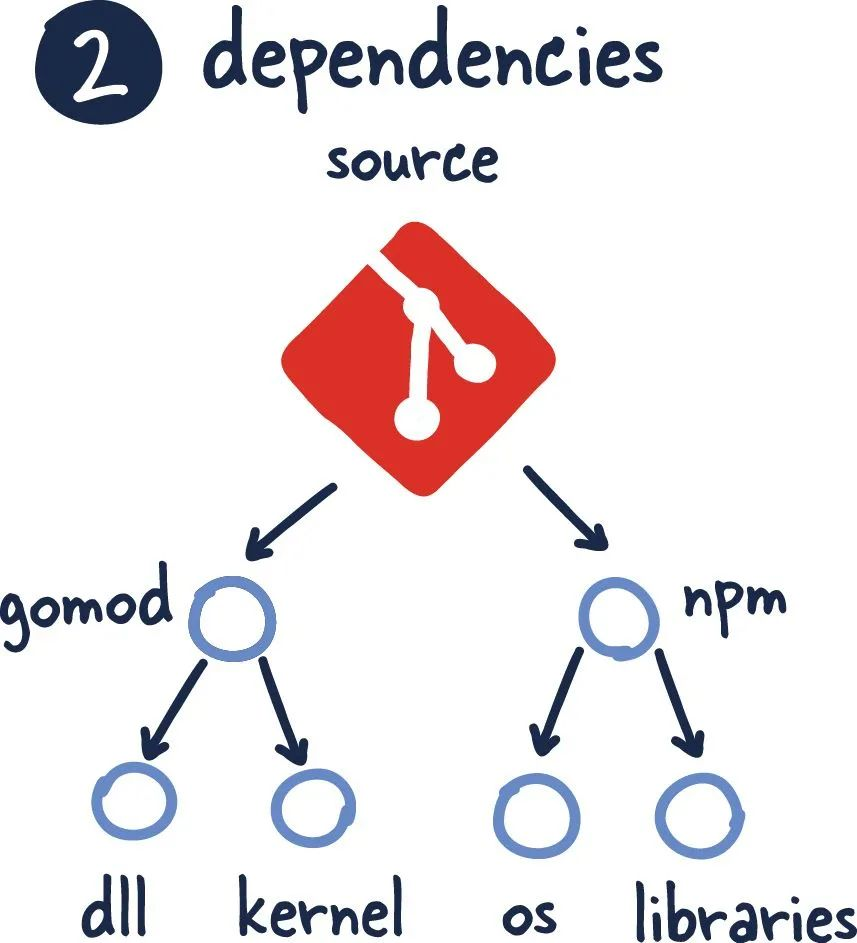

我不确定你们中有多少人曾经在 Ansible 和 Puppet 等软件可用之前处理过依赖系统。尽管如此，操作系统和各种版本的库之间的特殊性绝对是一场噩梦。

这个因素抓住了关键，最终在很大程度上使得依赖可以被视为一个已解决的问题。

通过引入各种清单文件，我们的应用可以以一致和准确的方式重新构建。此外，像 Bazel 这样的构建工具进一步包含了许多强大的工具，供构建工程师创建可重现的版本。更不用说我们现在可以发布简单的镜像，这些镜像严格打包了我们需要在生产中部署的内容（稍后会详细介绍）。

## 3. **配置**

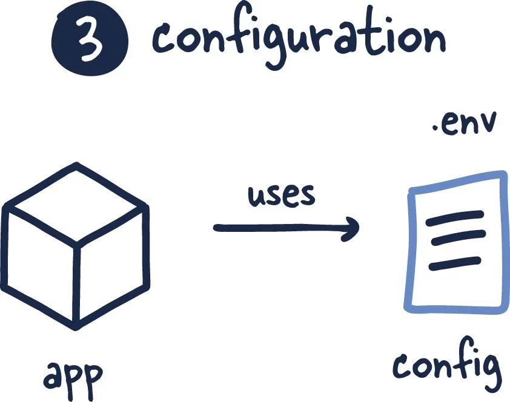

这个因素保持不变，但在确保配置与应用代码分开时需要考虑一些事项。随着工具更加成熟，这些选择正越来越多地转向诸如 Vault 或服务发现系统之类的工具，这些工具在环境感知系统中管理和存储配置。

## 3. **后端服务**

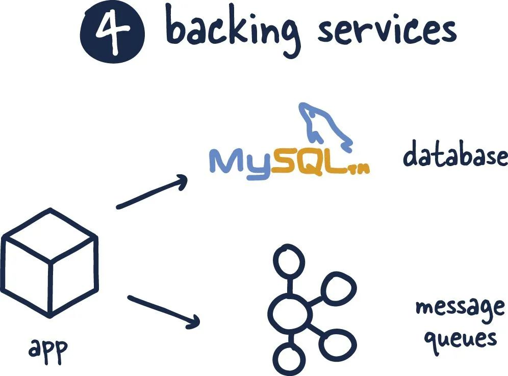

最初，这个因素主要是围绕单个系统的组件编写的，主要集中在数据库等。尽管它没有提到本地系统和第三方系统之间的任何区别，但在构建一个其他人将利用 “API 优先”方法作为平台的系统时，这一点已被进一步采用。这种方法非常成功，以至于许多团队开始采用这种策略便于在负责系统不同区域的团队之间创建一份清晰的合同。随着这些系统的发展，这最终会提高灵活性和效率。

## 5. **构建、发布、运行**

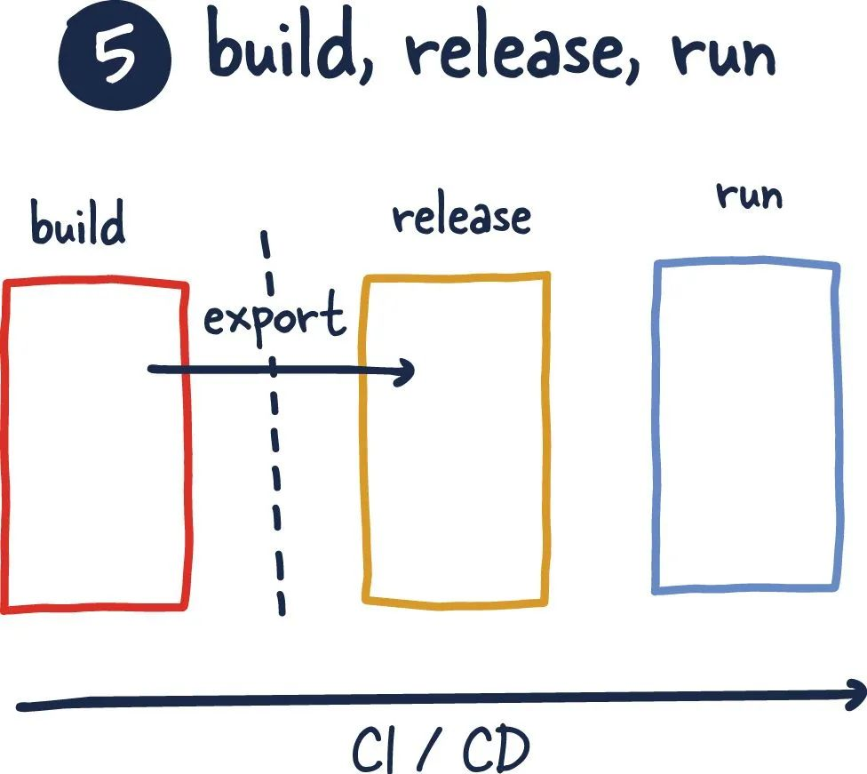

对于当今正在开发的任何现代服务而言，这个因素几乎是相同的。我想指出的是，我认为不会经常发生的事情是构建和发布步骤之间的分离，这对于进行合理的部署和回滚流程至关重要。

随着代码的合并和测试，每个构建结果镜像（或二进制文件）都应该通过某种机制存储，以便后续发布和部署。这种分离允许更简单且不易出错的开发周期。

在更小规模或更早的开发周期中，这可能没有必要，因为这些更改与应用及其基础架构的开发紧密相关。GitOps 是一个进一步讨论许多概念的领域。

## 6. **进程**

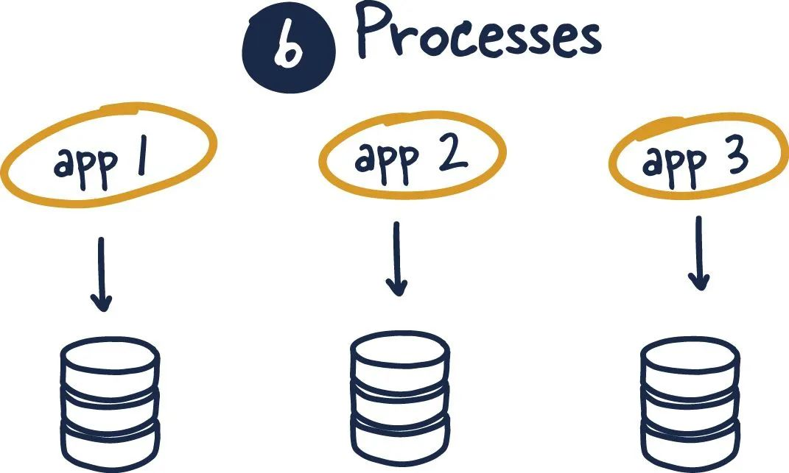

正如所写的，这个因素在 REST API 的世界中仍然很重要。在 Web 服务的情况下，这意味着我们永远不应该在请求之间在内存中保留域状态。相反，这些应用之间的所有通信都应该保持无状态或存储在另一个支持系统中。

所有系统面临的扩展问题都是状态的管理和存储。这在SaaS模型中进行横向扩展非常重要。这也与限界上下文的概念相得益彰，它确保每个系统都应该管理其存储层，如果其他系统需要访问该数据，它应该通过一个设计良好的 API 来实现。

## 7. **端口绑定**

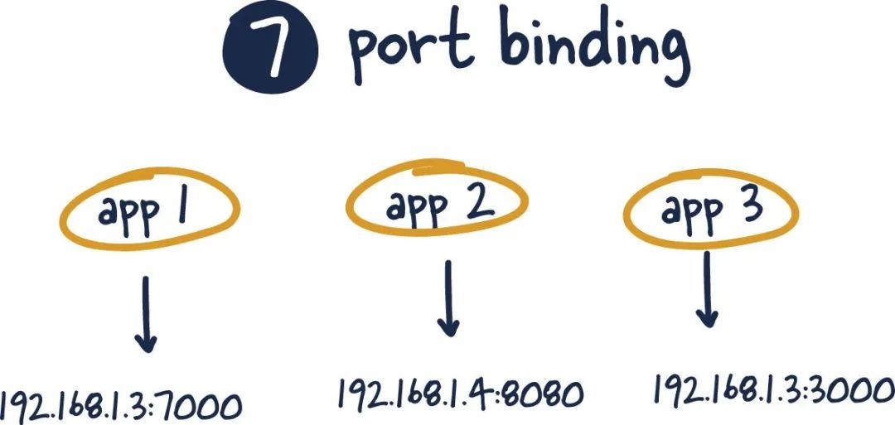

一段时间以来，这个因素一直是标准做法，这里没有任何有意义的变化。此外，许多容器化标准、代理和负载均衡器都强制执行了这一因素。

主要思想是每个应用都应该有一个特定的端口映射。

通常，所选端口可以在所述端口上传递预期的信息。这只能通过容器到主机的网络映射来实现。端口绑定的概念是，使用统一的端口号是向网络公开进程的最佳方法。例如，在 HTTP 下运行时，端口 80 是 Web 服务器的默认端口。同样，在 SSH 下运行时，端口 22 是默认的。

## 8. **并发**

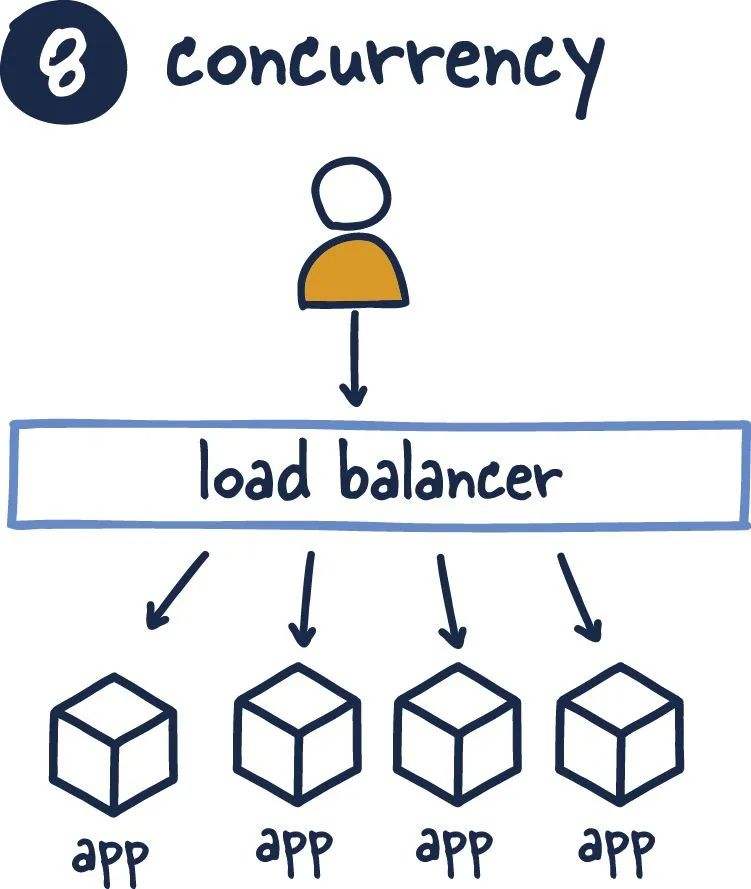

并发因素是应用应该根据其目的组织每个进程。工程师可以通过将这些进程分成不同的组来实现这一点。这个因素总结了水平扩展，以及领域新加入者，例如 FaaS 等的各种属性。例如，我们知道对于特定工作负载，大量机器比几台大型机器更有能力。

另一个关键要点是应用应该围绕它们的工作负载执行这种并发性，并且具有竞争工作负载的应用应该分开并独立扩展。

## 9. **可处置性**

在系统需要它之前，我经常看到这个因素被忽略了。启动检查对于确保系统正常运行至关重要。运行状况检查可确保系统继续处于此状态或将自身从轮换中移除。

我在关机过程中看到了同样的疏忽；它相对复杂且很难做正确，再加上古老的观点“如果我们干净地做有什么关系？它不会存活这个进程”。好吧，如果在分布式系统中没有正确结束，它可能会对依赖它的其他系统产生级联影响。此外，如果忽视可能会导致系统可靠性下降，并最终影响客户。

## 10. **开发/生产环境等价**

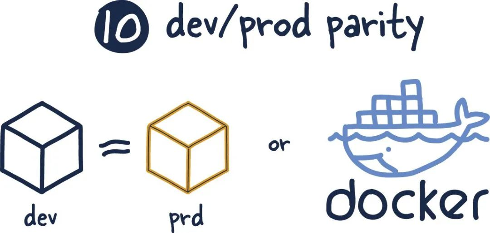

正如我所看到的，随着我们将更多的基础设施转移到供应商锁定的私有云中，这个因素正在变得更糟。当然，从操作的角度来看，像 Docker 和 Kubernetes 这样的东西让我们在这两种环境中运行我们的系统是等效的，但是当我们查看事实真相时，情况几乎就不是这样了。

那些不得不调试可在生产环境中重现的问题的人都可以让你重现这种噩梦般的情况。不幸的是，私有云提供商很少有动力公开他们的技术，事实上（作为一种服务），它是最好的卖点之一。

此外，Sisyphean 本身也在挣扎着试图将所有这些系统安装在所有开发人员都可以使用的机器上。

## 11. **日志**

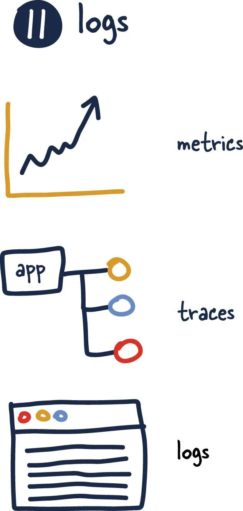

这个因素已经成为成为主业，尽管 Adam 写这个因素的方式让它看起来像是别人的问题。这主要已经从应用的输出（日志）变成了应用绝对应该关注的事情。

随着应用的发展，他们将需要跟踪日志、指标和路径，以便在其发展过程中真正了解和维护他们的系统。因此，这个因素可能需要更新以反映应用应该是可观察的，而无需修改所述系统。

## 12. **管理进程**

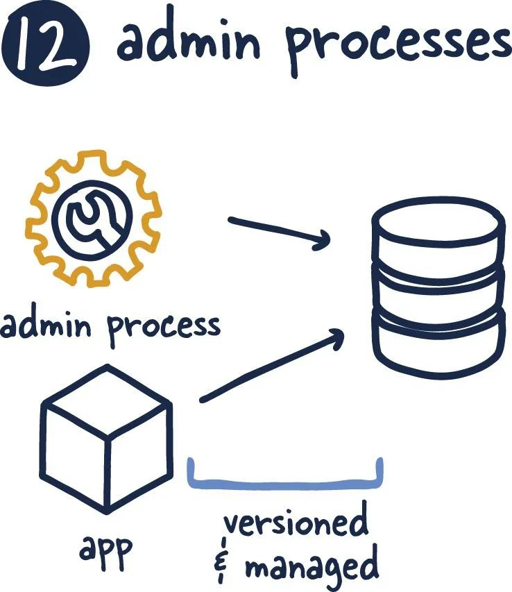

任何改变应用状态的东西都应该以与应用本身等同的进程进行管理。应该对它们进行测试和审查。当你在枪下时，很难确保这一点，而且非常容易做到。我相信这可以解释数量惊人的停电和令人不舒服的停工。

具有可用框架的更成熟的语言提供了创建和测试这些管理进程的简单机制。但是，如果你使用的语言不提供这些，则必须创建它们。这包括迁移进程、依赖关系管理，甚至是用于清理和管理的一次性过程。

 

