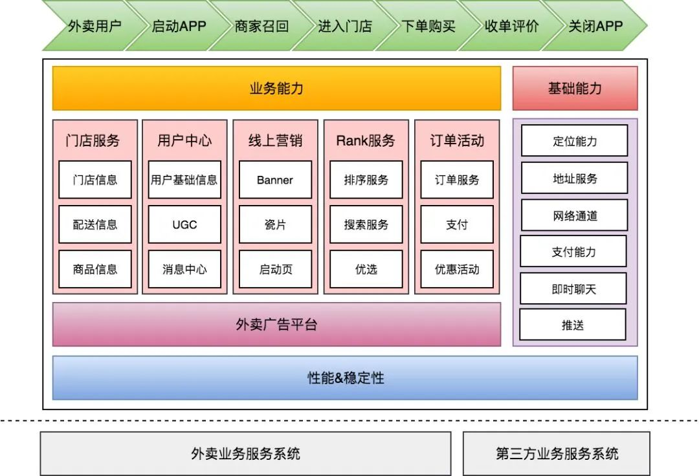
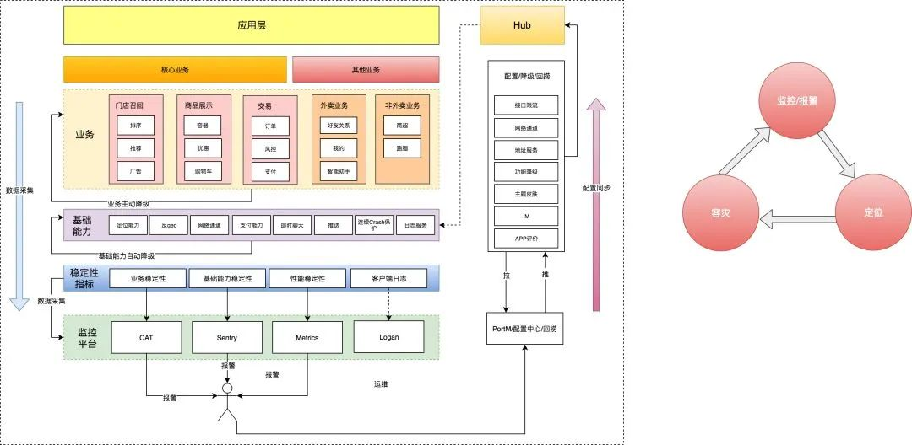
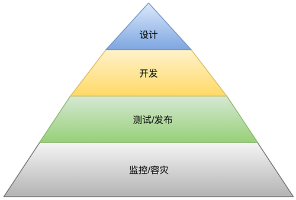
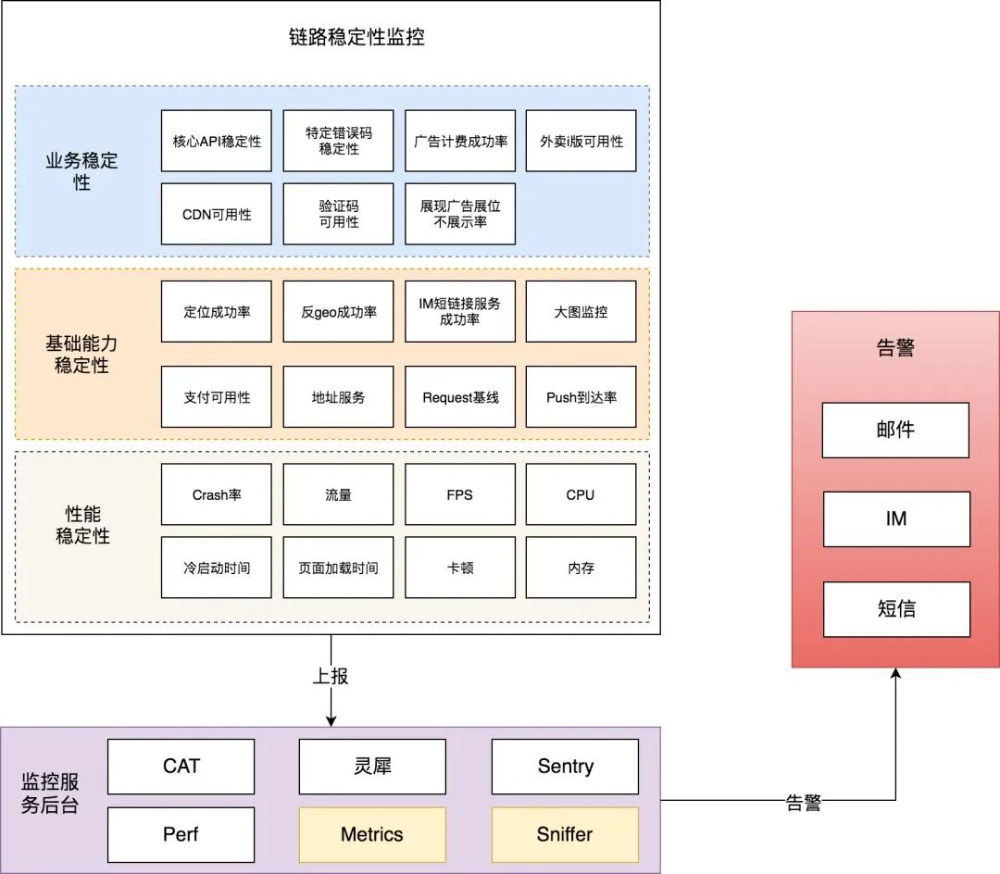
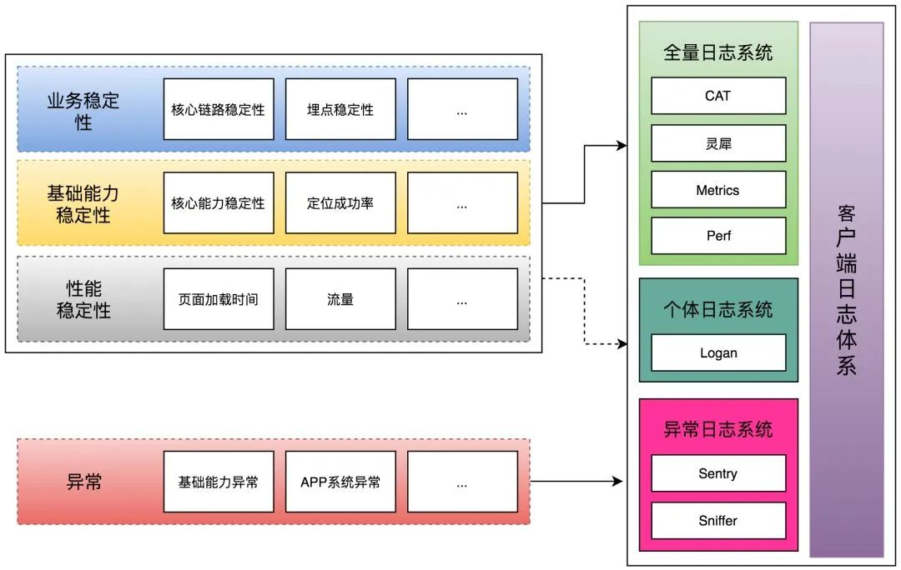
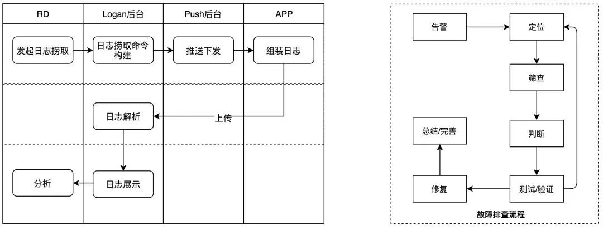
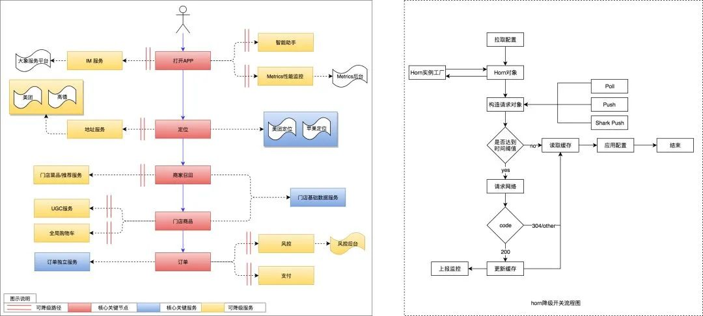
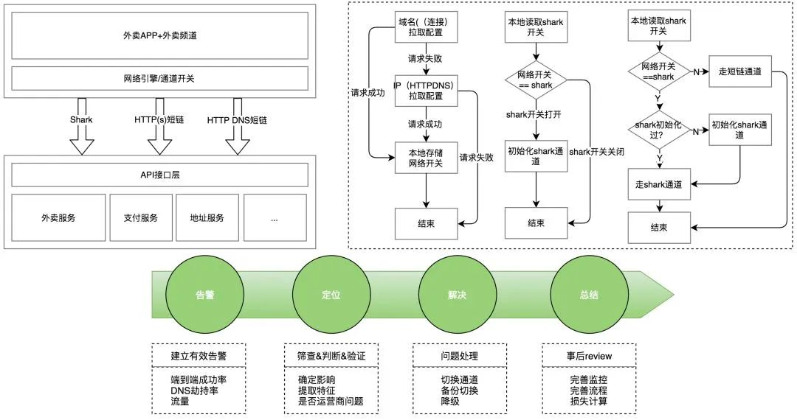
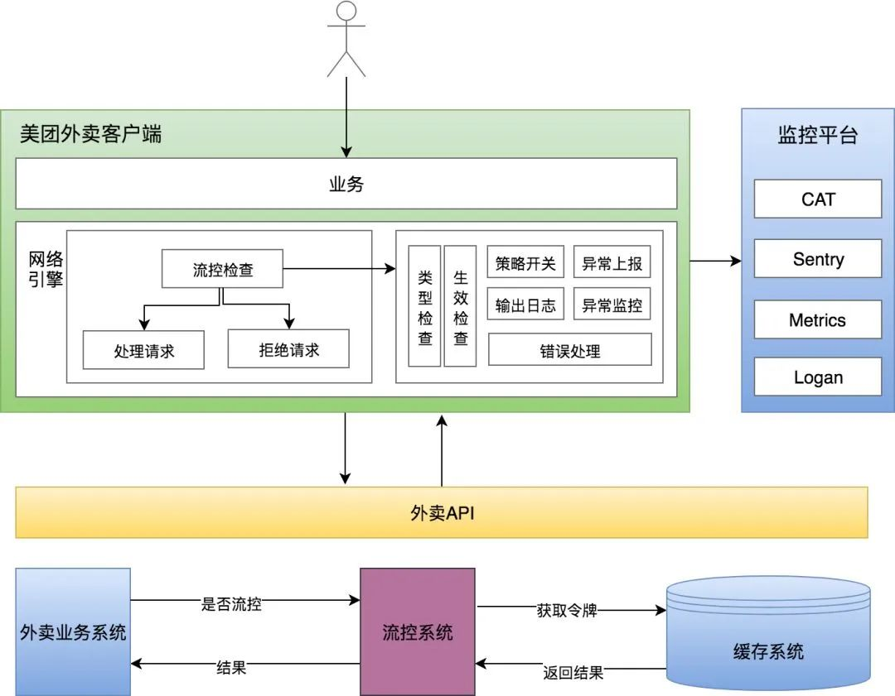
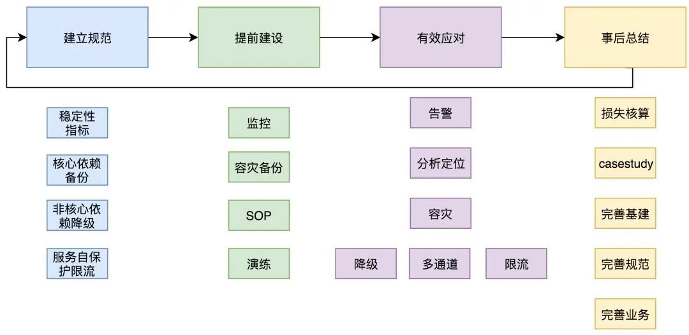

 

> 美团外卖从 2013 年 11 月开始起步，经过数年的高速发展，一直在不断地刷新着记录。2018 年 5 月 19 日，日订单量峰值突破 2000 万单，已经成为全球规模最大的外卖平台。

 

业务的快速发展对系统稳定性提出了更高的要求，如何为线上用户提供高稳定的服务体验，保障全链路业务和系统高可用运行，不仅需要后端服务支持，更需要在端上提供全面的技术保障。

而相对服务端而言，客户端运行环境千差万别，不可控因素多，面对突发问题应急能力差。

因此，构建客户端的高可用建设体系，保障服务稳定高可用，不仅是对工程师的技术挑战，也是外卖平台的核心竞争力之一。

## 高可用建设体系的思路

一个设计良好的大型客户端系统往往是由一系列各自独立的小组共同开发完成的，每一个小组都应当具有明确定义的的职责划分。

各业务模块之间推行“松耦合”开发模式，让业务模块拥有隔离式变更的能力，是一种可以同时提升开发灵活性和系统健壮性的有效手段。

下面是美团外卖整体的业务架构，以商品交易链路（门店召回，商品展示，交易）为核心方向进行建设，局部上依据业务特点和团队分工分成多个可独立运维单元单独维护。

可独立运维单元的简单性是可靠性的前提条件，这使得我们能够持续关注功能迭代，不断完成相关的工程开发任务。

**我们将问题依照生命周期划分为三个阶段：**发现、定位、解决，围绕这三个阶段的持续建设，构成了美团外卖高可用建设体系的核心。

## 美团外卖质量保障体系全景图

这是美团外卖客户端整体质量体系全景图。整体思路：监控报警，日志体系，容灾。

通过采集业务稳定性，基础能力稳定性，性能稳定性三大类指标数据并上报，使得衡量客户端系统质量的标准得以完善。

通过设立基线，应用特定业务模型对这一系列指标进行监控报警，客户端具备了分钟级感知核心链路稳定性的能力。

而通过搭建日志体系，整个系统有了提取关键线索能力，多维度快速定位问题。

当问题一旦定位，我们就能通过美团外卖的线上运维规范进行容灾操作：降级，切换通道或限流，从而保证整体的核心链路稳定性。

## 背景监控&报警

监控系统，处于整个服务可靠度层级模型的最底层，是运维一个可靠的稳定系统必不可少的重要组成部分。

为了保障全链路业务和系统高可用运行，需要在用户感知问题之前发现系统中存在的异常，离开了监控系统，我们就没有能力分辨客户端是不是在正常提供服务。

按照监控的领域方向，可以分成系统监控与业务监控：

- **系统监控，**主要用于基础能力如端到端成功率，服务响应时长，网络流量，硬件性能等相关的监控。

	系统监控侧重在无业务侵入和定制系统级别的监控，更多侧重在业务应用的底层，多属于单系统级别的监控。

- **业务监控，**侧重在某个时间区间，业务的运行情况分析。业务监控系统构建于系统监控之上，可以基于系统监控的数据指标计算，并基于特定的业务介入，实现多系统之间的数据联合与分析，并根据相应的业务模型，提供实时的业务监控与告警。

按照业务监控的时效性，可以继续将其细分成实时业务监控与离线业务监控。

- **实时业务监控，**通过实时的数据采集分析，帮助快速发现及定位线上问题，提供告警机制及介入响应（人工或系统）途径，帮助避免发生系统故障。

- **离线的业务监控，**对一定时间段收集的数据进行数据挖掘、聚合、分析，推断出系统业务可能存在的问题，帮助进行业务上的重新优化或改进的监控。

美团外卖的业务监控，大部分属于实时业务监控。借助美团统一的系统监控建设基础，美团外卖联合公司其他部门将部分监控基础设施进行了改造、共建和整合复用，并打通形成闭环（监控，日志，回捞）。

我们构建了特定符合外卖业务流程的实时业务监控，而离线的业务监控，主要通过用户行为的统计与业务数据的挖掘分析，来帮助产品设计，运营策略行为等产生影响。目前这部分监控主要由美团外卖数据组提供服务。

值得特别说明的是单纯的信息汇总展示，无需或无法立即做出介入动作的业务监控，可以称之为业务分析。

如特定区域的活动消费情况、区域订单数量、特定路径转换率、曝光点击率等，除非这些数据用来决策系统实时状态健康情况，帮助产生系统维护行为，否则这部分监控由离线来处理更合适。

我们把客户端稳定性指标分为 3 类维度：

- **业务稳定性指标**

- **基础能力稳定性指标**

- **性能稳定性指标**

对不同的指标，我们采用不同的采集方案进行提取上报，汇总到不同系统；在设定完指标后，我们就可以制定基线，并依照特定的业务模型制定报警策略。

美团外卖客户端拥有超过 40 项度量质量指标，其中 25 项指标支持分钟级别报警。

报警通道依据紧急程度支持邮件，IM 和短信三条通道。因此，我们团队具备及时发现影响核心链路稳定性的关键指标变化能力。

一个完善的监控报警系统是非常复杂的，因此在设计时一定要追求简化。以下是《Site Reliability Engineering：How Google Runs Production Systems》一书中提到的告警设置原则：

`*最能反映真实故障的规则应该可预测性强，非常可靠，并且越简单越好*`

`*不常用的数据采集，汇总以及告警配置应该定时清除（某些 SRE 团队的标准是一季度未使用即删除）*`

`*没有暴露给任何监控后台、告警规则的采集数据指标应该定时清除*`

 

**通过监控&报警系统，2017 年下半年美团外卖客户端团队共发现影响核心链路稳定性超过 20 起问题：**包括爬虫、流量、运营商 403 问题、性能问题等。目前，所有问题均已全部改造完毕。

## 日志体系

监控系统的一个重要特征是生产紧急告警。一旦出现故障，需要有人来调查这项告警，以决定目前是否存在真实故障，是否需要采取特定方法缓解故障，直至查出导致故障的问题根源。

简单定位和深入调试的过程必须要保持非常简单，必须能够被团队中任何一个人所理解。日志体系，在简化这一过程中起到了决定性作用。

美团外卖的日志体系总体分为 3 大类：

- **全量日志系统，**主要负责采集整体性指标，如网络可用性，埋点可用性。我们可以通过它了解到系统整体大盘，了解整体波动，确定问题影响范围。

- **个体日志系统，**用于提取个体用户的关键信息，从而针对性的分析特定客诉问题。

- **异常日志系统，**主要采集异常指标，如大图问题，分享失败，定位失败等。我们通过它可以迅速获取异常上下文信息，分析解决问题。

这三类日志，构成了完整的客户端日志体系。

日志的一个典型使用场景是处理单点客诉问题，解决系统潜在隐患。个体日志系统，用于简化工程师提取关键线索步骤，提升定位分析问题效率。在这一领域，美团外卖使用的是点评平台开发的 Logan 服务。

作为美团移动端底层的基础日志库，Logan 接入了集团众多日志系统，例如端到端日志、用户行为日志、代码级日志、崩溃日志等。

并且这些日志全部都是本地存储，且有多重加密机制和严格的权限审核机制，在处理用户客诉时才对数据进行回捞和分析，保证用户隐私安全。

通过设计和实施美团外卖核心链路日志方案，我们打通了用户交易流程中各系统如订单，用户中心，Crash 平台与 Push 后台之间的底层数据同步。

通过输出标准问题分析手册，针对常见个体问题的分析和处理得以标准化；通过制定日志捞取 SOP 并定期演练，线上追溯能力大幅提升，日常客诉绝大部分可在 30 分钟内定位原因。

在这一过程中，通过个体暴露出影响核心链路稳定性的问题也均已全部改进/修复。

故障排查是运维大型系统的一项关键技能。采用系统化的工具和手段而不仅仅依靠经验甚至运气，这项技能是可以自我学习，也可以内部进行传授。

## 容灾备份

针对不同级别的服务，应该采取不同的手段进行有效止损。非核心依赖，通过降级向用户提供可伸缩的服务。

而核心依赖，采用多通道方式进行依赖备份容灾，保证交易路径链路的高可用；异常流量，通过多维度限流，最大限度保证业务可用性的同时，给予用户良好的体验。

**总结成三点，即：非核心依赖降级、核心依赖备份、过载保护限流。接下来我们分别来阐述这三方面。**

### **降级**

在这里选取美团外卖客户端整体系统结构关系图来介绍非核心依赖降级建设概览。

图上中间红色部分是核心关键节点，即外卖业务的核心链路：定位，商家召回，商品展示，下单；蓝色部分，是核心链路依赖的关键服务；黄色部分，是可降级服务。

我们通过梳理依赖关系，改造前后端通讯协议，实现了客户端非核心依赖可降级。

而后端服务，通过各级缓存，屏蔽隔离策略，实现了业务模块内部可降级，业务之间可降级。这构成了美团外卖客户端整体的降级体系。

右边则是美团外卖客户端业务/技术降级开关流程图。通过推拉结合，缓存更新策略，我们能够分钟级别同步降级配置，快速止损。

目前，美团外卖客户端有超过 20 项业务/能力支持降级。通过有效降级，我们避开了 1 次 S2 级事故，多次 S3、S4 级事故。

此外，降级开关整体方案产出 SDK horn，推广至集团酒旅、金融等其他核心业务应用。

### **备份**

核心依赖备份建设上，在此重点介绍美团外卖多网络通道。网络通道，作为客户端的最核心依赖，却是整个全链路体系最不可控的部分，经常出现问题。

网络劫持，运营商故障，甚至光纤被物理挖断等大大小小的故障严重影响了核心链路的稳定性。因此，治理网络问题，必须要建设可靠的多通道备份。

这是美团外卖多网络通道备份示意图。美团外卖客户端拥有 Shark、HTTP、HTTPS、HTTP DNS 四条网络通道：整体网络以 Shark 长连通道为主通道，其余三条通道作为备份通道。

配合完备的开关切换流程，可以在网络指标发生骤降时，实现分钟级别的分城市网络通道切换。

而通过制定故障应急 SOP 并不断演练，提升了我们解决问题的能力和速度，有效应对各类网络异常。我们的网络通道开关思路也输出至集团其他部门，有效支持了业务发展。

### **限流**

服务过载是另一类典型的事故。究其原因大部分情况下都是由于少数调用方调用的少数接口性能很差，导致对应服务的性能恶化。

若调用端缺乏有效降级容错，在某些正常情况下能够降低错误率的手段，如请求失败后重试，反而会让服务进一步性能恶化，甚至影响本来正常的服务调用。

美团外卖业务在高峰期订单量已达到了相当高的规模量级，业务系统也极其复杂。

根据以往经验，在业务高峰期，一旦出现异常流量疯狂增长从而导致服务器宕机，则损失不可估量。

因此，美团外卖前后端联合开发了一套“流量控制系统”，对流量实施实时控制。

这样既能日常保证业务系统稳定运转，也能在业务系统出现问题的时候提供一套优雅的降级方案，最大限度保证业务的可用性，在将损失降到最低的前提下，给予用户良好的体验。

整套系统，后端服务负责识别打标分类，通过统一的协议告诉前端所标识类别。

而前端，通过多级流控检查，对不同流量进行区分处理：弹验证码，或排队等待，或直接处理，或直接丢弃。

面对不同场景，系统支持多级流控方案，可有效拦截系统过载流量，防止系统雪崩。

此外，整套系统拥有分接口流控监控能力，可对流控效果进行监控，及时发现系统异常。整套方案在数次异常流量增长的故障中，经受住了考验。

## 发布

随着外卖业务的发展，美团外卖的用户量和订单量已经达到了相当的量级，在线直接全量发布版本/功能影响范围大，风险高。

版本灰度和功能灰度是一种能够平滑过渡的发布方式：即在线上进行 A/B 实验，让一部分用户继续使用产品（特性）A，另一部分用户开始使用产品（特性）B。

如果各项指标平稳正常，结果符合预期，则扩大范围，将所有用户都迁移到 B 上来，否则回滚。

灰度发布可以保证系统的稳定，在初试阶段就可以发现问题，修复问题，调整策略，保证影响范围不被扩散。

美团外卖客户端在版本灰度及功能灰度已较为完善：

- **版本灰度，**iOS 采用苹果官方提供的分阶段发布方式，Android 则采用美团自研的 EVA 包管理后台进行发布。这两类发布均支持逐步放量的分发方式。

- **功能灰度，**功能发布开关配置系统依据用户特征维度（如城市，用户 ID）发布，并且整个配置系统有测试和线上两套不同环境，配合固定的上线窗口，保证上线的规范性。

对应的，相应的监控基础设施也支持分用户特征维度（如城市，用户 ID）监控，避免了那些无法在整体大盘体现的灰度异常。

此外，无论版本灰度或功能灰度，我们均有相应最小灰度周期和回滚机制，保证整个灰度发布过程可控，最小化问题影响。

## 线上运维

在故障来临时如何应对，是整个质量保障体系中最关键的环节。没有人天生就能完美的处理紧急情况，面对问题，恰当的处理需要平时不断的演练。

围绕问题的生命周期，即发现、定位、解决（预防），美团外卖客户端团队组建了一套完备的处理流程和规范来应对影响链路稳定性的各类线上问题。

整体思路：建立规范，提前建设，有效应对，事后总结，如下图：

在不同阶段用不同方式解决不同问题，事前确定完整的事故流程管理策略，并确保平稳实施，经常演练，问题的平均恢复时间大大降低，美团外卖核心链路的高稳定性才能够得以保障。

## 未来展望

当前美团外卖业务仍然处于快速增长期。伴随着业务的发展，背后支持业务的技术系统也日趋复杂。

在美团外卖客户端高可用体系建设过程中，我们希望能够通过一套智能化运维系统，帮助工程师快速、准确的识别核心链路各子系统异常，发现问题根源。

并自动执行对应的异常解决预案，进一步缩短服务恢复时间，从而避免或减少线上事故影响。

诚然，业界关于自动化运维的探索有很多，但多数都集中在后台服务领域，前端方向成果较少。

我们外卖技术团队目前也在同步的探索中，正处于基础性建设阶段，欢迎更多业界同行跟我们一起讨论、切磋。

 

*作者：陈航、富强**、**徐宏*

*简介：陈航，美团高级技术专家。2015 年加入美团，目前负责美团外卖 iOS 团队，对移动端架构演进，监控报警备份容灾，移动端线上运维等领域有深刻理解。*

*富强，美团资深工程师。2015 年加入美团，是外卖 iOS 的早期开发者之一，目前作为美团外卖 iOS 基础设施小组负责人，负责外卖基础设施及广告运营相关业务。*

*徐宏，美团高级工程师。2016 年加入美团，目前作为外卖 iOS 团队主力开发，负责移动端 APM 性能监控，高可用基础设施支撑相关推进工作。*

 

