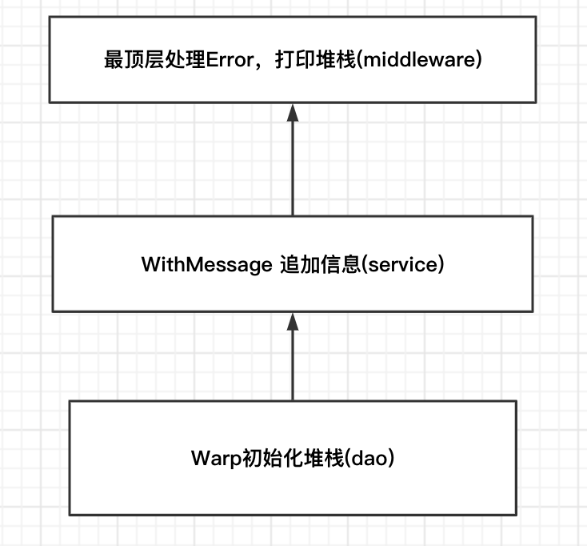
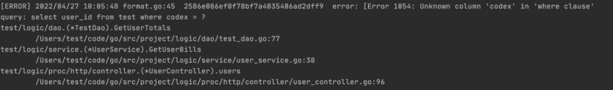

`导语 `| 错误处理一直以一是编程必需要面对的问题，错误处理如果做的好的话，代码的稳定性会很好。不同的语言有不同的出现处理的方式。Go语言也一样，在本篇文章中，我们来讨论一下Go语言的错误处理方式。

## 1、错误与异常

### 1.1）Error

错误是程序中可能出现的问题，比如连接数据库失败，连接网络失败等，在程序设计中，错误处理是业务的一部分。

Go内建一个error接口类型作为go的错误标准处理

http://golang.org/pkg/builtin/#error


```go
// 接口定义
type error interface {
   Error() string
}
```

http://golang.org/src/pkg/errors/errors.go


```plain text
// 实现
func New(text string) error {
   return &errorString{text}
}

type errorString struct {
   s string
}

func (e *errorString) Error() string {
   return e.s
}
```

### 1.2）Exception

异常是指在不该出现问题的地方出现问题，是预料之外的，比如空指针引用，下标越界，向空map添加键值等。

- 人为制造被自动触发的异常，比如：数组越界，向空map添加键值对等。

- 手工触发异常并终止异常，比如：连接数据库失败主动panic。

### 1.3）panic

对于真正意外的情况，那些表示不可恢复的程序错误，不可恢复才使用panic。对于其他的错误情况，我们应该是期望使用error来进行判定。

go源代码很多地方写panic, 但是工程实践业务代码不要主动写panic，理论上panic只存在于server启动阶段，比如config文件解析失败，端口监听失败等等，所有业务逻辑禁止主动panic，所有异步的goroutine都要用recover去兜底处理。

### 1.4）总结

理解了错误和异常的真正含义，我们就能理解Go的错误和异常处理的设计意图。传统的try...catch...结构，很容易让开发人员把错误和异常混为一谈，甚至把业务错误处理的一部分当做异常来处理，于是你会在程序中看到一大堆的catch...

Go开发团队认为错误应该明确地当成业务的一部分，任何可以预见的问题都需要做错误处理，于是在Go代码中，任何调用者在接收函数返回值的同时也需要对错误进行处理，以防遗漏任何运行时可能的错误。

异常则是意料之外的，甚至你认为在编码中不可能发生的，Go遇到异常会自动触发panic（恐慌），触发panic程序会自动退出。除了程序自动触发异常，一些你认为不可允许的情况你也可以手动触发异常。

另外，在Go中除了触发异常，还可以终止异常并可选的对异常进行错误处理，也就是说，错误和异常是可以相互转换的。

## 二、Go处理错误的三种方式

### 2.1）经典Go逻辑

直观的返回error：


```plain text
type ZooTour interface {
    Enter() error 
    VisitPanda(panda *Panda) error 
    Leave() error
}

// 分步处理，每个步骤可以针对具体返回结果进行处理
func Tour(t ZooTour1, panda *Panda) error {
    if err := t.Enter(); err != nil {
        return errors.WithMessage(err, "Enter failed.")
    }
    if err := t.VisitPanda(); err != nil {
        return errors.WithMessage(err, "VisitPanda failed.")
    }
    // ...

    return nil
}
```

### 2.2）屏蔽过程中的error的处理

将error保存到对象内部，处理逻辑交给每个方法，本质上仍是顺序执行。标准库的bufio、database/sql包中的Rows等都是这样实现的，有兴趣可以去看下源码：


```plain text
type ZooTour interface {
    Enter() error
    VisitPanda(panda *Panda) error
    Leave() error
    Err() error
}

func Tour(t ZooTour, panda *Panda) error {

    t.Enter()
    t.VisitPanda(panda)
    t.Leave()
    
    // 集中编写业务逻辑代码,最后统一处理error
    if err := t.Err(); err != nil {
        return errors.WithMessage(err, "ZooTour failed")
    }
    return nil
}
```

## 2.3）利用函数式编程延迟运行

分离关注点-遍历访问用数据结构定义运行顺序，根据场景选择，如顺序、逆序、二叉树树遍历等。运行逻辑将代码的控制流逻辑抽离，灵活调整。kubernetes中的visitor对此就有很多种扩展方式，分离了数据和行为，有兴趣可以去扩展阅读：


```plain text
type Walker interface {
    Next MyFunc
}
type SliceWalker struct {
    index int 
    funs []MyFunc
} 

func NewEnterFunc() MyFunc {
    return func(t ZooTour) error {
        return t.Enter()
    }
}

func BreakOnError(t ZooTour, walker Walker) error {
    for {
        f := walker.Next() 
        if f == nil {
            break
        }
        if err := f(t); err := nil {
          // 遇到错误break或者continue继续执行  
      }
    }
}
```

### 2.4）三种方式对比

上面这三个例子，是Go项目处理错误使用频率最高的三种方式，也可以应用在error以外的处理逻辑。

- case1: 如果业务逻辑不是很清楚，比较推荐case1；

- case2: 代码很少去改动，类似标准库，可以使用case2；

- case3: 比较复杂的场景，复杂到抽象成一种设计模式。

## 三、分层下的Error Handling

### 3.1）一个常见的三层调用

在工程实践中，以一个常见的三层架构（dao->service->controller）为例，我们常见的错误处理方式大致如下：


```plain text
// controller
if err := mode.ParamCheck(param); err != nil {
    log.Errorf("param=%+v", param)
    return errs.ErrInvalidParam
}

return mode.ListTestName("")

// service
_, err := dao.GetTestName(ctx, settleId)
    if err != nil {
    log.Errorf("GetTestName failed. err: %v", err)
    return errs.ErrDatabase
}

// dao
if err != nil {
    log.Errorf("GetTestDao failed. uery: %s error(%v)", sql, err)
}
```

### 3.2）问题总结

- 分层开发导致的处处打印日志；

- 难以获取详细的堆栈关联；

- 根因丢失。

### 3.3）Wrap erros

Go相关的错误处理方法很多，但大多为过渡方案，这里就不一一分析了（类似github.com/juju/errors库，有兴趣可以了解）。这里我以github.com/pkg/errors为例，这个也是官方Proposal的重点参考对象。

1. 错误要被日志记录；

1. 应用程序处理错误，保证100%完整性；

1. 之后不再报告当前错误（错误只被处理一次）。

github.com/pkg/errors包主要包含以下几个方法，如果我们要新生成一个错误，可以使用New函数,生成的错误，自带调用堆栈信息。如果有一个现成的error ，我们需要对他进行再次包装处理，这时候有三个函数可以选择（WithMessage/WithStack/Wrapf）。其次，如果需要对源错误类型进行自定义判断可以使用Cause,可以获得最根本的错误原因。


```plain text
// 新生成一个错误, 带堆栈信息
func New(message string) error

// 只附加新的信息
func WithMessage(err error, message string) error

// 只附加调用堆栈信息
func WithStack(err error) error

// 同时附加堆栈和信息
func Wrapf(err error, format string, args ...interface{}) error

// 获得最根本的错误原因
func Cause(err error) error
```

以常见的一个三层架构为例：



- Dao层使用Wrap上抛错误


```plain text
  if err != nil {
        if errors.Is(err, sql.ErrNoRows) {
            return nil, errors.Wrapf(ierror.ErrNotFound, "query:%s", query)
        }
        return nil, errors.Wrapf(ierror.ErrDatabase,
            "query: %s error(%v)", query, err)
    }
```

- Service层追加信息


```plain text
bills, err := a.Dao.GetName(ctx, param)
if err != nil {
    return result, errors.WithMessage(err, "GetName failed")
}
```

- MiddleWare统一打印错误日志


```plain text
// 请求响应组装
func (Format) Handle(next ihttp.MiddleFunc) ihttp.MiddleFunc {
    return func(ctx context.Context, req *http.Request, rsp *ihttp.Response) error {
        format := &format{Time: time.Now().Unix()}
        err := next(ctx, req, rsp)
        format.Data = rsp.Data
        if err != nil {
            format.Code, format.Msg = errCodes(ctx, err)
        }
        rsp.Data = format
        return nil
    }
}

// 获取错误码
func errCodes(ctx context.Context, err error) (int, string) {
    if err != nil {
        log.CtxErrorf(ctx, "error: [%+v]", err)
    }
    var myError = new(erro.IError)
    if errors.As(err, &myError) {
        return myError.Code, myError.Msg
    }

    return code.ServerError, i18n.CodeMessage(code.ServerError)
}
```

- 和其他库进行协作

如果和其他库进行协作，考虑使用errors.Wrap或者errors.Wrapf保存堆栈信息。同样适用于和标准库协作的时候。


```plain text
_, err := os.Open(path)
if err != nil {
   return errors.Wrapf(err, "Open failed. [%s]", path)
}
```

- 包内如果调用其他包内的函数，通常简单的直接return err

最终效果样例：



**关键点总结**：

- MyError作为全局error的底层实现，保存具体的错误码和错误信息；

- MyError向上返回错误时，第一次先用Wrap初始化堆栈，后续用WithMessage增加堆栈信息；

- 要判断error是否为指定的错误时，可以使用errors.Cause获取root error，再进行和sentinel error判定；

- github.com/pkg/errors和标准库的error完全兼容，可以先替换、后续改造历史遗留的代码；

- 打印error的堆栈需要用%+v，而原来的%v依旧为普通字符串方法；同时也要注意日志采集工具是否支持多行匹配；

- log error级别的打印栈，warn和info可不打印堆栈；

- 可结合统一错误码使用：

	https://google-cloud.gitbook.io/api-design-guide/errors

## 四、errgroup集中错误处理

官方的ErrGroup非常简单，其实就是解决小型多任务并发任务。基本用法golang.org/x/sync/errgroup包下定义了一个Group struct，它就是我们要介绍的ErrGroup并发原语，底层也是基于WaitGroup实现的。在使用ErrGroup时，我们要用到三个方法，分别是WithContext、Go和Wait。

### 4.1）背景

通常，在写业务代码性能优化时经常将一个通用的父任务拆成几个小任务并发执行。此时需要将一个大的任务拆成几个小任务并发执行，来提高QPS，我们需要再业务代码里嵌入以下逻辑，但这种方式存在问题：

- 每个请求都开启goroutinue，会有一定的性能开销。

- 野生的goroutinue，生命周期管理比较困难。

- 收到类似SIGQUIT信号时，无法平滑退出。

### 4.2）errgroup函数签名


```plain text
type Group
    func WithContext(ctx context.Context) (*Group, context.Context)
    func (g *Group) Go(f func() error)
    func (g *Group) Wait() error
```

整个包就一个Group结构体：

- 通过WithContext可以创建一个带取消的Group；

- 当然除此之外也可以零值的Group也可以直接使用，但是出错之后就不会取消其他的goroutine了；

- Go方法传入一个func() error内部会启动一个goroutine去处理；

- Wait类似WaitGroup的Wait方法，等待所有的goroutine结束后退出，返回的错误是一个出错的err。

### 4.3）使用案例

注意这里有一个坑，在后面的代码中不要把ctx当做父 context又传给下游，因为errgroup取消了，这个context就没用了，会导致下游复用的时候出错


```plain text
func TestErrgroup() {
   eg, ctx := errgroup.WithContext(context.Background())
   for i := 0; i < 100; i++ {
      i := i
      eg.Go(func() error {
         time.Sleep(2 * time.Second)
         select {
         case <-ctx.Done():
            fmt.Println("Canceled:", i)
            return nil
         default:
            fmt.Println("End:", i)
            return nil
         }})}
   if err := eg.Wait(); err != nil {
      log.Fatal(err)
   }
}
```

### 4.4）errgroup拓展包

B站拓展包

（https://github.com/go-kratos/kratos/blob/v0.3.3/pkg/sync/errgroup/errgroup.go）

相比官方的结构，B站的结构多出了一个函数签名管道和一个函数签名切片,并把Context直接放入了返回的Group结构，返回仅返回一个Group结构指针。


```plain text
type Group struct {
   err     error
   wg      sync.WaitGroup
   errOnce sync.Once

   workerOnce sync.Once
   ch         chan func(ctx context.Context) error
   chs        []func(ctx context.Context) error

   ctx    context.Context
   cancel func()
}

func WithContext(ctx context.Context) *Group {
   return &Group{ctx: ctx}
}
```

Go方法可以看出并不是直接起协程的（如果管道已经初始化好了），而是优先将函数签名放入管道，管道如果满了就放入切片。


```plain text
func (g *Group) Go(f func(ctx context.Context) error) {
   g.wg.Add(1)
   if g.ch != nil {
      select {
      case g.ch <- f:
      default:
         g.chs = append(g.chs, f)
      }
      return
   }
   go g.do(f)
}
```

GOMAXPROCS函数其实是起了一个并发池来控制协程数量，传入最大协程数量进行并发消费管道里的函数签名：


```plain text
func (g *Group) GOMAXPROCS(n int) {
   if n <= 0 {
      panic("errgroup: GOMAXPROCS must great than 0")
   }
   g.workerOnce.Do(func() {
      g.ch = make(chan func(context.Context) error, n)
      for i := 0; i < n; i++ {
         go func() {
            for f := range g.ch {
               g.do(f)
            }
         }()
      }
   })
}
```

整个流程梳理下来其实就是启动一个固定数量的并发池消费任务，Go函数其实是向管道中发送任务的生产者，这个设计中有意思的是他的协程生命周期的控制，他的控制方式是每发送一个任务都进行WaitGroup加一，在最后结束时的wait函数中进行等待，等待所有的请求都处理完才会关闭管道，返出错误。

<br/>

💡 备注：

- B站拓展包主要解决了官方ErrGroup的几个痛点：控制并发量、Recover住协程的Panic并打出堆栈信息。

- Go方法并发的去调用在量很多的情况下会产生死锁，因为他的切片不是线程安全的，如果要并发，并发数量一定不能过大，一旦动用了任务切片，那么很有可能就在wait方法那里hold住了。这个可以加个锁来优化。

- Wg watigroup只在Go方法中进行Add()，并没有控制消费者的并发，Wait的逻辑就是分发者都分发完成，直接关闭管道，让消费者并发池自行销毁，不去管控，一旦逻辑中有完全hold住的方法那么容易产生内存泄漏。

<br/>

<br/>

