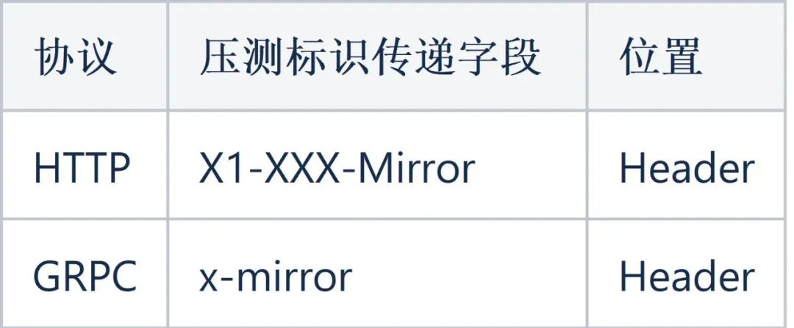
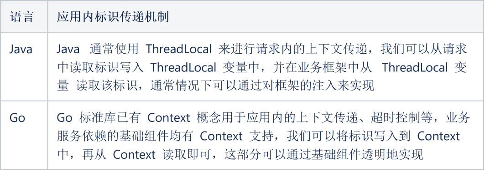
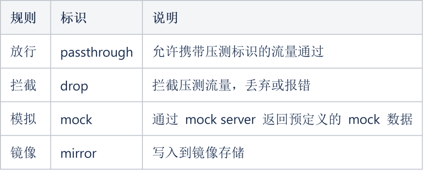
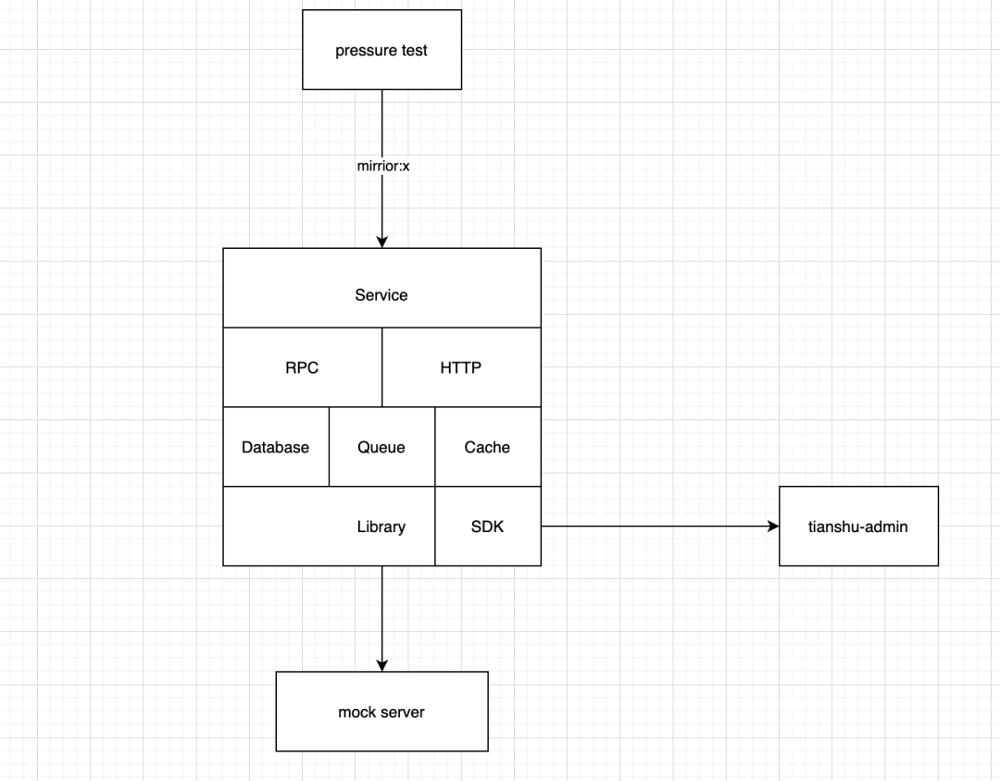
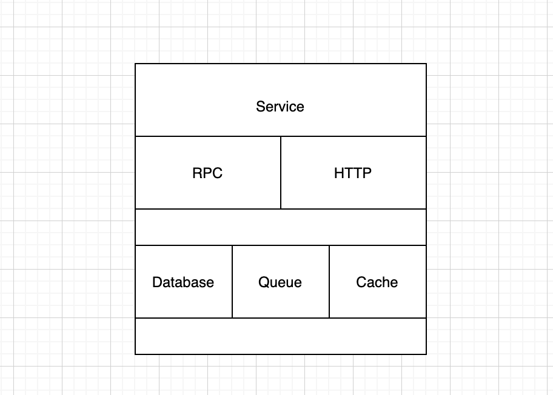
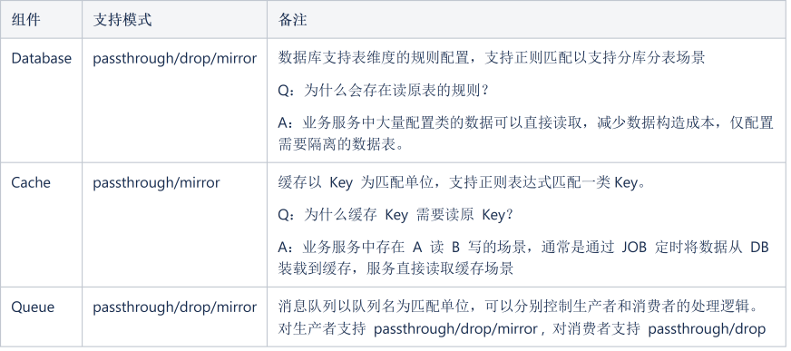
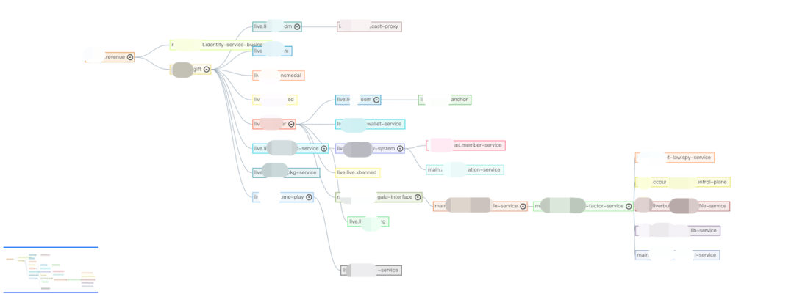
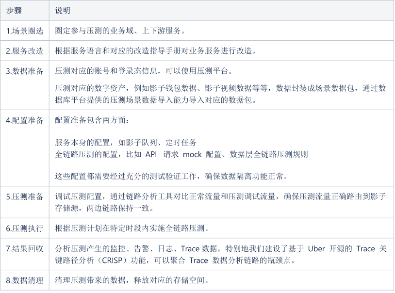

<br/>

## **01 背景**

全链路压测是在线上生产环境中通过模拟正常用户操作路径进行压力测试的一种方式，对比于我们通常的接口压测具有仿真度高、场景覆盖全等特点。过去的几年里，阿里、美团、字节等大厂均有一系列的实践技术文章进行分享公开，更有PTS全链路压测、XSea全链路压测平台、Takin全链路压测平台等商业化解决方案。站在巨人们的肩膀上，本文将基于这些成熟的实践经验并结合 B 站的基础设施来介绍我们在全链路压测的建设和落地经验。

## **02 方案选择**

我们首先看看实施全链路压测需要具备哪些能力？整体分为两部分：基础压测能力、全链路压测能力

基础压测能力是我们实施压测的核心依赖，在[《B站压测实践之压测平台的演进》](http://mp.weixin.qq.com/s?__biz=Mzg3Njc0NTgwMg==&mid=2247486677&idx=1&sn=46325046c76586d566ad1291ae12c2cb&chksm=cf2cc9f0f85b40e6e8e8a6f0cedb396382afcf5a4ccbb729c13962109de0bfd182008d0e63fe&scene=21#wechat_redirect)一文中已有介绍，核心要实现三大能力：发压能力、压测场景编辑、压测数据管理，幸运的是这些已经被我们的 Melloi 压测平台解决。

全链路压测能力是我们的压测目标对象和压测平台需要同时具备的一种能力，其核心在于全链路这三个字，进一步讲是全链路标识传递和数据隔离这两种能力。

为什么是全链路标识传递和数据隔离这两种能力？回到全链路压测的定义（在生产环境的实施的场景化压测）避免不了用户写入场景的压测，这会对生产环境产生脏数据。为了解决这个问题引入了压测标识传递和数据隔离这两种能力的需求。

### **全链路标识传递**

定义一种压测标识，并将这个标识在压测过程中沿着请求链路一直传递下去。这就是全链路标识传递需要实现的功能。

我们将压测标识定义为字符串，其取值为压测场景ID。场景 ID 关联了一个特定的压测场景，因为我们发现不同的场景下压测所需要覆盖的服务范围、压测配置会存在差异。

**请求间的标识传递**

请求间的标识传递属于 RPC 协议规范的一部分，需要在服务框架中实现客户端设置标识、请求传递标识、服务端读取标识三部分。B 站内部服务间主要是通过 HTTP / GRPC 协议进行通信，对于这两种协议我们约定了压测标识的传递格式如下（示例）：



同时在常用服务框架层面已支持标识的读取和写入，即从上下文取得标识并设置请求、从请求中取得标识并设置到上下文。

**服务内的标识传递**

业务服务在收到携带标识的请求后，在业务逻辑处理中需要将标识一直携带下去，如业务逻辑中的 RPC 请求、数据库访问、缓存访问、日志写入等等。如何在请求维度去传递标识不同的语言有不同的实现。我们以最常用的两种语言 JAVA 和 Go 举例：



**异步场景的标识传递**

这里的异步场景指常见的生产消费模型，即通过消息队列进行交互的场景。我们有两种方式来处理异步场景的标识传递。

方法1：影子队列模式，即在应用程序中识别到压测标识后将消息投递到另一个队列中。消息本身不再携带压测标识，而是通过队列名称进行区分。消费者需要同时消费正常队列和影子队列，对于影子队列使用上文提到的 服务内标识传递技术进行传递。

方法2：在消息数据结构中封装 metadata 信息，并通过 metadata 传递压测标识。对于消费者而言将会在同一个队列收到正常业务消息和携带压测标识的业务消息。业务服务在读取到携带压测标识的消息后需要构建携带标识的 Context 用于应用内标识传递。

两种方法各有其优缺点，也需要业务服务进行适配改造。

**定时任务的标识传递**

定时任务不同于业务请求，是通过时间触发而不是一个外部请求，因此无法传入标识。对于定时任务需要业务程序同时创建两个定时任务，一个是普通的业务任务，一个是用于处理压测数据的影子任务，对于影子任务可以通过配置文件管理需要注入上下文的压测标识。

### **数据隔离**

为了在全链路压测中不造成数据污染，所有涉及数据读写的场景需要针对携带压测标识的流量进行数据隔离操作。为此我们定义 4 种规则类型分别为：



4种规则分别对应于不同场景下对压测流量的处理方式。其中 passthrough 和 drop 实现比较简单，我们重点讲一下 mock 和 mirror 如何实现。

**mock**

即我们常说的 mock 服务器，在实施全链路压测中有以下几种常见需要通过 mock 服务器实现：

1. 外部的服务依赖，通常是无法支持全链路压测的第三方服务需要通过mock 的方式使压测请求能够按照普通请求的业务流程处理完成。

1. 控制压测流量的作用范围，对于在业务请求的依赖链路中但不想参与到该场景的服务或暂时无法满足要求的服务可以通过 mock 方式使压测的主场景能完整走通。

**mirror**

mirror 又叫镜像、影子，其本质是从存储角度将普通业务流量产生的数据和压测流量产生的数据区别开。对于我们常用的存储组件通常有这样一些方案可供选择：

数据库：一般来说有影子库和影子表两种方案，影子库顾名思义是将压测流量路由到另一个同构的数据库实例上；影子表则是通过 SQL PARSE 将实际执行的 SQL 改写为同构的影子表，影子表通常是通过添加特定前缀的数据表，其表结构与原表完全一致。

缓存: 通常采用影子 Key 的实现方式，与数据库的影子表模式基本一致，即将压测流量操作的 key 添加特定前缀的方案。

消息队列：采用影子队列的方式，带有压测标识的消息将被发送到影子 TOPIC ，由对应的影子消费者进行数据消费。

## **03 系统设计**

系统设计需要考虑真实业务场景的复杂度，以及尽可能减少业务在适配全链路压测过程中的改造成本。因此我们把 90% 场景对全链路压测的支持都通过基础库透明实现，业务只需要引入全链路压测 SDK 即可。同时设计了足够灵活的配置系统，进一步减少业务的在支持全链路压测的成本。



### **全链路压测配置管理**

配置管理需要管什么？我们可以从服务角度从外向内逐层解析。



**Service**：服务维度有全局压测开关，用于控制该服务是否接受压测流量。可以在压测异常的情况下通过开关快速拒绝压测流量，使服务回归正常状态。

**RPC/HTTP**：请求维度，分为服务接口和依赖服务接口，分别是服务对外提供的接口和依赖服务的接口。可以从接口维度控制压测流量的准入和禁止，我们称为传入接口控制，支持了 passthrough 和 drop 两种行为。而依赖服务接口配置则控制了服务调用其他服务时的表现，我们称为传出接口控制，支持了 passthrough/drop/mock 三种行为。

**Database/Queue/Cache**：三类我们可以统称为数据层的压测流量控制，也是全链路压测中数据隔离的关键部分。



以上配置我们统称为服务全链路压测的基准配置，在基准配置之上我们还设计了一层场景配置。所谓的场景配置是针对一个具体的业务场景关联的全链路压测配置集合，场景是由一个或多个服务构成的集合，场景内的服务需要支持全链路压测，在场景所包含的请求链路上但不在圈定场景内的服务则默认不接受压测流量。通过场景概念的抽象，我们控制了全链路压测的流量范围，实现精准的流量控制。

### **链路分析器**

链路分析器以 Dapper 记录的 Trace 信息作为数据源，在全链路压测中提供以下功能：

1. 业务场景调用链分析：如依赖服务、依赖接口，基于这些信息来圈定待压测的服务范围，对范围内的服务需要支持全链路压测，范围外的服务或接口可通过 drop 或 mock 隔离压测流量。

1. 业务依赖组件分析：分析服务使用的缓存、数据库资源，作为后续全链路压测配置的参考，以及准备对应的影子表创建和数据预装。

1. 全链路标识覆盖率分析：验证压测标识是否在整个链路完整传递。

1. 全链路配置覆盖率分析：通过链路压测调试验证配置完整覆盖整个请求链路。



### **Mock Server**

Mock Server 已有非常多的候选项，可以根据熟悉程度选择合适的开源产品或自建 mock 服务。我们在实现上对 mock server 的支持是通过嵌入 SDK 的方式实现，即通过服务框架的拦截器将命中的压测请求转发到指定的 mock 服务上。特别注意的是 mock server 需要支持动态返回，即根据请求的参数动态生成返回的数据，因为在真实业务场景中返回数据通常是跟请求数据相关联的，如 UID 匹配、数据下标对应等等。同时还需要支持对平均耗时、99分位耗时的模拟以更贴近真正的请求场景。

### **全链路压测 SDK**

我们这里以 Golang 语言为例简要说明基础库在 SDK 改造中的要点。

1. 无侵入性，所有对全链路压测的支持均在基础库实现，业务只需要使用基础库提供的标准组件即可，如 ORM库、Redis Client 等等。

1. 无 Breaking Change，SDK 接入前后对正常业务流量无影响，任何时候规则处理仅针对压测流量，不影响正常用户请求。

1. 保底安全策略，即在 无配置或压测配置服务异常情况下，业务服务默认以安全的方式处理压测流量，不产生脏数据。

**主要组件的改造思路**：

1. MySQL：我们采用的影子表方案，采用了pingcap 开源的 SQL Parser 对 SQL 进行解析和重新通过规则匹配将 SQL 操作的数据表改写为对应的影子表。

1. Cache : 主要是 Redis 和 Memcache，需要注意的是Redis 的命令非常多且不同命令的 Key 参数位置和数量也有差异，需要根据不用的命令作对应的重写处理。

1. GRPC: 分为 Client 和 Server，通过 Interceptor 机制实现拦截器即可，客户端和服务端均支持拦截器模式。

1. HTTP：与GRPC 类似地实现拦截器机制。

1. Queue：分为生产和消费者，SDK 同时建立正常的消息通道和影子消息通道，基于配置将消息投递到对应的通道。

### **基础平台支持**

完备、顺畅的全链路压测实施不仅需要压测平台和业务的支持，还需要公司现有的基础平台的配合实现，这里列举了我们在全链路压测实施中对既有平台的改造适配。

数据库平台：支持影子表的管理，一键创建、清理影子表，影子表数据包管理，可维护不同压测场景的影子表数据包，支持一键载入场景数据包到影子表。

消息队列平台：支持影子队列生产、消费的快速创建。

缓存平台：支持对影子 Key 的快速清理，便于压测后缓存空间的快速回收。

## **04 业务改造**

业务改造分为三部分：

**1. 全链路压测 SDK 接入**

我们实现了一行代码接入的方式，这部分的成本是最低的。


```plain text
import "go-common/library/mirror/mirroragent"
  
mirroragent.Init(nil)
defer mirroragent.Close()
```

**2. 特殊场景的适配**

除了上述提到的 请求/响应、生产/消费场景外，还存在定时任务场景，这部分我们也通过组件封装的形式将改造成本降为一行代码。


```plain text
cron.AddFunc("@every 15s", fun1, "loaddata", cronUtil.PreLoad())  //原JOB
cron.AddFunc("@every 15s", fun1, "loaddata", cronUtil.PreLoad(),cronUtil.Mirror("mirrorId")) //新增影子JOB
```

**3. 不兼容历史代码改造**

这部分是业务改造的难点、痛点部分，对于 Golang 而言最大的问题是 Context 的规范使用，我们已经知道全链路压测标识传递依赖于 Context 在应用内和应用间的传递。为了快速识别业务代码中 Context 中断的场景，我们开发了 Context lint 工具。不同于通常的基于 AST 的lint 工具实现，在深入分析 Golang 编译过程后我们基于 SSA 实现了调用链的 Context 中断检查，支持了以下模式：

1. 检查 ctx 是否为函数的第一个入参。

1. 检查是否在有 ctx 传入的函数中使用了 log.Info、log.Warn、log.Error。

1. 检查是否在有 ctx 传入的函数中使用了非继承的新 ctx。

1. 检查是否在有 ctx 传入的函数中调用了无需传递 ctx 的子函数，但是在子函数中又需要使用 ctx。

目前该 lint 已开源并集成到 Golangci-lint 中。

## **05 压测实施**

为了指导业务顺利实施全链路压测，我们把整个过程我们总结为了 8 个步骤，并针对每个步骤提供了对应的指导手册和平台使用指南以便业务顺利实施全链路压测。



业务在接入全链路压测后，通过全链路压测能力在线上真实环境压测发现了10+ 线上问题，如配置错误、慢查询、锁冲突等等。以直播营收系统为例，在同等资源下对压测发现的瓶颈点优化后系统 TPS 提升 140%，有效地保障了大型活动中服务的稳定性。

<br/>

**参考资料**

[1] 阿里怎么做双 11 全链路压测？(https://www.infoq.cn/article/xe6durkfvpxk20c5egosa)

[2] 字节跳动全链路压测 (Rhino) 的实践 (https://www.infoq.cn/article/O9i6BfecBm3TI5htfM1r/)

[3] 首款生产环境全链路压测平台——Takin开源啦！(https://news.shulie.io/?p=3024)

[4] CRISP: Critical Path Analysis for Microservice Architectures (https://eng.uber.com/crisp-critical-path-analysis-for-microservice-architectures/)

[5] https://golangci-lint.run/usage/linters/

