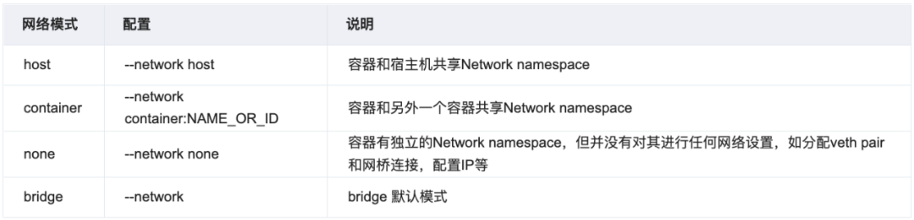
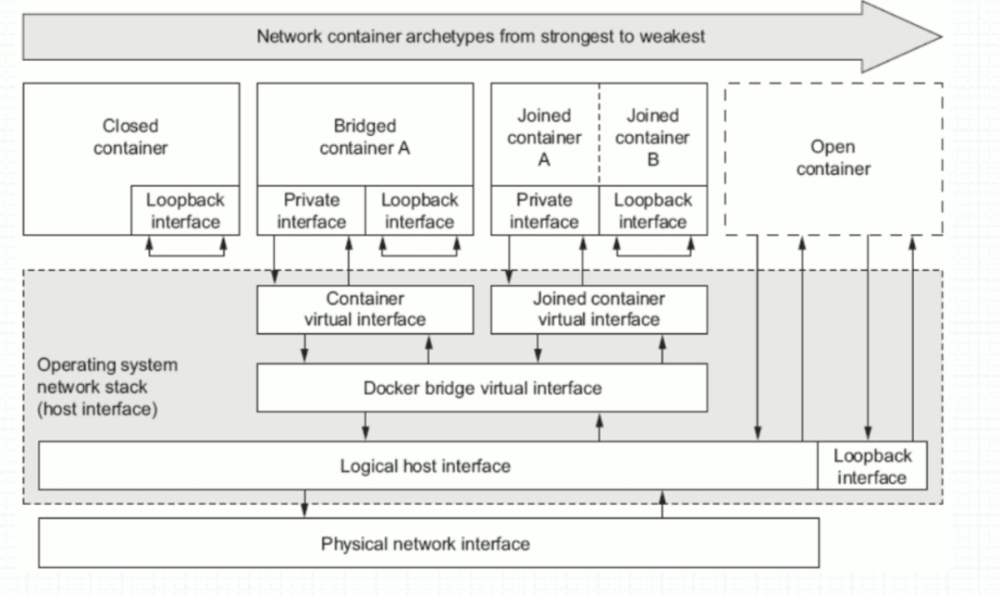
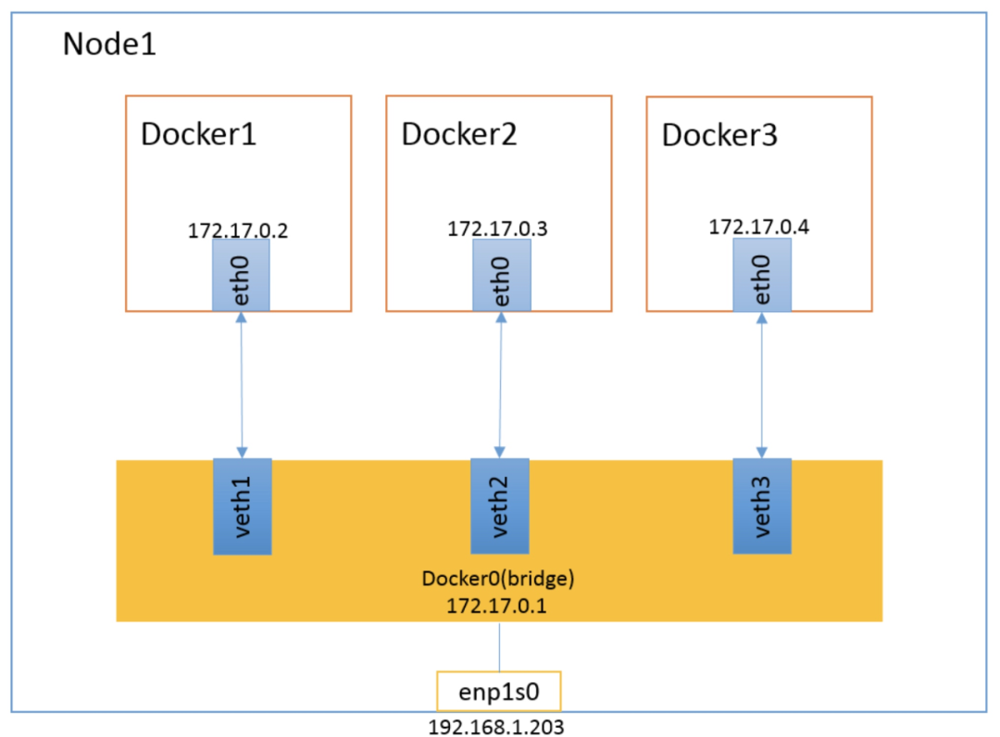
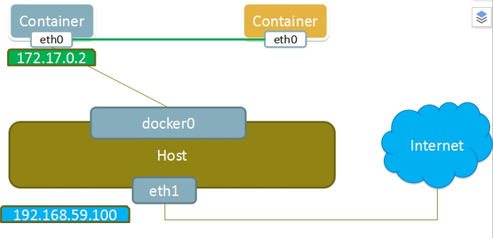
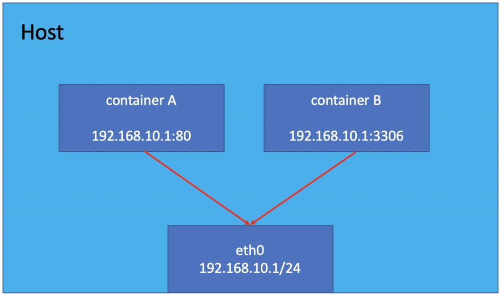
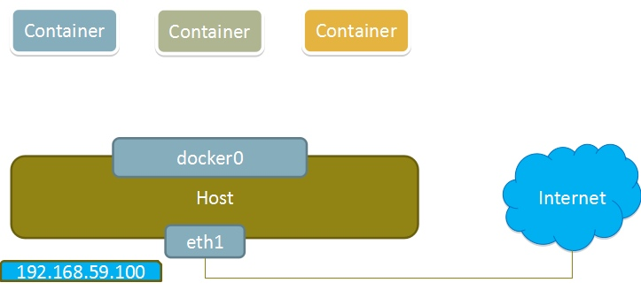
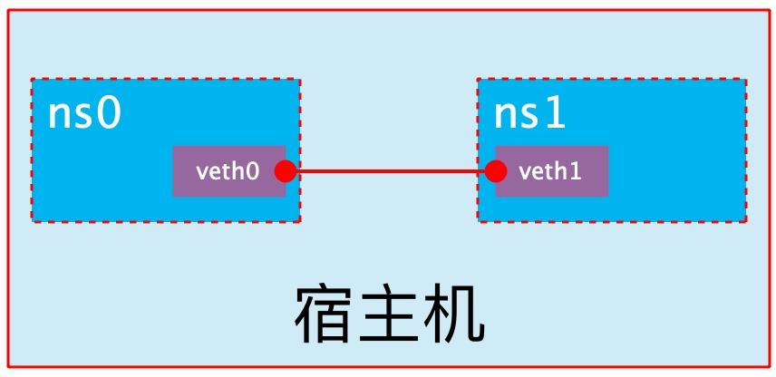

## docker 容器网络

Docker 在安装后自动提供 3 种网络，可以使用 docker network ls 命令查看


```plain text
[root@localhost ~]# docker network ls
NETWORK ID          NAME                DRIVER              SCOPE
cd97bb997b84        bridge              bridge              local
0a04824fc9b6        host                host                local
4dcb8fbdb599        none                null                local

```

Docker 使用 `Linux 桥接`，在宿主机虚拟一个 Docker `容器网桥(docker0)`，Docker 启动一个容器时会根据 Docker 网桥的网段分配给容器一个 IP 地址，称为 Container-IP，同时 Docker 网桥是每个容器的默认网关。因为在同一宿主机内的容器都接入同一个网桥，这样容器之间就能够通过容器的 Container-IP 直接通信。

## docker 的 4 种网络模式





### bridge 模式

当 Docker 进程启动时，会在主机上创建一个名为 docker0 的虚拟网桥，此主机上启动的 Docker 容器会连接到这个虚拟网桥上。虚拟网桥的工作方式和物理交换机类似，这样主机上的所有容器就通过交换机连在了一个二层网络中。

从 docker0 子网中分配一个 IP 给容器使用，并设置 docker0 的 IP 地址为容器的默认网关。在主机上创建一对虚拟网卡 veth pair 设备，Docker 将 veth pair 设备的一端放在新创建的容器中，并命名为 eth0（容器的网卡），另一端放在主机中，以 vethxxx 这样类似的名字命名，并将这个网络设备加入到 docker0 网桥中。可以通过 `brctl show` 命令查看。

bridge 模式是 docker 的`默认网络模式`，不写--network 参数，就是 bridge 模式。使用 docker run -p 时，docker 实际是在 iptables 做了 DNAT 规则，实现端口转发功能。可以使用 iptables -t nat -vnL 查看。

bridge 模式如下图所示：



假设上图的 docker2 中运行了一个 nginx，大家来想几个问题：

- 同主机间两个容器间是否可以直接通信？比如在 docker1 上能不能直接访问到 docker2 的 nginx 站点？

- 在宿主机上能否直接访问到 docker2 的 nginx 站点？

- 在另一台主机上如何访问 node1 上的这个 nginx 站点呢？DNAT 发布？

Docker 网桥是宿主机虚拟出来的，并不是真实存在的网络设备，外部网络是无法寻址到的，这也意味着外部网络无法通过直接 Container-IP 访问到容器。如果容器希望外部访问能够访问到，可以通过映射容器端口到宿主主机（端口映射），即 docker run 创建容器时候通过 -p 或 -P 参数来启用，访问容器的时候就通过`[宿主机 IP]:[容器端口]`访问容器。

### container 模式

这个模式指定新创建的容器和已经存在的一个容器共享一个 Network Namespace，而不是和宿主机共享。新创建的容器不会创建自己的网卡，配置自己的 IP，而是和一个指定的容器共享 IP、端口范围等。同样，两个容器除了网络方面，其他的如文件系统、进程列表等还是隔离的。两个容器的进程可以通过 IO 网卡设备通信。

container 模式如下图所示：



### host 模式

如果启动容器的时候使用 host 模式，那么这个容器将不会获得一个独立的 Network Namespace，而是和宿主机共用一个 Network Namespace。容器将不会虚拟出自己的网卡，配置自己的 IP 等，而是使用宿主机的 IP 和端口。但是，容器的其他方面，如文件系统、进程列表等还是和宿主机隔离的。

使用 host 模式的容器可以直接使用宿主机的 IP 地址与外界通信，容器内部的服务端口也可以使用宿主机的端口，不需要进行 NAT，host 最大的优势就是网络性能比较好，但是 docker host 上已经使用的端口就不能再用了，网络的隔离性不好。

Host 模式如下图所示：



### none 模式

使用 none 模式，Docker 容器拥有自己的 Network Namespace，但是，并不为 Docker 容器进行任何网络配置。也就是说，这个 Docker 容器没有网卡、IP、路由等信息。需要我们自己为 Docker 容器添加网卡、配置 IP 等。

这种网络模式下`容器只有 lo 回环网络`，没有其他网卡。none 模式可以在容器创建时通过--network none 来指定。这种类型的网络没有办法联网，封闭的网络能很好的保证容器的安全性。

**应用场景**

- 启动一个容器处理数据，比如转换数据格式

- 一些后台的计算和处理任务

none 模式如下图所示：




```plain text
docker network inspect bridge   #查看bridge网络的详细配置
```

## docker 容器网络配置

**Linux 内核实现名称空间的创建**

**ip netns 命令**

可以借助 ip netns 命令来完成对 Network Namespace 的各种操作。ip netns 命令来自于 iproute 安装包，一般系统会默认安装，如果没有的话，请自行安装。

注意：ip netns 命令修改网络配置时需要 sudo 权限。

可以通过 ip netns 命令完成对 Network Namespace 的相关操作，可以通过 ip netns help 查看命令帮助信息：


```plain text
[root@localhost ~]# ip netns help
Usage: ip netns list
       ip netns add NAME
       ip netns set NAME NETNSID
       ip [-all] netns delete [NAME]
       ip netns identify [PID]
       ip netns pids NAME
       ip [-all] netns exec [NAME] cmd ...
       ip netns monitor
       ip netns list-id

```

默认情况下，Linux 系统中是没有任何 Network Namespace 的，所以 ip netns list 命令不会返回任何信息。

**创建 Network Namespace**

通过命令创建一个名为 ns0 的命名空间：


```plain text
[root@localhost ~]# ip netns list
[root@localhost ~]# ip netns add ns0
[root@localhost ~]# ip netns list
ns0

```

新创建的 Network Namespace 会出现在/var/run/netns/目录下。如果相同名字的 namespace 已经存在，命令会报 Cannot create namespace file "/var/run/netns/ns0": File exists 的错误。


```plain text
[root@localhost ~]# ls /var/run/netns/
ns0
[root@localhost ~]# ip netns add ns0
Cannot create namespace file "/var/run/netns/ns0": File exists
```

对于每个 Network Namespace 来说，它会有自己独立的网卡、路由表、ARP 表、iptables 等和网络相关的资源。

**操作 Network Namespace**

ip 命令提供了 ip netns exec 子命令可以在对应的 Network Namespace 中执行命令。

查看新创建 Network Namespace 的网卡信息


```plain text
[root@localhost ~]# ip netns exec ns0 ip addr
1: lo: <LOOPBACK> mtu 65536 qdisc noop state DOWN group default qlen 1000
    link/loopback 00:00:00:00:00:00 brd 00:00:00:00:00:00

```

可以看到，新创建的 Network Namespace 中会默认创建一个 lo 回环网卡，此时网卡处于关闭状态。此时，尝试去 ping 该 lo 回环网卡，会提示 Network is unreachable


```plain text
[root@localhost ~]# ip netns exec ns0 ping 127.0.0.1
connect: Network is unreachable

127.0.0.1是默认回环网卡

```

通过下面的命令启用 lo 回环网卡：


```plain text
[root@localhost ~]# ip netns exec ns0 ip link set lo up
[root@localhost ~]# ip netns exec ns0 ping 127.0.0.1
PING 127.0.0.1 (127.0.0.1) 56(84) bytes of data.
64 bytes from 127.0.0.1: icmp_seq=1 ttl=64 time=0.029 ms
64 bytes from 127.0.0.1: icmp_seq=2 ttl=64 time=0.029 ms
^C
--- 127.0.0.1 ping statistics ---
2 packets transmitted, 2 received, 0% packet loss, time 1036ms
rtt min/avg/max/mdev = 0.029/0.029/0.029/0.000 ms

```

## 转移设备

我们可以在不同的 Network Namespace 之间转移设备（如 veth）。由于一个设备只能属于一个 Network Namespace ，所以转移后在这个 Network Namespace 内就看不到这个设备了。

其中，veth 设备属于可转移设备，而很多其它设备（如 lo、vxlan、ppp、bridge 等）是不可以转移的。

**veth pair**

veth pair 全称是 Virtual Ethernet Pair，是一个成对的端口，所有从这对端口一 端进入的数据包都将从另一端出来，反之也是一样。

引入 veth pair 是为了在不同的 Network Namespace 直接进行通信，利用它可以直接将两个 Network Namespace 连接起来。



**创建 veth pair**


```plain text
[root@localhost ~]# ip link add type veth
[root@localhost ~]# ip a

4: veth0@veth1: <BROADCAST,MULTICAST,M-DOWN> mtu 1500 qdisc noop state DOWN group default qlen 1000
    link/ether 0a:f4:e2:2d:37:fb brd ff:ff:ff:ff:ff:ff
5: veth1@veth0: <BROADCAST,MULTICAST,M-DOWN> mtu 1500 qdisc noop state DOWN group default qlen 1000
    link/ether 5e:7e:f6:59:f0:4f brd ff:ff:ff:ff:ff:ff

```

可以看到，此时系统中新增了一对 veth pair，将 veth0 和 veth1 两个虚拟网卡连接了起来，此时这对 veth pair 处于”未启用“状态。

**实现 Network Namespace 间通信**

下面我们利用 veth pair 实现两个不同的 Network Namespace 之间的通信。刚才我们已经创建了一个名为 ns0 的 Network Namespace，下面再创建一个信息 Network Namespace，命名为 ns1


```plain text
[root@localhost ~]# ip netns add ns1
[root@localhost ~]# ip netns list
ns1
ns0
```

然后我们将 veth0 加入到 ns0，将 veth1 加入到 ns1


```plain text
[root@localhost ~]# ip link set veth0 netns ns0
[root@localhost ~]# ip link set veth1 netns ns1

```

然后我们分别为这对 veth pair 配置上 ip 地址，并启用它们


```plain text
[root@localhost ~]# ip netns exec ns0 ip link set veth0 up
[root@localhost ~]# ip netns exec ns0 ip addr add 192.0.0.1/24 dev veth0
[root@localhost ~]# ip netns exec ns1 ip link set veth1 up
[root@localhost ~]# ip netns exec ns1 ip addr add 192.0.0.2/24 dev veth1

```

查看这对 veth pair 的状态


```plain text
[root@localhost ~]# ip netns exec ns0 ip a
1: lo: <LOOPBACK,UP,LOWER_UP> mtu 65536 qdisc noqueue state UNKNOWN group default qlen 1000
    link/loopback 00:00:00:00:00:00 brd 00:00:00:00:00:00
    inet 127.0.0.1/8 scope host lo
       valid_lft forever preferred_lft forever
    inet6 ::1/128 scope host
       valid_lft forever preferred_lft forever
4: veth0@if5: <BROADCAST,MULTICAST,UP,LOWER_UP> mtu 1500 qdisc noqueue state UP group default qlen 1000
    link/ether 0a:f4:e2:2d:37:fb brd ff:ff:ff:ff:ff:ff link-netns ns1
    inet 192.0.0.1/24 scope global veth0
       valid_lft forever preferred_lft forever
    inet6 fe80::8f4:e2ff:fe2d:37fb/64 scope link
       valid_lft forever preferred_lft forever

```


```plain text
[root@localhost ~]# ip netns exec ns1 ip a
1: lo: <LOOPBACK> mtu 65536 qdisc noop state DOWN group default qlen 1000
    link/loopback 00:00:00:00:00:00 brd 00:00:00:00:00:00
5: veth1@if4: <BROADCAST,MULTICAST,UP,LOWER_UP> mtu 1500 qdisc noqueue state UP group default qlen 1000
    link/ether 5e:7e:f6:59:f0:4f brd ff:ff:ff:ff:ff:ff link-netns ns0
    inet 192.0.0.2/24 scope global veth1
       valid_lft forever preferred_lft forever
    inet6 fe80::5c7e:f6ff:fe59:f04f/64 scope link
       valid_lft forever preferred_lft forever

```

从上面可以看出，我们已经成功启用了这个 veth pair，并为每个 veth 设备分配了对应的 ip 地址。我们尝试在 ns1 中访问 ns0 中的 ip 地址


```plain text
[root@localhost ~]# ip netns exec ns1 ping 192.0.0.1
PING 192.0.0.1 (192.0.0.1) 56(84) bytes of data.
64 bytes from 192.0.0.1: icmp_seq=1 ttl=64 time=0.033 ms
64 bytes from 192.0.0.1: icmp_seq=2 ttl=64 time=0.041 ms
^C
--- 192.0.0.1 ping statistics ---
2 packets transmitted, 2 received, 0% packet loss, time 1001ms
rtt min/avg/max/mdev = 0.033/0.037/0.041/0.004 ms
[root@localhost ~]# ip netns exec ns0 ping 192.0.0.2
PING 192.0.0.2 (192.0.0.2) 56(84) bytes of data.
64 bytes from 192.0.0.2: icmp_seq=1 ttl=64 time=0.025 ms
64 bytes from 192.0.0.2: icmp_seq=2 ttl=64 time=0.025 ms
^C
--- 192.0.0.2 ping statistics ---
2 packets transmitted, 2 received, 0% packet loss, time 1038ms
rtt min/avg/max/mdev = 0.025/0.025/0.025/0.000 ms

```

可以看到，veth pair 成功实现了两个不同 Network Namespace 之间的网络交互。

## 四种网络模式配置

bridge 模式配置


```plain text
[root@localhost ~]# docker run -it --name ti --rm busybox
/ # ifconfig
eth0      Link encap:Ethernet  HWaddr 02:42:AC:11:00:02
          inet addr:172.17.0.2  Bcast:172.17.255.255  Mask:255.255.0.0
          UP BROADCAST RUNNING MULTICAST  MTU:1500  Metric:1
          RX packets:12 errors:0 dropped:0 overruns:0 frame:0
          TX packets:0 errors:0 dropped:0 overruns:0 carrier:0
          collisions:0 txqueuelen:0
          RX bytes:1032 (1.0 KiB)  TX bytes:0 (0.0 B)

lo        Link encap:Local Loopback
          inet addr:127.0.0.1  Mask:255.0.0.0
          UP LOOPBACK RUNNING  MTU:65536  Metric:1
          RX packets:0 errors:0 dropped:0 overruns:0 frame:0
          TX packets:0 errors:0 dropped:0 overruns:0 carrier:0
          collisions:0 txqueuelen:1000
          RX bytes:0 (0.0 B)  TX bytes:0 (0.0 B)

```

在创建容器时添加--network bridge 与不加--network 选项效果是一致的


```plain text
[root@localhost ~]# docker run -it --name t1 --network bridge --rm busybox
/ # ifconfig
eth0      Link encap:Ethernet  HWaddr 02:42:AC:11:00:02
         inet addr:172.17.0.2  Bcast:172.17.255.255  Mask:255.255.0.0
         UP BROADCAST RUNNING MULTICAST  MTU:1500  Metric:1
         RX packets:8 errors:0 dropped:0 overruns:0 frame:0
         TX packets:0 errors:0 dropped:0 overruns:0 carrier:0
         collisions:0 txqueuelen:0
         RX bytes:696 (696.0 B)  TX bytes:0 (0.0 B)

lo        Link encap:Local Loopback
         inet addr:127.0.0.1  Mask:255.0.0.0
         UP LOOPBACK RUNNING  MTU:65536  Metric:1
         RX packets:0 errors:0 dropped:0 overruns:0 frame:0
         TX packets:0 errors:0 dropped:0 overruns:0 carrier:0
         collisions:0 txqueuelen:1000
         RX bytes:0 (0.0 B)  TX bytes:0 (0.0 B)

```

none 模式配置


```plain text
[root@localhost ~]# docker run -it --name t1 --network none --rm busybox
/ # ifconfig -a
lo        Link encap:Local Loopback
          inet addr:127.0.0.1  Mask:255.0.0.0
          UP LOOPBACK RUNNING  MTU:65536  Metric:1
          RX packets:0 errors:0 dropped:0 overruns:0 frame:0
          TX packets:0 errors:0 dropped:0 overruns:0 carrier:0
          collisions:0 txqueuelen:1000
          RX bytes:0 (0.0 B)  TX bytes:0 (0.0 B)

```

container 模式配置

启动第一个容器


```plain text
[root@localhost ~]# docker run -dit --name b3 busybox
af5ba32f990ebf5a46d7ecaf1eec67f1712bbef6ad7df37d52b7a8a498a592a0

[root@localhost ~]# docker exec -it b3 /bin/sh
/ # ifconfig
eth0      Link encap:Ethernet  HWaddr 02:42:AC:11:00:02
          inet addr:172.17.0.2  Bcast:172.17.255.255  Mask:255.255.0.0
          UP BROADCAST RUNNING MULTICAST  MTU:1500  Metric:1
          RX packets:11 errors:0 dropped:0 overruns:0 frame:0
          TX packets:0 errors:0 dropped:0 overruns:0 carrier:0
          collisions:0 txqueuelen:0
          RX bytes:906 (906.0 B)  TX bytes:0 (0.0 B)

```

启动第二个容器


```plain text
[root@localhost ~]# docker run -it --name b2 --rm busybox
/ # ifconfig
eth0      Link encap:Ethernet  HWaddr 02:42:AC:11:00:03
          inet addr:172.17.0.3  Bcast:172.17.255.255  Mask:255.255.0.0
          UP BROADCAST RUNNING MULTICAST  MTU:1500  Metric:1
          RX packets:6 errors:0 dropped:0 overruns:0 frame:0
          TX packets:0 errors:0 dropped:0 overruns:0 carrier:0
          collisions:0 txqueuelen:0
          RX bytes:516 (516.0 B)  TX bytes:0 (0.0 B)

```

可以看到名为 b2 的容器 IP 地址是 10.0.0.3，与第一个容器的 IP 地址不是一样的，也就是说并没有共享网络，此时如果我们将第二个容器的启动方式改变一下，就可以使名为 b2 的容器 IP 与 B3 容器 IP 一致，也即共享 IP，但不共享文件系统。


```plain text
[root@localhost ~]# docker run -it --name b2 --rm --network container:b3 busybox
/ # ifconfig
eth0      Link encap:Ethernet  HWaddr 02:42:AC:11:00:02
          inet addr:172.17.0.2  Bcast:172.17.255.255  Mask:255.255.0.0
          UP BROADCAST RUNNING MULTICAST  MTU:1500  Metric:1
          RX packets:14 errors:0 dropped:0 overruns:0 frame:0
          TX packets:0 errors:0 dropped:0 overruns:0 carrier:0
          collisions:0 txqueuelen:0
          RX bytes:1116 (1.0 KiB)  TX bytes:0 (0.0 B)

```

此时我们在b1容器上创建一个目录


```plain text
/ # mkdir /tmp/data
/ # ls /tmp
data

```

到 b2 容器上检查/tmp 目录会发现并没有这个目录，因为文件系统是处于隔离状态，仅仅是共享了网络而已。

在 b2 容器上部署一个站点


```plain text
/ # echo 'hello world' > /tmp/index.html
/ # ls /tmp
index.html
/ # httpd -h /tmp
/ # netstat -antl
Active Internet connections (servers and established)
Proto Recv-Q Send-Q Local Address           Foreign Address         State
tcp        0      0 :::80                   :::*                    LISTEN

```

在 b1 容器上用本地地址去访问此站点


```plain text
/ # wget -O - -q 172.17.0.2:80
hello world

```

host 模式配置

启动容器时直接指明模式为 host


```plain text
[root@localhost ~]# docker run -it --name b2 --rm --network host busybox
/ # ifconfig
docker0   Link encap:Ethernet  HWaddr 02:42:B8:7F:8E:2C
          inet addr:172.17.0.1  Bcast:172.17.255.255  Mask:255.255.0.0
          inet6 addr: fe80::42:b8ff:fe7f:8e2c/64 Scope:Link
          UP BROADCAST RUNNING MULTICAST  MTU:1500  Metric:1
          RX packets:3 errors:0 dropped:0 overruns:0 frame:0
          TX packets:20 errors:0 dropped:0 overruns:0 carrier:0
          collisions:0 txqueuelen:0
          RX bytes:116 (116.0 B)  TX bytes:1664 (1.6 KiB)

ens33     Link encap:Ethernet  HWaddr 00:0C:29:95:19:47
          inet addr:192.168.203.138  Bcast:192.168.203.255  Mask:255.255.255.0
          inet6 addr: fe80::2e61:1ea3:c05a:3d9b/64 Scope:Link
          UP BROADCAST RUNNING MULTICAST  MTU:1500  Metric:1
          RX packets:9626 errors:0 dropped:0 overruns:0 frame:0
          TX packets:3950 errors:0 dropped:0 overruns:0 carrier:0
          collisions:0 txqueuelen:1000
          RX bytes:3779562 (3.6 MiB)  TX bytes:362386 (353.8 KiB)

lo        Link encap:Local Loopback
          inet addr:127.0.0.1  Mask:255.0.0.0
          inet6 addr: ::1/128 Scope:Host
          UP LOOPBACK RUNNING  MTU:65536  Metric:1
          RX packets:0 errors:0 dropped:0 overruns:0 frame:0
          TX packets:0 errors:0 dropped:0 overruns:0 carrier:0
          collisions:0 txqueuelen:1000
          RX bytes:0 (0.0 B)  TX bytes:0 (0.0 B)

veth09ee47e Link encap:Ethernet  HWaddr B2:10:53:7B:66:AE
          inet6 addr: fe80::b010:53ff:fe7b:66ae/64 Scope:Link
          UP BROADCAST RUNNING MULTICAST  MTU:1500  Metric:1
          RX packets:3 errors:0 dropped:0 overruns:0 frame:0
          TX packets:19 errors:0 dropped:0 overruns:0 carrier:0
          collisions:0 txqueuelen:0
          RX bytes:158 (158.0 B)  TX bytes:1394 (1.3 KiB)

```

此时如果我们在这个容器中启动一个 http 站点，我们就可以直接用宿主机的 IP 直接在浏览器中访问这个容器中的站点了。

## 容器的常用操作

查看容器的主机名


```plain text
[root@localhost ~]# docker run -it --name t1 --network bridge --rm busybox
/ # hostname
48cb45a0b2e7

```

在容器启动时注入主机名


```plain text
[root@localhost ~]# docker run -it --name t1 --network bridge --hostname ljl --rm busybox
/ # hostname
ljl
/ # cat /etc/hosts
127.0.0.1 localhost
::1 localhost ip6-localhost ip6-loopback
fe00::0 ip6-localnet
ff00::0 ip6-mcastprefix
ff02::1 ip6-allnodes
ff02::2 ip6-allrouters
172.17.0.3 ljl
/ # cat /etc/resolv.conf
# Generated by NetworkManager
search localdomain
nameserver 192.168.203.2
/ # ping www.baidu.com
PING www.baidu.com (182.61.200.7): 56 data bytes
64 bytes from 182.61.200.7: seq=0 ttl=127 time=31.929 ms
64 bytes from 182.61.200.7: seq=1 ttl=127 time=41.062 ms
64 bytes from 182.61.200.7: seq=2 ttl=127 time=31.540 ms
^C
--- www.baidu.com ping statistics ---
3 packets transmitted, 3 packets received, 0% packet loss
round-trip min/avg/max = 31.540/34.843/41.062 ms

```

手动指定容器要使用的 DNS


```plain text
[root@localhost ~]# docker run -it --name t1 --network bridge --hostname ljl --dns 114.114.114.114 --rm busybox
/ # cat /etc/resolv.conf
search localdomain
nameserver 114.114.114.114
/ # nslookup -type=a www.baidu.com
Server:  114.114.114.114
Address: 114.114.114.114:53

Non-authoritative answer:
www.baidu.com canonical name = www.a.shifen.com
Name: www.a.shifen.com
Address: 182.61.200.6
Name: www.a.shifen.com
Address: 182.61.200.7

```

手动往/etc/hosts 文件中注入主机名到 IP 地址的映射


```plain text
[root@localhost ~]# docker run -it --name t1 --network bridge --hostname ljl --add-host www.a.com:1.1.1.1 --rm busybox
/ # cat /etc/hosts
127.0.0.1 localhost
::1 localhost ip6-localhost ip6-loopback
fe00::0 ip6-localnet
ff00::0 ip6-mcastprefix
ff02::1 ip6-allnodes
ff02::2 ip6-allrouters
1.1.1.1 www.a.com
172.17.0.3 ljl

```

开放容器端口

执行 docker run 的时候有个-p 选项，可以将容器中的应用端口映射到宿主机中，从而实现让外部主机可以通过访问宿主机的某端口来访问容器内应用的目的。

- p 选项能够使用多次，其所能够暴露的端口必须是容器确实在监听的端口。

- p 选项的使用格式：

	- p containerPort

	- 将指定的容器端口映射至主机所有地址的一个动态端口

	- p hostPort : containerPort

	- 将容器端口 containerPort 映射至指定的主机端口 hostPort

	- p ip :: containerPort

	- 将指定的容器端口 containerPort 映射至主机指定 ip 的动态端口

	- p ip : hostPort : containerPort

	- 将指定的容器端口 containerPort 映射至主机指定 ip 的端口 hostPort

动态端口指的是随机端口，具体的映射结果可使用 docker port 命令查看。


```plain text
[root@localhost ~]# docker run -dit --name web1 -p 192.168.203.138::80 httpd
e97bc1774e40132659990090f0e98a308a7f83986610ca89037713e9af8a6b9f
[root@localhost ~]# docker ps
CONTAINER ID   IMAGE     COMMAND              CREATED          STATUS          PORTS                           NAMES
e97bc1774e40   httpd     "httpd-foreground"   6 seconds ago    Up 5 seconds    192.168.203.138:49153->80/tcp   web1
af5ba32f990e   busybox   "sh"                 48 minutes ago   Up 48 minutes                                   b3
[root@localhost ~]# ss -antl
State    Recv-Q   Send-Q        Local Address:Port        Peer Address:Port   Process
LISTEN   0        128         192.168.203.138:49153            0.0.0.0:*
LISTEN   0        128                 0.0.0.0:22               0.0.0.0:*
LISTEN   0        128                    [::]:22                  [::]:*

```

以上命令执行后会一直占用着前端，我们新开一个终端连接来看一下容器的 80 端口被映射到了宿主机的什么端口上


```plain text
[root@localhost ~]# docker port web1
80/tcp -> 192.168.203.138:49153

```

由此可见，容器的 80 端口被暴露到了宿主机的 49153 端口上，此时我们在宿主机上访问一下这个端口看是否能访问到容器内的站点


```plain text
[root@localhost ~]# curl http://192.168.203.138:49153
<html><body><h1>It works!</h1></body></html>

```

iptables 防火墙规则将随容器的创建自动生成，随容器的删除自动删除规则。


```plain text
[root@localhost ~]# iptables -t nat -nvL
Chain PREROUTING (policy ACCEPT 0 packets, 0 bytes)
 pkts bytes target     prot opt in     out     source               destination
    3   164 DOCKER     all  --  *      *       0.0.0.0/0            0.0.0.0/0            ADDRTYPE match dst-type LOCAL

Chain INPUT (policy ACCEPT 0 packets, 0 bytes)
 pkts bytes target     prot opt in     out     source               destination

Chain POSTROUTING (policy ACCEPT 0 packets, 0 bytes)
 pkts bytes target     prot opt in     out     source               destination
    4   261 MASQUERADE  all  --  *      !docker0  172.17.0.0/16        0.0.0.0/0
    0     0 MASQUERADE  tcp  --  *      *       172.17.0.3           172.17.0.3           tcp dpt:80

Chain OUTPUT (policy ACCEPT 0 packets, 0 bytes)
 pkts bytes target     prot opt in     out     source               destination
    2   120 DOCKER     all  --  *      *       0.0.0.0/0           !127.0.0.0/8          ADDRTYPE match dst-type LOCAL

Chain DOCKER (2 references)
 pkts bytes target     prot opt in     out     source               destination
    1    60 RETURN     all  --  docker0 *       0.0.0.0/0            0.0.0.0/0
    1    60 DNAT       tcp  --  !docker0 *       0.0.0.0/0            192.168.203.138      tcp dpt:49153 to:172.17.0.3:80

```

将容器端口映射到指定 IP 的随机端口


```plain text
[root@localhost ~]# docker run -dit --name web1 -p 192.168.203.138::80 httpd

```

在另一个终端上查看端口映射情况


```plain text
[root@localhost ~]# docker port web1
80/tcp -> 192.168.203.138:49153

```

自定义 docker0 桥的网络属性信息

自定义 docker0 桥的网络属性信息需要修改/etc/docker/daemon.json 配置文件


```plain text
[root@localhost ~]# cd /etc/docker/
[root@localhost docker]# vim daemon.json
[root@localhost docker]# systemctl daemon-reload
[root@localhost docker]# systemctl restart docker

{
    "registry-mirrors": ["https://4hygggbu.mirror.aliyuncs.com/"],
    "bip": "192.168.1.5/24"
}
EOF

``` ```ruby
[root@localhost ~]# vim /lib/systemd/system/docker.service

ExecStart=/usr/bin/dockerd -H fd:// --containerd=/run/containerd/containerd.sock -H tcp://0.0.0.0:2375  -H unix:///var/run/docker.sock
[root@localhost ~]# systemctl daemon-reload
[root@localhost ~]# systemctl restart docker

```

在客户端上向 dockerd 直接传递“-H|--host”选项指定要控制哪台主机上的 docker 容器


```plain text
[root@localhost ~]# docker -H 192.168.203.138:2375 ps
CONTAINER ID   IMAGE     COMMAND              CREATED             STATUS          PORTS                           NAMES
e97bc1774e40   httpd     "httpd-foreground"   30 minutes ago      Up 11 seconds   192.168.203.138:49153->80/tcp   web1
af5ba32f990e   busybox   "sh"                 About an hour ago   Up 14 seconds                                   b3

```

创建新网络


```plain text
[root@localhost ~]# docker network create ljl -d bridge
883eda50812bb214c04986ca110dbbcb7600eba8b033f2084cd4d750b0436e12
[root@localhost ~]# docker network ls
NETWORK ID     NAME      DRIVER    SCOPE
0c5f4f114c27   bridge    bridge    local
8c2d14f1fb82   host      host      local
883eda50812b   ljl       bridge    local
85ed12d38815   none      null      local

```

创建一个额外的自定义桥，区别于 docker0


```plain text
[root@localhost ~]# docker network create -d bridge --subnet "192.168.2.0/24" --gateway "192.168.2.1" br0
af9ba80deb619de3167939ec5b6d6136a45dce90907695a5bc5ed4608d188b99
[root@localhost ~]# docker network ls
NETWORK ID     NAME      DRIVER    SCOPE
af9ba80deb61   br0       bridge    local
0c5f4f114c27   bridge    bridge    local
8c2d14f1fb82   host      host      local
883eda50812b   ljl       bridge    local
85ed12d38815   none      null      local

```

使用新创建的自定义桥来创建容器：


```bash
[root@localhost ~]# docker run -it --name b1 --network br0 busybox
/ # ifconfig
eth0      Link encap:Ethernet  HWaddr 02:42:C0:A8:02:02
          inet addr:192.168.2.2  Bcast:192.168.2.255  Mask:255.255.255.0
          UP BROADCAST RUNNING MULTICAST  MTU:1500  Metric:1
          RX packets:11 errors:0 dropped:0 overruns:0 frame:0
          TX packets:0 errors:0 dropped:0 overruns:0 carrier:0
          collisions:0 txqueuelen:0
          RX bytes:962 (962.0 B)  TX bytes:0 (0.0 B)
```

再创建一个容器，使用默认的 bridge 桥：


```bash
[root@localhost ~]# docker run --name b2 -it busybox
/ # ls
bin   dev   etc   home  proc  root  sys   tmp   usr   var
/ # ifconfig
eth0      Link encap:Ethernet  HWaddr 02:42:C0:A8:01:03
          inet addr:192.168.1.3  Bcast:192.168.1.255  Mask:255.255.255.0
          UP BROADCAST RUNNING MULTICAST  MTU:1500  Metric:1
          RX packets:6 errors:0 dropped:0 overruns:0 frame:0
          TX packets:0 errors:0 dropped:0 overruns:0 carrier:0
          collisions:0 txqueuelen:0
          RX bytes:516 (516.0 B)  TX bytes:0 (0.0 B)
```

<br/>

<br/>

**推荐阅读 **

[《Docker是什么？》](https://mp.weixin.qq.com/s?__biz=MzI1NzI5NDM4Mw==&mid=2247483749&idx=1&sn=ae31929089c172e3517958506b965fd8&chksm=ea18e825dd6f6133ef33e75e44ef2de766870b83174d90ad85e274467a5f58482d748c3205b1&token=1662552961&lang=zh_CN&scene=21#wechat_redirect)

[《Kubernetes是什么？》](https://mp.weixin.qq.com/s?__biz=MzI1NzI5NDM4Mw==&mid=2247483724&idx=1&sn=36d0814216e831d410db4eb4a70f0e83&chksm=ea18e80cdd6f611a2af90234f587e23edaf1ea9cff9b8c1bb442d19eea463c5a2739a2d3f2e0&token=1662552961&lang=zh_CN&scene=21#wechat_redirect)

[《Kubernetes和Docker到底有啥关系？》](https://mp.weixin.qq.com/s?__biz=MzI1NzI5NDM4Mw==&mid=2247483724&idx=2&sn=7868943b1a31fc7bc65c97110ecfc97e&chksm=ea18e80cdd6f611acfea08392e87b1cfc79791b4eafa0e88607b53ab67f2e4f80891324b9a06&token=1662552961&lang=zh_CN&scene=21#wechat_redirect)

[《教你如何快捷的查询选择网络仓库镜像tag》](https://mp.weixin.qq.com/s?__biz=MzI1NzI5NDM4Mw==&mid=2247483866&idx=1&sn=6aaa877352f533358480aabc37021f72&chksm=ea18e89add6f618c474627e635c2bf74a049704e585736041138c43a03230ef573c29ae81fc2&token=2047901948&lang=zh_CN&scene=21#wechat_redirect)

[《Docker镜像进阶：了解其背后的技术原理》](https://mp.weixin.qq.com/s?__biz=MzI1NzI5NDM4Mw==&mid=2247483747&idx=1&sn=fb2065fdc327cbdcfd2f2ab06536b5a9&chksm=ea18e823dd6f613543b2cd1983b635ed0eb419caf1418a76f00c546b9b609647ad11e3ee94c8&token=1662552961&lang=zh_CN&scene=21#wechat_redirect)

[《教你如何修改运行中的容器端口映射》](https://mp.weixin.qq.com/s?__biz=MzI1NzI5NDM4Mw==&mid=2247483813&idx=1&sn=ea95eeafb5598cab925b13e4fb308172&chksm=ea18e8e5dd6f61f3c7708dd441d2909193ac437923b0006ded6a3acac95ae08c3e97d56db605&token=92043779&lang=zh_CN&scene=21#wechat_redirect)

[《k8s学习笔记：介绍&上手》](https://mp.weixin.qq.com/s?__biz=MzI1NzI5NDM4Mw==&mid=2247483903&idx=1&sn=acfe1eae0a0e25d5338a43f7b9eb5732&chksm=ea18e8bfdd6f61a9428784e5985c6706f5e99f25e1ee1fba4d9efde1b31d97aa09d34ba9d4dc&token=2123136639&lang=zh_CN&scene=21#wechat_redirect)

[《k8s学习笔记：缩扩容&更新》](https://mp.weixin.qq.com/s?__biz=MzI1NzI5NDM4Mw==&mid=2247483928&idx=1&sn=db9f1214381dd5cedec84b9533a69f4c&chksm=ea18eb58dd6f624e3f12a4c867aa58d1cbece7bf6e537c94cc9eec9ccc8ae0680cd011567a34&token=1315810181&lang=zh_CN&scene=21#wechat_redirect)

[《Docker 基础用法和命令帮助》](https://mp.weixin.qq.com/s?__biz=MzI1NzI5NDM4Mw==&mid=2247483753&idx=1&sn=7a48dc98ccf25adf42420a552bddeb45&chksm=ea18e829dd6f613f4de7dd5f86b3883d276501841fcf17b35c38aa41cbb81fb6edb22411188b&token=1662552961&lang=zh_CN&scene=21#wechat_redirect)

[《在K8S上搭建Redis集群》](https://mp.weixin.qq.com/s?__biz=MzI1NzI5NDM4Mw==&mid=2247483933&idx=1&sn=997ba9c8b840426f80406c0f785f8b9b&chksm=ea18eb5ddd6f624b3467ab6b258cb018380f68ffcf321eb92324c77d03aa79d3cf360cbf3866&token=293543975&lang=zh_CN&scene=21#wechat_redirect)

[《灰度部署、滚动部署、蓝绿部署》](https://mp.weixin.qq.com/s?__biz=MzI1NzI5NDM4Mw==&mid=2247483938&idx=1&sn=94e070f429b8dfdab3c29121ecd89e67&chksm=ea18eb62dd6f6274d13e6217ea70b41d12993aeceb1b4955a36c7cd3547deecc16c4d36d22e3&token=845656495&lang=zh_CN&scene=21#wechat_redirect)

[《PM2实践指南》](https://mp.weixin.qq.com/s?__biz=MzI1NzI5NDM4Mw==&mid=2247483968&idx=1&sn=246d0de27f6ac8d6097eab60ffedbb1e&chksm=ea18eb00dd6f6216f4798bf11df26083dfced24294456f5137f07c38c995905336b9137eebfb&token=1908076881&lang=zh_CN&scene=21#wechat_redirect)

[《Kubernetes(k8s)底层网络原理刨析》](https://mp.weixin.qq.com/s?__biz=MzI1NzI5NDM4Mw==&mid=2247483976&idx=1&sn=12372df6b289c2195ea6f3ab0f384f02&chksm=ea18eb08dd6f621ebc87c4606b4e6928352ec0bb614c394e1b92758bd27537e3919d1b126536&token=1435050357&lang=zh_CN&scene=21#wechat_redirect)

[《容器环境下Node.js的内存管理》](https://mp.weixin.qq.com/s?__biz=MzI1NzI5NDM4Mw==&mid=2247483976&idx=1&sn=12372df6b289c2195ea6f3ab0f384f02&chksm=ea18eb08dd6f621ebc87c4606b4e6928352ec0bb614c394e1b92758bd27537e3919d1b126536&token=1435050357&lang=zh_CN&scene=21#wechat_redirect)

[《MySQL 快速创建千万级测试数据》](https://mp.weixin.qq.com/s?__biz=MzI1NzI5NDM4Mw==&mid=2247484008&idx=1&sn=ab4aa79f9d6abf1c921a3e2186ea8475&chksm=ea18eb28dd6f623e6e7ce0f6aa80980b5087f5bc493050498e575b5dfdbbe775305c5014b3f4&token=1264335813&lang=zh_CN&scene=21#wechat_redirect)

[《老司机必须懂的MySQL规范》](https://mp.weixin.qq.com/s?__biz=MzI1NzI5NDM4Mw==&mid=2247484048&idx=1&sn=49f970d4421cfd8783808c9d63379074&chksm=ea18ebd0dd6f62c68988bfb894d4e4d9e9bdc2d0d44595f5a98d2df59debfec5ea43541c23d1&token=1376660398&lang=zh_CN&scene=21#wechat_redirect)

[《Docker中Image、Container与Volume的迁移》](https://mp.weixin.qq.com/s?__biz=MzI1NzI5NDM4Mw==&mid=2247484061&idx=1&sn=1c73e0bd6a437a00b1a24fd5e884118f&chksm=ea18ebdddd6f62cbec87fd77b26f4b6bf65891aeee9b4aebf4c84f7500dd091dc41f5e6ab0a5&token=351630413&lang=zh_CN&scene=21#wechat_redirect)

[《漫画|如何用Kubernetes搞定CICD》](https://mp.weixin.qq.com/s?__biz=MzI1NzI5NDM4Mw==&mid=2247484075&idx=1&sn=0e7ffa8cfa672da587e0ea146e443c4f&chksm=ea18ebebdd6f62fda74091cb9b74af311b1e6be34a248a8d47926674d3dbb5e7817d66632bfe&token=1669482947&lang=zh_CN&scene=21#wechat_redirect)

[《写给前端的Docker实战教程》](https://mp.weixin.qq.com/s?__biz=MzI1NzI5NDM4Mw==&mid=2247484107&idx=1&sn=20a051c56622e9cd71f18f81e80be999&chksm=ea18eb8bdd6f629dd8e291c3f4a8518e856695b60caf58f6482a5ae2edf636a83969cff045a3&token=1565146668&lang=zh_CN&scene=21#wechat_redirect)

[《Linux 操作系统知识地图2.0，我看行》](https://mp.weixin.qq.com/s?__biz=MzI1NzI5NDM4Mw==&mid=2247484130&idx=1&sn=3499ae3a251e0f2599db839750a3de14&chksm=ea18eba2dd6f62b445631a5ba120e58b8e2012f7edc88313a51937c470f629a1a7c2d1547a5e&token=1930773406&lang=zh_CN&scene=21#wechat_redirect)

[《16个概念带你入门 Kubernetes》](https://mp.weixin.qq.com/s?__biz=MzI1NzI5NDM4Mw==&mid=2247484139&idx=1&sn=707150be4352b3750b2284d99f452a7a&chksm=ea18ebabdd6f62bde1fa4c64b7b1bdac944c4eb7af164f1e946f82f72cedf19b898ea96d9fda&token=1885905392&lang=zh_CN&scene=21#wechat_redirect)

[《程序员因接外包坐牢456天，长文叙述心酸真实经历》](https://mp.weixin.qq.com/s?__biz=MzI1NzI5NDM4Mw==&mid=2247484155&idx=1&sn=9238791b24ee68d82cce8cfb98f2db12&chksm=ea18ebbbdd6f62ad42363346a5876ec33e6debc7757744ec39fc90b288c4114ed316d204fefc&token=2089224243&lang=zh_CN&scene=21#wechat_redirect)

[《HTTPS 为什么是安全的？](https://mp.weixin.qq.com/s?__biz=MzI1NzI5NDM4Mw==&mid=2247484191&idx=1&sn=8213cd463e5448dc46cbac2dca9ccaa7&chksm=ea18ea5fdd6f63496e36a8147a7e62c36e8f4bc36c10e1876f8d3fc1f4f5e885351d021c99c4&token=1075485654&lang=zh_CN&scene=21#wechat_redirect)[说一下他的底层实现原理？](https://mp.weixin.qq.com/s?__biz=MzI1NzI5NDM4Mw==&mid=2247484191&idx=1&sn=8213cd463e5448dc46cbac2dca9ccaa7&chksm=ea18ea5fdd6f63496e36a8147a7e62c36e8f4bc36c10e1876f8d3fc1f4f5e885351d021c99c4&token=1075485654&lang=zh_CN&scene=21#wechat_redirect)[》](https://mp.weixin.qq.com/s?__biz=MzI1NzI5NDM4Mw==&mid=2247484191&idx=1&sn=8213cd463e5448dc46cbac2dca9ccaa7&chksm=ea18ea5fdd6f63496e36a8147a7e62c36e8f4bc36c10e1876f8d3fc1f4f5e885351d021c99c4&token=1075485654&lang=zh_CN&scene=21#wechat_redirect)

<br/>

