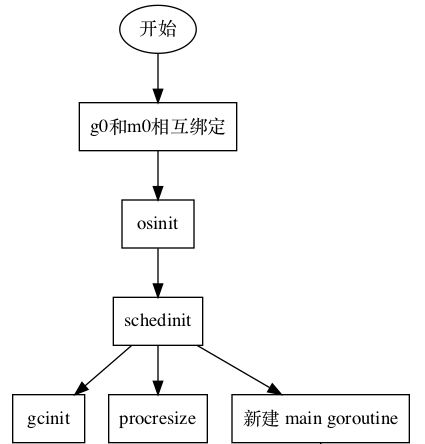
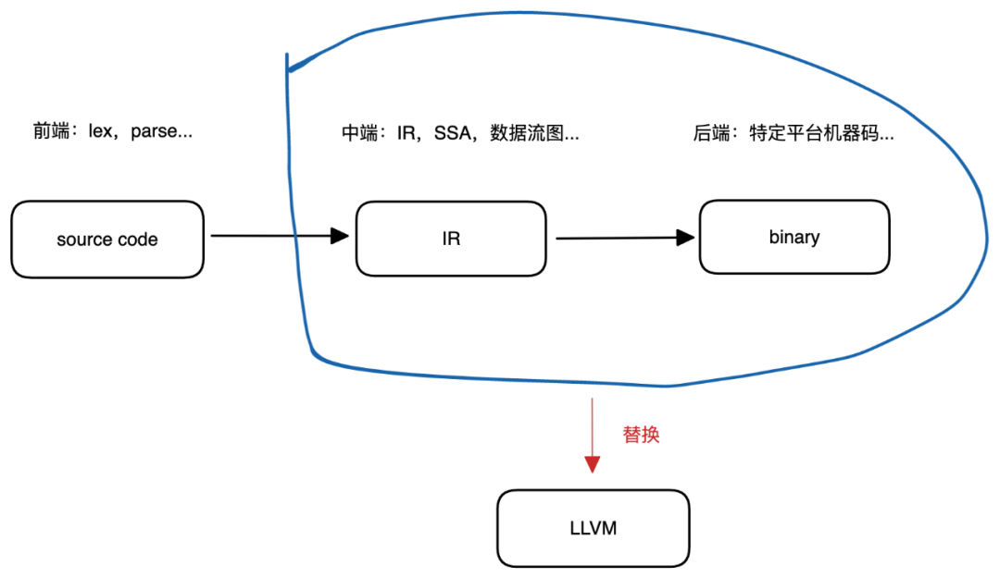

<br/>

## 一、魔法：最小化运行时(minimal runtime)

我们知道，go有一层很重的运行时(runtime)，包括内存管理、goroutine 调度等重要组件；这些组件极大地方便了应用程序的开发和迭代，但也带来了一些问题，比如：

- Go程序自动接管了内存，并自带GC，使我们无法直接操纵内存；

- Go程序自动化了内存、调度等重要模块，但这些组件本身就占用了一定资源；

- .....

对于应用程序而言，runtime是良药，能够很大程度上简化机械工作，让开发者集中于核心业务开发和迭代上，但对于一些其它场景，比如操作系统，那么runtime会严重破坏其核心资源管理能力，那么有没有方案能让go摆脱掉runtime的束缚，使其成为一个真正的系统级编程语言呢？

肯定是有的，任何一个可执行文件而言，本质上都是目标文件被链接后生成的（以下均以Linux作为实践平台）。

go编译器默认编译生成的文件，其程序的入口是runtime包中的_rt0_amd64_linux函数：


```plain text
TEXT _rt0_amd64_linux(SB),NOSPLIT,$-8
    JMP _rt0_amd64(SB)

TEXT _rt0_amd64(SB),NOSPLIT,$-8
    MOVQ    0(SP), DI   // argc
    LEAQ    8(SP), SI   // argv
    JMP runtime·rt0_go(SB)
```

经_rt0_amd64_linux入口跳转到_rt0_amd64、rt0_go；在rt0_go中，go程序会初始化一系列的内存、调度、GC等资源，如下图所示：



每个go程序都会走这么一遭，这也是其runtime很重的原因；想要规避掉 runtime，那么最好的方法肯定是从根源入手，将程序入口 _rt0_amd64_linux换掉，不再进入rt0_go函数，也就不会初始化 runtime，那么自然就能摆脱掉runtime。

既然有了正确的思路，那么实现起来也就不会难了。

首先，我们从一个简单的Hello Runtime!入手：


```plain text
// ....
func main() {
    fmt.Println("Hello Runtime!")
}
```

绝大多数情况下，我们会选择go run来运行这个简单的程序，或者使用go build来直接将其编译为可执行文件。

但这种做法无疑屏蔽了太多的细节，因此我们选择先编译、后链接的“笨”方法来做：


```plain text
$ go tool compile -p main -o main.o main.go
$ go tool pack c main.a main.o
# internal 表示使用go内置的链接器
$ go tool link -linkmode=internal main.a
```

- 使用工具compile将main.go编译为目标文件main.o；

- 使用工具pack将目标文件main.o打包为main.a；

- 使用工具link将打包文件链接，生成可执行文件a.out。

这3个命令分别生成了目标文件main.o，归档文件main.a，以及可执行文件a.out：


```plain text
$ tree -L 1 .
.
|__a.out
|__main.a
|__main.go
|__main.o
```

运行a.out：


```go
$ ./a.out
Hello Runtime!
```

这样就展示了一个程序编译、生成到运行的全过程。

为了改变程序的入口，使其摆脱runtime，我们可以这样做：

- 定义一个新的函数，比如：entry；

- 指定链接生成可执行文件时，将entry作为程序入口。

- 改造main.go文件，新增一个entry函数：


```go
//go:nosplit
//go:noescape
func entry()

func main() {
    fmt.Println("Hello Runtime!")
    entry()
}
```

这里，我们没有删掉原来的代码，而是直接新增了一个entry函数，并在main函数中调用，是为了更好的展示入口函数的作用。

entry函数体定义在一个单独的汇编文件中，如下：


```plain text
# linux 下
# main_linux_amd64.s
TEXT ·entry(SB), $0-0
    MOVL    $33,  DI
    MOVL    $60,  AX
    SYSCALL
    RET
```

entry的功能也很简单，系统调用exit退出程序，并返回退出码33。

由于很多使用MAC的同学，其对应的entry函数略有不同，如下：


```plain text
# mac 下
# main_darwin_amd64.s
TEXT ·entry(SB), $0-0
    MOVL    $33, DI
    MOVL    $(0x2000000+1), AX
    SYSCALL
    RET
```

然后，我们需要在链接时指定程序入口为entry，如下：


```plain text
$ go tool asm -gensymabis -o symabis main_linux_amd64.s
$ go tool compile -symabis symabis -p main -o x1.o main.go
$ go tool asm -o x2.o main_linux_amd64.s
$ go tool pack c x.a x1.o x2.o
$ go tool link -linkmode=internal -E 'main.entry' x.a
```

- 使用asm工具为main_linux_amd64.s生成符号文件；

- 使用compile工具编译 main.go文件，生成x1.o目标文件；

- 使用asm工具为main_linux_amd64生成目标文件x2.o；

- 使用pack工具打包x1.o，x2.o并生成x.a归档文件；

- 使用link工具链接生成a.out可执行文件。

go链接器提供E参数来设置执行文件入口，这里我们指定main.entry为程序入口，这样链接生成的文件就不会再走原来的执行流，执行结果如下：


```plain text
$ ./a.out
$ echo $?
33
```

从运行结果来看，程序并没有调用Println函数，而是直接从entry进入，调用exit后退出程序，退出码为33。

这样，程序也不会进入rt0_go中，不会初始化runtime资源，从而达到规避runtime的作用。

这种方式虽然不会初始化runtime，但由于go编译器的默认行为，runtime代码也会被打包进执行文件，因此笔者才没有说丢掉runtime，而是最小化runtime。

## 二、魔法：即时编译 JIT(just-in-time)

目前很多脚本语言都加入了即时编译的新特性。即时编译的原理很简单，那就是在运行时生成机器码，然后执行，达到提升程序性能的效果。

Python脚本是通过虚拟机(VM)以字节码的方式解释执行的。一个简单的字节码样例大致如下：


```plain text
>>> def add(x, y):
...     return x + y

>>> import dis
>>> dis.dis(add)
  2           0 LOAD_FAST                0 (x)
              2 LOAD_FAST                1 (y)
              4 BINARY_ADD
              6 RETURN_VALUE
```

这里，我们定义了一个简单的add函数，并通过dis模块来查看add函数对应的字节码。Python虚拟机是一个典型的栈机，其字节码执行都是基于栈来执行的，以add为例：


```plain text
0 LOAD_FAST                0 (x)
2 LOAD_FAST                1 (y)
4 BINARY_ADD
6 RETURN_VALUE
```

LOAD_FAST指令会从局部变量中拿到变量值并入栈，这里会将x，y入栈，然后调用BINARY_ADD指令将栈顶的两个值出栈、相加后将结果再入栈，最后调用RETURN_VALUE指令将栈顶值返回。

如下图所示：


与直接运行机器码相比，字节码执行具有良好的跨平台性，一次编译，处处运行（装有Python虚拟机的前提下），但也损耗了一定的性能。

而`即时编译`会在程序运行时，将字节码编译为机器码运行，一定程度上补偿了这种损耗。

下面，我们就用go来实现一个简单的Python JIT编译器来领略即时编译的魅力。

虽然简单明了，但实现却很复杂，我们只会实现一个简单的JIT编译器，它会将类似下面的Python函数即时编译为机器码，然后写入内存并执行：


```plain text
def foo(x, y):
    return x * x - y * y
```

这个函数会进行简单的四则运算，并将结果返回。其对应的字节码如下：


```plain text
0 LOAD_FAST                0 (x)
2 LOAD_FAST                0 (x)
4 BINARY_MULTIPLY
6 LOAD_FAST                1 (y)
8 LOAD_FAST                1 (y)
10 BINARY_MULTIPLY
12 BINARY_SUBTRACT
14 RETURN_VALUE
```

笔者没有写代码去实现如何将Python代码翻译为字节码，这些编译器前端知识感兴趣的同学可以自行去查阅词法分析、语法分析等资料，或者直接去阅读CPython源码。

想要将字节码直接翻译为机器码可不简单，我们需引入中间代码（IR，Intermediate Representation），即先将字节码翻译为IR，然后再将IR翻译为机器码。

很多同学会不会疑惑多此一举？其实IR的存在是非常有必要的，几乎所有的编译器都有IR，甚至可能不止一种IR，至于IR的作用，在后文中笔者带领大家来体会。

我们以foo函数为例，看看如何将其字节码翻译为IR。foo的第一条字节码指令：


```plain text
LOAD_FAST                0 (x)
```

LOAD_FAST会从局部变量中拿到数据，然后推入栈，LOAD_FAST指令附带一个参数，即后面的0，表示第0个局部变量，也就是x参数。

使用寄存器来暂存局部变量，我们可以设计出类似下面的 IR：


```go
push rax
```

与绝大多数汇编一样，这里将一段内存看作一个栈来操作，push表示入栈，即将rax入栈。反过来，pop表示出栈：


```go
pop rdi
```

这里将栈顶的值推出后，复制到rdi。当然对于一些计算操作，比如加法：


```plain text
add rdi rsi # rdi = rdi + rsi
```

会将两个寄存器的值相加后再置入第一个寄存器中。每一个指令只做一件小事情，比如赋值、四则运算等等，类似这样的IR指令称为SSA。

另外，我们的IR指令一般都是一个操作命令，一个操作数或者两个操作数，比如：


```go
mov rax 100
push rax
```

为了保证统一，我们将所有IR指令严格限制在两个操作数中，如果不足两个，则添加一个none，如下


```plain text
mov rax 100
push rax none
```

这样的指令形式被称为Three-address code(TAC)。.com/pr

SSA和TAC都有严格的定义，这里只做了简单说明，有兴趣的同学可以查看：

SSA：

https://en.wikipedia.org/wiki/Static_single_assignment_form
TAC：

https://en.wikipedia.org/wiki/Three-address_code

你肯定会眼熟，这不就是汇编吗？是的，我们的终极目标是翻译成机器码，而汇编是目前对机器码最好的解释码，因此我们的IR差不多就是一种汇编方言(Dialect)。

由于目前我们支持的字节码比较少，我们的翻译代码也很简洁明了，如下：


```plain text
func (c *Compiler) Compile() ([]*SSA, error) {
    ir := make([]*SSA, 0)
    pushSSA := func(a string, b, c interface{}) {
        ssa := &amp;SSA{
            Action: a,
            Arg1:   b,
            Arg2:   c,
        }
        ir = append(ir, ssa)
    }
    for c.index < len(c.Opcodes) {
        op := c.fetch()
        switch op.Code {
        case "LOAD_FAST":
            pushSSA("push", c.variable(op.Arg.(int)), nil)
        case "STORE_FAST":
            pushSSA("pop", "rdi", nil)
            pushSSA("move", c.variable(op.Arg.(int)), "rdi")
        case "LOAD_CONST": // 加载立即数
            pushSSA("immediate", "rdi", c.Constants[op.Arg.(int)])
            pushSSA("push", "rdi", nil)
        case "BINARY_MULTIPLY": // 乘法
            pushSSA("pop", "rdi", nil)
            pushSSA("pop", "rsi", nil)
            pushSSA("imul", "rdi", "rsi")
            pushSSA("push", "rdi", nil)
        case "BINARY_ADD", "INPLACE_ADD": // 加法
            pushSSA("pop", "rdi", nil)
            pushSSA("pop", "rsi", nil)
            pushSSA("add", "rdi", "rsi")
            pushSSA("push", "rdi", nil)
        case "BINARY_SUBTRACT", "INPLACE_SUBTRACT": // 减法
            pushSSA("pop", "rsi", nil)
            pushSSA("pop", "rdi", nil)
            pushSSA("sub", "rdi", "rsi")
            pushSSA("push", "rdi", nil)
        case "UNARY_NEGATIVE":  // -x
            pushSSA("pop", "rdi", nil)
            pushSSA("neg", "rdi", nil)
            pushSSA("push", "rdi", nil)
        case "RETURN_VALUE":  // 返回
            pushSSA("pop", "rax", nil)
            pushSSA("ret", nil, nil)
        default:
            return nil, fmt.Errorf("%s not support", op.Code)
        }
    }
    return ir, nil
}
```

Compile函数负责将字节码翻译为IR(SSA)，借助寄存器和栈，能够很迅速的将字节码翻译为对应的IR。

运行程序，翻译foo函数的字节码，可以得到如下的输出：


```plain text
push rax none
push rax none
pop rdi none
pop rsi none
imul rdi rsi
push rdi none
push rbx none
push rbx none
pop rdi none
pop rsi none
imul rdi rsi
push rdi none
pop rsi none
pop rdi none
sub rdi rsi
push rdi none
pop rax none
ret none none
```

可以看到，foo函数仅有8条字节码指令，但翻译为IR后，数量就翻倍了，而指令数量直接影响到了程序执行效率。

因此，我们加入一个简单的优化器，来优化IR。这里不会涉及到太复杂的优化算法，我们只罗列几个简单的优化实现，比如：


```plain text
push rax none
push rax none
pop rdi none
```

这里push rax明显重复了两次，也对应了两次LOAD_FAST，但对于寄存器分配而言，这明显重复了。

另外：


```plain text
push rax none
pop rdi none
```

现将rax的栈入栈，然后再将栈顶的值推出，并赋值给rdi，这两个操作明显可以直接优化成一个操作：


```go
mov rdi rax
```

这里直接将rax的值拷贝到rdi就行了。对应的优化代码如下：


```plain text
if op1 == "push" &amp;&amp; op2 == "pop" {
    index += 2
    pushSSA("mov", a2, a1)
    continue
}
```

如果出现类似mov rdi rdi这样无效的复制指令，也是可以直接优化的，对应的代码如下：


```plain text
if op1 == "mov" &amp;&amp; a1 == b1 {
    index += 1
    continue
}
```

当然也有一些其它的优化，它们都是对多余指令、重复指令的精简，整体代码如下：


```plain text
func Optimize(ir []*SSA) []*SSA {
    ret := make([]*SSA, 0)
    fetch := func(n int) (string,
        interface{}, interface{}) {
        if n < len(ir) {
            return ir[n].Action,
                ir[n].Arg1, ir[n].Arg2
        }
        return "", nil, nil
    }
    pushSSA := func(a string, b, c interface{}) {
        ssa := &amp;SSA{
            Action: a,
            Arg1:   b,
            Arg2:   c,
        }
        ret = append(ret, ssa)
    }
    index := 0
    for index < len(ir) {
        op1, a1, b1 := fetch(index)
        op2, a2, b2 := fetch(index + 1)
        op3, a3, _ := fetch(index + 2)
        if op1 == "mov" &amp;&amp; a1 == b1 {
            index += 1
            continue
        }
        if op1 == "mov" &amp;&amp; op2 == "mov" &amp;&amp; a1 == b2 {
            index += 2
            pushSSA("mov", a2, b1)
            continue
        }
        if op1 == "push" &amp;&amp; op2 == "pop" {
            index += 2
            pushSSA("mov", a2, a1)
            continue
        }
        if op1 == "push" &amp;&amp; op3 == "pop" &amp;&amp;
            op2 != "push" &amp;&amp; op2 != "pop" {
            if a2 != a3 {
                index += 3
                pushSSA("mov", a3, a1)
                pushSSA(op2, a2, b2)
                continue
            }
        }
        index++
        pushSSA(op1, a1, b1)
    }
    return ret
}
```

我们实现了一个简单的优化器，虽然简单，但效果却很好，将字节码生成的IR优化后，新的IR如下：


```plain text
mov rsi rax
mov rdi rax
imul rdi rsi
push rdi none
mov rsi rbx
mov rdi rbx
imul rdi rsi
mov rsi rdi
pop rdi none
sub rdi rsi
mov rax rdi
ret none none
```

IR被精简了一半，大幅提高了程序运行效率。其实在这里已经体现出IR的强大作用，IR具有很强的表现力，并且适合程序进行分析和优化，比起直接翻译为机器码，添加IR中间层是很有必要的。

得到IR后，我们需要将IR翻译为具体的机器码，这个地方的翻译是比较枯燥的，实际上就是人肉翻译，以mov指令为例：


```plain text
func (as *Assembler) mov(a, b string) {
    as.emit(0x48, 0x89, 0xc0|as.register(b, a))
}

func (as *Assembler) register(a, b string) byte {
    order := map[string]byte{
        "rax": 0,
        "rcx": 1,
        "rdx": 2,
        "rbx": 3,
        "rsp": 4,
        "rbp": 5,
        "rsi": 6,
        "rdi": 7,
    }
    enc := order[a]
    if b != "" {
        enc = enc<<3 | order[b]
    }
    return enc
}
```

mov指令对应的机器码实际上就是唯一的，区别在于不同的寄存器，指令的操作数会不一样，比如rax对应序号0，其它操作寄存器的指令也类似于此，因此这里不做过多介绍，感兴趣的同学可以自己将程序编译为执行文件后，使用objdump工具来查看，整体的翻译代码如下：


```plain text
func (as *Assembler) Assembly(ir []*SSA) []byte {
    for _, ssa := range ir {
        name, a, b := ssa.Action, ssa.Arg1, ssa.Arg2
        switch name {
        case "ret":
            as.ret()
        case "push":
            as.push(a.(string))
        case "pop":
            as.pop(a.(string))
        case "imul":
            as.imul(a.(string), b.(string))
        case "add":
            as.add(a.(string), b.(string))
        case "sub":
            as.sub(a.(string), b.(string))
        case "neg":
            as.neg(a.(string))
        case "mov":
            as.mov(a.(string), b.(string))
        case "immediate":
            as.immediate(a.(string), b.(int))
        }
    }
    return as.code[:as.index]
}
```

得到机器码后，JIT的工作差不多就完成了，剩下的就是将机器码写入内存，然后执行了，如下：


```plain text
func main() {
    opcodes := []*py.Opcode{ /* ... */ }
    c := py.NewCompiler(opcodes, []interface{}{nil})
    ir, err := c.Compile()
    // ... 可根据实际的情况，来选择优化几次
    ir = py.Optimize(ir)
    ir = py.Optimize(ir)
    // ....
    assembler := py.NewAssembler(4096)
    code := assembler.Assembly(ir)
    // ...
    area, err := syscall.Mmap(
        -1,
        0,
        4096,
        syscall.PROT_READ|syscall.PROT_WRITE|syscall.PROT_EXEC,
        syscall.MAP_PRIVATE|syscall.MAP_ANON) // linux for MAP_ANONYMOUS
    if err != nil {
        fmt.Printf("mmap err: %v", err)
    }
    for i, by := range code { // 选择 copy 无疑更佳
        area[i] = by
    }
    type fooFunc func(x, y int64) int64
    unsafePrintFunc := (uintptr)(unsafe.Pointer(&amp;area))
    foo := *(*fooFunc)(unsafe.Pointer(&amp;unsafePrintFunc))
    ret := foo(3, 2)
    fmt.Println(ret)
}
```

这里使用mmap映射出一段内存后，将生成的机器码写入内存，然后将其通过指针强转为函数指针，最后通过函数指针调用foo(3,2)，得到如下结果：


```go
5
```

提示一下，由于不同语言的调用约定是不一样的，go自1.17使用寄存器来传参后，其参数是按照rax, rcx, rdx来排列的，因此如果是在其它语言下，生成的机器码是不同的。

从结果可以发现，JIT是成功的，一个简单的Python JIT编译器就这样被实现了。

## 三、魔法：自举(bootstrap)

go是自举实现的，而且是一个完全自举的编译器实现，即编译器、链接器等等都是用go实现的；不仅如此，go把编译器的前端部分直接开放在了标准库中，这意味着我们不仅可以直接使用前端部分，还可以替换另外的中、后端平台来编译go。如下：



我们借助go标准库和LLVM就能实现一个非常简单的编译器，不再使用go默认编译器独有的IR和机器码生成器。

目标很明确：


```plain text
package main

import "fmt"

func add(x int, y int) int {
    return x + y
}

func main() {
    fmt.Println(add(10, 2))
}
```

实现一个极简编译器，将这段go代码编译为可执行文件即可。

首先，使用go/parser等标准库来等go源代码进行解析，如下：


```go
func main() {
    fset := token.NewFileSet() // 相对于fset的position
    src := `package main

import "fmt"

func add(x int, y int) int {
    return x + y
}

func main() {
    fmt.Println(add(10, 2))
}`

    f, err := parser.ParseFile(fset, "", src, parser.AllErrors)
    if err != nil {
        fmt.Println(err)
        return
    }

    ast.Print(fset, f)
}
```

由于go良好的自举设计，我们可以轻松得到这段代码的AST树：


```plain text
0  *ast.File {
1  .  Package: 1:1
2  .  Name: *ast.Ident {
3  .  .  NamePos: 1:9
4  .  .  Name: "main"
5  .  }
6  .  Decls: []ast.Decl (len = 3) {
7  .  .  0: *ast.GenDecl {
8  .  .  .  TokPos: 3:1
9  .  .  .  Tok: import
.... 省略
```

LLVM为了屏蔽不同平台架构之间的指令差异性，设计了一种IR，举例：


```plain text
define i32 @add(i32 %a, i32 %b) {
  %1 = add i32 %a, %b
  ret i32 %1
}
```

LLVM的IR不同于上面提到的汇编方言，而是一种更加高级的抽象，有基本的函数定义、分支等，更像是一种low level C。

LLVM的编译器clang是支持直接将IR编译为可执行文件的，在编译的过程中会自动对IR、机器码进行优化，这也是LLVM近些年火爆的原因，很多语言搭上了LLVM的快车，比如Rust等。

所以，任务更加简单了，只需要在AST树翻译为LLVM IR即可。实际上，有一些项目就是采用这种做法，比如gollvm和tinygo等。

当然，一门语言的语法翻译也不是一件易事，感兴趣的同学可以点开gollvm和tinygo的链接看看它们是如何做的，这里笔者仅简单的翻译上面的例子。

得到AST树后，我们需要拿到add、main函数的定义，并将其翻译为IR，如下：


```plain text
for _, decl := range f.Decls {
    if fn, ok := decl.(*ast.FuncDecl); ok {
        if fn.Name.Name == "add" {
            translateAdd(m, fn, funcMap)
        } else if fn.Name.Name == "main" {
            translateMain(m, fn, funcMap)
        } else {
            continue
        }
    }
}
```

对于add函数，没有复杂的函数体，我们提取出参数、返回值然后生成对应的IR即可：


```plain text
func translateAdd(m *ir.Module, decl *ast.FuncDecl, funcMap map[string]*ir.Func) *ir.Func {
    params := make([]*ir.Param, 0)
    for _, field := range decl.Type.Params.List {
        paramName := field.Names[0].Name
        paramType := field.Type.(*ast.Ident).Name
        if paramType != "int" { // 暂不支持
            continue
        }
        params = append(params, ir.NewParam(paramName, types.I32))
    }
    returnType := decl.Type.Results.List[0].Type.(*ast.Ident).Name
    if returnType != "int" { // 暂不支持
        panic(returnType + " return type is not support")
    }
    funcDefine := m.NewFunc(decl.Name.Name, types.I32, params...)
    ab := funcDefine.NewBlock("")
    ab.NewRet(ab.NewAdd(funcDefine.Params[0], funcDefine.Params[1]))
    funcMap[decl.Name.Name] = funcDefine
    return funcDefine
}
```

而在main函数中，我们不仅需要调用add函数，还需要调用println函数来打印结果，所以，我们提前定义一个printf内置函数，并将其加入到哈希表中方便后续查找：


```plain text
// builtin
printf := m.NewFunc(
    "printf",
    types.I32,
    ir.NewParam("", types.NewPointer(types.I8)),
)
printf.Sig.Variadic = true

funcMap := map[string]*ir.Func{
        "printf": printf,
}
```

main函数中，需要对add函数的参数进行处理，如下：


```plain text
func translateMain(m *ir.Module, decl *ast.FuncDecl, funcMap map[string]*ir.Func) *ir.Func {
    zero := constant.NewInt(types.I32, 0)
    stmt := decl.Body.List[0].(*ast.ExprStmt).X.(*ast.CallExpr).Args[0].(*ast.CallExpr)
    args := make([]value.Value, 0)
    for _, item := range stmt.Args {
        val := item.(*ast.BasicLit).Value
        i, err := strconv.ParseInt(val, 10, 64)
        if err != nil {
            continue
        }
        args = append(args, constant.NewInt(types.I32, i))
    }

    funcMain := m.NewFunc("main", types.I32)
    mb := funcMain.NewBlock("")
    result := mb.NewCall(funcMap["add"], args...)
    formatStr := m.NewGlobalDef("formatStr", constant.NewCharArrayFromString("%d\n"))
    format := constant.NewGetElementPtr(types.NewArray(3, types.I8), formatStr, zero, zero)
    mb.NewCall(funcMap["printf"], format, result)
    mb.NewRet(zero)
    return funcMain
}
```

然后，我们将得到的IR打印并写入文件，并调用clang编译为执行文件：


```plain text
func main() {
    fset := token.NewFileSet() // 相对于fset的position
    src := `package main

import "fmt"

func add(x int, y int) int {
    return x + y
}

func main() {
    fmt.Println(add(10, 2))
}`
    f, err := parser.ParseFile(fset, "", src, parser.AllErrors)
    if err != nil {
        fmt.Println(err)
        return
    }
    m := ir.NewModule()
    // builtin
    printf := m.NewFunc(
        "printf",
        types.I32,
        ir.NewParam("", types.NewPointer(types.I8)),
    )
    printf.Sig.Variadic = true
    funcMap := map[string]*ir.Func{
        "printf": printf,
    }
    for _, decl := range f.Decls {
        if fn, ok := decl.(*ast.FuncDecl); ok {
            if fn.Name.Name == "add" {
                translateAdd(m, fn, funcMap)
            } else if fn.Name.Name == "main" {
                translateMain(m, fn, funcMap)
            } else {
                continue
            }
        }
    }
    fmt.Println(m.String())
    err = ioutil.WriteFile("./add.ll", []byte(m.String()), 0666)
    if err != nil {
        panic(err)
    }
    err = exec.Command("clang", "./add.ll").Run()
    if err != nil {
        panic(err)
    }
}
```

运行程序，我们可以在命令行中看到生成的IR：


```plain text
@formatStr = global [3 x i8] c"%d\0A"

declare i32 @printf(i8* %0, ...)

define i32 @add(i32 %x, i32 %y) {
0:
        %1 = add i32 %x, %y
        ret i32 %1
}

define i32 @main() {
0:
        %1 = call i32 @add(i32 10, i32 2)
        %2 = call i32 (i8*, ...) @printf(i8* getelementptr ([3 x i8], [3 x i8]* @formatStr, i32 0, i32 0), i32 %1)
        ret i32 0

```

且在当前文件夹下有a.out可执行文件，我们尝试运行它：


```plain text
$ ./a.out
12
```

至此，一个极简的go自举编译器就实现了，我们也顺利得到了正确的结果。

## 总结

很明显，本文内容与编译器强相关，编译器是一个极其有意思的主题，希望本文能带给你一个新的编译器视角，然后去学习、实践它。体验不一样的乐趣。

# **参考资料：**

1. go

1. gopher-os

1. eggos

1. Go 1.17的新调用规约

1. JIT compiling a subset of Python to x86-64

1. tinygo

1. llir

<br/>

