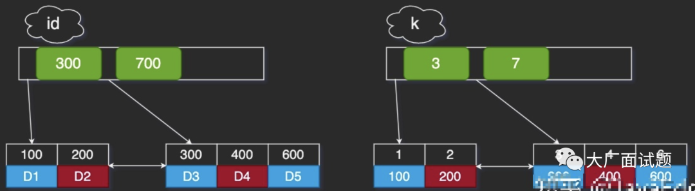
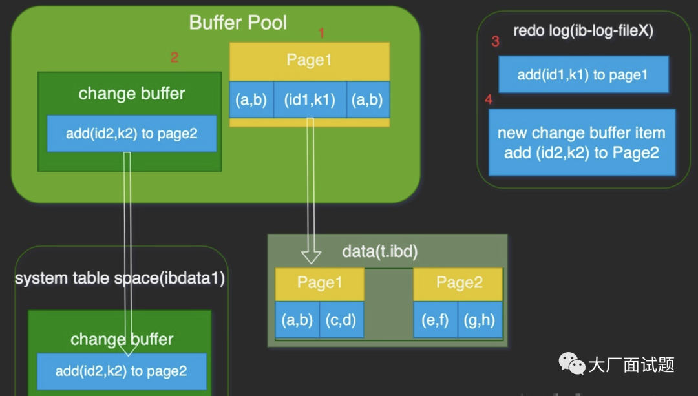
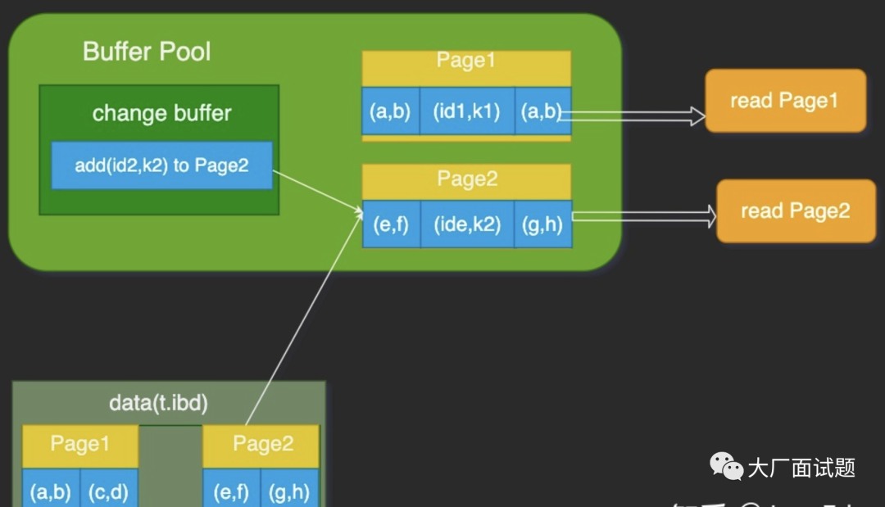

<br/>

## 1 概念区分

### 普通索引 V.S 唯一索引

普通索引可重复，唯一索引和主键一样不能重复。唯一索引可作为数据的一个合法验证手段，例如学生表的身份证号码字段，人为规定该字段不得重复，那么就使用唯一索引。（一般设置学号字段为主键）

主键 V.S 唯一索引

主键保证DB的每一行都是唯一、不重复，比如身份证，学号等，不重复。唯一索引的作用跟主键一样。但在一张表里面只能有一个主键，不能为空，唯一索引可有多个。唯一索引可有一条记录为null。

比如学生表：- 在学校，一般用学号做主键，身份证号作为唯一索引 - 在教育局，就把身份证号弄成主键，学号作为唯一索引

所以选谁做主键，取决于业务需求。

## 2 案例

某居民系统，每人有唯一身份证号。若系统要按身份证号查姓名：


```sql
select name from CUser where id_card = 'ooxx';
```

`id_card`字段较大，不推荐做主键。现有如下选择：

1. 在`id_card`创建唯一索引

1. 创建一个普通索引

假定业务代码已确保不会写入重复身份证号，这两个选择逻辑上都正确。但性能角度考虑，选择哪个呢？

假设字段 k 上的值都不重复。

InnoDB索引结构：



## 3 查询性能


```sql
select id from T where k=4
```

通过B+树从root开始层序遍历到叶节点，数据页内部通过二分搜索： 

-  普通索引 查找到满足条件的第一个记录(4,400)后，继续查找下个记录，直到碰到第一个不满足`k=4`的记录 

-  唯一索引 查到第一个满足条件的，就停止搜索

看起来性能差距很小。

InnoDB数据按数据页单位读写。即读一条记录时，并非将该一个记录从磁盘读出，而以页为单位，将其整体读入内存。

所以普通索引，多了一次“查找和判断下一条记录”的操作，即一次指针寻找和一次计算。若`k=4`记录恰为该数据页的最后一个记录，则此时要取下个记录，还得读取下个数据页。对整型字段，一个数据页可存近千个key，因此这种情况概率其实也很低。因此计算平均性能差异时，可认为该操作成本对CPU开销忽略不计。

## 4 更新性能

往表中插入一个新记录(4,400)，InnoDB会有什么反应？

这要看该记录要更新的目标页是否在内存：

**在内存**

- 普通索引 找到3和5之间的位置，插入值，结束。

- 唯一索引 找到3和5之间的位置，判断到没有冲突，插入值，结束。

只是一个判断的差别，耗费微小CPU时间。

**不在内存**

- 唯一索引 将数据页读入内存，判断到没有冲突，插入值，结束。

- 普通索引 将更新记录在change buffer，结束。

将数据从磁盘读入内存涉及随机I/O访问，是DB里成本最高的操作之一。而change buffer可以减少随机磁盘访问，所以更新性能提升明显。

## 5 索引选择最佳实践

普通索引、唯一索引在查询性能上无差别，主要考虑更新性能。所以，推荐尽量选择普通索引。

若所有更新后面，都紧跟对该记录的查询，就该关闭change buffer。其它情况下，change buffer都能提升更新性能。普通索引和change buffer的配合使用，对数据量大的表的更新优化还是明显的。

在使用机械硬盘时，change buffer收益也很大。所以，当你有“历史数据”库，且出于成本考虑用机械硬盘，应该关注这些表里的索引，尽量用普通索引，把change buffer开大，确保“历史数据”表的数据写性能。

## 6 change buffer 和 redo log

WAL 提升性能的核心机制，也是尽量减少随机读写，它们有啥区别？

### 6.1 插入流程


```sql
insert into t(id,k)values (id1,k1),(id2,k2);
```

假设当前k索引树的状态，查找到位置后：- k1所在数据页在内存(buffer pool) - k2数据页不在内存

看如下流程：

### 带change buffer的更新流程

> 图中箭头都是后台操作，不影响更新请求的响应。



该更新做了如下操作：

1. Page1在内存，直接更新内存 

2. Page2不在内存，就往change buffer区，缓存一个“往Page2插一行记录”的信息 

3. 将前两个动作记入redo log

至此，事务完成。执行该更新语句成本很低，只是写两处内存，然后写一处磁盘（前两次操作合在一起写了一次磁盘），还是顺序写。

### 6.2 处理之后的读请求


```sql
select * from twhere k    in (k1, k2);
```

读语句紧随更新语句之后，这时内存中的数据都还在，所以此时这俩读操作就与系统表空间和 redo log 无关。

### 带change buffer的读过程



读Page1时，直接从内存返回。

WAL之后若读数据，是否一定要读盘？一定要从redo log将数据更新后才能返回？其实不用。看上图状态，虽然磁盘上还是之前的数据，但这里直接从内存返回结果，结果是正确的。

读Page2时，需将Page2从磁盘读入内存，然后应用change buffer里的操作日志，生成一个正确版本并返回结果。所以一直到需要读Page2时，该数据页才会被从磁盘读入内存。

综上，这俩机制的更新性能：

1.  redo log 主要节省随机写磁盘的I/O消耗（转成顺序写） - 

1.  change buffer主要节省随机读磁盘的I/O消耗

## 7 总结

因为唯一索引用不了change buffer，若业务可以接受，从性能角度，优先考虑非唯一索引。

### 到底何时使用唯一索引

问题就在于“业务可能无法确保”，而本文前提是“业务代码已保证不会写入重复数据”，才讨论的性能问题。- 若业务无法保证或业务就是要求数据库来做约束 没有撤退可言，必须创建唯一索引。那本文意义就在于，若碰上大量插入数据慢、内存命中率低时，多提供了一个排查思路 - “归档库”场景，可考虑使用唯一索引 比如线上数据只需保留半年，然后历史数据存在归档库。此时，归档数据已是确保没有唯一键冲突。要提高归档效率，可考虑把表的唯一索引改为普通索引。

### 若某次写入使用了change buffer，之后主机异常重启，是否会丢失change buffer数据

不会！虽然是只更新内存，但在事务提交时，change buffer的操作也被记录到了redo log。所以崩溃恢复时，change buffer也能找回。

### merge时是否会把数据直接写回磁盘

### merge流程

1. 从磁盘读入数据页到内存（老版本数据页）

1. 从change buffer找出该数据页的change buffer 记录(可能多个），依次应用，得到新版数据页

1. 写redo log 该redo log包含数据的变更和change buffer的变更

至此merge结束。这时，数据页和内存中change buffer对应磁盘位置都尚未修改，是脏页，之后各自刷回自己物理数据，就是另外一过程。

在构造第一个例子的过程，通过session A的配合，让session B删除数据后又重新插入一遍数据，然后就发现explain结果中，rows字段从10001变成37000多。而如果没有session A的配合，只是单独执行delete from t 、call idata()、explain这三句话，会看到rows字段其实还是10000左右。这是什么原因呢？

如果没有复现，检查 - 隔离级别是不是RR（Repeatable Read，可重复读） - 创建的表t是不是InnoDB引擎

为什么经过这个操作序列，explain的结果就不对了？delete 语句删掉了所有的数据，然后再通过call idata()插入了10万行数据，看上去是覆盖了原来10万行。

但session A开启了事务并没有提交，所以之前插入的10万行数据是不能删除的。这样，之前的数据每行数据都有两个版本，旧版本是delete之前数据，新版本是标记deleted的数据。这样，索引a上的数据其实有两份。

不对啊，主键上的数据也不能删，那没有使用force index的语句，使用explain命令看到的扫描行数为什么还是100000左右？（潜台词，如果这个也翻倍，也许优化器还会认为选字段a作为索引更合适） 是的，不过这个是主键，主键是直接按照表的行数来估计的。

而表的行数，优化器直接用的是`show table status`的值。大家的机器如果IO能力比较差的话，做这个验证的时候，可以把`innodb_flush_log_at_trx_commit` 和 `sync_binlog` 都设成0。

<br/>

推荐阅读：

[阿里面试题：聊一聊联合索引，要遵循什么原则](http://mp.weixin.qq.com/s?__biz=MzAxNTk2MDI2OQ==&mid=2247484337&idx=1&sn=27f6b7a43703674f8f10c2891bfbaf75&chksm=9bfd5213ac8adb051064c12f0b3c4b12e0a0646d3b9c6d1a818fecc4fcadde5830137845014a&scene=21#wechat_redirect)

[面试题之MySQL的B+树索引，MySQL 索引B+树原理，以及建索引的几大原则](http://mp.weixin.qq.com/s?__biz=MzAxNTk2MDI2OQ==&mid=2247484114&idx=1&sn=12248bb32197ea0723732c12c1690764&chksm=9bfd5370ac8ada66ecdee63c8baeda94cf008774ee29aa4daa492086eab72befa2380f9096b1&scene=21#wechat_redirect)

[百度面试题：说一下聚簇索引和非聚簇索引的区别](http://mp.weixin.qq.com/s?__biz=MzAxNTk2MDI2OQ==&mid=2247484785&idx=1&sn=498f7a3111cc138449007f8d1909ffd0&chksm=9bfd54d3ac8addc5ecf99a9777750b794fa1a474c8ada247f57c84c2241f0e9055987a5604e2&scene=21#wechat_redirect)

<br/>

