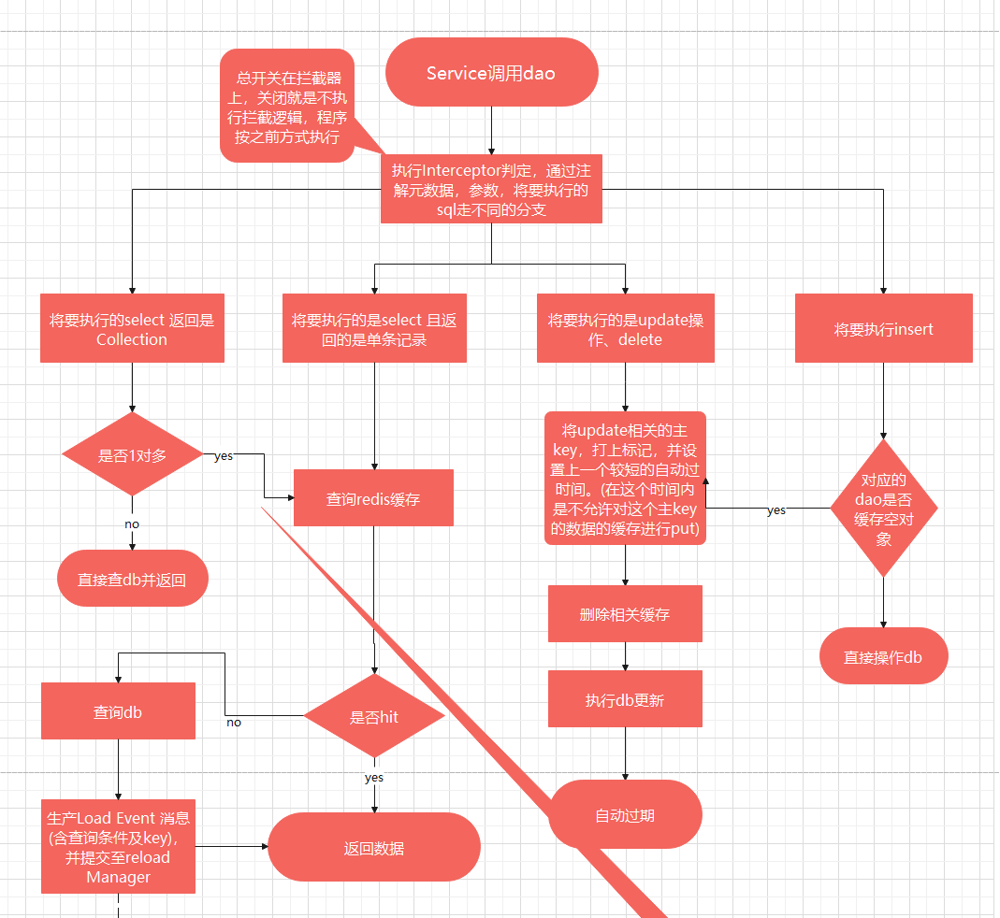
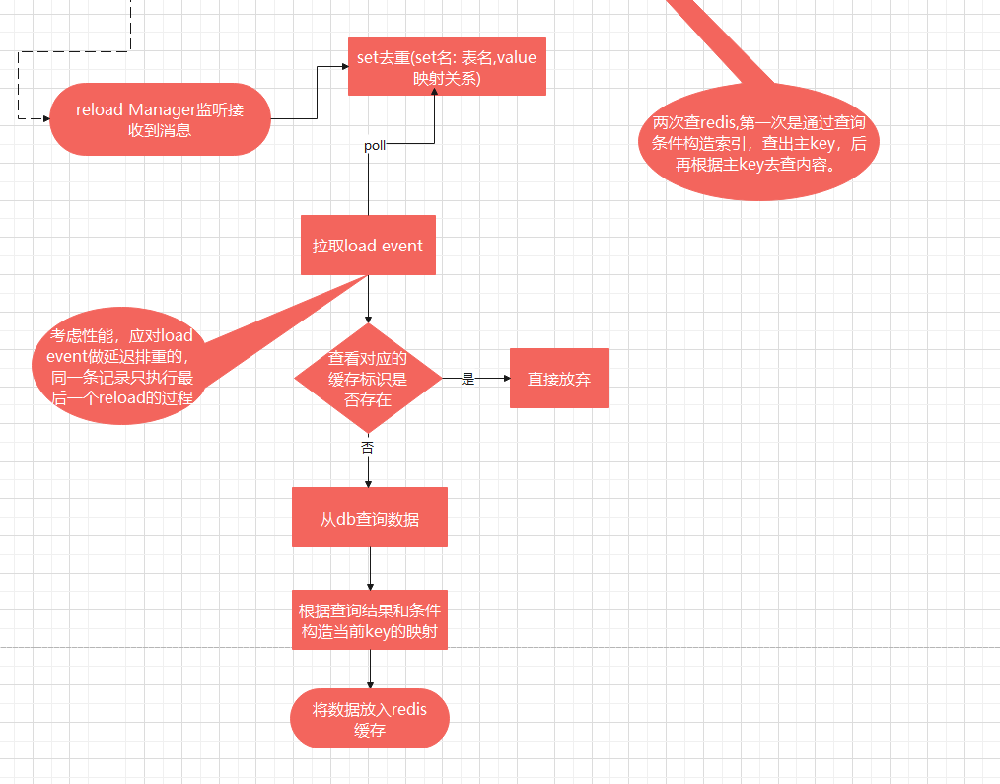
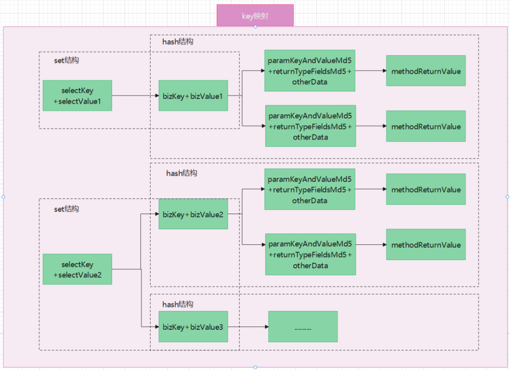
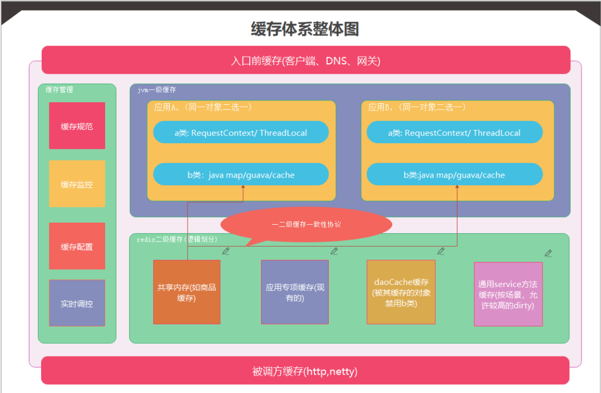
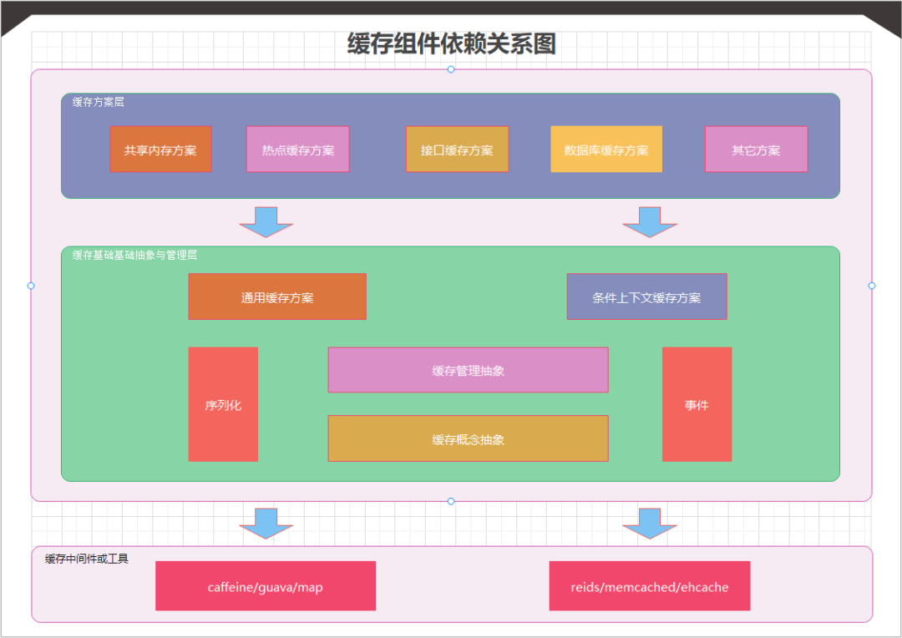
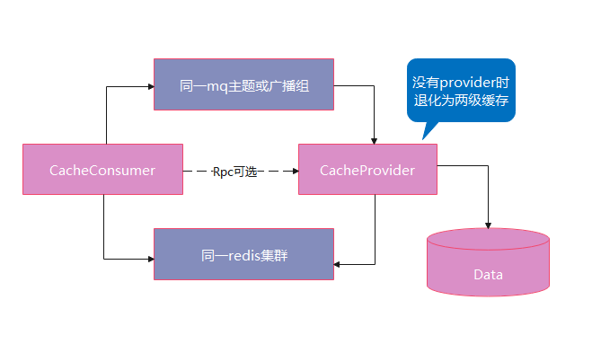
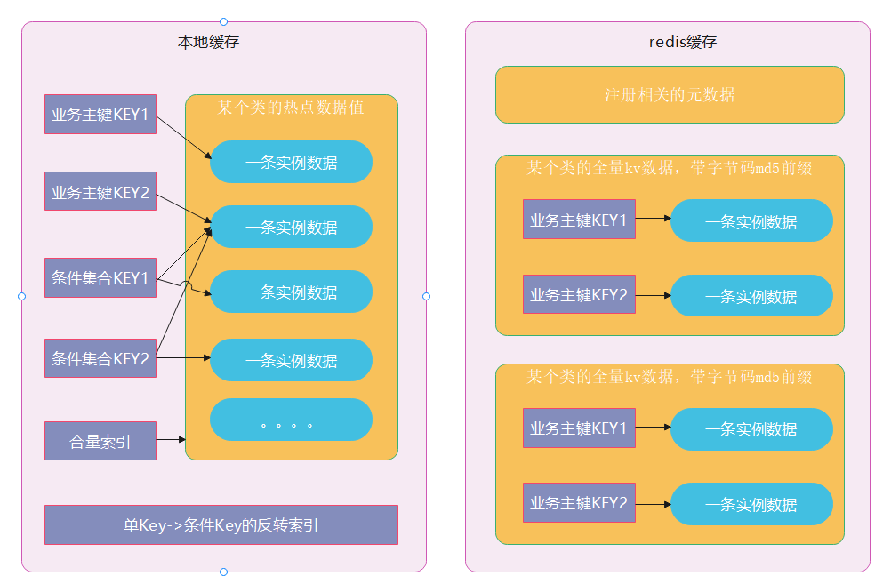
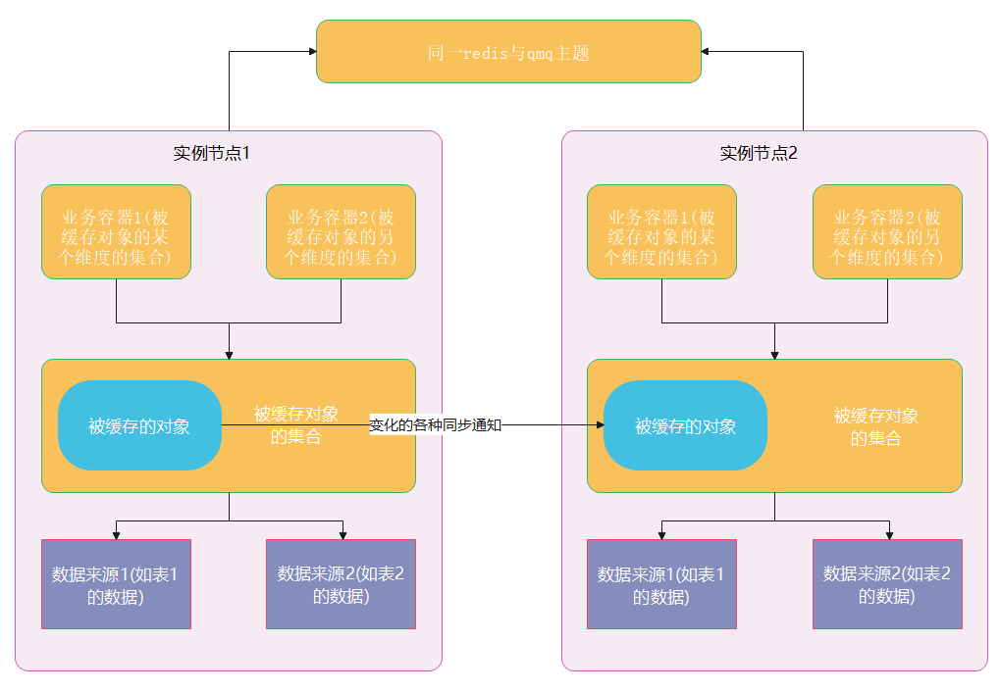

## 前言

在高性能的系统开发设计过程中，缓存的开发与使用是必不可少的内容，对于较复杂的业务系统往往并不是一个缓存方案就能解决所有性能问题，而是根据业务场景的不同选择不同的缓存方案进行搭配产出更好的整体性能。

去哪儿的增值业务系统是一个承接多业务线贯穿多种售卖场景的三高系统，2021 年上半年我们对系统进行了缓存体系化改造升级，改造后的缓存不仅容易拓展和维护，性能上的直接收益非常可观，数据库 qps 下降 80% 以上，详情接口响应时长从 150ms 下降到了 90ms ，内部子系统间的 rpc 调用减少了 40% 以上，关键部分缓存命中率维护在 80% 以上 。**那么这样的一个缓存体系是如何设计开发出来的呢？本文将给以详细解答。**

## **一、第一个缓存组件的开发**

### **1、开发背景**

2020 圣诞节前后业务流量受疫情恢复开始反弹，增值业务系统 db 的 qps 单库上涨至 3 万以上，核心接口延迟增加，增值业务交易系统 load 节节升高，生单存在性能安全隐患。经调查发现大量请求处在 IO 阻塞中且系统线程数(2000+)和活动线程过高，系统上下文切换开销大。为此，我们团队做了很多性能优化的措施，其中最重要一个动作就是给数据库层加了一个特殊的缓存方案，这个缓存方案就是我们开发的第一个缓存组件。

之前系统已有在用redis和guava缓存的，为什么这次还要再加一个针对 db 层的缓存方案呢？主要源于以下几点：

- 本次性能问题突出在 db 上，db 的连接过高也在报警。

- 系统体量是很大的，仅交易系统有 30 万以上代码，系统内部流程和分支很多，直接在入口处做缓存命中率不会很高，而系统最关键表结构只有 6 个，在此处做缓存更好收口。

- 这是个迭代过多年的系统，内部流程很长，上下文间经常有些对 db 重复的查询，改业务流程工作量大需要回归的 case 太多。

- 交易系统对缓存的一致性要求极高，需要专用的缓存方案。

除此之外，传统的与数据库有关的缓存方案在我们的业务场景 下是存在缺限的:

- mysql 数据库端的查询缓存，这个缓存很鸡肋，只要数据发生变更相关缓存数据全部失效，对于一个含订单交易的系统而言变更可是常态。

- mybatis 二级存在，不仅一致性较差，其缓存粒度是基于 mapper , 一条数据的变更会将整个 mapper 的缓存数据清空。

- 使用 aop 和注解，基于方法直接在 dao 请求和 mysql 间加一个 redis ，这个如果没有更细节的设计，分布式环境下的全局一致性是得不到保证的。

- 基于 binglog 同步做缓存，这个是有秒级内延迟的，不适用于交易系统。

### **2、设计思考**

我们设计的这个缓存组件命名为 daoCache ，原于其加在 dao 层上，其主作用于分担数据库的 qps ，以近 1：1 的比例将 mysql 的查询请求转移至 redis ，通过一套固化的流程和机制确保在分布式环境下缓存数据与 db 具有较高一致性，同时尽可能对业务使用透明。

分布式场景的一致性理论基础 cap 原则和 base 理论告诉我们在分布式环境下无法在强一致性上去死磕，分布式缓存完整的强制一致是一个不可解的问题， 工程实践时应主要考虑一致性、开发成本与性能开销之间的平衡。由于这是一个重要的缓存方案，为了降低实践风险，我们做了充分的分析和思考。

**1）内部情况考虑**

数据层的编码有专人负责，一般业务开发只需调用数据层人员提供好的接口即可，这样的分工在项目人员较多时有明显优点，DB 和 SQL 能力强的同学写出的数据层代码质量更好，也可以集中做一些优化，缺点就是业务链路长的时候业务开发人员不太会去从整体和底层关注数据层的效率；为了降低方案后续接入改造的成本，设计的方案要尽量减少对数据层以上编码的要求或关注。为了降低 DB 的压力，团队已经做了分库分表相关的操作，并对某些高频繁的查询做过一些缓存，但不太系统，只是基于一些点片。已有的分库分表是后续做缓存分片时应该重点考虑到的内容。

**2）外部情况考虑**

这里主要是考虑公司对 redis 的 api 在安全使用上的限制。比如公司的 redis 客户端是不支持很多批量处理操作的，这就决定了减少交互次数不好进行批处理优化；另外服务端禁用了 lua 脚本，没办法进行 cas 操作。

**3）一致性的考虑**

在缓存与 db 之间的更新一般有四种组合：先更新数据库，再更新缓存；先更新缓存，再更新数据库；先删缓存，再更新数据库；先更新数据库，再删缓存。仔细想想这四种更新组合在并发场景下都存在一致性问题，本文限于篇幅就不详细展开讨论了。

另外，要做到高一致性对缓存与 db 进行更新一般也四种思路：a、分布式同步加锁；b、映射到单线程+队列；c、监听数据库 binlog 同步更新缓存(秒级内延迟)；d、独立的缓存更新平台统一控制, 缓存 key 分片与客户端监听变化。我们的方案没有使用以上的任务何一种，这个在后文会详细介绍。

**4）性能的考虑**

为了做好性能，在具体方案实现流程中关注了以下几个点：

**① 资源消耗，平均资源调用次数**

这里主要是指要尽量减少接入缓存的实例与redis服务端的交互次数，当然不必要的db交互也要减少。

**② 缓存命中率**

缓存目标通过配置可以选择，对缓存命中率低的key尽量不缓存， 一般而言缓存命中30%以下就要考虑是否去除缓存。

**③ 异常流程**

一些异常过程是否会造成极端的脏数据，是否有清洗手段，清洗是否对性能有影响，redis服务端网络的波动是否会影响到业务服务

**④ 加锁与并行度**

在并行更缓存下无锁化设计优于加锁，尽可减少加锁操作，特别是主干流程，但是不要因为网络延迟而造成脏数据。

**5）成本的考虑**

这里主要是时间成本，因为业务流量还在上涨中，所以开发出的方案一定是轻量级的。

### **3、实现原理详解**

**1）流程**

本缓存是使用 redis 作为缓存中间件(也可以换其分布式进程外缓存)，通过 mybatis 插件加 dao 层的注解加启动扫描实现的。在应用启动时扫描 dao 层所有加了 daoCache 注解的缓存，分析要对哪些方法进行拦截(预分析而不是在访问 dao 层时实时分析，也是为了性能的考虑)；添加一个 mybatis 的插件对数据的增删改查做拦截，其拦截过程与缓存处理流程如下图：

上图中我们将 sql 语句分为 4 种，重点关注的是图中第二种和第三种 sql ，对于第四种 sql 我们只关心新加数据时清理缓存兜空的情况，而对于第一种 sql ，由于多对多的处理太复杂，而且我们的项目中这样的 sql 的 qps 很低，不处理不影响大局，只需要对 qps 较高的一对多进行处理即可。仔细看这张图上有几个点要注意：

- 读的流程，如果缓存命中开销是很低了，没有多余的交互和确保动作，而如果 miss，除了有 db 操作，还增加了两三次的 redis 操作; 所以，对于命中率较低的sql可以用注解忽略使用缓存。

- 缓存不进主动更新，只是主动删除，只有被动 miss 时才向 redis 加入数据。

- 整个流程没有分布式锁，保证并发时ABA不发生的关键在于打个自动过期的标记，关联同一个key的更新操作的标记是可以相互复盖，打标持续期间是不允许向缓存中存放数据, 向缓存放数据的那个线程遇到标记是不阻塞的，而是直接丢弃本次操作; 标记存活时间可配置，默认长达10秒， 这么处理，可能从单条数据来看缓存长时间没被使用，但是从宏观整体去看，损失的miss则是占比很小的，几乎可以忽略。

- 缓存都设置了过期时间，用以作最终一致性保障的兜底，一般时长为10分钟至20分钟，这个时长和用户单次使用我们系统时长相差不多。

- 为了进一步处理极端情况，还做了很多处理，比如: put完数据后马上又check一下标识，如果标识又存在则清理缓存；对于一些退款判定类的sql，直接忽略缓存; 为了保证生单过程的不被可能的脏缓存影响，对于生单线程做特殊放行。

该方案的核心思想是：

- 对于一致性，不是完全 case 解决，而是尽量处理多数 case ，对于不好处理的部分就直接扔给数据库。

- 以主流程为基本保证一致性手段，补充例外手段，线程维度放行与方法维护放行相结合。

- 按实际流量排行，优先解决大流量的查询。

**2）关键数据结构**

整个流程中 key 映射处理非常关键，因为只有映射关系准确了，在对应的dao 执行更新时才有可能将缓存中所有相关联的数据清理掉，具体映射关系如下图:

图中的字段含义解释如下：

- **bizKey：**业务主键，在我们场景下一般就是定单号 orderId。

- **bizValue：**业务主键对应的值，后加数字表示不同的值。

- **selectKey：**通常我们的查询条件中会带有 bizKey， 如果不包含则需要指明一个能与 bizKey 产生关系的 key ，它们之间的关联是在miss后通过返回值建立起来的。

- **selectKeyValue：**selectKey 对应的值，后加数字表示不同的值。

- **methodReturnValue：**表示的是被拦截的 dao 方法的返回值。

其他字段大家可以顾名思义一下。set 结构表示它们之间的映射关系在 redis 中是通过 set 结构维护的，hash 结构表示它们之间的关系在 redis 中是通过hash结构维护的。通常如果我们的查询条件中带有业务主键，那么通过 redis 的 hash 结构可以一次查询到，如果不带则需要先从 set 接口中拿到关系的键再通过主键获取数据，这个过程有些类似数据库的非聚合索引查找数据需要回表的过程。

这么设计使得我们只需要给那个 bizValue 相关的缓存打个标记并将其缓存内容删 除即等价于所有与这个 bizValue 相关的缓存都被删除了(此时通过 selectKey 能检索到 bizKey ，但是对应的 selectValue 被删除了，返回结果还是空，等价于没有命中)。同一个 bizValue 存储着多个缓存值是因为对于同一条数据的查询其返回的数据结构可能是不一样的，所以缓存不是按表中记录一条条存储的，而是按每个方法的返回值存储。另外，我们的方案要求对于被缓存管理的 dao 的所有更改操作都能带上 bizKey ，以便程序更新数据时能关联清除掉所有相关的数据。

需要注意的是，目前该映射关系仅能处理表和 dao 是一一映射的场景，在高 qps 场景，多表联合查询的设计很少，至少在我们当前应用上不存在的。越复杂的查询需要的这个映射关系也越复杂，缓存端的数据结构也要进行定制，数据结构的复杂也会影响缓存的性能，理论实现成本也很高，redis 现有的数据结构无法满足，可能需要开发专用缓存中间件。

### **4、功能上线**

做好上线，要把以下两个问题处理好。

**1）如何平滑升级?**

由于缓存是以 dao 接口为粒度进行配置的，所以可以先选择一些不太重要的、更新频度低的先上线进行验证，做好配置与切换的开关，一旦问题可以切换回无缓存状态。在正式开量之前先进行充分的 diff ，也就是拿缓存数据和拿 db 数据进行对比，看看差异，如果存在差异再通过日志查找造成差异的原因。

这个验证过程可以查找出细节没有处理好的点，或者漏处理的点。实际上我们在渐进上线过程和后续维护过程中就通过 diff ，查日志，看调栈的方式优化了一些细节才使得缓存一致性达到了线上可接受的状态，这里就不详细说明了。

**2）出现意想不到的问题时如何处理，有没有反制手段?**

首先在编码处理的细节上将 redis 做了弱依赖处理，也就是即使redis服务挂了也不影响业务的正常运转，在编码的每一步就考虑到了 redis 挂了后程序的继续运行。我们调短了 redis 连接超时时间，使用滑动窗口算法对 redis 超时和异常进行分流，redis 越不稳定或异常越多时，直接走 db 的流量也就越多，当然为 db 的安全，正常分流最大值是 50% 直接走 db ，这个分流调整几乎是毫秒级的，毕竟 redis 不稳定，哪怕只是阻塞 1 秒，我们的应用也会产生数万条的错误日志。

上线过程中的那个 diff 功能一直保留，它有额外的两个作用：一是上线后留置 5% 流量 diff ，一旦发现缓存不一致会触发报警; 二是当开 100% diff 的时候其实是在做缓存清洗的，因为 diff 的逻辑是出现差异会以 db 的数据为准，并清理缓存，当有意想不到的问题出现时，比如跑 sql 洗数了，可以针对性的把相关 dao 的 diff 全开。

## **二、全局缓存体系设计与规划**

### **1、提出背景**

在做了第一个缓存方案之后虽然解了 db 之忧，但后续有出项目启动过慢，系统性能抖动等问题，经调查发现一部分原因是由于商品缓存定时全量加载所致。这个商品缓存同时存在多个微服务系统之间，为此我们提出了共享缓存的概念。不过，在提出共享缓存概念之前，为了避免又有其它类似问题出现，先用了一个临时方案的方案堵住了表象问题，然后再对系统已有缓存作了一个全盘梳理，通过全盘梳理发现以下问题：

- 缓存的使用很零散，在长期项目跌代过程中变得很维护，无法整体观察，也无法进行全局调参配置。

- 有些缓存key可有多个子应用共用着，导致开发人员在不是很了解各应用代码的情况下不敢轻易对这些缓存key做下线清理，时间一长，redis中可能残存着很多无用的数据，浪费了大量的缓存资源;

其实这些问题是有一些代表性的，我想它不仅仅存在于我们增值业务系统中。

### **2、缓存体系简介**

图中由上至下是从纵向按请求流对缓存进行横向划分。

- **一级缓存**

指进程内部的缓存，使用一级缓存完全是内存操作没有 io 开销，但是在分布场景下一级缓存分隔在各个进程中，一致性没有任何保证，它适用于周期较短的无状态化请求，或者是其数据不一致性但业务可接受且在程序员可控范围内的，最理想的情况是被访问资源能从整体架流程上做到被某个进程独享。一级缓存分成两类，如图中 a 类一般是不需要考虑全局一致性的，而 b 类很多情况是要考虑一致性的；所有缓存都要考虑容量、命中率、过期等问题；在某一个被缓存的条目上，a 类缓存和 b 类缓存一般是二选一，两者同时使用会使缓存设计过于复杂，缓存一致性问题难解。

- **二级缓存**

是指进程外部被一个应用多个实例或多个应用共享的缓存，一般会共享数据，这里我们暂只用 redis 做二级缓存；将 redis 缓存按功能用途分为以下四块，这四块在部署的时候不一定需要四个独立的命名空间，只是一种逻辑划分以便于编码上的区别对待，如部署时被放入同一命名空间编码时可考虑用命名前缀加以区分。

下面从右至左解释一下这四块内存：

- **通用 service 缓存**

类似 spring 的注解，其缓存的数据量可能较大，要有内存限制，要考虑崩了不影响程序逻辑和正常流程，主要作用是对一般缓存使用场景的统一收口。

- **daoCache 缓存**

也称为数据库缓存，加在 dao 层，以方法签名和参数内容为 key ，内存较冗余，一般只 cache 部分表及部分方法；该缓存有较强一致性要求。

- **应用专项缓存**

被一个应用所独享的专用缓存，一般不做批量数据存储，多用做一些标识、计量、功能性队列、锁、幂等判定，对延迟要求敏感，redis 故障或延迟会影响到系统功能; 我们现在大部分功能性缓存都属于这种情况，其中不属于但使用的部分以后要考虑迁走。

- **共享内存**

一般是被多个应用共享，其中至少一个应用对内存具备维护的权限(一般是谁创建谁维护)，这种缓存一般适合用于被多个应用访问的高频热数据，数据的变更很少或不变更，接受一定时间的数据不一致，但数据必须最终一致。使用这种缓存，一般会配合一级缓存中的b类，二级缓存做全量，一级缓存做热点，同时要设计一二级缓存的一致性协议；对于我们的系统来讲，商品缓存明显适用这一情况。

### **3、缓存组件相关间关系**

上文介绍的各种缓存，它们除了可单独使用外，还能整合起来使用，达到 1+1 大于 2 的效果。实现这一点得益于两方面:

- 上文的整体规划上定义了各方案组件之间的边界；

- 组件之间在实现上有明确的依赖关系，这个依赖关系如下图：

图中箭头的指向为依赖方向，中间绿色的部分收敛所有缓存中间件的和工具的使用，抽象出一致的缓存定义、配置、构建、基本接口，它自带两个缓存方案, 即通用缓存 service 缓存方案和条件上下缓存方法；其它缓存方案是位于这个接口的定义和管理之上的，每一个上层的缓存方案是解一个特定缓存场景问题。

这样处理带来很多的好处：

- 所有缓存方案都不依赖具体的缓存中间件，缓存中间件可以很方便的按上层具体场景甚至具体应用进行更换（ redis 有多种数据结构可以形成多个抽象实例，将其功能性和存储性部分分离）。

- 有统一的基础监控和基础功能，比如基于消息中间件做本地缓存更新的通知。

- 便于各方案间相互打通，由于增值系统中使用了多种缓存方案，当缓存因一些特殊原因（如手动改数据库数据了）而出现不一致时，使得问题非常难排查，特别是在不太健状且复杂多变的测试环境上时，此时只需要在通用缓存组件部分加一个禁用缓存上下文的功能就可以很方便有选择的禁用或全部禁用缓存，进行差异 diff 。

- 通用 service 缓存有一些基础功能，上层缓存方案是可以直接复用的，比如使用 mq 做基本的消息同步（这里只是一个接口定义，实际可以根据场景换），各种序列化方案的选择与使用。

**鉴于本文篇幅有限，下面只详细介绍共享缓存。**

## **三、共享缓存组件开发**

微服务环境下大项目会被拆分为多个小项目，原来在一个单体中的缓存可能会面临同时存在多个子应用中，这时就产生了一致性问题，将本地缓存直接改写成用 redis 这种进程外共享的缓存往往有性能上的风险。共享缓存的核心理念是多应用共享数据，以本地缓存作为一级缓存，redis 作为二级缓存，通过 mq 消息或其它扩展实现缓存变更的增量更新，它的内容不单单只是如此，接下来我们先对它的架构作个简要的了解，然后再看看它到底有哪些特点。

### **1、架构简述**

- 共享缓存的接入方分为 Provider 和 Consumer 两个角色。Provider 方是持有缓存相关的数据源的一方（不一定要求是 db 数据源，但必须有更新闭环），可对缓存进行读写；Consumer 方是只读缓存数据的一方, 只有在二级缓存 miss 的时候 consumer 才可通过隐式的 rpc 接口触发 provider 缓存数据的填充。

- provider 和 consumer 都是可选，只使用 consumer 相当于对第三方接口进行了缓存， 只使用 provider 的场景多为同一应用多实例节点，数据无需跨应用共享。

- redis 既作为二级缓存，也作为注册中心。

 

为什么要分为 Provider 和 Consumer 两个角色呢? 这是照顾跨团队的场景，在 api 的便用上 consumer 做得尽可能简洁，只需要调用即可，而 provider 则要关心更新闭环和缓存的维护; 另外，在微服务的场景下，服务间的关系也存在这样的角色，也是职能分工的需要。多应用共享一个 redis 集群和拆分后继续共享在我们团队里是个常见的现象，而这时共享 key 的设置非常重要，参与应用可能要手工维护 key 的一致性，有了共享缓存 key 一致性就再也不用担心出问题了。

### **2、价值特色**

共存缓存应对的是低频更新极高频访问的场景，是最终一致性缓存方案，同步通常在 2 秒内完成，高峰时 10 秒内，异常时 5 分钟，极端情况 20 分钟，自身升级有 bug 时有手工同步后门。

共享缓存方案无论是在 redis 还是在本地都只有一条原数据，这样做不仅节省内存，在一致性上也好处理，实现细节上我们也做了很多优化工作。

支持事务，支持按条件查询条件缓存。

真增量更新，全量数据本地缓存时，当新加某条数据或某条数据发生变更时，所有节点添加当条数据索引或仅过期当条数据。

自动分包与合包，为了避免 qmq 消息过载，短时间内大量相同消息会在发送端和接收端去重，并尽可合并消息，减少消息发送量。

支持 mq 消息丢失, 多种机制防止消息丢失后导致缓存结果不一致。

我们接下来看来实现这些价值特点的原理。

### **3、核心实现原理**

在没有做共享缓存之前，团队里其实有同学已经用 mq 做本地缓存数据同步了，也有些团队用数据库的 binlog 日志做同步; 但是没有将这个过程进行模版化，很难进行持续优化，方案很不好复用。共享缓存实现的一个基本原理就是将 mq 同步缓存的这个过程进行模版化了。那么如何进行模版化的呢？

简单的说就是将与缓存相关的几个流程进行分解，将其中不变的部分提取出来放到框架中，将业务的部分留给使用时注入。共享缓存将缓存操作相关的流程分为：预热、读取、更新、接收同步消息和处理同步、兜底检查五个主流程，其中只有前三个流程需要用户去注册业务动作。本文限于篇幅详细流程就不再展述了。下面我们看看实现共享缓存最关键的一个设计，正是这个设计使其与一般的通过 mq 进行同步的缓存有着根本的不同。

**1）共享缓存的核心数据结构**

共享缓存与 daoCache 一样也有一个业务主键的概念，与 daoCache 不同的是共享缓存无论是在本地还是在 redis 对于同一个业务主键通常只对应一条数据， daoCache 存储的是 db 中数据的映射，共享缓存理论上可以存用户定义的任何数据。我们来详细看看这张图上的缓存结构。

在 reids 这边， 存着注册相关的元数据，全量的业务数据，升级过程中可能同时存在多个全量数据的版本，它们之间通过字节码前缀加以区别。

在本地，共享缓存维护着当前热点数据(当前没有开发热推送平台，这个热点指的是经常被拉上来的数据)，维护四种索引：单条主键索引、条件集合索引（可选）、全量索引（可选）、反转索（有条件集合时才存在）。由于数据在本地和远程都只有一份，它们的最终一致性就很好维护。而对于索引的维护最坏的情况就是重建索引，在内存中重建索引的效率远高于重建相关的数据。为了做到更好的增量更新，数据更新都是先对比最新更新的 key 相关的内容是否符合索引条件，再决定是否向下取数据的。

**2）共享缓存的一致性**

有以下 5 个点来保证数据的一致性：

- mq 进行本地缓存同步，mq 仅通知发生变化数据的业务主键，本地接收后对相关缓存进行删除，然后业务访问时重新抽取数据即可，这个拉取数据的过程要尽量不要拉取到旧数据，由于这个流程远比 daoCache 要复杂，这里就不详细解释了。

- provider 端对缓存进行更新的前后会在 redis 进行打标和删标，leader 节点会定时检查最近的标记，如果发现存在 30 秒前未删除的标记，则认为相关的缓存更新可能出现异常，随即清理相关的缓存。

- provider 端更新或添加数据时会将相关联的业务主键登记到 redis 里，各节点会在本地记录最近收到的需要变更的业务主键，每间隔 5 分钟会和 redis 里进行对比(仅 5 分钟内变更的业务主键)，对于差异化的部分进行缓存清理。

- leader 节点一般每间隔（开发时可编码设定）20 分钟会将数据库中的数据全量更新至 redis 做二级缓存一致性的兜底， 本地缓存也可以设置过期时间做一致性的兜底，一般默认是半小时。

- 本地缓存全量滚动更新后门，可以手动调用，也可以配置 QSchedule 定时调用。(该方式可先，一般用于大版本更新，或应用初接时)

**3）共享缓存的典型使用场景**

图中放入共享缓存的数据是中间的那一部分，这个数据是由两个表构造出来的(实际使用时也可以来源于 qconfig 或其他接口, 但前提是应用能掌握数据更新的闭环)，图中业务容器数据是根据被缓存数据创建的（这个创建过程可以穿插别的数据源），当节点 1 把表 1 或表 2 的数据更新时会触发所有节点被缓存数据的更新，当某个节点缓存数据更新完成之后会回调注册的业务代码，由业务代码重新构建基于缓存数据的上层数据。

这个场景如果使用其它缓存方案是需要很多编码才能解决的，而通过我们共享缓存只需要业务定义好被缓存的象的读取构建过程，上层关联构建过程，相关表的 Dao 方法上增加注解即可。事实上这些过程在接入共享缓存之前业务就有类似的代码，只需要按共享缓存的方式修改一下即可。这一点并不是本方案最大特点，最大的特点是，短时间内多次被缓存对象的多个表的多条数据更新，共享缓存只会触发一条 mq 消息进行数据同步。其它一般基于 mq 消息同步或 binlog 同步的缓存，可能需要大量的网络开销。

这里举个例子，我们某个应用几个商品数据的更新，可能会更新到一批 ext 表的数据又有主表的更新，主表的更新可能又会造成所属分组的更新，所属分组更新会又引起上层分类容器的更新，如果直接使用传统的 mq 消息同步方案可能瞬时产生几千条 mq 消息给所有节点消费，而这些节点又会可能全部重新拉取数据，引起网络 IO 风暴。共享缓存在框架内部的发送端和接收端都基于业务主键进行了合并去重的操作，在这些基础之上又进行数据合包，使得最终发出的 mq 消息降了几个量级，除此之外对于关联的的上层容器构建的触发也作了处理，当短期内收到大量更新触发时也会只执行最新的有效更新。

另外，由于共享缓存是基于通用缓存之上做了缓存方案，是不依赖具体的底层组件的，本地默认的 caffine 可以更换性能更高的 Map，redis 也可以在某些场景换成 memcached 。没错，在我们的实践中 caffine 在单机百万级跌代下性能会有明显消耗(耗秒级，我们搜索接口 20ms 超时），在这种场景下直接换成 map 丢失了缓存过期失效(可以通过主动失效补偿)换取了性能优势。

## **四、总结**

这些缓存上线了不仅直接减少了 db 的 qps ，同时也消除了 DB 峰值的抖动，一些应用间的接口因为共享缓存的存在也直接由高频qps到直接下线。数据库缓存自上线以来并没有出现过明显缓存不一致，仅在一些改造升级期出现过零星不一致，也没有给业务造成负面影响，几乎没有收到与此相关的问题单。但是数据库缓存方案有很多的局限，主要表现在：

- 缓存在请求流的末端，缓存效益是很低的，给系统做缓存是分层的，越靠近靠近请求入口收益越高（不过命中率不好做高）。

- 使用上对 dao 有一些要求和约束，如：只能单表查询，更新必带业务主键，对一对多的支持需要 @DaoCacheSelectMethod 指明一些参数，否则不会拦截这种方法，也并不是支持所有的一对多，这个细节要了解原码才比较清楚，最重要的是配错了是没有任何提示的，需开发人员自己小心。

- 特殊放行逻辑需要业务额外编码配合。

- 一直认为该缓存方案较高的命中率和我们项目的编码特点有关（本身也是按项目已有的编码特点产生的），换成别的项目缓存命中率可能会降低。

不过本文分享的重点不是该方案的实现细节，而是产生和设计这个方案的思想，这个设计思想是可以用作别的缓存方案的。

而文中描述的共享缓存其适用于极高 qps 与低 tps 的最终一致性倒是在使用局限上面要小很多，目前的实现完全满足我们增值系统的需求，在对外推广上还有很大的成长空间，需要更多的业务场景去驱动完善。总之，基于缓存体系的全局规划，我们力争在后续的业务驱动开发过程中将所有遇到的缓存方案的整合成一个缓存方案池，不断优化迭代使其成为更通用的缓存方案库。

 

来源丨公众号：Qunar技术沙龙（ID：QunarTL）dbaplus社群欢迎广大技术人员投稿，投稿邮箱：editor@dbaplus.cn

 

