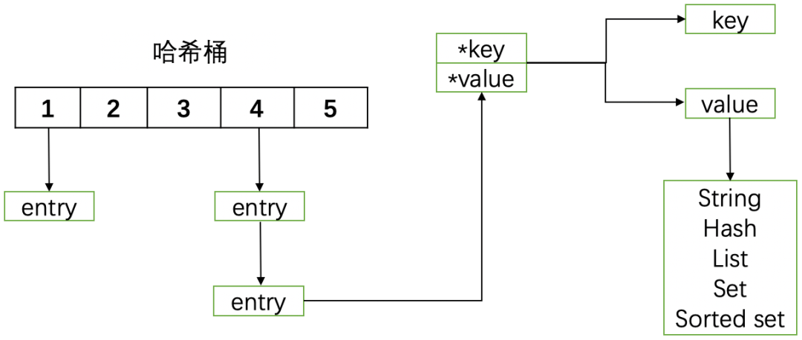
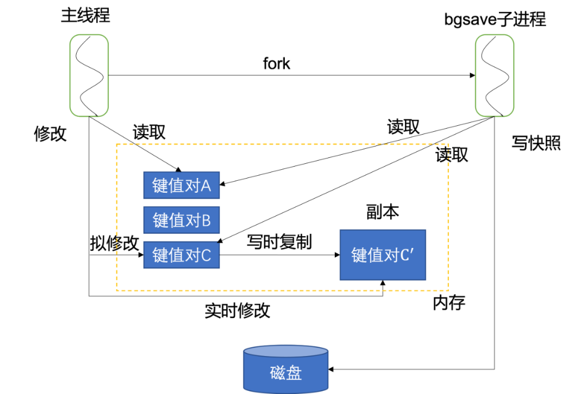
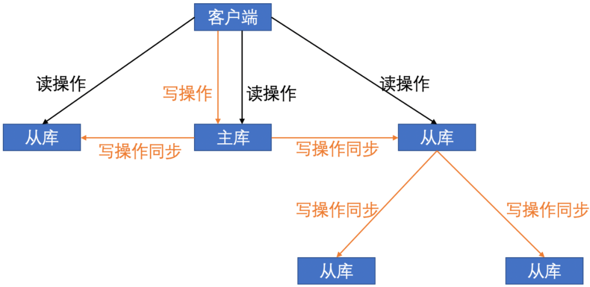
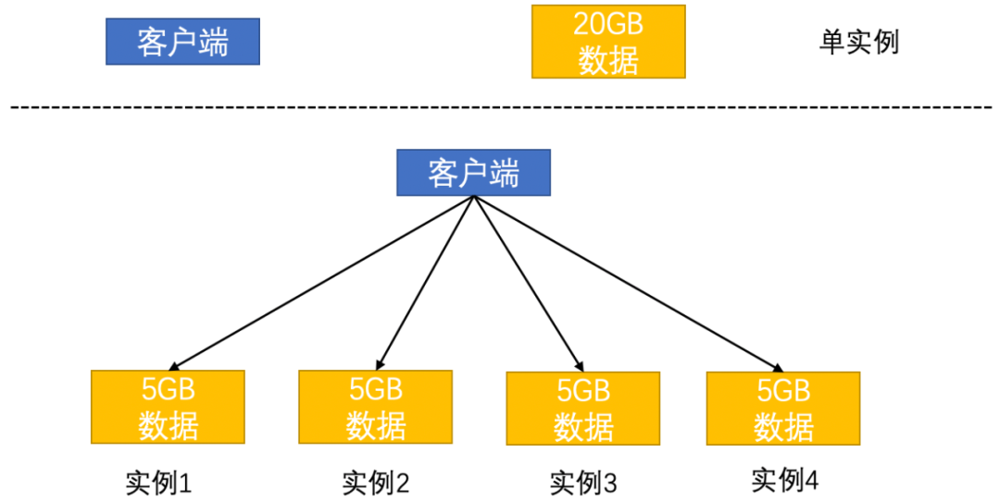

<br/>

本文主要讲述Redis的基础知识和常识性内容，帮助大家了解和熟悉Redis。

## 什么是Redis

Redis是一个开源、基于内存、使用C语言编写的key-value数据库，并提供了多种语言的API。它的数据结构十分丰富，基础数据类型包括：string（字符串）、list（列表，双向链表）、hash（散列，键值对集合）、set（集合，不重复）和sorted set（有序集合）。主要可以用于数据库、缓存、分布式锁、消息队列等...

以上的数据类型是Redis键值的数据类型，其实就是数据的保存形式，但是数据类型的底层实现是最重要的，底层的数据结构主要分为6种，分别是：`简单动态字符串`、`双向链表`、`压缩链表`、`哈希表`、`跳表`和`整数数组`。各个数据类型和底层结构的对应关系如下：


各个底层实现的时间复杂度如下：


可以看出除了string类型的底层实现只有一种数据结构，其他四种均有两种底层实现，这四种类型为集合类型，其中一个键对应了一个集合的数据。

### （一）Redis键值是如何保存的呢？

Redis为了快速访问键值对，采用了`哈希表`来保存所有的键值对，一个哈希表对应了多个`哈希桶`，所谓的哈希桶是指哈希表数组中的每一个元素，当然哈希表中保存的不是值本身，是指向值的指针，如下图。

其中哈希桶中的entry元素中保存了*key和*value指针，分别指向了实际的键和值。通过Redis可以在O(1)的时间内找到键值对，只需要计算key的哈希值就可以定位位置，但从下图可以看出，在4号位置出现了冲突，两个key映射到了同一个位置，这就产生了哈希冲突，会导致哈希表的操作变慢。虽然Redis通过链式冲突解决该问题，但如果数据持续增多，产生的哈希冲突也会越来越多，会加重Redis的查询时间。



                                                             Redis保存数据示意图

为了解决上述的哈希冲突问题，Redis会对哈希表进行`rehash`操作，也就是增加目前的哈希桶数量，使得key更加分散，进而减少哈希冲突的问题，主要流程如下：

- 采用两个hash表进行操作，当哈希表A需要进行扩容时，给哈希表B分配两倍的空间。

- 将哈希表A的数据重新映射并拷贝给哈希表B。

- 释放A的空间。

上述的步骤可能会存在一个问题，当哈希表A向B复制的时候，是需要一定的时间的，可能会造成Redis的线程阻塞，就无法服务其他的请求了。

针对上述问题，Redis采用了`渐进式rehash`，主要的流程是：Redis还是继续处理客户端的请求，每次处理一个请求的时候，就会将该位置所有的entry都拷贝到哈希表B中，当然也会存在某个位置一直没有被请求。Redis也考虑了这个问题，通过设置一个定时任务进行rehash，在一些键值对一直没有操作的时候，会周期性的搬移一些数据到哈希表B中，进而缩短rehash的过程。

### （二）Redis为什么采用单线程呢？

首先要明确的是Redis单线程指的是`网络IO`和`键值对读写`是由一个线程来完成的，但Redis持久化、集群数据等是由额外的线程执行的。了解Redis使用单线程之前可以先了解一下多线程的开销。

通常情况下，使用多线程可以增加系统吞吐率或者可以增加系统扩展性，但多线程通常会存在同时访问某些共享资源，为了保证访问共享资源的正确性，就需要有额外的机制进行保证，这个机制首先会带来一定的开销。其实对于多线程并发访问的控制一直是一个难点问题，如果没有精细的设计，比如说，只是简单地采用一个粗粒度互斥锁，就会出现不理想的结果。即使增加了线程，大部分线程也在等待获取访问共享资源的互斥锁，并行变串行，系统吞吐率并没有随着线程的增加而增加。

这也是Redis使用单线程的主要原因。

`值得注意的是在Redis6.0中引入了多线程`。在Redis6.0之前，从网络IO处理到实际的读写命令处理都是由单个线程完成的，但随着网络硬件的性能提升，Redis的性能瓶颈有可能会出现在网络IO的处理上，也就是说单个主线程处理网络请求的速度跟不上底层网络硬件的速度。针对此问题，Redis采用多个IO线程来处理网络请求，提高网络请求处理的并行度，但多IO线程只用于处理网络请求，`对于读写命令，Redis仍然使用单线程处理`！

### （三）Redis单线程为什么还这么快？

IO多路复用机制：使其在网络IO操作中能并发处理大量的客户端请求从而实现高吞吐率。

IO多路复用机制是指一个线程处理多个IO流，也就是常说的select/epoll机制。在Redis运行单线程的情况下，该机制允许内核中同时存在多个监听套接字和已连接套接字。内核会一直监听这些套接字上的连接请求或数据请求。一旦有请求到达，就会交给Redis线程处理，这就实现了一个Redis线程处理多个IO流的效果，进而提升并发性。

Redis是基于内存的，绝大部分请求都是内存操作，十分的迅速。

Redis具有高效的底层数据结构，为优化内存，对每种类型基本都有两种底层实现方式。

主要执行过程是单线程，避免了不必要的上下文切换和资源竞争，不存在多线程导致的CPU切换和锁的问题。

## Redis数据丢失问题

由上一小节我们大概了解了 Redis的存储和快的主要原因，通常情况下我们会把Redis当作缓存使用，将后端数据库中的数据存储在内存中，然后从内存中直接读取数据，响应速度会非常快。但是如果服务器宕机了，内存中的数据也就会丢失，当然我们可以重新从后端数据库中恢复这些缓存数据，但是频繁访问数据库，会给数据库带来一定的压力；另一方面数据是从慢速的数据库中读取的，性能肯定比不上Redis，也会导致这些数据的应用程序响应变慢。

所以对Redis来说，实现数据的持久化，避免从后端恢复数据是至关重要的，目前Redis持久化主要有两大机制，分别是`AOF（Append Only File）日志`和`RDB快照`。

### （一）AOF日志

AOF日志是写后日志，也就是Redis先执行命令，然后将数据写入内存，最后才记录日志，如下图：


                                                                 Redis AOF操作过程

AOF日志中记录的是Redis收到的每一条命令，这些命令都是以文本的形式保存的，例如我们以Redis收到set key value命令后记录的日志为例，AOF文件中保存的数据如下图所示，其中*3代表当前命令分为三部分，每部分都是通过$+数字开头，其中数字表示该部分的命令、键、值一共有多少字节。


                                                                  Redis AOF日志内容

AOF为了避免额外的检查开销，并不会检查命令的正确性，如果先记录日志再执行命令，就有可能记录错误的命令，再通过AOF日志恢复数据的时候，就有可能出错，而且在执行完命令后记录日志也不会阻塞当前的写操作。但是AOF是存在一定的风险的，首先是如果刚执行一个命令，但是AOF文件中还没来得及保存就宕机了，那么这个命令和数据就会有丢失的风险，另外AOF虽然可以避免对当前命令的阻塞（因为是先写入再记录日志），但有可能会对下一次操作带来阻塞风险（可能存在写入磁盘较慢的情况）。这两种情况都在于AOF什么时候写入磁盘，对于这个问题AOF机制提供了三种选择（appendfsync的三个可选值），分别是`Always`、`Everysec`、`No`具体如下：


我们可以根据不同的场景来选择不同的方式：

- Always可靠性较高，数据基本不丢失，但是对性能的影响较大。

- Everysec性能适中，即使宕机也只会丢失1秒的数据。

- No性能好，但是如果宕机丢失的数据较多。

虽然有一定的写回策略，但毕竟AOF是通过文件的形式记录所有的写命令，但如果指令越来越多的时候，AOF文件就会越来越大，可能会超出文件大小的限制；另外，如果文件过大再次写入指令的话效率也会变低；如果发生宕机，需要把AOF所有的命令重新执行，以用于故障恢复，数据过大的话这个恢复过程越漫长，也会影响Redis的使用。

此时，`AOF重写机制`就来了：

AOF重写就是根据所有的键值对创建一个新的AOF文件，可以减少大量的文件空间，减少的原因是：AOF对于命令的添加是追加的方式，逐一记录命令，但有可能存在某个键值被反复更改，产生了一些冗余数据，这样在重写的时候就可以过滤掉这些指令，从而更新当前的最新状态。

AOF重写的过程是通过主线程fork后台的`bgrewriteaof`子进程来实现的，可以避免阻塞主进程导致性能下降，整个过程如下：

- AOF每次重写，fork过程会把主线程的内存拷贝一份bgrewriteaof子进程，里面包含了数据库的数据，拷贝的是父进程的页表，可以在不影响主进程的情况下逐一把拷贝的数据记入重写日志；

- 因为主线程没有阻塞，仍然可以处理新来的操作，如果这时候存在写操作，会先把操作先放入缓冲区，对于正在使用的日志，如果宕机了这个日志也是齐全的，可以用于恢复；对于正在更新的日志，也不会丢失新的操作，等到数据拷贝完成，就可以将缓冲区的数据写入到新的文件中，保证数据库的最新状态。

### （二）RDB快照

上一小节里了解了避免Redis数据丢失的AOF方法，这个方法记录的是操作命令，而不是实际的数据，如果日志非常多的话，Redis恢复的就很缓慢，会影响到正常的使用。

这一小节主要是讲述的另一种Redis数据持久化的方式：`内存快照`。即记录内存中的数据在某一时刻的状态，并以文件的形式写到磁盘上，即使服务器宕机，快照文件也不会丢失，数据的可靠性也就得到了保证，这个文件称为RDB(Redis DataBase)文件。可以看出RDB记录的是某一时刻的数据，和AOF不同，所以在数据恢复的时候只需要将RDB文件读入到内存，就可以完成数据恢复。但为了RDB数据恢复的可靠性，在进行快照的时候是全量快照，会将内存中所有的数据都记录到磁盘中，这就有可能会阻塞主线程的执行。Redis提供了两个命令来生成RDB文件，分别是`save`和`bgsave`：

- save：在主线程中执行，会导致阻塞；

- bgsave：会创建一个子进程，该进程专门用于写入RDB文件，可以避免主线程的阻塞，也是默认的方式。

我们可以采用bgsave的命令来执行全量快照，提供了数据的可靠性保证，也避免了对Redis的性能影响。执行快照期间数据能不能修改呢?如果不能修改，快照过程中如果有新的写操作，数据就会不一致，这肯定是不符合预期的。Redis借用了操作系统的写时复制，在执行快照的期间，正常处理写操作。

主要流程为：

- bgsave子进程是由主线程fork出来的，可以共享主线程的所有内存数据。

- bgsave子进程运行后，开始读取主线程的内存数据，并把它们写入RDB文件中。

- 如果主线程对这些数据都是读操作，例如A，那么主线程和bgsave子进程互不影响。

- 如果主线程需要修改一块数据，如C，这块数据会被复制一份，生成数据的副本，然主线程在这个副本上进行修改；bgsave子进程可以把原来的数据C写入RDB文件。



                                              写时复制机制保证快照期间数据可修改

<br/>

通过上述方法就可以保证快照的完整性，也可以允许主线程处理写操作，可以避免对业务的影响。那多久进行一次快照呢？

理论上来说快照时间间隔越短越好，可以减少数据的丢失，毕竟fork的子进程不会阻塞主线程，但是频繁的将数据写入磁盘，会给磁盘带来很多压力，也可能会存在多个快照竞争磁盘带宽（当前快照没结束，下一个就开始了）。另一方面，虽然fork出的子进程不会阻塞，但fork这个创建过程是会阻塞主线程的，当主线程需要的内存越大，阻塞时间越长。

针对上面的问题，Redis采用了`增量快照`，在做一次全量快照后，后续的快照只对修改的数据进行记录，需要记住哪些数据被修改了，可以避免全量快照带来的开销。

### （三）混合使用AOF日志和RDB快照

虽然跟AOF相比，RDB快照的恢复速度快，但快照的频率不好把握，如果频率太低，两次快照间一旦宕机，就可能有比较多的数据丢失。如果频率太高，又会产生额外开销，那么，还有什么方法既能利用 RDB 的快速恢复，又能以较小的开销做到尽量少丢数据呢？

在Redis4.0提出了混合使用AOF和RDB快照的方法，也就是两次RDB快照期间的所有命令操作由AOF日志文件进行记录。这样的好处是RDB快照不需要很频繁的执行，可以避免频繁fork对主线程的影响，而且AOF日志也只记录两次快照期间的操作，不用记录所有操作，也不会出现文件过大的情况，避免了重写开销。

通过上述方法既可以享受RDB快速恢复的好处，也可以享受AOF记录简单命令的优势。

对于AOF和RDB的选择问题：

- 数据不能丢失时，内存快照和AOF的混合使用是一个很好的选择。

- 如果允许分钟级别的数据丢失，可以只使用RDB。

- 如果只用AOF，优先使用everysec的配置选项，因为它在可靠性和性能之间取了一个平衡。

## Redis数据同步

当Redis发生宕机的时候，可以通过AOF和RDB文件的方式恢复数据，从而保证数据的丢失从而提高稳定性。但如果Redis实例宕机了，在恢复期间就无法服务新来的数据请求；AOF和RDB虽然可以保证数据尽量的少丢失，但无法保证服务尽量少中断，这就会影响业务的使用，不能保证Redis的高可靠性。

Redis其实采用了主从库的模式，以保证数据副本的一致性，主从库采用读写分离的方式：从库和主库都可以接受读操作；对于写操作，首先要到主库执行，然后主库再将写操作同步到从库。

只有主库接收写操作可以避免客户端将数据修改到不同的Redis实例上，其他

客户端进行读取时可能就会读取到旧的值；当然，如果非要所有的库都可以进行写操作，就要涉及到锁、实例间协商是否完成修改等一系列操作，会带来额外的开销。

### （一）主从库如何进行第一次数据同步

当存在多个Redis实例的时候，可以通过replicaof命令形成主库和从库的关系，在从库中输入：`replicaof主库ip 6379` 就可以在主库中复制数据，具体有三个阶段：

- 首先是主从库建立连接、协商同步的过程，具体的从库向主库发送psync命令，代表要进行数据同步；psync中包含了主库的runID（Redis启动时生成的随机ID，初始值为：？）和复制进度offset（设为-1，代表第一次复制）两个参数，主库接收到psync命令，会用FULLRESYNC命令返回给从库，包含两个参数：主库runID和复制进度offset；其中FULLRESYNC代表的全量复制，会将主库所有的数据都复制给从库。

- 待从库接收到数据后，在本地完成数据加载，具体的主库执行bgsave命令，生成RDB文件，然后将文件发给从库，从库接收到RDB文件后，首先清空当前数据，然后再加载RDB文件；这个过程主库不会被阻塞，仍然可以接受请求，如果存在写操作，刚刚生成的RDB文件中是不包含这些新数据的，此时主库会在内存中用专门的replication buffer记录RDB文件生成后所有的写操作。

- 最后，主库会把replication buffer中的修改操作发给从库，从库重新执行这些操作，就可以实现主从库同步了。

如果从库的实例过多，对于主库来说有一定的压力，主库会频繁fork子进程以生成RDB文件，fork这个操作会阻塞主线程处理正常请求，导致响应变慢，Redis采用了主-从-从的模式，可以手动选择一个从库，用来同步其他从库的数据，以减少主库生成RDB文件和传输RDB文件的压力；如下图：



                                                       级联的“主-从-从”模式

这样从库就可以知道在进行数据同步的时候，不需要和主库直接交互，只需要和选择的从库进行写操作同步就可以了，从而减少主库的压力。

### （二）主库如果挂了呢？

Redis采用主从库的模式保证数据副本的一致性，在这个模式下如果从库发生故障，客户端可以向其他主库或者从库发送请求，但如果主库挂了，客户端就没法进行写操作了，也无法对从库进行相应的数据复制操作。

不管是写服务中断还是从库无法进行数据同步，都是不能接受的，所以当主库挂了以后，需要一个新的主库来代替挂掉的主库，这样就就会产生三个问题：

- 怎么判断主库是真的挂了，而不是网络异常？

- 主库如果挂了，该选择哪个从库作为新的主库？

- 怎么把新主库的相关信息通知给从库和客户端？

Redis采用了哨兵机制应对这些问题，哨兵机制是实现主从库自动切换的关键机制，在主从库运行的同时，它也在进行监控、选择主库和通知的操作。

- 监控。哨兵在运行时，周期性地给所有的主从库发送PING命令，检测是否仍在运行。如果从库没有响应哨兵的PING命令，哨兵就会将它标记为下线状态；如果主库没有在规定时间内响应哨兵的PING命令，哨兵也会判断主库下限，然后开始自动切换主库的流程。

- 选主。主库挂了之后，哨兵需要按照一定的规则选择一个从库，并将他作为新的主库。

- 通知。选取了新的主库后，哨兵会把新主库的连接信息发给其他从库，让它们执行replicaof命令和新主库建立连接，并进行数据复制；同时哨兵也会将新主库的消息发给客户端。

下图展示了哨兵的几个操作的任务：


                                                  哨兵机制的三项任务与目标

<br/>

`但这样也会存在一个问题，哨兵判断主从库是否下线如果出现失误呢？`

对于从库，下线影响不大，集群的对外服务也不会间断。但是如果哨兵误判主库下线，可能是因为网络拥塞或者主库压力大的情况，这时候也就需要进行选主并让从库和新的主库进行数据同步，这个过程是有一定的开销的，所以我们要尽可能地避免误判的情况。哨兵机制也考虑了这一点，它通常采用多实例组成的集群模式进行部署，也被称为哨兵集群；通过引入多个哨兵实例一起判断，就可以尽可能地避免单个哨兵产生的误判问题。这时候判断主库是否下线不是由一个哨兵决定的，只有大多数哨兵认为该主库下线，主库才会标记为“客观下线”。

简单的来说”客观下线“的标准是当N个哨兵实例，有N/2+1个实例认为该主库为下线状态，该主库就会被认定为“客观下线”。这样就可以尽量的避免单个哨兵产生的误判问题（N/2+1这个值也可以通过参数改变）；

如果判断了主库为主观下线，怎么选取新的主库呢？

上面有说到，这一部分也是由哨兵机制来完成的，选取主库的过程分为“筛选 和打分”。主要是按照一定的规则过滤掉不符合的从库，再按照一定的规则给其余的从库打分，将最高分的从库作为新的主库。

- 筛选。首先从库一定是正在运行的，还要判断从库之前的网络连接状态，如果总是断连并且超过了一定的阈值，哨兵会认为该从库的网络不好，也会将其筛掉。

- 打分。哨兵机制根据三个规则依次进行打分：从库优先级、从库复制进度以及从库ID号；在某一轮有从库得分最高，那么它就是新的主库了，选主过程结束。如果该轮没有出现最高的，继续下一轮。

- 优先级最高的从库。用户可以通过slave-priority配置项，给不同的从库设置优先级。选主库的时候哨兵会给优先级高的从库打高分，如果一个从库优先级高，那么就是新主库。

- 从库复制进度最接近。主库的slave_repl_offset和从库master_repl_offset越接近，得分越高。

- ID小的从库得分高。如果上面两轮也没有选出新主库，就会根据从库实例的ID来判断，ID越小的从库得分越高。

由此哨兵可以选择出一个新的主库。

由哪个哨兵来执行主从库切换呢？

这个过程和判断主库“客观下线”类似，也是一个投票的过程。如果某个哨兵判断了主库为下线状态，就会给其他的哨兵实例发送is-master-down-by-addr的命令，其他实例会根据自己和主库的连接状态作出Y或N的响应，Y相当于赞成票，N为反对票。一个哨兵获得一定的票数后，就可以标记主库为“客观下线”，这个票数是由参数quorum设置的。如下图：


<br/>

例如：现在有3个哨兵，quorum配置的是2，那么，一个哨兵需要2张赞成票，就可以标记主库为“客观下线”了。这2张赞成票包括哨兵自己的一张赞成票和另外两个哨兵的赞成票。

这个时候哨兵就可以给其他哨兵发送消息，表示希望自己来执行主从切换，并让所有的哨兵进行投票，这个过程称为“Leader选举”，进行主从切换的哨兵称为Leader。任何一个想成为Leader的哨兵都需要满足两个条件：

- 拿到半数以上的哨兵赞成票。

- 拿到的票数需要大于等于quorum的值。

以上就可以选出Leader然后进行主从库切换了。

## Redis集群

### （一）数据量过多如何处理？

当数据量过多的情况下，一种简单的方式是升级Redis实例的资源配置，包括增加内存容量、磁盘容量、更好配置的CPU等，但这种情况下Redis使用RDB进行持久化的时候响应会变慢，Redis通过fork子进程来完成数据持久化，但fork在执行时会阻塞主线程，数据量越大，fork的阻塞时间就越长，从而导致Redis响应变慢。

Redis的切片集群可以解决这个问题，也就是启动多个Redis实例来组成一个集群，再按照一定的规则把数据划分为多份，每一份用一个实例来保存，这样客户端只需要访问对应的实例就可以获取数据。在这种情况下fork子进程一般不会给主线程带来较长时间的阻塞，如下图：



                                                                    切片集群架构图

<br/>

将20GB的数据分为4分，每份包含5GB数据，客户端只需要找到对应的实例就可以获取数据，从而减少主线程阻塞的时间。

当数据量过多的时候，可以通过升级Redis实例的资源配置或者通过切片集群的方式。前者实现起来简单粗暴，但这数据量增加的时候，需要的内存也在不断增加，主线程fork子进程就有可能会阻塞，而且该方案受到硬件和成本的限制。相比之下第二种方案是一种扩展性更好的方案，如果想保存更多的数据，仅需要增加Redis实例的个数，不用担心单个实例的硬件和成本限制。`在面向百万、千万级别的用户规模时，横向扩展的 Redis 切片集群会是一个非常好的选择。`

选择切片集群也是需要解决一些问题的：

- 数据切片后，在多个实例之间怎么分布？

- 客户端怎么确定想要访问的实例是哪一个？

Redis采用了Redis Cluster的方案来实现切片集群，具体的Redis Cluster采用了哈希槽（Hash Slot）来处理数据和实例之间的映射关系。在Redis Cluster中，一个切片集群共有16384个哈希槽（为什么Hash Slot的个数是16384），这些哈希槽类似于数据的分区，每个键值对都会根据自己的key被影射到一个哈希槽中，映射步骤如下：

- 根据键值对key，按照CRC16算法计算一个16bit的值。

- 用计算的值对16384取模，得到0～16383范围内的模数，每个模数对应一个哈希槽。

这时候可以得到一个key对应的哈希槽了，哈希槽又是如何找到对应的实例的呢？

在部署Redis Cluster的时候，可以通过cluster create命令创建集群，此时Redis会自动把这些槽分布在集群实例上，例如一共有N个实例，那么每个实例包含的槽个数就为16384/N。当然可能存在Redis实例中内存大小配置不一的问题，内存大的实例具有更大的容量。这种情况下可以通过cluster addslots命令手动分配哈希槽。


```plain text
redis-cli -h 33.33.33.3 –p 6379 cluster addslots 0,1
redis-cli -h 33.33.33.4 –p 6379 cluster addslots 2,3
redis-cli -h 33.33.33.5 –p 6379 cluster addslots 4
```

要注意的是，如果采用cluster addslots的方式手动分配哈希槽，需要将16384个槽全部分配完，否则Redis集群无法正常工作。现在通过哈希槽，切片集群就实现了数据到哈希槽、哈希槽到实例的对应关系，那么客户端如何确定需要访问的实例是哪一个呢？

<br/>

### （二）客户端定位集群中的数据

客户端请求的key可以通过CRC16算法计算得到，但客户端还需要知道哈希槽分布在哪个实例上。在最开始客户端和集群实例建立连接后，实例就会把哈希槽的分配信息发给客户端，实例之间会把自己的哈希槽信息发给和它相连的实例，完成哈希槽的扩散。这样客户端访问任何一个实例的时候，都能获取所有的哈希槽信息。当客户端收到哈希槽的信息后会把哈希槽对应的信息缓存在本地，当客户端发送请求的时候，会先找到key对应的哈希槽，然后就可以给对应的实例发送请求了。

但是，哈希槽和实例的对应关系不是一成不变的，可能会存在新增或者删除的情况，这时候就需要重新分配哈希槽；也可能为了负载均衡，Redis需要把所有的实例重新分布。

虽然实例之间可以互相传递消息以获取最新的哈希槽分配信息，但是客户端无法感知这个变化，就会导致客户端访问的实例可能不是自己所需要的了。

Redis Cluster提供了重定向的机制，当客户端给实例发送数据读写操作的时候，如果这个实例上没有找到对应的数据，此时这个实例就会给客户端返回MOVED命令的相应结果，这个结果中包含了新实例的访问地址，此时客户端需要再给新实例发送操作命令以进行读写操作，MOVED命令如下：


```plain text
GET hello:key
(error) MOVED  33.33.33.33:6379
```

返回的信息代表客户端请求的key所在的哈希槽为3333，实际是在33.33.33.33这个实例上，此时客户端只需要向33.33.33.33这个实例发送请求就可以了。

此时也存在一个小问题，哈希槽中对应的数据过多，导致还没有迁移到其他实例，此时客户端就发起了请求，在这种情况下，客户端就对实例发起了请求，如果数据还在对应的实例中，会给客户端返回数据；如果请求的数据已经被转移到其他实例上，客户端就会收到实例返回的ASK命令，该命令表示：哈希槽中数据还在前一种、ASK命令把客户端需要访问的新实例返回了。此时客户端需要给新实例发送ASKING命令以进行请求操作。

值得注意的是ASK信息和MOVED信息不一样，`ASK信息并不会更新客户端本地的缓存的哈希槽分配信息`，也就是说如果客户端再次访问该哈希槽还是会请求之前的实例，直到数据迁移完成。

<br/>

