<br/>

在本文中，我们设计了一个类似于 Amazon Simple Storage Service (S3) 的对象存储服务。S3 是 Amazon Web Services (AWS) 提供的一项服务， 它通过基于 RESTful API 的接口提供对象存储。根据亚马逊的报告，到 2021 年，有超过 100 万亿个对象存储在 S3 中。

在深入设计之前，有必要先回顾一下存储系统和相关的术语。

## **存储系统**

在高层次上，存储系统分类三大类：

- 块存储

- 文件存储

- 对象存储

**块存储**

块存储最早出现在 1960 年。常见的物理存储设备，比如常说的 HDD 和 SSD 都属于块存储。块存储直接暴露出来卷或者盘，这是最灵活，最通用的存储形式。

块存储不局限于物理连接的存储，也可以通过网络、光纤和 iSCSI 行业标准协议连接到服务器。从概念上讲，网络附加块存储仍然暴露原始块，对于服务器来说，它的工作方式和使用物理连接的块存储是相同的。

**文件存储**

文件存储在块存储的上层，提供了更高级别的抽象，文件存储不需要处理管理块、格式化卷等，所以它处理文件和目录更简单，数据文件存储在分层目录结构。

**对象存储**

对象存储相对来说比较新，为了高持久性，大规模和低成本而牺牲性能，这是一个非常刻意的权衡。对象存储针对的是相对 “冷” 的数据，主要用于归档和备份。对象存储把所有的数据作为对象存储在平面结构中，没有分层的目录结构。

通常提供了 RESTful API 用来支持数据访问，和其他的存储相比，它是比较慢的，大多云服务商都提供了对象存储的产品，比如 AWS S3, Azure Blob 存储等。

**对比**

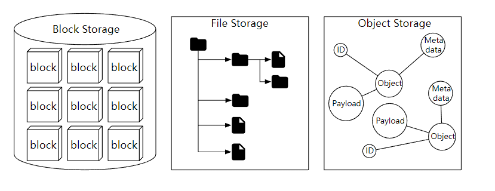

**术语**

要设计一个类似于 S3 的对象存储，我们需要先了解一些对象存储的核心概念。

- 桶 （Bucket），桶是对象的逻辑容器，存储桶名称是全局唯一的。

- 对象（Object），对象时我们存储在桶中的单个数据，它由对象数据和元数据组成。对象可以是我们存储的任何字节序列，元数据是一组描述对象的键值对。

- 版本控制 （Versioning）， 数据更新时，允许多版本共存。

- 统一资源标识符 (URI)，对象存储提供了 RESTful API 来访问资源，所以每个资源都有一个URI 唯一标识。

- 服务等级协议 (SLA)，SLA 是服务提供商和客户之间的协议。比如 AWS S3 对象存储，提供了 99.9 的可用性，以及夸张的 99.999999999% （11个9） 的数据持久性。

## **设计要求**

在这个面试的系统设计环节中，需要设计一个对象存储，并且要满足下面的几个要求。

- 基础功能，桶管理，对象上传和下载，版本控制。

- 对象数据有可能是大对象（几个 GB），也可能是小对象（几十 kb）。

- 一年需要存储 100 PB 的数据。

- 服务可用性 99.99% （4个9）, 数据持久性 99.9999 % （6个 9）。

- 需要比较低的存储成本。

## 对象存储的特点

在开始设计对象存储之前，你需要了解它的下面这些特点。

**对象不变性**

对象存储和其他两种存储的主要区别是，存储对象是不可变的，允许进行删除或者完全更新，但是不能进行增量修改。

**键值存储**

我们可以使用 URI 来访问对象数据，对象的 URI 是键，对象的数据是值，如下


```plain text
Request:
GET /bucket1/object1.txt HTTP/1.1

Response:
HTTP/1.1 200 OK
Content-Length: 4567

[4567 bytes of object data]
```

**写一次，读多次**

对象数据的访问模式是一次写入，多次读取。根据 LinkedIn 做的研究报告，95 %的请求是读取操作。

【Ambry: LinkedIn’s Scalable Geo-Distributed Object Store】

**支持小型和大型对象**

对象存储的设计理念和 UNIX 文件系统的设计理念非常相似。在 UNIX 中，当我们在本地文件系统中保存文件时，它不会把文件名和文件数据一起保存。那是怎么做的呢？它把文件名存储在 inode 的数据结构中，把文件数据存储在不同的磁盘位置。inode 包含一个文件块指针列表，这些指针指向文件数据的磁盘位置。当我们访问本地文件时，首先会获取 inode 中的元数据。然后我们按照文件块指针来读取磁盘的文件数据。

对象存储的工作方式也是如此，元数据和数据存储分离，如下

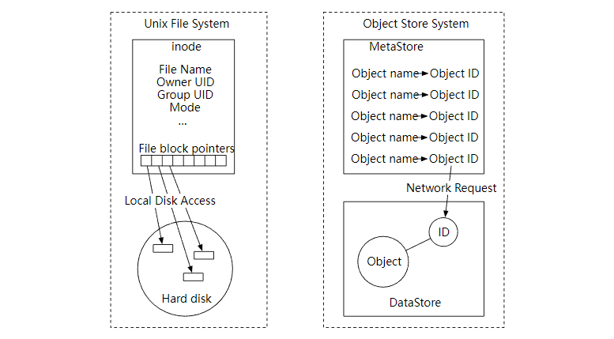

看一看我们的存储桶和对象的设计

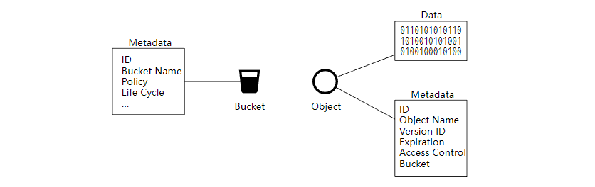

## **整体设计**

下图显示了对象存储的整体设计。

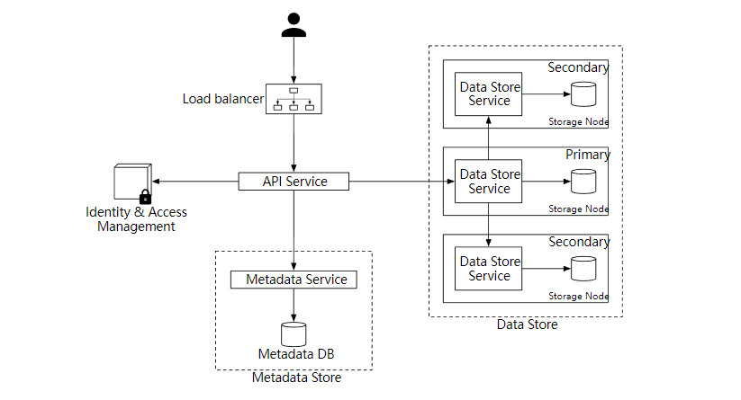

- Load balancer 负载均衡，向多个 API 服务分发 RESTful API 请求。

- API Service，编排身份验证服务，元数据服务和存储服务，它是无状态的，可以很好的支持水平扩展。

- Identity & Access Management （IAM），身份和访问管理，这是处理身份验证、授权和访问控制的服务。

- Data Store 数据存储，存储和检索对象数据，所有和数据有关的操作都是基于对象 ID（UUID）。

- Metadata Service 元数据服务，存储对象的元数据。

接下来我们一起来探索对象存储中的一些重要的工作流程。

- 上传对象

- 下载对象

- 版本控制

## **上传对象**

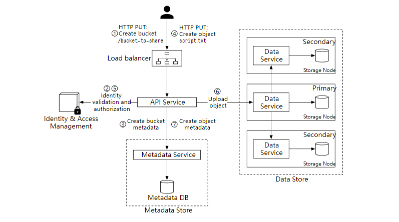

在上面的流程中，我们首先创建了一个名为 "bucket-to-share" 的存储桶，然后把一个名为 "script.txt" 的文件上传到这个桶。

1. 客户端发送一个创建 “bucket-to-share” 桶的 HTTP PUT 请求，经过负载均衡器转发到 API 服务。

1. API 服务调用 IAM 确保用户已获得授权并且有 Write 权限。

1. API 服务调用元数据服务，创建存储桶，并返回成功给客户端。

1. 客户端发送创建 “script.txt” 对象的 HTTP PUT 请求。

1. API 服务验证用户的身份并确保用户对存储桶具有 Write 权限。

1. API 服务把 HTTP 请求发到到数据存储服务，完成存储后返回对象的 UUID。

1. 调用元数据服务并创建元数据项，格式如下

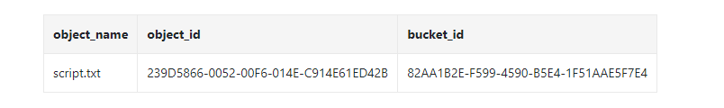

上传数据的 Http 请求示例如下:

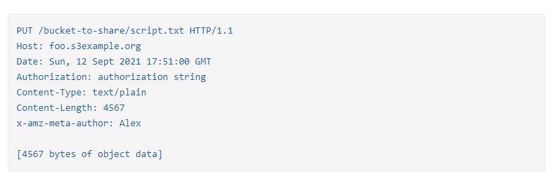

## **下载对象**

存储对象可以通过 HTTP GET 请求进行下载，示例如下

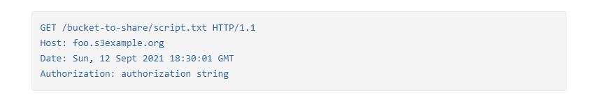

**下载流程图**

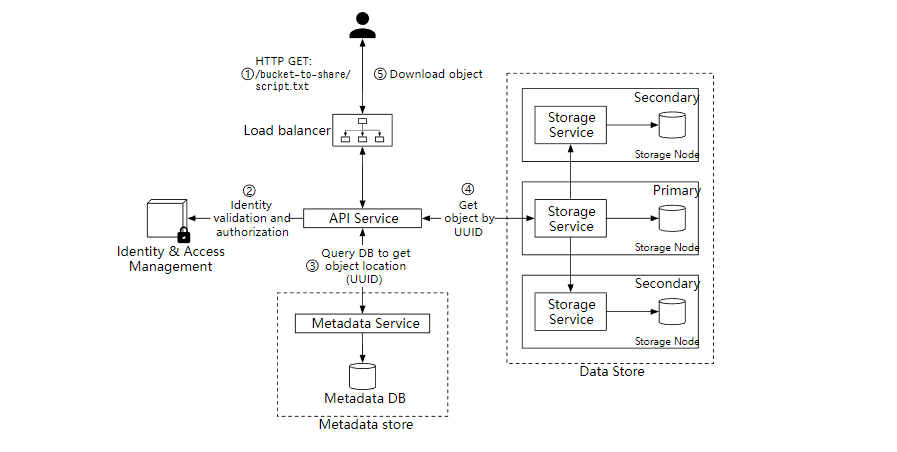

1. 客户端发送 GET 请求，GET /bucket-to-share/script.txt

1. API 服务查询 IAM 验证用户是否有对应桶的读取权限。

1. 验证后，API 服务会从元数据服务中获取对象的 UUID。

1. 通过 对象的 UUID 从数据存储中获取相应的对象。

1. API 服务返回对象给客户端。

## **深入设计**

接下来，我们会讨论下面几个比较重要的部分。

- 数据一致性

- 元数据

- 版本控制

- 优化大文件的上传

- 垃圾收集 GC

## **数据一致性**

对象数据只存放在单个节点肯定是不行的，为了保证高可用，需要把数据复制到多个节点。这种情况下，我们需要考虑到一致性和性能问题。

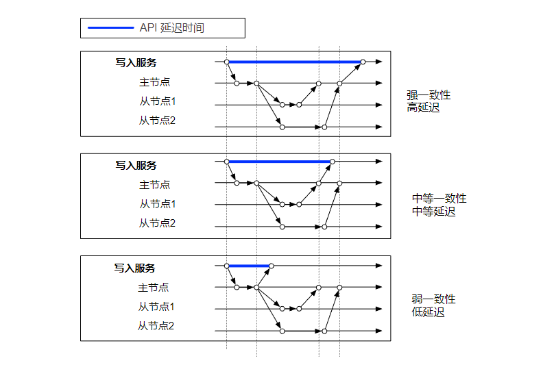

保证强一致性就要牺牲性能，如果性能要求比较高时，可以选择弱一致性。鱼和熊掌不可兼得。

## 数据存储方式

对于数据存储，一个简单的方式是把每个对象都存储在一个独立的文件中，这样当然是可以的。但是，当有大量的小型文件时，会有下面两个问题。

第一个问题是，会浪费很多数据块。文件系统把文件存储在磁盘块中，磁盘块的大小在卷初始化的时候就固定了，一般是 4 kb。所以，对于小于 4kb 的文件，它也会占满整个磁盘块。如果文件系统中保存了大量的小文件，那就会就会有很多浪费。

第二个问题是，系统的 inode 容量是有限的。文件系统把文件元数据存储在 inode 特殊类型的磁盘块中。对于大多数文件系统，inode 的数量在磁盘初始化时是固定的。所以有大量的文件时，要考虑到 inode 容量满的问题。

为了解决这个问题，我们可以把很多小文件合并到一个更大的文件中。从概念上讲，类似于预写日志（WAL）。当我们保存一个对象时，它被附加到一个现有的文件中。文件大小达到一定值（比如说 1 GB）后，创建一个新的文件来存储对象，下图解释了它的工作流程。

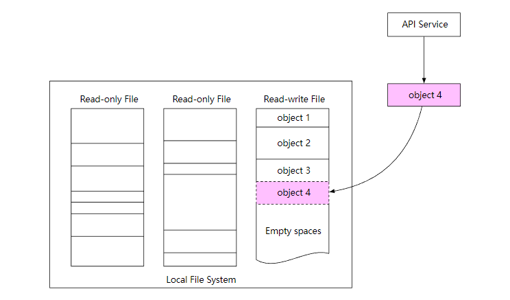

## **数据持久性**

对存储系统来说，数据持久性非常重要，如何设计出一个 6 个 9 (99.9999%) 持久性 的存储系统？

**硬件故障和故障域**

无论使用哪种存储，硬件故障都是不可避免的。所以为了数据持久性，需要把数据复制到多个硬盘中。

假设硬盘的年故障率是 0.81 %, 当然不同的型号和品牌这些是不一样的，那个我们需要三个数据副本，1-(0.0081)^3=~0.999999, 才可以满足要求。

另外，我们还需要考虑到不同故障域的影响。这样可以在极端情况下，带来更好的可靠性，比如大规模停电，自然灾害等。

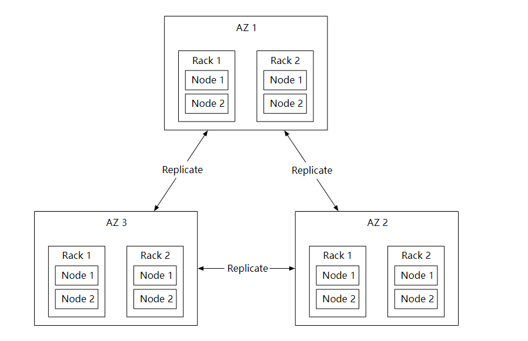

## Erasure Coding 纠删码

上面提到，我们用三个完整的数据副本可以提供大概 6 个 9 的数据持久性，但是，这样的成本太高了。

还能不能优化呢？我们可以使用纠删码技术，它的原理其实很简单，假设现在有 a 和 b 两条数据，进行异或 （XOR）运算后得到 c，a ^ b = c , 而 b = c ^ a，a = c ^ b，所以这三条数据丢失任意一条数据，都可以通过剩余两条数据计算出丢失数据。

下面是一个 4 +2 纠删码的例子。

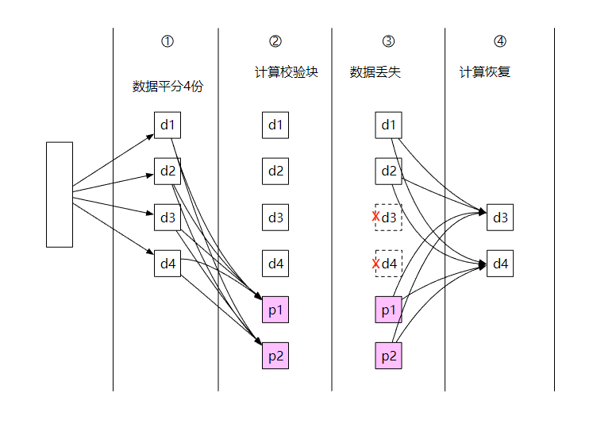

1. 数据被分成四个大小均匀的数据块 d1、d2、d3 和 d4。

1. 使用 Reed-Solomon 数学公式计算校验块，比如 `p1 = d1 + 2*d2 - d3 + 4*d4 p2 = -d1 + 5*d2 + d3 - 3*d4`

1. 节点崩溃，导致数据 d3 和 d4 丢失。

1. 通过数据公式和现有数据，计算出丢失的数据并恢复。`d3 = 3*p1 + 4*p2 + d1 - 26*d2d4 = p1 + p2 - 7*d2`

和多副本复制相比，纠删码占用的存储空间更少。但是，在进行丢失数据恢复时，它需要先根据现有数据计算出丢失数据，这也消耗了 CPU 资源。

## 数据完整性校验

纠删码技术在保证数据持久性的同时，也降低的存储成本。接下来，我们可以继续解决下一个难题：数据损坏。

我们可以给数据通过 Checksum 算法计算出校验和。常见的 checksum 算法有 MD5, SHA1 等。

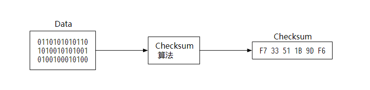

当需要验证数据时，只需要对比校验和即可，如果不一致，说明文件数据发生了改变。

我们同样可以把校验和添加到存储系统中，对于读写文件，每个对象都计算校验和，而对于只读文件，只需要在文件的末尾添加上整个文件的校验和即可。

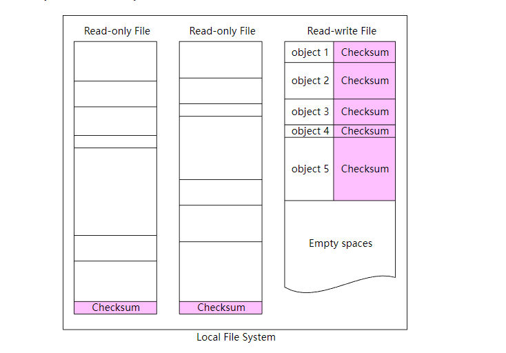

## **版本控制**

版本控制可以让一个对象的多个版本同时保存在存储桶中。这样的好处是，我们可以恢复意外删除或者覆盖的对象。

为了支持版本控制，元数据存储的列表中需要有一个 object_version 的列。上传对象文件时，不是直接覆盖现有的记录，而是插入一个新记录。

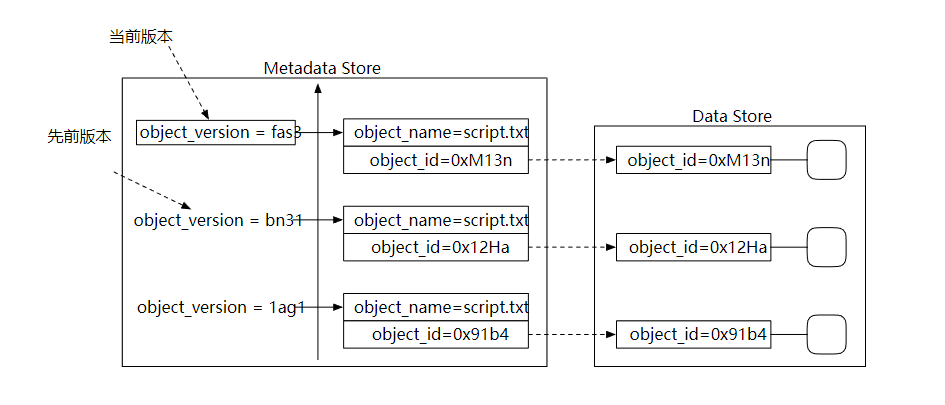

当进行对象删除的时候，不需要删除这条记录，而是添加一个删除标记即可，然后等垃圾收集器自动处理它。

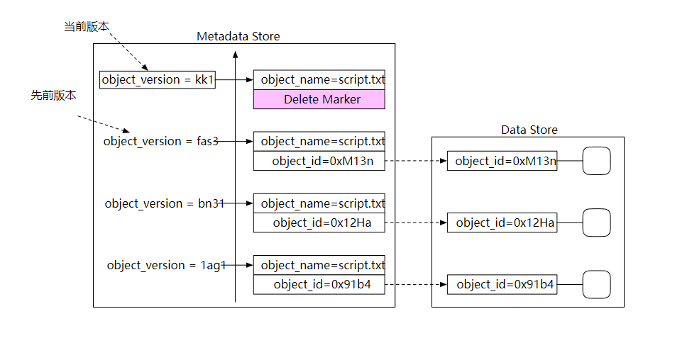

## **优化大文件上传**

对于比较大的对象文件（可能有几个 GB），上传可能需要较长的时间。如果在上传过程中网络连接失败，就要重新进行上传了。

为了解决这个问题，我们可以使用分段上传，上传失败时可以快速恢复。

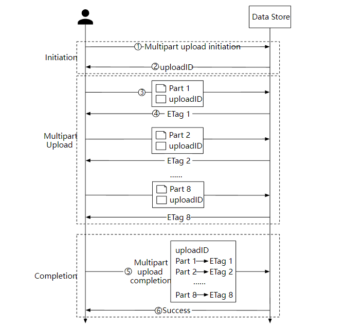

1. 客户端调用对象存储服务发起分段上传请求。

1. 数据存储服务返回一个唯一的 uploadID。

1. 客户端把大文件拆分为小对象并开始上传，假设文件大小是 1.6 GB, 每个部分的大小是 200 MB, 客户端上传第一部分和 uploadID 。

1. 上传第一部分后，数据存储服务会返回一个 ETag，本质上它是第一部分的 md5 校验和，客户端通过它来判断数据是否发生了更改，如果是则重新上传。

1. 当每个部分都上传成功后，客户端发送一个分段上传成功的请求。

1. 数据存储服务组装小对象为大文件，并返回一个成功消息。

## 垃圾收集 GC

垃圾收集是自动回收不再使用的存储空间的过程，数据可能变成垃圾的几种方式：

- 延迟删除的对象，对象在删除时标记成已删除，但实际上还没有删除。

- 孤儿数据，比如上传一半的数据。

- 损坏的数据。

对于需要删除的对象，我们使用压缩机制定期清理，下图显示了它的工作流程。

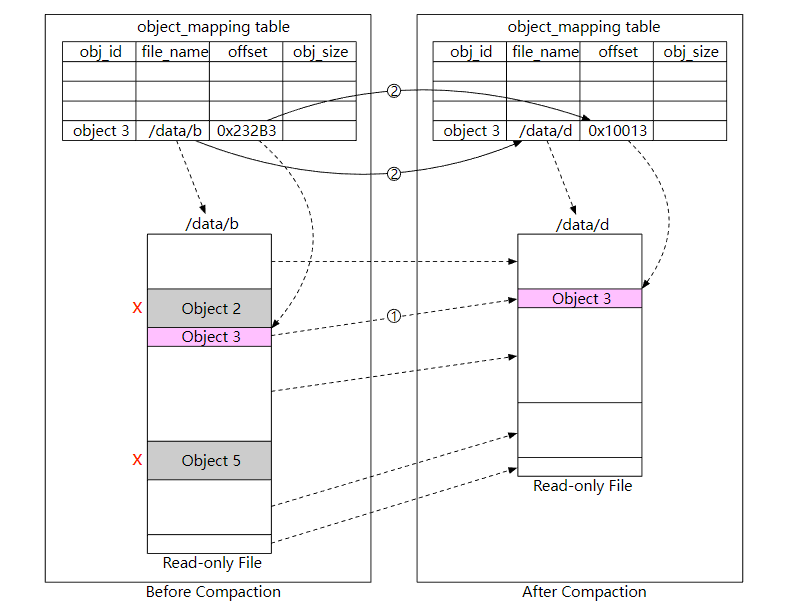

1. 垃圾收集器把对象 “/data/b”复制到一个名为“/data/d”的新文件中。这里会跳过对象 2 和 5，因为它们的删除标志都是 true。

1. 复制完所有的对象后，垃圾收集器会更新 object_mapping 表，指向新的文件地址，然后删除掉旧的文件。

在本文中，介绍了类似于 S3 的对象存储，比较了块存储、文件存储和对象存储之间的区别，设计了对象上传，对象下载，版本控制功能，并讨论了两种提高可靠性和持久性的方法：复制和纠删码，最后介绍了对象存储的垃圾收集的工作流程。

希望这篇设计对象存储的文章对大家有用！

## Reference

[0] System Design Interview Volume 2:
https://www.amazon.com/System-Design-Interview-Insiders-Guide/dp/1736049119

[1] Fibre channel: https://en.wikipedia.org/wiki/Fibre_Channel

[2] iSCSI: https://en.wikipedia.org/wiki/ISCSI

[3] Server Message Block: https://en.wikipedia.org/wiki/Server_Message_Block

[4] Network File System: https://en.wikipedia.org/wiki/Network_File_System

[5] Amazon S3 Strong Consistency: https://aws.amazon.com/s3/consistency/

[6] Serial Attached SCSI: https://en.wikipedia.org/wiki/Serial_Attached_SCSI

[7] AWS CLI ls command: https://docs.aws.amazon.com/cli/latest/reference/s3/ls.html

[8] Amazon S3 Service Level Agreement: https://aws.amazon.com/s3/sla/

[9] Ambry: LinkedIn’s Scalable Geo-Distributed Object Store: https://assured-cloud-computing.illinois.edu/files/2014/03/Ambry-LinkedIns-Scalable-GeoDistributed-Object-Store.pdf

[10] inode: https://en.wikipedia.org/wiki/Inode

[11] Ceph’s Rados Gateway: https://docs.ceph.com/en/pacific/radosgw/index.html

[12] grpc: https://grpc.io/

[13] Paxos: https://en.wikipedia.org/wiki/Paxos_(computer_science)

[14] Raft: https://raft.github.io/

[15] Consistent hashing: https://www.toptal.com/big-data/consistent-hashing

[16] RocksDB: https://github.com/facebook/rocksdb

[17] SSTable: https://www.igvita.com/2012/02/06/sstable-and-log-structured-storage-leveldb/

[18] B+ tree: https://en.wikipedia.org/wiki/B%2B_tree

[19] SQLite: https://www.sqlite.org/index.html

[20] Data Durability Calculation: https://www.backblaze.com/blog/cloud-storage-durability/

[21] Rack: https://en.wikipedia.org/wiki/19-inch_rack

[22] Erasure Coding: https://en.wikipedia.org/wiki/Erasure_code

[23] Reed–Solomon error correction: https://en.wikipedia.org/wiki/Reed%E2%80%93Solomon_error_correction

[24] Erasure Coding Demystified: https://www.youtube.com/watch?v=Q5kVuM7zEUI

[25] Checksum:https://en.wikipedia.org/wiki/Checksum

[26] Md5: https://en.wikipedia.org/wiki/MD5

[27] Sha1: https://en.wikipedia.org/wiki/SHA-1

[28] Hmac: https://en.wikipedia.org/wiki/HMAC

[29] TIMEUUID: https://docs.datastax.com/en/cql-oss/3.3/cql/cql_reference/timeuuid_functions_r.html

