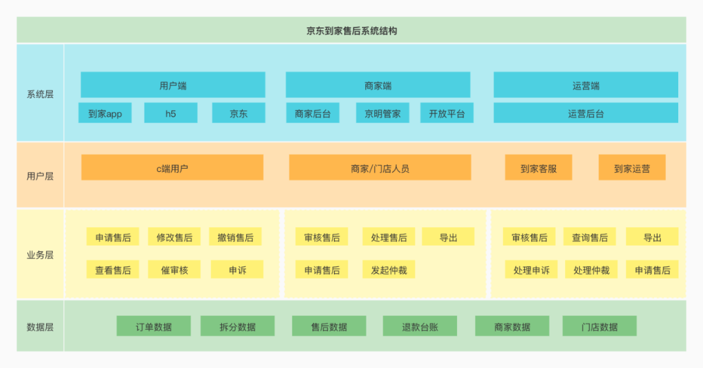
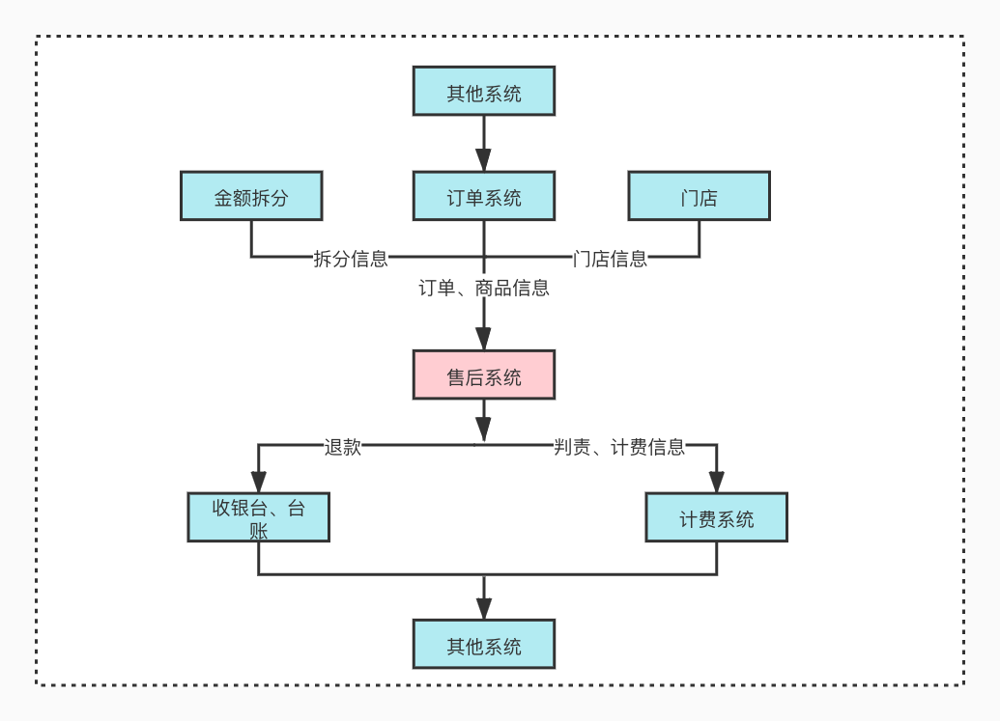
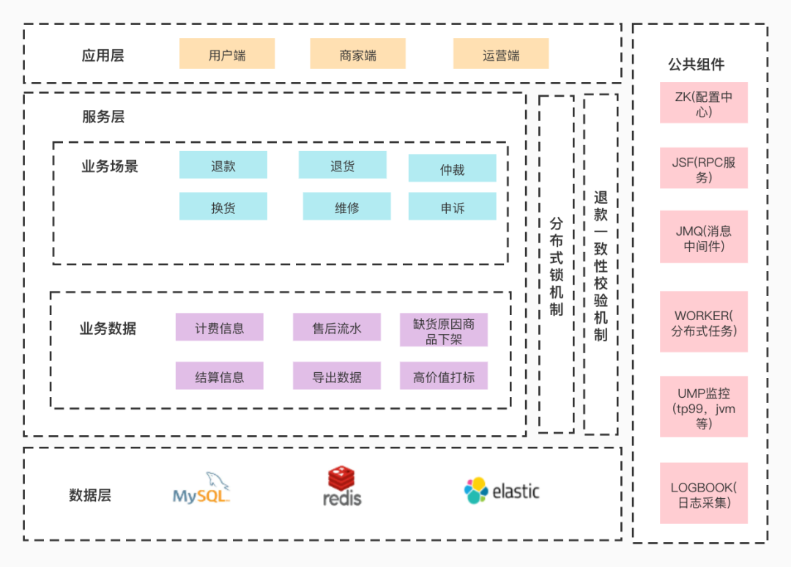
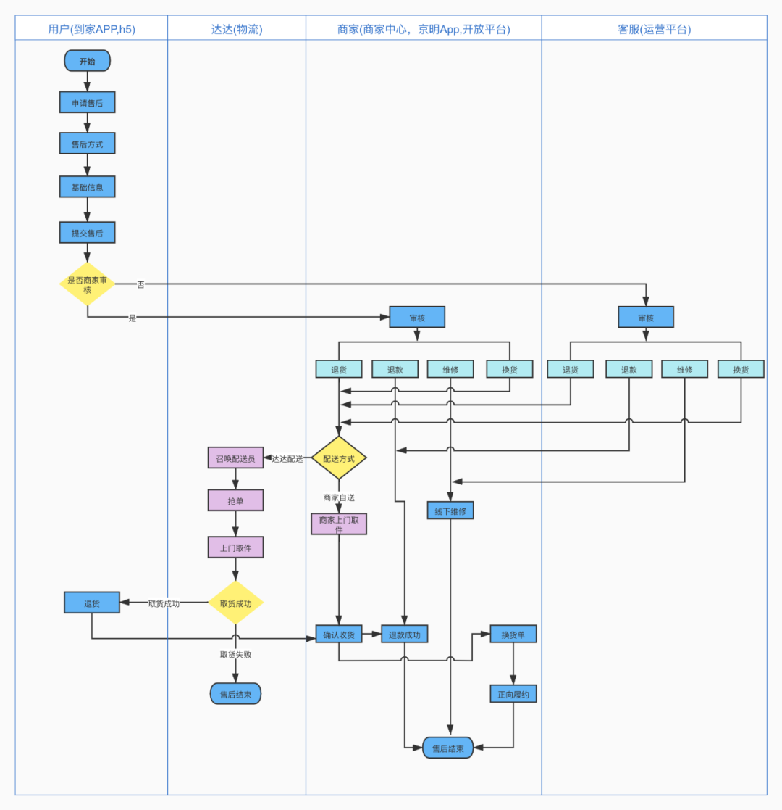
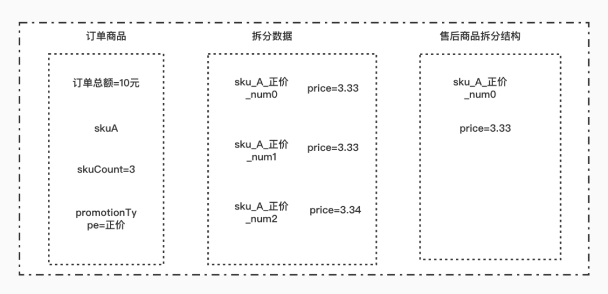
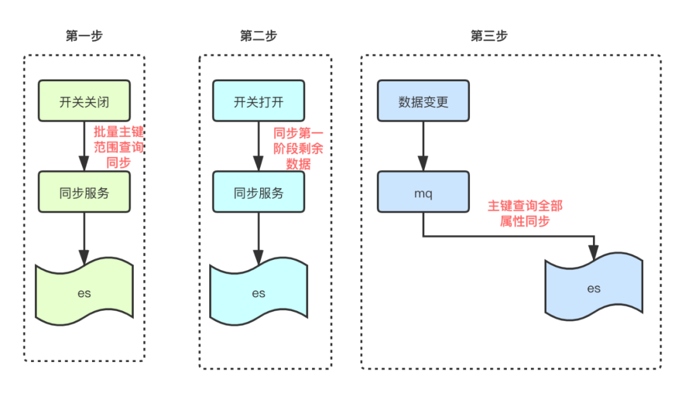
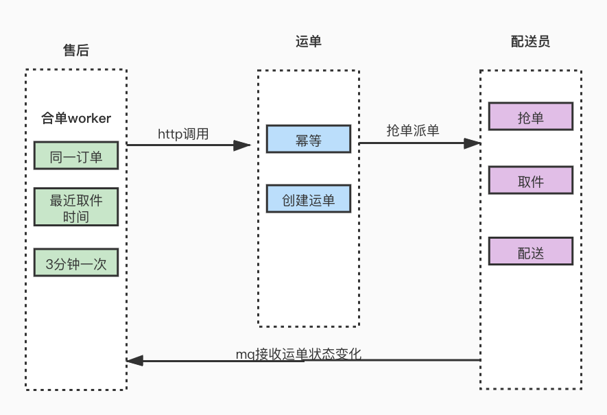
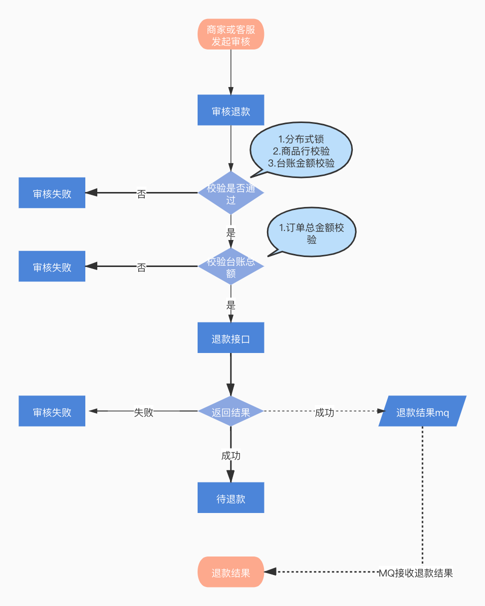

## **前言**

通过阅读本文，您将了解到一个售后系统应该具备的一些能力、在整个上下游系统中的定位、基本的系统架构，以及针对售后业务场景中常见问题的解决方案。

## **一、核心价值**

京东到家售后系统作为逆向流，强依赖京东到家业务域，目前涵盖了：退款、退货、换货、维修等四大类场景，并且为用户与商家提供申诉、仲裁场景支持，为计费与结算系统提供逆向金额数据支持。

售后系统业务结构：



售后系统上下游依赖：



## **二、系统架构**

售后系统使用的就是基础的三层架构。应用层有不同身份的三个端入口，服务层提供了一些业务支持和数据支持，数据层目前使用到了MySQL和Redis以及ElasticSearch。当然还有一些中间件使用，比如rpc框架，zk配置中心，worker分布式定时任务，jmq消息。还有完善的基础设施，统一监控和日志采集。



## **三、业务形态**

当正向订单履约完成后，如订单中商品有缺件、错件、质量等问题可以发起售后申请。目前申请售后支持用户端、商家端、到家客服发起。用户端申请需要根据不同责任方分配到商家或者客服审核。商家端只能选择商家责任原因申请售后，然后自动审核通过。客服代用户申请售后和用户端一致，流转到商家或客服审核。

用户端申请售后流程：



### **1. 申请售后**

**1）多端操作并发场景下问题**

**2）售后商品拆分信息如何获取**

在正向订单履约完成后一定的时效内，可以通过用户端，商家端，运营端基于订单中商品选择性申请售后。当接收到一个售后单提交申请，售后这边会依赖订单数据，拆分数据来构建售后单详情数据。那么对于多端申请售后入口，我们怎么能保证订单中商品不会被重复申请呢？申请时我们使用了redis分布式锁。

**售后申请场景下分布式锁需要注意点：**

①不同的入口使用相同的key，这里我们通过前缀加订单号来区分，来保证对同一订单加锁。

②加入过期时间，比如第一个申请获取到锁，如果释放锁异常，这里只需要等到超时时间自动过期，防止死锁。

③等待锁时间，同一个订单多个入口同时申请售后，如果获取不到锁就进入等待，直到获取到锁或者等待超时后退出。

④使用uuid来保证token唯一性，每次都释放自己当前请求锁。

我们保证了同一时间只能有一个订单下的售后能够申请，接下来就是组装售后单详情数据。一个完整的售后单数据来源于订单详情和拆分详情。

通过从订单详情中取用户基础信息，订单信息，商家门店信息来保存到售后单主表中。根据申请选择的商品skuid从订单商品详情中获取对应商品基础信息保存到售后商品表中。接下来就是比较重要的售后商品拆分信息，这个数据来源于拆分系统。先了解下拆分数据结构:



可以看到，拆分系统会根据订单中所有商品把金额拆分到每一件商品上，并且通过num_下标来区分。当选择订单中某个商品发起售后我们是怎么去找到这个商品对应的拆分信息呢？

**我们通过sku_promotionType（商品+促销类型)来区分不同的商品拆分信息，然后通过记录num商品下标来确定找到哪一个商品。**

比如下面的场景：

假设订单中购买了3个正价A商品，1个促销A商品。

①第一次申请一个正价A售后。这时售后系统会记录一个售后单，对应售后详情为商品A。从拆分获取sku_A_正价_num0信息并记录到售后商品拆分详情表。

②再申请一个正价A和一个促销A售后。这里售后会发现此订单已申请过一个正价A，记录的是sku_A_正价_num0。这时就会去取拆分的 sku_A_正价_num1这条数据。

③第二次申请售后对应一个新售后单，商品详情记录为sku_A_正价，sku_A_促销。商品拆分记录数据为:sku_A_正价_num1，sku_A_促销_num0。

初步了解了售后商品获取对应拆分数据的逻辑，这时如果同一个订单中购买了相同促销的A商品，但是价格不一样怎么办呢？按照上面获取逻辑，获取的售后商品金额就会出现多退或者少退情况。

比如下面的捆绑促销：

A+B捆绑销售，A金额3元。A+C捆绑销售，此时A金额2元。这时拆分的数据结构为：sku_A_捆绑_num0价格3元，sku_A_捆绑_num0价格2元。此时如果两个A都申请了售后，我们再按照sku_promotionType去获取拆分那么永远获取的都是第一个的金额。因此针对这种特殊的促销场景，我们在原有获取拆分维度基础上又增加了一个价格。

> 区分维度：sku_promotionType_price(商品+促销类型+价格)

上面的方案可以满足各种不同促销场景的售后，但是针对称重退差订单申请售后还会适用么？

称重退差订单含义：当正向订单拣货时，商家发现实际拣货的称重品和售卖规格有误差，此时可以发起退差单把差额的钱退给用户。之后订单正常履约，订单完成后用户也可以申请售后。此时再申请售后退给用户的钱就应该是减去退差后的部分。

比如下面的场景：

假设一个订单中买了2个原价A+1个促销价A，原价3元，促销价2元，整单共8元。拣货时发现A商品实际重量比标重少，退差1元，此时退差单中会记录商品A退差金额，退差重量。这时选择正价A发起售后申请，售后系统就需要根据实际重量获取退差商品金额，然后计算实际退款金额。这时我们又在原来的基础上增加了一个重量维度。

> sku_promotionType_price_weight(商品+促销类型+价格+重量)

系统都是为了业务来服务的，随着业务变更场景的增多，我们的架构也在演变。目前所有的计算拆分逻辑都封装成统一方法，统一入口，未来再增加不同促销，或者其他业务都可以很友好的支持。

### **2. 审核售后**

**1）多条件复杂查询性能问题**

当售后单申请成功后，会根据审核方分配给商家或者客服审核。这里涉及到两个列表查询，一个是运营端客服使用，一个是商家端根据商家账号权限来展示可操作的售后单列表。最初我们的售后单表数据并不是很大，随着业务品类扩增以及用户量的增加遇到了一些问题。

①数据库频繁报警，慢SQL，影响其他业务

②商家运营反馈售后单列表查询过慢，影响审核效率。

通过分析慢SQL日志，我们根据查询字段增加索引来提高查询速率。由于支持各种查询场景过多，目前主表中已经建立了20多个索引。而且基于业务的发展需要支持查询的时间区间也会更长。主表的数据量一直在增长，还是会遇到查询性能问题，过多的索引对于售后单流程中变化更新也有一定的影响。

因为ES是基于倒排索引实现的搜索，配合分词器在文本模糊搜索上表现比较好，使用的业务场景广泛，因此我们考虑把售后单数据同步到ES中，列表查询走ES。

基于我们目的是为了解决查询问题，每次操作业务都会根据主键再查询一次mysql库详情，数据迁移同步方案如下：



**①存量数据如何同步？**

- 首先增加一个开关来控制操作是走mysql还是es。先关闭开关然后通过批量同步接口，根据主键id范围区间查询把存量数据分批同步到ES中。

- 打开开关，这时如果有新的售后单数据，通过MQ异步同步到ES中，同时把开关打开前产生的一部分数据同步到ES中。

- 最后再通过count总数校验下数据是否全部同步。

**②如何保证数据同步一致性？**

- 涉及到同步数据，难免就会有数据不一致问题。从售后单申请到售后单状态变更，提交事务后每个节点都会发送一个需要同步的MQ消息。

- 接收到消息后通过主键id查询mysql获取售后单详情。然后全量字段同步到ES中。

- 这样不管先消费哪个节点的MQ，同步的数据都是实时查询的数据库，以此来保证每次同步的数据都是当时最新数据。

**③数据延迟怎么处理？**

- MQ消费有延时，就有可能造成ES和mysql中数据状态不一致问题。我们只是为了解决查询性能问题，因此所有复杂查询都是查的ES数据，但当商家或者客服操作售后单时会根据主键查询mysql售后单详情，然后执行审核操作。

- 针对所有的业务操作后端也增加了前置状态校验，来屏蔽这种数据延时带来的问题。

没有最好的方案，只有最适用自己业务的方案。当然现在也有一些工具类插件可以支持不同的同步方案，比如cancel基于binlog的同步以及CloudCanal。我们的目的是为了解决查询效率问题，因此选择了上面的同步方案。

### **3. 售后退货**

**1）合单召唤物流配送方案**

退货退款售后单，商家或平台审核通过后，需要退回订单中货物。这里就需要与达达交互，召唤配送员走逆向取件流程。在创建运单召唤达达配送前售后这边会有一个合单逻辑。



**①合单思想**

- 订单完成后申请售后可以分多次申请，每次可以选择不同数量的商品。

- 如果用户同一个订单中商品分多次售后都申请为退货，那么在售后单审核通过后这些售后的商品都需要配送员送回商家。

- 这里为了提升用户多次退货体验，也同时为了节约配送成本。因此就需要有一个合单逻辑，同一订单下的售后单退货只需召唤一次物流配送即可。

**②合单逻辑**

- 合单worker定时扫描待召唤物流的售后单，当到达用户预计取件开始时间前10分钟就会触发需要合单的任务。

- 合单任务会根据订单号获取此订单下所有需合单的售后单，然后获取预计取件开始时间最近的售后单。

- 依据最近上门取件开始时间来创建物流运单。

**③创建运单**

- 创建运单前需要前置状态校验，只处理待退货售后单。然后组装订单下用户基本信息，需要合单的所有售后单商品信息以及累计重量，创建运单。

- 运单接口根据订单号做幂等处理，重复调用会返回相同的运单号。

**④接收结果**

通过监听运单状态消息，来同步更新配送员信息。

**⑤异常重试**

- 针对合单任务失败数据，记录失败标识，等待下次合单worker执行。

- 记录失败次数，如果超过失败最大次数，跳过合单并预警处理。避免一直合单失败的数据影响正常合单业务数据。

### **4. 售后退款**

**1）退款准确性问题**



通过上面的流程图了解了售后单审核退款到退款结束的一个过程。那么我们都做了哪些来保证审核退款的售后单金额是正确的呢？

**①增加分布式锁**

商家角色审核退款可以通过商家中心、商家端APP、系统对接接口。同时客服端也可以通过运营平台审核退款。

因为这里也涉及多端操作，所以这里的锁主要为了防止重复审核退款。

审核退款时已经确定是售后单维度，每个售后单只能审核退款一次，所以这里的key维度是售后单维度。并且获取不到锁直接抛出失败，提示业务异常。

**②单行商品合法性校验**

为什么要做单行商品合法性校验呢？可以看下下面这个场景:

假设当前订单购买了1个A商品和2个B商品，A商品单价10元，B商品单价15元，整单金额40元。申请售后接口参数为：


```plain text
skuList:[{"skuCount":1,"skuName":"skuA","procotionType":"1"},{"skuCount":1,"skuName":"skuA","promotionType":"1"}]
```

系统对接的商家通过到家开放平台发布的售后接口创建售后单，由于开放平台入口面对的是所有商家，每个商家系统对接能力不一样，可以看出订单中只买了1个A商品，但是传了两遍。正常我们的做法是解析入参list，然后校验每一行商品的合法性。查询当前订单已申请商品个数，以及订单中总商品个数，然后与当前审核售后单商品个数做比较。但是循环比较等于比较了两次，每次个数都是1。而且由于2个商品A总额小于订单总额，所以即使有后面的台账总额校验，还是会造成多退情况。因此这里需要根据当前申请商品总数加已申请此商品总数与订单中商品总数做校验。

**③订单台账金额校验**

- 订单台账金额校验，是最后一道校验，校验的维度不同，是获取每一项支付明细剩余可退金额。

- 校验当前要退售后单金额与台账余额比较，必须小于等于台账余额。

**④异步退款结果**

- 审核退款后，通过异步接收退款mq来更新退款状态。

- 退款成功通知下游依赖系统。

## **总结**

逆向售后的业务是依赖于正向订单的，随着正向单不同场景玩法的增加，售后需要支持的场景也在增多，我们也在不断的迭代进步。在这当中也遇到了一些需要解决和完善的问题，比如售后系统没有自己的网关，这样会造成业务逻辑维护多处，业务不闭环。整个售后业务中各种不同场景下逻辑配置都不同，我们也在规划通过模板引擎配置做到智能化。最后也非常欢迎大家留言交流，共同进步。

<br/>

