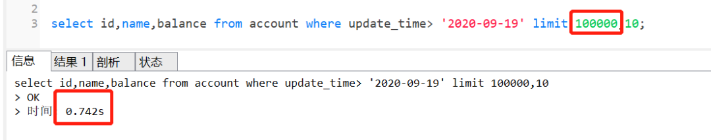
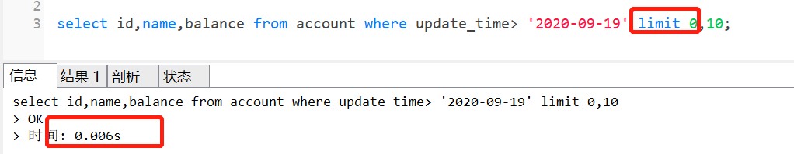
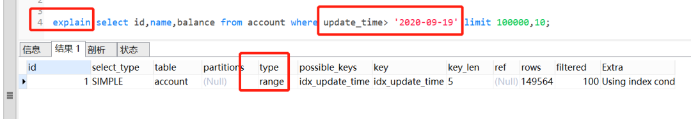
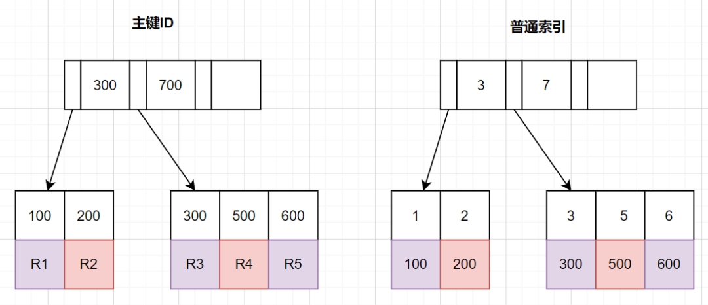
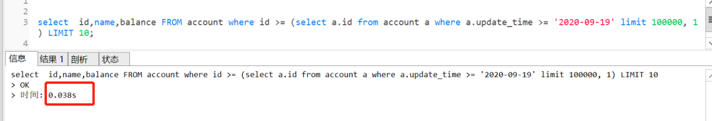
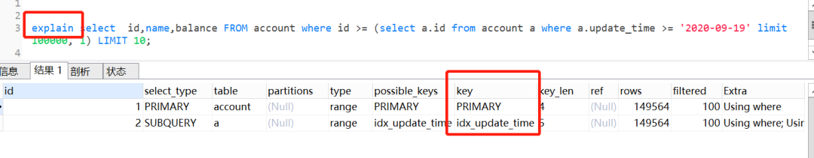
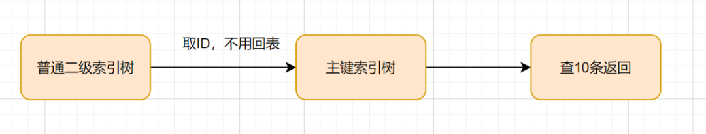
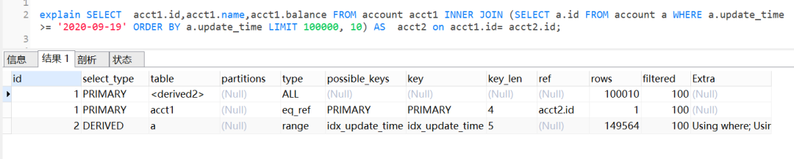

<br/>

**一、前言**

我们日常做分页需求时，一般会用limit实现，但是当偏移量特别大的时候，查询效率就变得低下。本文将分四个方案，讨论如何优化MySQL百万数据的深分页问题，并附上最近优化生产慢SQL的实战案例。

**二、limit深分页为什么会变慢？**

先看下表结构哈：


```sql
CREATE TABLE account (
  id int(11) NOT NULL AUTO_INCREMENT COMMENT '主键Id',
  name varchar(255) DEFAULT NULL COMMENT '账户名',
  balance int(11) DEFAULT NULL COMMENT '余额',
  create_time datetime NOT NULL COMMENT '创建时间',
  update_time datetime NOT NULL ON UPDATE CURRENT_TIMESTAMP COMMENT '更新时间',
  PRIMARY KEY (id),
  KEY idx_name (name),
  KEY idx_update_time (update_time) //索引
) ENGINE=InnoDB AUTO_INCREMENT=1570068 DEFAULT CHARSET=utf8 ROW_FORMAT=REDUNDANT COMMENT='账户表';
```

假设深分页的执行SQL如下：


```sql
select id,name,balance from account where update_time> '2020-09-19' limit 100000,10;
```

这个SQL的执行时间如下：



<br/>

执行完需要**0.742秒**，深分页为什么会**变慢**呢？如果换成 limit 0,10，只需要**0.006秒**哦



我们先来看下这个SQL的执行流程：

- 通过**普通二级索引树**idx_update_time，过滤update_time条件，找到满足条件的记录ID

- 通过ID，回到**主键索引树**，找到满足记录的行，然后取出展示的列（回表）

- 扫描满足条件的100010行，然后扔掉前100000行，返回


                                                                      SQL的执行流程

**执行计划**如下：



**SQL变慢原因**有两个：

- limit语句会先扫描offset+n行，然后再丢弃掉前offset行，返回后n行数据。也就是说limit 100000,10，就会扫描100010行，而limit 0,10，只扫描10行。

- limit 100000,10 扫描更多的行数，也意味着**回表**更多的次数。

**三、优化方案**

**1、通过子查询优化**

因为以上的SQL，回表了100010次，实际上，我们只需要10条数据，也就是我们只需要10次回表其实就够了。因此，我们可以通过**减少回表次数**来优化。

**1）回顾B+ 树结构**

那么，如何减少回表次数呢？我们先来复习下B+树索引结构哈~

InnoDB中，索引分主键索引（聚簇索引）和二级索引

- 主键索引，叶子节点存放的是整行数据

- 二级索引，叶子节点存放的是**主键的值**。



**2）把条件转移到主键索引树**

如果我们把查询条件，转移回到主键索引树，那就可以减少回表次数啦。转移到主键索引树查询的话，查询条件得改为主键id了，之前SQL的update_time这些条件咋办呢？抽到**子查询**那里嘛~

子查询那里怎么抽的呢？因为二级索引叶子节点是有主键ID的，所以我们直接根据update_time来查主键ID即可，同时我们把 limit 100000的条件，也转移到子查询，完整SQL如下：


```sql
select id,name,balance FROM account where id >= (select a.id from account a where a.update_time >= '2020-09-19' limit 100000, 1) LIMIT 10;写漏了，可以补下时间条件在外面
```

查询效果一样的，执行时间只需要0.038秒！



我们来看下执行计划



由执行计划得知，子查询 table a查询是用到了idx_update_time索引。首先在索引上拿到了聚集索引的主键ID,省去了回表操作，然后第二查询直接根据第一个查询的 ID往后再去查10个就可以了！



因此，这个方案是可以的~

<br/>

**2、INNER JOIN延迟关联**

延迟关联的优化思路，**跟子查询的优化思路其实是一样的：**都是把条件转移到主键索引树，然后减少回表。不同点是，延迟关联使用了inner join代替子查询。

优化后的SQL如下：


```sql
SELECT  acct1.id,acct1.name,acct1.balance FROM account acct1 INNER JOIN (SELECT a.id FROM account a WHERE a.update_time >= '2020-09-19' ORDER BY a.update_time LIMIT 100000, 10) AS  acct2 on acct1.id= acct2.id;
```

查询效果也是杠杆的，只需要0.034秒

![Untitled../../../static/paper/34de22c286612804.png)

执行计划如下：



查询思路就是，先通过idx_update_time二级索引树查询到满足条件的主键ID，再与原表通过主键ID内连接，这样后面直接走了主键索引了，同时也减少了回表。

<br/>

**3、标签记录法**

limit 深分页问题的本质原因就是：**偏移量（offset）越大，mysql就会扫描越多的行，然后再抛弃掉。这样就导致查询性能的下降。**

其实我们可以采用标签记录法，就是标记一下上次查询到哪一条了，下次再来查的时候，从该条开始往下扫描。**就好像看书一样，上次看到哪里了，你就折叠一下或者夹个书签，下次来看的时候，直接就翻到啦。**

假设上一次记录到100000，则SQL可以修改为：


```sql
select  id,name,balance FROM account where id > 100000 order by id limit 10;
```

这样的话，后面无论翻多少页，性能都会不错的，因为命中了id索引。但是这种方式有**局限性**：需要一种类似连续自增的字段。

<br/>

**4、使用between...and...**

很多时候，可以将limit查询转换为已知位置的查询，这样MySQL通过范围扫描between...and，就能获得到对应的结果。

如果知道边界值为100000，100010后，就可以这样优化：


```sql
select  id,name,balance FROM account where id between 100000 and 100010 order by id;
```

<br/>

**四、手把手实战案例**

我们一起来看一个实战案例哈。假设现在有表结构如下，并且有**200万**数据。


```sql
CREATE TABLE account (
 id varchar(32) COLLATE utf8_bin NOT NULL COMMENT '主键',
 account_no varchar(64) COLLATE utf8_bin NOT NULL DEFAULT '' COMMENT '账号'
 amount decimal(20,2) DEFAULT NULL COMMENT '金额'
 type varchar(10) COLLATE utf8_bin DEFAULT NULL COMMENT '类型A，B'
 create_time datetime DEFAULT NULL COMMENT '创建时间',
 update_time datetime DEFAULT NULL COMMENT '更新时间',
 PRIMARY KEY (id),
 KEY `idx_account_no` (account_no),
 KEY `idx_create_time` (create_time)
 ) ENGINE=InnoDB DEFAULT CHARSET=utf8 COLLATE=utf8_bin COMMENT='账户表'
```

业务需求是这样：获取最2021年的A类型账户数据，上报到大数据平台。

**1、一般思路的实现方式**

很多伙伴接到这么一个需求，会直接这么实现了：


```java
//查询上报总数量
Integer total = accountDAO.countAccount();

//查询上报总数量对应的SQL
<select id ='countAccount' resultType="java.lang.Integer">  
	seelct count(1) 
	from account  
	where create_time >='2021-01-01 00:00:00'  
	and  type ='A'
</select>

//计算页数
int pageNo = total % pageSize == 0 ? total / pageSize : (total / pageSize + 1);

//分页查询，上报
for(int i = 0; i < pageNo; i++){
	List<AcctountPO> list = accountDAO.listAccountByPage(startRow,pageSize); 
	startRow = (pageNo-1)*pageSize; 
	//上报大数据 
	postBigData(list);
}

//分页查询SQL（可能存在limit深分页问题，因为account表数据量几百万）
<select id ='listAccountByPage' >  
	seelct *  
	from account  
	where create_time >='2021-01-01 00:00:00'  
	and  type ='A'  limit #{startRow},#{pageSize}
</select>
```

**2、实战优化方案**

以上的实现方案，会存在limit深分页问题，因为account表数据量几百万。那怎么优化呢？

其实可以使用标签记录法，有些伙伴可能会有疑惑，**id主键不是连续的**呀，真的可以使用标签记录？

当然可以，id不是连续，我们可以通过order by让它连续嘛。优化方案如下：


```java
//查询最小ID
String  lastId = accountDAO.queryMinId();

//查询最小ID对应的SQL
<select id="queryMinId" returnType=“java.lang.String”>
	select MIN(id)
	from account
	where create_time >='2021-01-01 00:00:00' 
	and type ='A'
</select>

//一页的条数
Integer pageSize = 100;

List<AcctountPO> list ;
do{   
	list = listAccountByPage(lastId,pageSize);   
	//标签记录法，记录上次查询过的Id   
	lastId = list.get(list,size()-1).getId();    
	//上报大数据   
	postBigData(list);
}while(CollectionUtils.isNotEmpty(list));

<select id ="listAccountByPage">  
	select *  from account 
	where create_time >='2021-01-01 00:00:00'  
	and id > #{lastId}  
	and type ='A'  
	order by id asc  
	limit #{pageSize}
</select>
```

<br/>

<br/>

- **原文链接**： [从0.742秒到0.006秒，MySQL百万数据深分页优化实战](https://mp.weixin.qq.com/s/B5poRPitkwW8zYcDX9fyGQ)

<br/>

