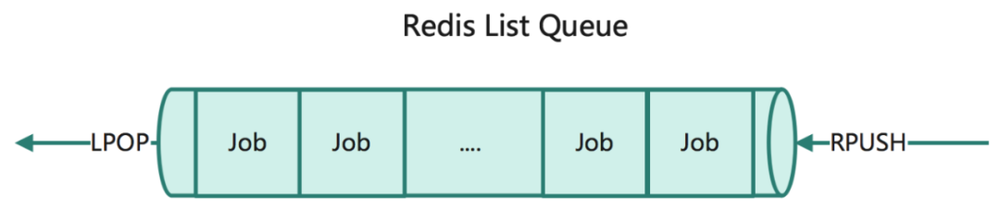
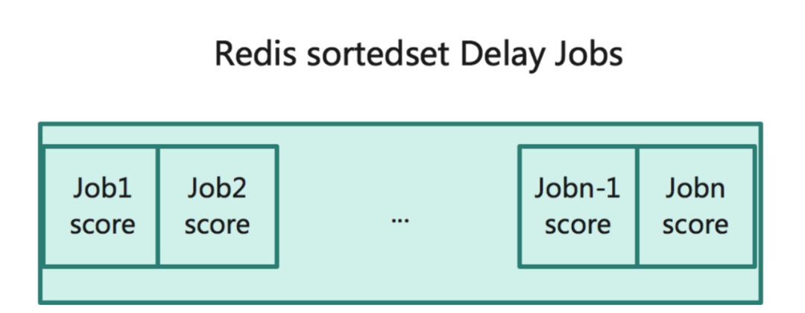
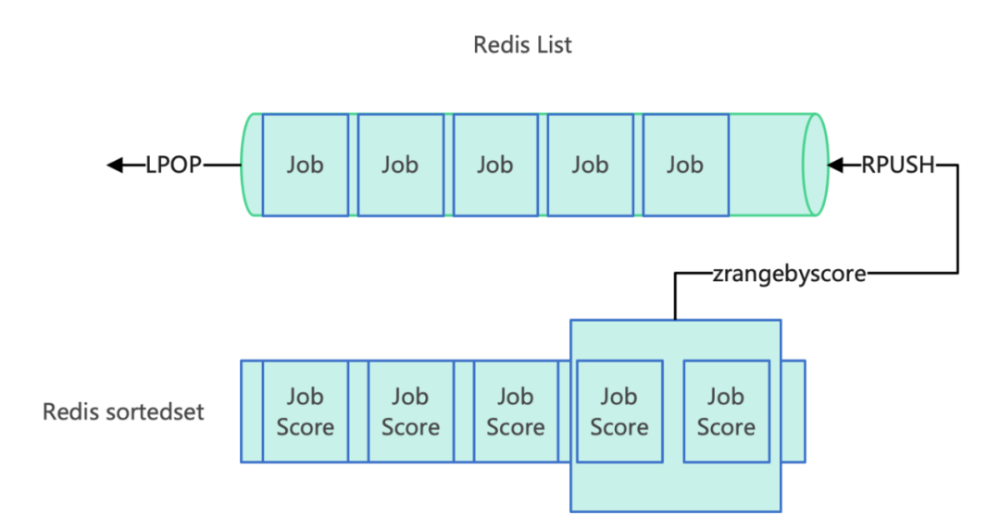
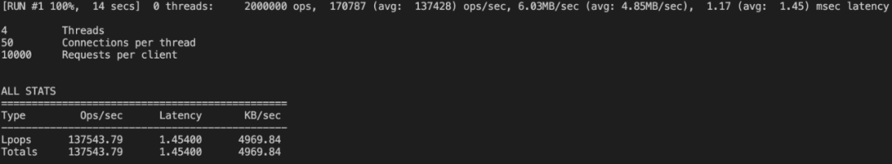
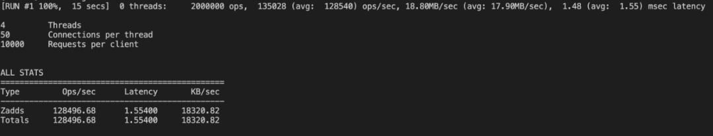
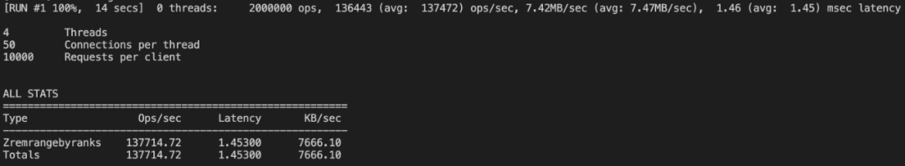
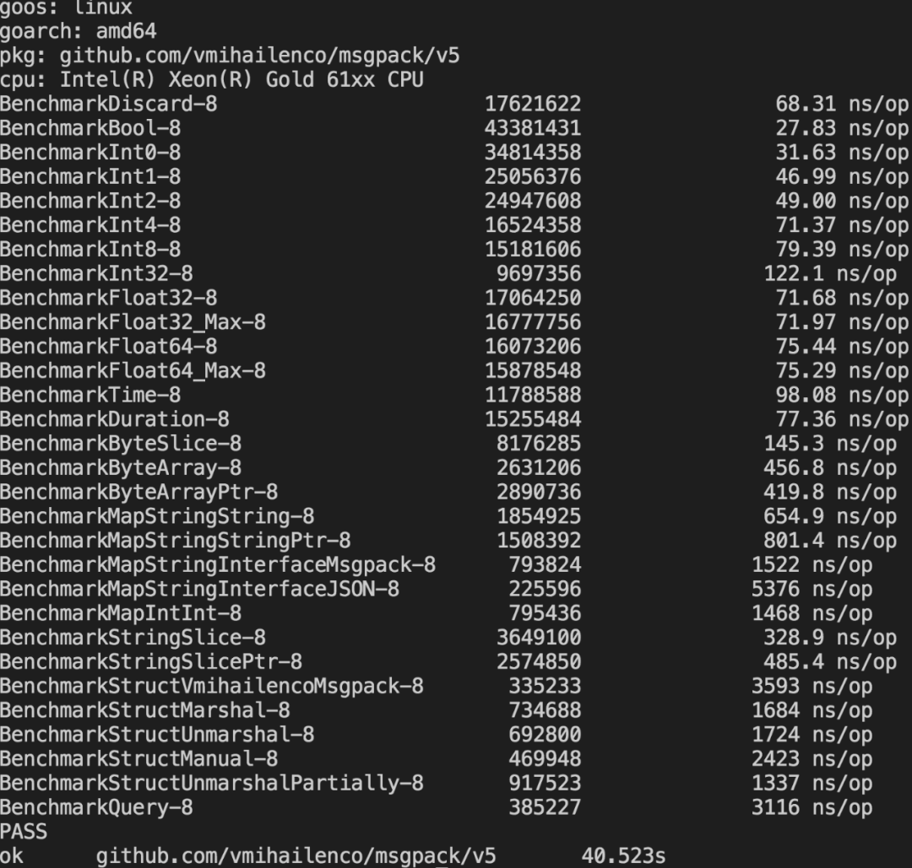
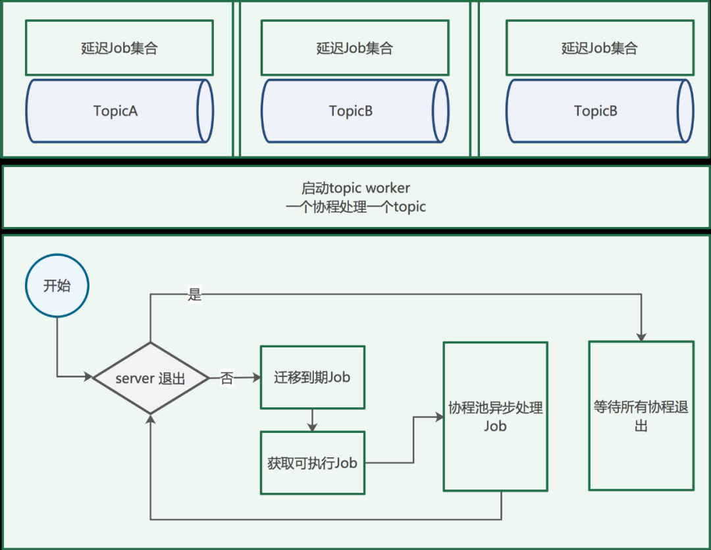

导语 | 本文主要讲述如何使用golang基于Redis实现延迟消息队列组件。希望对有需求的同学有所帮助。

## **一、背景**

业务中经常会有这样的场景：

- 到期后自动执行指定操作；

- 查询某个任务是否完成，未完成等待一定时间再次查询；

- 回调通知，当回调失败时，等待后重试；等等还有其他很多类似的场景。

很多时候我们会直接通过一个本地定时器来帮我们完成这个任务。如果我们的系统是多实例分布式的，本地定时器就会面临很多问题，如：怎么保证重复处理的问题；统一管控的问题等等。面对本地定时器遇到的问题，我们可以使用分布式延迟队列来实现。

这里介绍一种使用golang基于redis实现延迟队列的具体实践。

## **二、实现原理**

1、使用redis可以通过List类型来实现队列的功能，通过LPOP，RPUSH来保证先进先出的特性。



2、针对需要延迟处理的消息可以通过SortedSet有序集合类型来存储, 消息到期时期使用时间戳，作为member score的值。



3、定时轮训sortedset，使用到期时间戳作为score，通过ZRANGEBYSCORE排序获取到期的消息，将到期的消息迁移到List队列中即可。



## **三、消息迁移的原子性**

针对到期消息的往list的迁移需要三个动作：

- 查询到期消息；

- 从sortedset取出到期消息；

- 将到期消息push到list队列中。

那如何保证这个三个操作的`原子性`（要么都成功，要么都失败）。在redis中有两种处理方式可以保证多操作间的原子性。

（一）**Transaction**

- MULTI标记一个事务块的开始。事务块内的多条命令会按照先后顺序被放进一个队列当中，最后由EXEC命令原子性(atomic)地执行。

- EXEC执行所有事务块内的命令。

（二）**LuaScript**

Redis使用单个Lua解释器去运行所有脚本，并且，Redis也保证脚本会以原子性(atomic)的方式执行：当某个脚本正在运行的时候，不会有其他脚本或Redis命令被执行。这和使用MULTI/EXEC包围的事务很类似。在其他别的客户端看来，脚本的效果(effect)要么是不可见的(not visible)，要么就是已完成的(already completed)。注意：编写的script不能很慢，因为会阻塞其他命令的执行。

Transaction能够保证多个操作的原子性。LuaScript不仅保证了多操作间的原子性，可以处理更复杂的逻辑，如保障get、set操作的原子性。这里针对到期消息的迁移是先查询到期的消息，然后两个写操作完成。所以这里使用LuaScript实现更为简单方便。否则还需要加一个锁来避免同一个到期消息多次处理的问题。如果迁移到期消息的模块是单实例（非并发）处理的，不需要加锁处理。

## **四、List，SortedSet性能**

网上针对redis的压测很多，这里我们使用memtier_benchmark将与延迟队列使用到相关的操作进行压测。使用redis6.0，8核16Glinux服务器。

（一）**List读写性能 LPOP，RPUSH时间复杂度为O(1)**



<br/>


（二）**sortedset 相关操作的读写性能**

- zadd O(M*log(N))， N是有序集的基数，M为成功添加的新成员的数量。



- ZREMRANGEBYRANKS O(log(N)+M)， N为有序集的基数，而M为被移除成员的数量。



在熟悉了基于redis实现的延迟队列的基本方法后，接下来看下使用golang具体的实现。

## **五、消息协议定义**

定义一个消息结构来保存消息：


```go
// Job
type Job struct {
  Id        string `msgpack:"1"` // 任务id
  Topic     string `msgpack:"2"` // 消息名
  Delay     int64  `msgpack:"3"` // 延迟时间
  Playload  []byte `msgpack:"4"` // 消息体
  Timestamp int64  `msgpack:"5"` // 消息投递时间
}
```

这里使用msgpack实现消息的序列化。messagepack是一个高效的二进制序列化协议。相比json编码后的数据的体积更小，编解码的速度更快。redis script也支持messagepack。

benchmark性能测试:



其他编解码性能对比参考：

https://github.com/alecthomas/go_serialization_benchmarks

## **六、延迟队列的核心-redis**

基于redis实现分布式延迟队列，其核心是使用List类型实现队列功能；使用sortedset实现延迟消息的管理，并且轮询sortedset将到期的消息迁移到List队列中，再启用consumer实例处理List队列中的消息，就完成了整个延迟队列的核心处理流程。先来看下针对redis操作的相关实现，这里操作redis的库使用的是go-redis库。

（一）获取延时消息数


```go
// zcard
func zcard(rdb *redis.Client, key string) *redis.IntCmd {
  return rdb.ZCard(context.Background(), key)
}
```

（二）获取等待执行的消息数


```go
// list 长度
func llen(rdb *redis.Client, key string) *redis.IntCmd {
  return rdb.LLen(context.Background(), key)
}
```

这两个方法属于metric方法，可以帮助我们了解当前延时队列的消息积压情况，为我们对consumer实例的水平扩展提供参考指标。

（三）发送可执行消息


```go
// 推送新的job到队列
func lpush(rdb *redis.Client, key string, value interface{}) error {
  return rdb.LPush(context.Background(), key, value).Err()
}
```

（四）发送延时消息


```go
// 增加延迟job
func zadd(rdb *redis.Client, key string, value interface{}, delay int) error {
  return rdb.ZAdd(
    context.Background(),
    key,
    &redis.Z{Score: float64(delay), Member: value}).Err()
}
```

（五）获取可执行消息


```go
// 增加延迟job
func zadd(rdb *redis.Client, key string, value interface{}, delay int) error {
  return rdb.ZAdd(
    context.Background(),
    key,
    &redis.Z{Score: float64(delay), Member: value}).Err()
}
```

（六）到期消息迁移到待执行队列，这里使用redis script实现。每次都取指定数量（limit 0 num）的到期消息，时间花费相对稳定。也不至于在到期消息突增时，导致redis内存占用突增。每次执行仅对客户端返回消息数，从而降低网络传输。


```go
// 将到期的job迁移到ready队列等待执行，这里使用redis script实现
func migrateExpiredJobs(rdb *redis.Client, delaykey, readyKey string) error {
  script := redis.NewScript(`
  local val = redis.call('zrangebyscore', KEYS[1], '-inf', ARGV[1], 'limit', 0, 20)
  if(next(val) ~= nil) then
    redis.call('zremrangebyrank', KEYS[1], 0, #val - 1)
    redis.call('rpush', KEYS[2], unpack(val, 1, #val))
  end
  return #val
  `)
  return script.Run(context.Background(), rdb, []string{delaykey, readyKey}, time.Now().Unix()).Err()
}
```

## **七、Product实现**

product功能比较单一，仅实现消息的投递。这里是对Redis两个方法RPUSH、ZADD的的封装。


```go
// QueueClient
type QueueClient struct {
  queue *queue
}// Dispatch
func (c *QueueClient) Dispatch(topic string, payload []byte) error {
  return c.queue.Push(&Job{
    Topic:     topic,
    Playload:  payload,
    Delay:     0,
    Timestamp: time.Now().Unix(),
  })
}
```

QueueClient提供了两个操作方法：

- 发送即时消息，针对非延迟执行的消息直接投递到ready队列中，等待执行；


```plain text
// Dispatch
func (c *QueueClient) Dispatch(topic string, payload []byte) error {
  return c.queue.Push(&Job{
    Topic:     topic,
    Playload:  payload,
    Delay:     0,
    Timestamp: time.Now().Unix(),
  })
}
```

- 发起延迟消息，针对需要延迟执行的消息这里支持秒级的延迟消息。这里底层使用的ZADD。


```plain text
// DispatchDelaySecond
func (c *QueueClient) DispatchDelaySecond(topic string, payload []byte, delaySec int) error {
  return c.queue.DelayJob(&Job{
    Topic:     topic,
    Playload:  payload,
    Delay:     int64(delaySec),
    Timestamp: time.Now().Unix(),
  })
}
```

## **八、consumer实现**

在完成消息投递的相关方法的实现后，我们来看下如何实现一个稳定高效的消息处理框架。

consumer完成两个核心操作：

- 将到期的消息，迁移到可执行队列中；

- 从可执行队列中取出消息完成相应的处理。

接下来看下consumer queueserver的实现的主要方法。



1、QueueServer开始执行的topic worker处理消息。一个topic一个协程的处理方式，保证不同的topic之间不相互影响；


```plain text
// QueueServer
type QueueServer struct {
  queueOption *QueueOption
  topicwokers []*TopicWorker
  queue       *queue
  stopCh      chan struct{}
  close       uint32
}

// Run 开始处理消息直到收到退出命令
func (s *QueueServer) Run(ctx context.Context) error {
  // 一个topic 一个协程处理
  for _, topicWorker := range s.topicwokers {
    go s.processJob(ctx, topicWorker)
  }
  // 监听系统信号
  go s.watchSystemSignal(ctx)
  // 等待退出
  <-s.stopCh
  ctxTimeOut, cancalFunc := context.WithTimeout(ctx, time.Second*time.Duration(s.queueOption.CloseWaitTime))
  defer cancalFunc()
  return s.Close(ctxTimeOut)
}
```

2、定义统一消息处理接口JobHandler，定义了两个方法：Topic返回队列名；Execute完成消息的处理，可以实现业务处理逻辑。


```plain text
// JobHandler
type JobHandler interface {
  Topic() string // 返回topic名称
  Execute(context.Context, []byte) error // 处理消息
}
```

通过topic worker来管理每个消息队列的处理。


```plain text
// TopicWorker
type TopicWorker struct {
  TopicName   string     // topic 名称
  Handler     JobHandler // 处理job的方法
  WorkerCount int        // 并行任务数
  WorkerPool  *semaphore.Weighted // 通过信号量控制并发协程数
}
```

通过信号量semaphore库实现协程的并发数控制。如果消息间有顺序要求，可以设置workerCount为1。当server退出的时候，获取与workerCount相等数量的信号量等待所有处理消息的协程执行完成。s.queue.GetReadyJob(topic.TopicName) 这个方法的内部出了获取可执行消息外，还执行了到期消息迁移的方法。


```plain text
// GetReadyJob 迁移到期消息，返回可执行消息
func (q *queue) GetReadyJob(topic string) (*Job, error) {
  migrateExpiredJobs(q.rdb, 
                           fmt.Sprintf("%s:%s", topic, DelayJobType),
                           fmt.Sprintf("%s:%s", topic, ReadyJobType))
  return q.Pop(topic)
}
```


```plain text
// processJob 处理消息
func (s *QueueServer) processJob(ctx context.Context, topic *TopicWorker) error {
  // 循环获取消息直到server退出
  for {
    // 判断server是否退出
    if atomic.LoadUint32(&s.close) == closed {
      break
    }
    // 通过信号量控制并发的协程数，正在运行的协程达到上限就等待
    if err := topic.WorkerPool.Acquire(ctx, 1); err != nil {
      return err
    }
    job, err := s.queue.GetReadyJob(topic.TopicName)
    if err != nil && err != redis.Nil {
      topic.WorkerPool.Release(1)
      continue
    }
    // 没有要执行的job
    if job == nil {
      topic.WorkerPool.Release(1)
      time.Sleep(time.Second * time.Duration(s.queueOption.WaitTime))
      continue
    }
    go func() {
      topic.Handler.Execute(ctx, job.Playload)
      topic.WorkerPool.Release(1)
    }()
  }
  // 等待所有处理消息的协程执行完成
  if err := topic.WorkerPool.Acquire(ctx, int64(topic.WorkerCount)); err != nil {
    return err
  }
  return nil
}
```

## **九、扩展**

### （一）Job错误重试

如果想要给上面的Job处理加上错误重试的机制。我们给Job struct加上TryCount字段，当JobHandler 执行返回error时，把job放入可执行队列或是延迟集合（等待指定时候后重试）。通过TryCount来限定重试的次数。超过指定次数后丢弃消息。

### （二）Job超时重试

如果想要给上面的Job处理加上超时重试的机制。我们给Job struct加上TryTimeOut字段，当读取消息的同时把job放入延迟集合（等待到达超时时间后重试）。通过TryCount来限定重试的次数。超过指定次数后丢弃消息。执行成功时需要从set集合删除。

## **十、总结**

使用golang基于redis实现延迟队列的方法如上所述，实现方式很多，但核心基本相同，可能在某些实现细节上略有差异。比如：

- 使用单独的协程来完成到期消息到可执行队列的迁移；

- 使用redis stream来实现队列。

熟悉php laravel框架的应该觉得这个方案相似，本文的实现方案跟laravel里的queue库实现方案类似，它支持更多的消息驱动：本地、文件、mysql、redis等。但我们借助golang可以实现的更高效消息处理框架。使用这种方式需要考虑消息丢失时的补偿机制。

# **参考资料：**

1. redis操作：http://doc.redisfans.com/index.html

1. go-redis：https://github.com/go-redis/redis

<br/>

