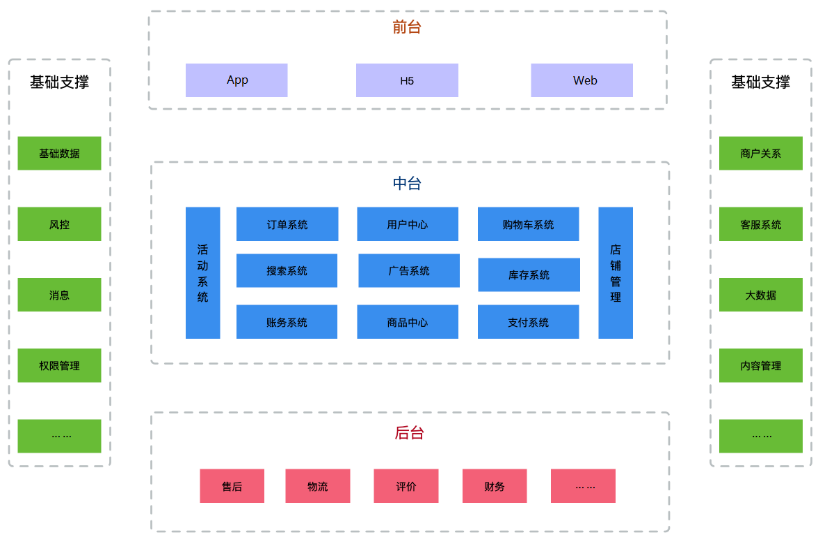
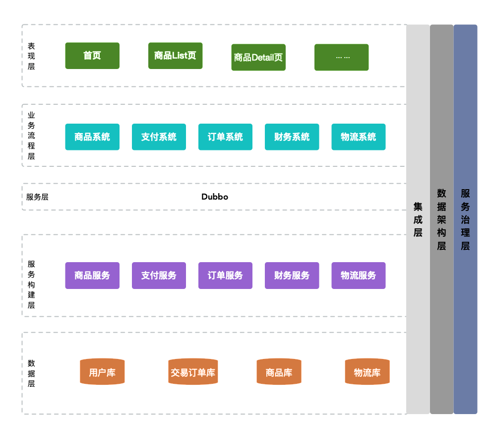
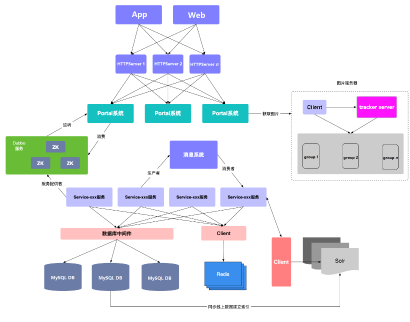
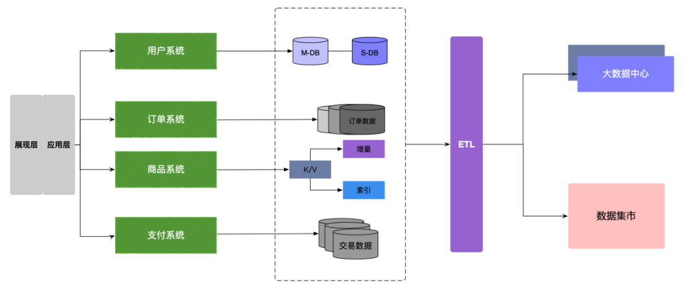

## 架构设计

### 1. 概要

架构设计是从业务需求到系统实现的一个转换，是对需求进一步深入分析的过程，用于确定系统中实体与实体的关系，以及实体的形式与功能。架构设计可根据从业务需求到系统实现的不同需要分为：业务架构、应用架构、数据架构、技术架构。下面以电商系统为例进行架构设计。

### 2. 业务架构

业务架构是对业务需求的提炼和抽象，使用一套方法论对产品（项目）所涉及需求的业务进行业务边界划分，简单地讲就是根据一套逻辑思路进行业务的拆分，开发软件必须满足业务需求，否则就是空中楼阁。软件系统在业务上的复杂度问题，可以从业务架构的角度切分工作交界面来解决。比如在做一个电商网站时，需要将商品类目、商品、订单、支付、退款等功能很清晰地划分出来，不要在业务架构中考虑用什么技术开发、并发量是否大大、选择什么样的硬件，等等。

这里简单规划了电商系统的业务模块，对其根据业务架构的模块不断细化，一直分解到代码流程。对于软件开发而言，以业务架构为依托，架构师和开发者能比较清晰地看到系统的业务全貌，架构师能更方便地分析系统复杂度，分解业务逻辑，做好开发的分工，如下图

业务架构是决定一个软件项目能否顺利开展的总纲，软件架构是业务架构在技术层面的映射，合理的开发分工也应该基于业务架构去做。如果没有业务架构，进行软件开发就会很盲目。业务架构是需求和开发的汇聚点，需求分析是否做到位，功能开发是否达到预期目标，都以此为依托。我们在工作中遇到的一些问题，例如研发人员说需求分析做得不到位，而做需求的人员会质疑需求做到怎样才算到位，为什么开发出的产品和用户想要的不一致，这些从根上来说，都是因为没有将业务架构梳理清楚，没有达成共识。

站在软件项目的角度来看，在项目前期做好业务架构设计，对整个项目的开发都有重要的意义。例如，对于比较类似的业务系统，可能业务架构在比较粗的颗粒度上是一样的，而在细化过程中不一样。在做项目时，当手头有一个现成的系统，需要做一个需求类似的项目时，大家可能会首选尝试用现成的系统去覆盖新项目，以求利益最大化，对于该想法能否实现，可以通过业务架构来衡量，如果没有业务架构，则接下来的工作会非常盲目。

业务架构的设计原则如下：

（1）将业务平台化。

◎ 业务平台化，相互独立，如交易平台、物流平台、支付平台、广告平台等。

◎ 基础业务下沉，可复用，如用户、商品、类目、促销、时效等。

（2）将核心业务和非核心业务分离。将电商系统的核心业务和非核心业务例如主交易服务和通用交易服务分离，将核心业务精简（利于稳定），并将非核心业务多样化。

（3）隔离不同类型的业务。

◎ 交易平台的作用是让买家和卖家签订交易合同，所以需要优先保证高可用，让用户能快速下单。

◎ 履约业务对可用性没有太高要求，但要优先保证一致性。

◎ 秒杀业务对高并发要求很高，应该和常用业务分离。

（4）区分主流程和辅助流程。要清楚哪些是电商系统的主流程，在运行时优先保证主流程的顺利完成；对辅助流程可以采用后台异步的方式，避免辅助流程的失败影响主流程的失败回流。

### 3. 应用架构

应用架构介于业务与技术之间，是对整个系统实现的总体架构，需要指出系统的层次、系统开发的原则、系统各个层次的应用服务。如图5.2所示为将系统分为表现层、业务流程层、服务层、服务构建层、数据层、集成层、数据架构层和服务治理层，并写明每个层次的应用提供的服务。

在进行系统拆分时，要平衡业务和技术的复杂度，保证系统形散神不散。系统采用什么样的应用架构，则受到业务复杂度的影响，包括企业的发展阶段和业务特点；同时受技术复杂度的影响，包括IT技术的发展阶段和内部技术人员的水平。业务的复杂度（包括业务量大）必然带来技术的复杂度，应用架构的目标是在解决业务复杂度的同时避免技术太复杂，确保业务架构落地。

应用架构的设计原则如下：

（1）稳定

◎ 一切以稳定为中心。

◎ 架构尽可能简单、清晰，追求小而美，不要大而全。

◎ 不过度设计。

（2）解耦

◎ 将稳定部分与易变部分分离。

◎ 将核心业务与非核心业务分离。

◎ 将电商主流程和辅助流程分离。

◎ 将应用与数据分离。

◎ 将服务和实现细节分离。

（3）抽象

◎ 应用抽象化：应用只依赖服务抽象，不依赖服务实现的细节和位置。

◎ 数据库抽象化：应用只依赖逻辑数据库，不需要关心物理库的位置和分片。

◎ 服务抽象化：应用虚拟化部署，不需要关心实体机的配置，动态调配资源。

（4）松耦合

◎ 跨域调用异步化：在不同的业务域之间尽量异步解耦。

◎ 非核心业务尽量异步化：在核心业务和非核心业务之间尽量异步化。

◎ 在必须同步调用时，需要设置超时时间和任务队列的长度。

（5）容错设计

◎ 服务自治：服务能彼此独立修改、部署、发布和管理，避免引发连锁反应。

◎ 集群容错：应用系统集群部署，避免单点服务。

◎ 多机房容灾：多机房部署、多活。

### 4. 技术架构

技术架构就是对在业务架构中提出的功能（或服务）进行技术方案的实现，包括软件系统实现、操作系统选择和运行时设计。技术架构的边界比较模糊，对于不同的受众，内容的详细程度也不同，技术栈自上而下比较关注技术架构，但是各层关注的点不同。技术决策层可能关心的是系统或系统群的技术选型，对整体的把握要保证不因为选型引起其他风险，例如，如果在高性能存储方面选择Redis，就要尽量保证网络的封闭性，避免公网访问；再如，在选择以COBOL语言实现的各类产品时，要考虑市场上开发人员数量少，需要承担更高的迭代成本等。

上述业务架构的一个简单技术架构如图

技术架构的设计原则如下。

（1）无状态，即尽量不要把状态数据保存在本机上。

（2）可复用。

◎ 复用粒度是有业务逻辑的抽象服务，不是服务的实现细节。

◎ 服务引用只依赖服务抽象。

（3）松耦合

◎ 跨业务域调用，尽可能异步解耦。

◎ 在同步调用时设置超时时间和队列大小。

◎ 将相对稳定的基础服务与易变流程服务分离。

（4）可治理

◎ 服务可降级。

◎ 服务可限流。

◎ 服务可开关。

◎ 服务可监控。

◎ 白名单机制。

◎ 制订服务契约。

（5）基础服务

◎ 基础服务下沉、可复用，例如时效、库存和价格计算。

◎ 基础服务自治、相对独立。

◎ 对基础服务的实现要精简，并可水平扩展。

◎ 对基础服务的实现要进行物理隔离，包括基础服务相关的数据。

### 5. 数据架构

数据架构是对存储数据（资源）的架构，其设计原则和应用架构设计大同小异，在设计时需要考虑系统的业务场景，需要根据不同的业务场景对数据进行异构设计、数据库读写分离、分布式数据存储策略等。如图所示是电商系统中数据架构的一个概要。

数据架构包括两部分内容：静态部分的内容和动态部分的内容。静态部分的内容的重点是数据元模型、数据模型，包括主数据、共享动态数据和所有业务相关的业务对象数据的分析和建模；动态部分的内容的重点则是对数据全生命周期的管控和治理。因此，不能单纯地将数据架构理解为纯静态的数据模型。业务架构中数据模型的分析重点是主数据和核心业务对象，应用架构中数据模型的分析重点则进一步转换为逻辑模型和物理模型，直到最终的数据存储和分布。

数据分两个层面的生命周期：单业务对象数据的全生命周期，它往往和流程建模中的单个工作流或审批流相关；跨多个业务域对象数据的全生命周期，它体现的是多个业务对象数据之间的转换和映射，往往和端到端的业务流程BPM相关。这里要注意，数据虽然是静态层面的内容，但是数据的生命周期或端到端的数据映射往往间接反映了流程，这是很重要的内容。

数据建模的方法包括面向结构的传统ER模型分析方法，也包括面向对象的对象类模型分析方法，它们都是可行的数据建模方法，只是传统ER模型分析方法更容易实现向底层物理数据库模型的转换，而面向对象的对象类建模方法更容易体现抽象和复用。特别是在企业架构建模中，面向对象和面向结构往往不是严格区分的，很多时候都会出现两种方法混用的情况，但重点是区分每种方法或工具的重点及要解决的问题。

与数据相关的矩阵分析相当多，业务架构阶段的重点矩阵分析是业务对象和业务流程、业务组件、业务功能间的类CRUD矩阵分析；而应用架构阶段的重点矩阵分析是逻辑或物理模型对象和具体的应用模块或应用功能间的矩阵分析。两者的思路基本类似，只是关注的层面不同，前者重点关注主数据的识别和业务组件的分析，而后者重点关注应用功能模块的划分和模块间集成接口的初步分析。

根据前面的思路，我们仍然应该将数据集成分析分解为两个层面的内容：业务层面的分析，以及应用和IT实现层面的分析。前者的重点是理清业务流程或业务域之间的业务对象集成和交互，而后者的重点是如何更好地共享数据或如何通过类似的BI工具或大数据平台实现数据的集成和交互。

数据架构的设计原则如下。

（1）统一数据视图，即保证数据的及时性、一致性、准确性和完整性。

（2）数据和应用分离。

◎ 应用系统只依赖逻辑数据库。

◎ 应用系统不直接访问其他宿主的数据库，只能通过服务接口访问。

（3）数据异构，即在源数据和目标数据内容相同时做索引异构，在商品库不同维度的内容不同时（如订单数据中的买家库和卖家库）做数据库异构。

（4）数据库读写分离。

◎ 将访问量大的数据库做读写分离，例如订单库。

◎ 将数据量大的数据库做分库分表。

◎ 将不同业务域的数据库做分区隔离。

◎ 对重要的数据配置备库。

（5）采用关系数据库。除成本因素外，MySQL的数据库扩展性和高并发支持能力较强，公司的研发和运维在这方面有一定的技术积累。

（6）合理利用NoSQL数据库。在数据库有能力支撑时，尽量不要引入缓存。另外，要合理利用缓存做容灾。

### 6. 架构优化总结

优化的常见手段或模式

- 静态化：动态数据和静态数据分离。

- 异步化：使用异步化减少主流程中的非关键业务逻辑。

- 并行化：使用多线程并发处理，缩短响应时间。

- 内存优化：减少对象大小，减少对象创造，数据模型优化

- 去重复运算：业务逻辑优化，或者使用缓存

- 减少数据库操作：数据冗余，数据缓存等

- 缩短数据库事务：短事务，异步化，最终一致性等方式可以考虑

- 精简代码逻辑：去除冗余代码，诸如过度设计检查等代码。

- 精简日志操作：日志大小要关注，注意IO上的瓶颈；日志太多，说明生成的string也会多，也增加了gc负担

### 7. 架构评审

架构设计完成需要被评审，那么架构评审从哪些方面入手呢？

1）紧扣业务

虽然是做技术规划，但如果脱离了业务支撑，是引起不了老板兴趣的

2）从实际问题出发

老板只会为解决实际问题的技术规划买单。规划的开头最好能从实际问题出发，比较容易引起老板的注意

3）重点在落地

只有能落地的技术才有说服力，老板不会被天花乱坠的技术词汇给迷惑的，他只会关注最后能落地是哪几项，应该重点谈落地的目标和计划

4）突出关键点和关键路径

其中一个哥们说了很多，非常丰富，但关键点不突出，结果在老板看来就是个零。在表述规划的整个过程中，一定要紧扣关键旋律，让老板用最短的时间理解你的意图

5）少、准、狠

有的哥们搞得规划面面俱到，结果搞得老板不相信，他想要的东西不是大而全的，而是在一个阶段里能一刀见血的，因此搞规划切勿四面开花，把最关键的、老板最关心的抠出来，并确保把它搞定。

6）目标要量化

老板很关心目标，这个胜于具体的行动计划，他需要用这个来最后check你的结果，因此不量化的目标是通不过的

7）和相关的人要事先沟通清楚

技术规划少不了合作方的支持，在汇报之前一定要知会到相关方，最好能达成一致，因为老板一定会在汇报过程中质疑你是否做过沟通，有好几个哥们因为这个做得不到位，导致老板觉得这个规划是纸上谈兵，不靠谱。

8）具有足够的开放性

如果这个规划只需要你自己或小范围几个人就能搞定，老板会觉得没价值，他希望看到是能involve更多的人，最好还是跨团队的人，只有具有影响力的事情才有规划的必要

9）数据最具说服力

做汇报前，最好能把相关的数据拿到手，并且一定要精确，含糊的说辞最容易遭到PK

以上几点都是在听评审的过程中最受质疑的几点，这对自己以后做技术规划具有参考意义。

 

