RedKV是小红书自研的一款基于NVMeSSD的分布式NoSQL KV存储系统，支持无中心和有中心的两种管控架构，旨在解决公司内实时落盘的KV存储需求。RedKV1.0基于Gossip协议做节点管理，在全公司已经大规模使用，实时QPS接近1亿/秒，存储量在数PB级别。RedKV2.0采用中心Shard管理架构，支持全球多云多副本在线弹性伸缩，异地容灾和服务秒级切换。

通过分层优化，RedKV对比开源同类产品，聚合写吞吐能力平均提升3倍，读1.5倍；对标HBase，成本优化近40%。RedKV部分兼容Redis协议，string/hash/zset等主要数据类型很好的的支持了公司的绝大部分在线存储业务，优化了早期Redis集群部署产生的成本问题以及HBase带来的性能及稳定性问题。RedKV和Hive数仓的数据互通能力为离线数据业务提供了一种解决方案。

## **一、小红书存储发展历史**

小红书是年轻人的生活记录、分享平台，用户可以通过短视频、图文等形式记录生活点滴，分享生活方式。在当前的业务模型下，用户的画像数据和笔记数据用来做风险控制和内容推荐。存储数据具有对象-属性的特征、维度多，画像数据量已经达到数十TB， 在线业务对画像和笔记数据的访问P99时延要求非常高。

2020年之前公司选择的NoSQL存储产品主要有：Redis、HBase，随着公司DAU的高速增长，早期的存储方案遇到如下挑战：

- Redis集群主要适用于缓存场景，开启AOF数据实时落盘对性能有比较大的影响，同时每个节点需要额外挂载云盘用于存储AOF。在集群节点和存储容量受限的情况下，单节点的数据量设置过大会导致故障后节点数据的failover时间太长，单节点数据量设置小会导致gossip协议在稳定性高要求下节点个数受限，同时考虑突发流量的压力，Redis集群在部署上需要做一些空间预留，带来成本高的问题。

- HBase作为一款生态完善的NoSQL存储系统，在高QPS下也产生了诸多的性能和稳定性问题，如：Zookeeper压力大时稳定性难以保障（节点探活，服务注册等都依赖 Zookeeper）；HBase的数据文件和WAL日志文件直接写HDFS，节点故障后，重放HDFS上的WAL速度慢；Java GC会导致Zookeeper误杀RegionServer，同时产生毛刺；Major Compaction 会导致I/O飙升，产生长尾效应；受限HDFS的复杂性，黑盒运维对工程师来说比较困难；在小红书的业务实战中，百万QPS下HBase延时不太理想，核心数据用大内存机型兜住，也引发成本高的问题。

随着业务的持续增长，开源存储产品已经不能很好地满足公司的业务发展需求, 公司需要一款稳定的高性能KV系统支撑内部业务，一方面要满足业务对功能和性能的需求，另一方面要优化成本。

## **二、小红书业务需求**

### **1、高QPS和低延时读取特性**

**1）特征数据存储场景**

写入带宽达到数十GB/s，要求实时写入性能和读取性能都很高。

**2）图片缓存的场景**

数据量很大，要求读取时延低。可以接受故障场景下少量数据丢失。

**3）高性能（P99 < 10ms）**

- 模型数据存储服务。记录过去一段时间用户训练模型数据，对P99时延要求非常高，数据量在几十TB。

- 去重存储服务。数据量在几十TB，P99<10ms, P999<20ms。

- 风控数据存储服务。QPS目前达到千万级别，P999 < 30ms。

### **2、低成本的缓存特性**

**1）对标Redis**

兼容Redis协议，性能比Redis慢一些，但资源成本降低50%+。

**2）典型场景**

广告的关键词存储和反作弊业务，解决大数据量、低QPS的存储模型。

### **3、NoSQL存储特性**

**1）对标HBase**

- 支持数据多版本，列存行取等特性，比HBase成本减少30%+，P99时延提升6倍。

- 支持KKV级别的TTL。

- 强一致：目前RedKV1.0采用的主从双副本，数据写入成功，可以通过配置同步模式来保障2副本写成功，读主写主保障强一致。对于写性能要求高的场景，可以打开异步写，写主成功则返回，依赖增量同步从节点数据。

**2）典型场景**

- 风控服务。实时查询对P999要求极高，千万QPS下HBase已经不能满足性能需求，时延抖动比较大。

- 画像存储服务。数据的维度多，字段读取的业务方多，对时延要求敏感。

## **三、架构设计**

RedKV整体架构分3层，接入层兼容Redis协议，支持各种语言的社区版SDK和公司定制的中间件版；接入代理层支持千万QPS的读写能力，无状态扩展；存储层提供高可靠读写服务。RedKV1.0架构如下图1，下面我们详细地展开3层组件的介绍。

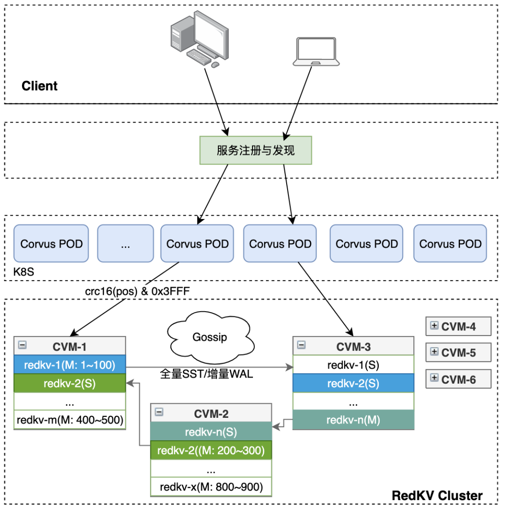

                                图1 RedKV1.0整体架构

**1、Client接入层**

RedKV集群部署完成后，通过公司内部提供的Service Mesh组件做服务发现，对Client提供服务。

**2、Proxy**

Proxy层由一个无状态CorvusPlus进程组成。它兼容老的Redis Client，扩缩容、升级对无Client和后端集群无感，支持多线程、IO多路复用和端口复用特性。对比开源版本，CorvusPlus增强了自我防护和可观测特性，实现了可在线配置的功能特性：

- Proxy限流

- 数据在线压缩

- 线程模型优化

- backup-read优化长尾

- 大key检测

**1）Proxy限流**

小红书当前的业务模型比较多，客户端行为无法预期，可能出现的发版错误、系统问题及网络抖动引发客户端重试，突发的qps会影响服务稳定性。在高QPS压力下，Proxy处理客户端读写超时，大量重试会导致雪崩，业务高峰期单个 Proxy 带宽可能超过机器的出入带宽限制，而存储集群只能保证在有限的资源内提供稳定可靠的服务。针对这类场景，我们需要保证流量过载时，Proxy和RedKV服务不被打崩，能保障高可用。

基于以上问题和目标，对比原生的Redis Cluster模式，RedKV基于令牌桶的流控算法支持了对连接数、带宽和QPS多维度限流。在高QPS下，我们的Proxy限流防止了雪崩，如图2；在大带宽场景下，我们优化了时延，如图3。

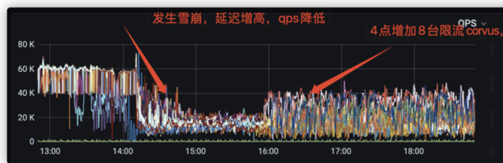

                                                  图2 雪崩场景下的限流

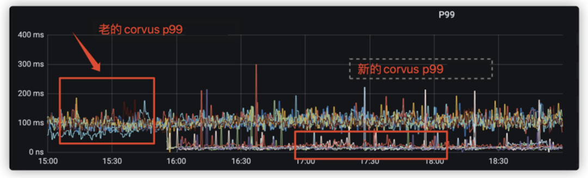

                                                   图3 大带宽场景下的限流

**2）数据在线压缩**

Proxy层本身只做路由转发，对CPU的消耗非常低。在大带宽的场景下，我们可以充分利用Proxy的CPU资源优化带宽和毛刺。在解析Redis协议时，使用LZ4算法对写入数据进行在线压缩，读取时在线解压。在推荐缓存的使用场景中网络带宽和存储空间压缩40%以上（如图4），总体时延并没有明显的下降。因为网络带宽和写入读取数据的减少，时延毛刺也变小了。

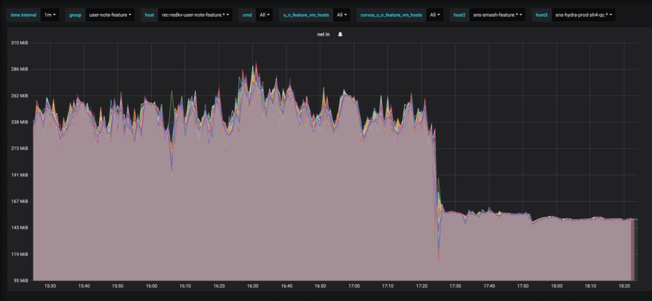

                     图4 Proxy开压缩后的带宽优化

**3）线程模型的优化**

Proxy采用IO多路复用技术，每个连接维护一个请求处理队列和响应队列，保序的返回给客户端。Proxy在收到RedKV Server的回应之后，如果没有收到所有发送的cmd的返回，则会一直等待所有cmd的返回后再发送给client，对于读的场景这种模式非常不友好。经过改造，如果某个cmd之前的cmd都已经正常响应，则可以马上响应给client，不需要再等后面的所有cmd请求完成。

**4）backup-read优化长尾**

在公网环境下，一个CVM虚拟机和其他多个虚拟机共享一台物理机。当某个客户的CVM占用大量资源时，很容易影响到其他CVM的P99时延（由于QOS和隔离性做的不够好，SMI中断和内存CE）。在网络吞吐较大的情况下，某云的DPDK容易被打爆，出现母机OOB。而在RedKV的内部实现中，如果Server请求比较大，某些key的查询时延比较高的时候，容易产生排队堆积，或者compaction之后的block cache失效，很容易造成IO长尾。因此，RedKV的P99读时延的毛刺很难避免，但毛刺是偶尔发生的，当前我们的主从节点一定是离散部署在不同的母机上，同时出现P99毛刺的可能很小。基于这点，我们在Proxy层做了backup read功能，优化了RedKV的p99时延问题。

针对以上模型，我们的优化思路：

- 检查节点的状态和过去的延时

- 选择2个节点中状态好的那个节点发送请求

- 计算P99时延，超过P95时延则向另外一个节点发送一定数目的backup read请求数

- 两个请求中任意一个请求返回成功则成功，如果超时则继续重试

	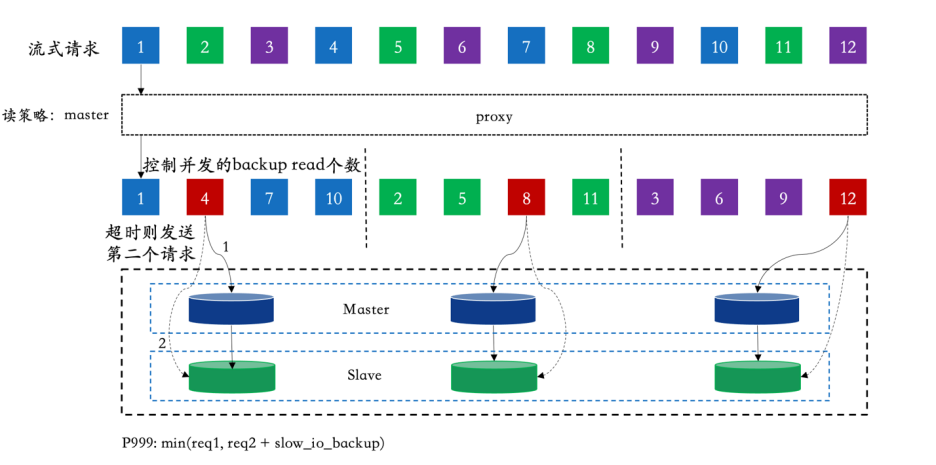

	                                    图5 Backup-read 消峰

因为backup read转发不需要复制内存，通过索引来保证生命周期，而且只有超过P95时延的报文会被检查是否能发送backup read，因此，只要5%的报文会发送两次，对集群基本不会增加压力。图6为一个集群中 P999从35ms降低到4ms左右，效果非常明显。对比HBase同样的业务场景，客户端在同样的timeout的配置下，我们的方案提高了客户端的成功率。

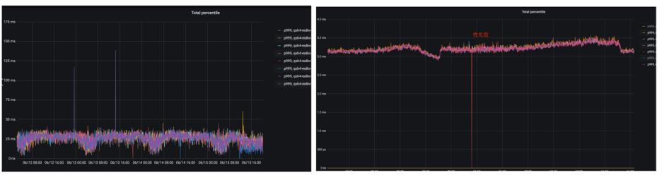

                      图6 Backup-read P999优化对比

**5）大Key检测**

我们线上很多集群在业务使用过程中会偶发的产生一些毛刺，通过抓包发现，这里毛刺有很大一部分原因是因为大Key造成的。为了甄别这类问题，我们在Proxy层支持的大Key的可观测指标。Proxy在解析Redis的cmd可以附带统计KV的大小。对于string读类型的command，读到的val值大于 big-string-size 判定为大key；对于写类型的command， 请求值大于 big-string-size 判定为大key；对于hash/zset则为一次读取的kv总数大小。通过增加read_size（所有读请求总共读到的字节数） 和 write_size （所有写请求总共写入的字节数）监控，rate(read_size) / rate(total_req_amount) 可以计算出平均请求值大小。大Key和热Key是KV系统不可避免的2个场景，针对大Key，我们提供了Proxy层的数据压缩能力；对于热Key， 我们在Server层基于HeavyKeeper算法做了topK统计和处理。

**3、RedKV Cluster**

公司的存储需求场景比较多，如广告业务存储的标签和数据模型很多，同时是非常核心的业务，业务需要做资源隔离。为了减少节点故障缩小数据的爆炸半径 ，这里业务我们采用无中心管控的架构，即RedKV1.0架构，它能在部署和运维上能大大简化。无中心的集群架构采用的是Gossip协议，存储节点采用多进程多实例部署，如图7。

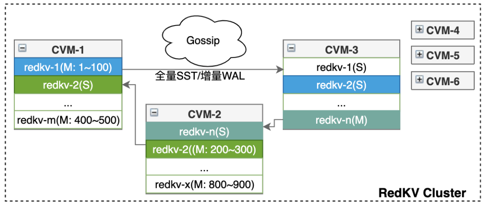

        图7 Gossip管控的KV Cluster

推荐模型训练的数据量非常大，上下游业务很多，承载的QPS高，对应集群的节点也比较多，在故障处理和扩缩容方面会触发gossip抖动。针对大集群的节点管理，我们采用有中心管控的架构，即RedKV2.0架构。基于Shard管理的中心架构能更好的支持数据迁移和集群扩缩容，存储节点采用单进程多实例部署，在多活场景中可以支持副本数弹性扩展，如图8。RedKV2.0的相关组件会在后续的技术文章中详细介绍。

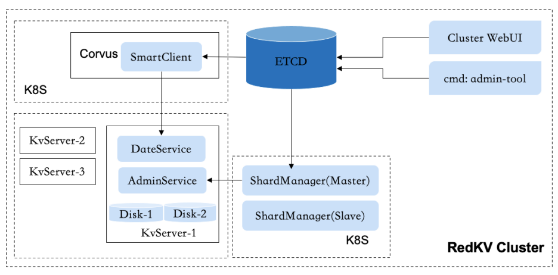

图8 基于中心管控的KV Cluster

**1）Gossip优化**

RedKV1.0采用Gossip协议通信，节点故障时主从节点的切换，最长影响时间为30s。一个节点出现故障时，集群中正常节点将故障节点标记为 fail 状态需要经过一段收敛时间。在这段时间内，Proxy层有可能将用户请求转发给已经 fail 的节点，导致请求失败。减小集群收敛时间能有效减少Proxy层错误请求数量，提高集群的稳定性和可用性。

RedKV1.0通过如下三个步骤加快视图收敛：

- **探测时间优化**

Redis Gossip协议正常情况下会每隔100ms随机选取一个节点发送ping包，并更新节点的ping_sent值为发送ping包时间。如果集群很大，节点数很多，那么故障节点被ping到的概率就会变小，最多超过node_timeout/2时间给故障节点发送ping包。这样就会导致节点发生故障时，集群中正常节点不能第一时间ping到故障节点，从而无法立刻感知到故障节点发生了故障。为了减少这部分时间，当集群中有节点超过2s没有收到故障节点发送的pong报文时，就立马通知其他节点去ping故障节点。这样可以把节点故障到正常节点给故障节点发送ping的时间控制在2s左右。

- **判定PFAIL时间优化**

Gossip 协议现有实现方式是超过node_timeout（通常为15s）时间没有收到pong报文，就将节点状态置为pfail。本次优化将这个时间设置为3s（可配置），如果24小时内（可配置）首次超过3s没有收到pong报文，就将节点置为pfail状态。如果24小时内频繁出现，那可能是网络抖动造成，还走原来的路径等待node_timeout。

- **减少PFAIL到FAIL的判定时间**

只有一个节点收到集群1/2的节点的PFAIL信息的时候，才会将故障节点判定为FAIL状态。而PFAIL这个信息是通过Gossip协议交互的，最久需要1/2 node_timeout才会通知到其他节点。因此为了加速PFAIL到FAIL的状态，所有的节点按照统一的规则选出一个种子节点，PFAIL信息除了随机发送一个节点意外，还会通知这个种子节点。这样种子节点能在最快的时间学习到集群所有节点的PFAIL信息，从而将故障节点标记为FAIL状态广播到集群。

**2）RedKV Server**

RedKV Server配置多个IO线程同时监听一个端口来接受连接请求，每个线程上的连接数目会随机均衡。每个线程只解析自己连接上的请求，并将解析出的报文通过key挂到对应的请求队列上，每个队列由一个Worker线程处理。这样同一个key/同一个slot上的请求都会落到同一根Worker线程上处理，避免了对key进行加锁，减少锁冲突和线程切换。Worker线程中会对数据进行重编码，存储到Rocksdb本地存储引擎。

RedKV内部的线程模型如下图9：

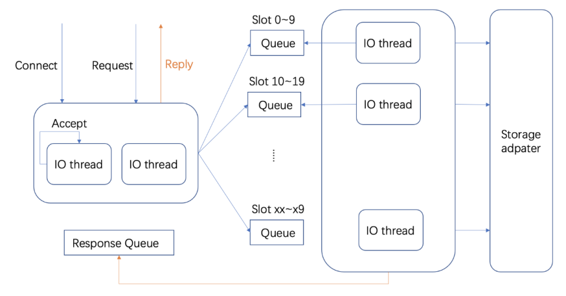

图9 RedKV Server无锁线程模型

**3）数据存储**

RedKV当前支持的数据类型有string、hash和zset，数据节点选择RocksDB作为本地存储引擎，集群创建时支持配置多副本，主从节点离散部署。采用hash打散的方式存储连续slot分片的数据，能比较好地避免热点key问题。不同的数据类型包含(MetaKey,MetaValue) 和（DataKey, DataValue）,设计格式如下：

- **MetaKey**

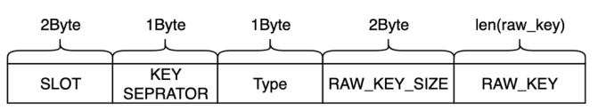

- **MetaValue**

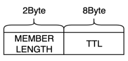

- **DataKey**

	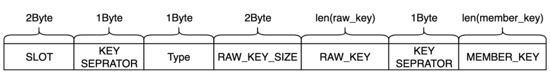

- **DataValue**

	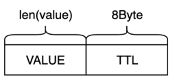

在如上的编码方式下，key的设计中保留的slot信息，可以在扩缩容的场景中通过slot灵活地做数据迁移。

## **四、生态功能**

**1、数据复制**

与传统解决方案引入同步组件的方式不同，我们快速实现了单向数据同步以及集群扩容需求，整体架构去除了对第三方组件的依赖，通过扩展Redis复制协议实现了RedKV数据节点的直接复制，如图10。单向复制的限制是扩容需要基于2n做节点同步，扩容完成后后台任务根据3.3.3中定义的key的分片删除不是本节点的数据。

在多活的部署形态下，多云集群的一对多的数据复制采用单向复制对主集群性能侵入较大，因此我们实现了基于中心管控的数据复制策略。该策略支持多个集群的分片异构部署，通过Checkpoint方式定向同步数据，不再需要额外的后台任务去做数据淘汰，能很好的支持多对多的多云集群数据复制、数据破环和扩缩容。

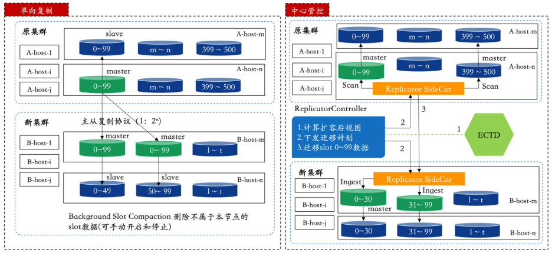

图10 RedKV的数据复制

**2、数据批量导入**

小红书大量的离线业务数据存储在S3 Hive中，每天会有部分数据需要增量更新，其他的数据会被淘汰。这类场景有几个挑战：

**1）批量导入**

如小红书的笔记数据，一般需要小时级别甚至天级别的更新，所以业务需要有快捷的批量导入功能。

**2）快速更新**

特征数据的特点就是数据量特别大，以笔记为例，全量笔记在TB 级别数据量。如果通过 Jedis SDK 写入，那么存储集群需要支持百万QPS的机器资源。当下小红书数据平台支持业务把数据从hive通过工作流直接导入RedKV，一般是每天凌晨开始写数据，等到晚高峰时大量读取。这种方法实践下来，经常导致 RedKV集群的集群内存OOM，影响稳定性。

**3）性能及稳定**

数据在导入的过程中不能影响读的性能。

**实现方案如图11：**

- 自定义获取集群视图和数据编码的UDTF，支持RedKV1.0的数据格式

- 将原先的抽数据，编码，分片和排序整合成一个HiveOperator，执行完成后按指定的OutputFormat输出SST文件到一个指定S3目录

- 通过Hadoop distcp工具做数据的跨云传输，走离线带宽不影响线上的读写业务

- RedKV集群的节点SiderCar作为对象存储的一个Client，RedKV节点加载本节点的SST并ingest

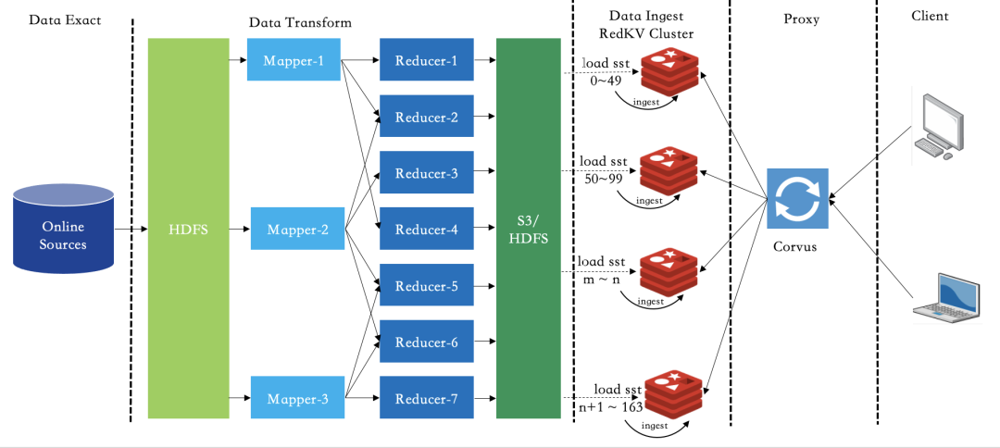

图11 离线数据BulkLoad

**3、数据批量导出**

小红书的业务模型训练数据通过Hash存储在RedKV集群中，业务下游需要对训练结果进行离线分析，希望RedKV具有和Hive数据流通的能力。RedKV本身是不支持Schema的，如果要将KV数据导入Hive表，则需要将Hash的KKV数据转化为一个Table。

RedKV的内部数据按hash打散，导入Hive表则需要提供table关键字，先按前缀扫描的方式扫描存储节点，再生成Hive识别的文件，最后通过Hive Load进行加载。为了更好地兼容其他spark任务，我们选择Hive支持的标准parquet列式存储文件，整个I/O链路如下图12：

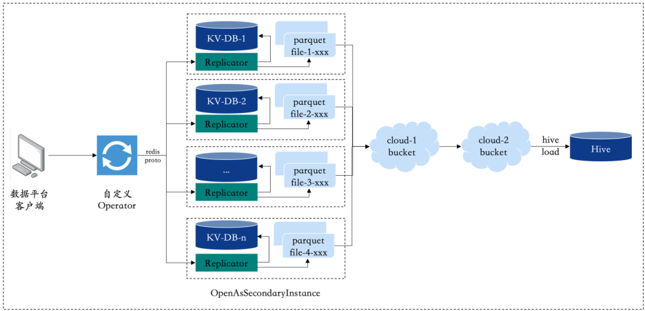

图12 RedKV2Hive I/O

示例：RedKV里面的Key 写入规定以 {tablename}_ 开始，比如一个artical表

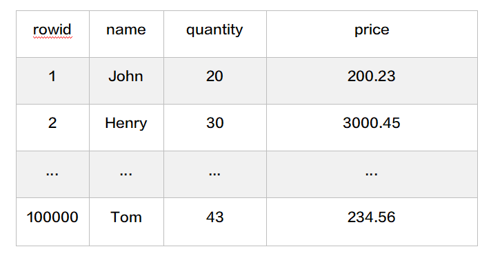

RedKV中的数据采用hmset写入：


```plain text
hmset {person}_1 name John quantity 20 price 200.23
hmset {person}_2 name Henry quantity 30 price 3000.45
```

通过以上的写入方式，可以通过配置RedKV2Hive 将KV里面的数据导入到Hive里面的Person表 如果单表的数据量很大，可以采用分表写入，比如把person表分成16份


```plain text
hmset {person:1}_1 name John quantity 20 price 200.23
hmset {person:1}_2 name Henry quantity 30 price 3000.45
...
hmset {person:16}_100000 name Tom quantity 43 price 234.56
```

**4、数据的备份和恢复**

小红书的广告数据存储在自研的分布式KV系统中，**数据安全主要面临如下挑战：**

- 基于LSM结构的KV系统，数据compaction导致的空间放大会翻倍，数据量大后，数据备份需要大容量的磁盘

- 单集群故障后，集群恢复的时间不可控

- 备份数据依赖第三方系统

- 广告系统对数据的及时恢复能力有比较高的要求，通常要求在分钟级。为了解决上述几个问题，我们提出了一种中心管控的主备集群容灾策略，通过Proxy接入层的秒级切换能快速切流到一个特定的版本

**实现方案如图13：**

- 先部署一个容灾集群，主集群对外提供读写服务，灾备集群保存特定数量的快照数据

- 低峰期，中心管控根据配置的版本数和任务时间会定时地向主集群发送打快照的服务

- 快照完成后通过发生远程rsync命令将快照目录传送到容灾集群，主集群低峰期数据压缩后数据量可控，这样灾备集群可以备份指定数量的版本信息

- 故障发生后，中心管控可以在灾备集群通过RPC指令指定恢复到一个特定的版本

- Proxy接入层通过服务注册与发现主键配置2组服务，通过动态的秒级切换可以将流量打向特定版本的集群，完成服务访问的秒级切换

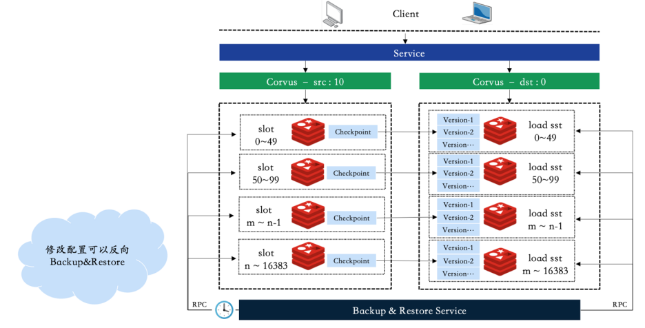

图13 集群备份

**5、跨云多活**

为了应对高速增长的业务需求，公司对云厂商的服务稳定性要求越来越高，单机房云服务难以满足公司稳定性的需求，跨云多活可以提高服务的稳定性，双写双读可以实现主备数据中心均对外提供读写服务, 这样既不会造成数据中心的资源浪费又可以实现跨地域容灾。我们对业界常用的方案做了一些对比分析：

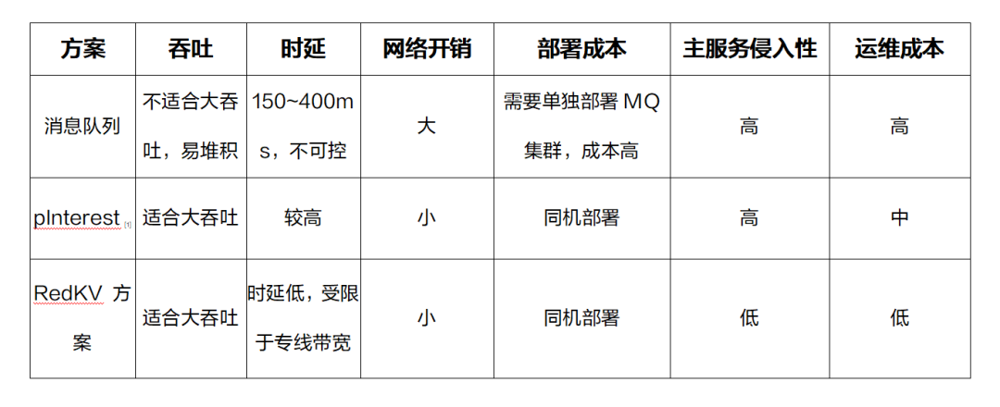

我们综合调研其他厂商的架构经验，提出了RedKV双活设计( Replicator as Sidecar Service同机部署) 方案，如图14。

- 同机部署，网络开销小；

- Sidecar Service 对主服务侵入性小；

- 单独部署，易于升级。

架构灵活，适合日志类存储系统双活架构。Redis 以及图数据库的多云方案都可以改造适用，具体的功能组件和实战场景会在后续技术文章详细介绍。

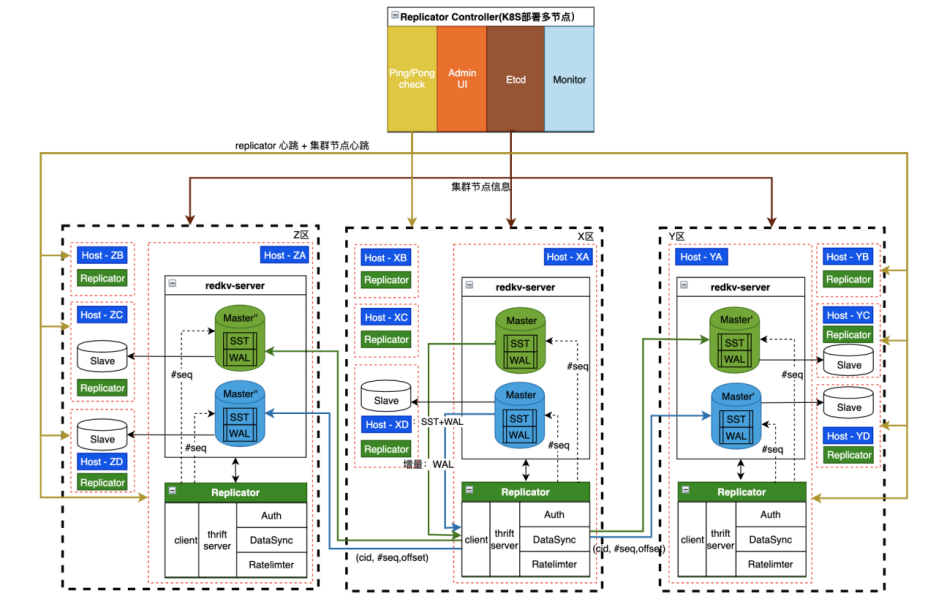

图14 跨云多活架构

## **五、实践案例**

正如第2节描述的小红书业务需求场景，本节通过一个典型的业务场景来展示RedKV在NoSQL存储下的收益。

早期在没有zprofile中台的场景下，zprofile用户和笔记信息都存储在HBase。为了保证集群的数据安全和服务稳定性，HBase采用了双集群部署，写入和读取方通过HBase Client API做数据存储。HBase的用户数据在数十TB，在百万QPS下，P99时延已经在70ms左右，随着QPS的快速增长，时延越来越高，集群扩容带来的存储成本也越来越高，稳定性保障也面临极大的挑战。

RedKV1.0上线后，经过半年多的打磨，开始慢慢承接公司的核心业务。推荐平台架构组也开始着手打造zprofile中台服务，收敛上下游的业务，提供标准统一的读写方式。在存储方案上，平台架构组同学和存储组经过多次的业务沟通，最终选择使用RedKV作为底层存储，主要对接两类业务方：分别是数据生产者 producer 以及数据消费方 consumer。zprofile最终的中台架构如下图15：

- zprofile-write service 对上游提供统一的数据写入接口服务，提供用户和比较的Meta管理，用户数据写入redkv-zprofile-user集群，笔记及其他数据写入redkv-zprofile-other集群。

- zprofile-service对下游提供统一的数据消费服务，对应时延要求不高的离线服务，RedKV本身支持单向数据复制的能力通过2个offline小集群提供数据scan业务。

整体架构改造完成后，使用RedKV对接同样QPS的业务能力，成本节省了36%, P99性能提升了约5倍。

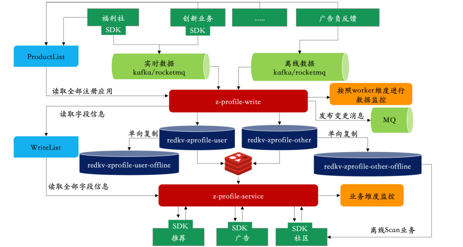

图15 zprofile中台

<br/>

**参考资料**

- Pinterest 数据复制

	https://medium.com/pinterest-engineering/open-sourcing-rocksplicator-a-real-time-rocksdb-data-replicator-558cd3847a9d

- https://github.com/facebook/rocksdb/wiki

- HeavyKeeper: An Accurate Algorithm for Finding Top-k Elephant Flows | USENIX

<br/>

