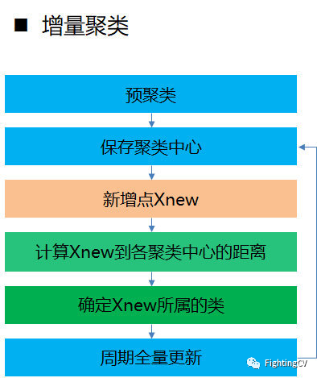

> 来源：https://zhuanlan.zhihu.com/p/328481154

当前主流的推荐系统中，embedding 无处不在，从一定意义上可以说，把 embedding 做好了，整个推荐系统的一个关键难题就攻克了。因此，本文总结了移动腾讯网推荐系统中的 embedding 技术实践，力图达到娱人娱己的目的。

## 什么是 embedding

embedding 其实就是一种稠密向量的表示形式。在 embedding 大行其道之前 onehot 才是最靓的仔。如果和我们比较熟悉的 oneHot 对比起来理解，顿时会发现 embedding 这个玄里玄乎的概念，实际上 so easy。

直观上看 embedding 相当于是对 oneHot 做了平滑，而 oneHot 相当于是对 embedding 做了 max pooling

比如 RGB（三原色，red,green,blue）任何颜色都可以用一个 RGB 向量来表示，其每一维度都有明确的物理含义（和一个具体的物理量相对应）。当然 RGB 这个例子比较特殊，和我们一般意义的 embedding，还不一样，因为 RGB 的特殊性就在，他的每一维度都是事先规定好的，所以解释性很强。而一般意义的 embedding 则是神经网络倒数第二层的参数权重，只具有整体意义和相对意义，不具备局部意义和绝对含义，这与 embedding 的产生过程有关，任何 embedding 一开始都是一个随机数，然后随着优化算法，不断迭代更新，最后网络收敛停止迭代的时候，网络各个层的参数就相对固化，得到隐层权重表（此时就相当于得到了我们想要的 embedding），然后在通过查表可以单独查看每个元素的 embedding。

## embedding 发展大事记

从 1986 年 Hinton，提出 embedding 的概念。到出现第一个在工业上取得不错结果的模型---word2vec,先驱们经历了勇敢的尝试，探索，在此向大神致敬。

MF 矩阵分解，已经隐约看到了 embedding 的影子，此时 embedding 还是一种经验感觉的模糊存在，没有人旗帜鲜明的提出这个概念，属于是 embedding 诞生的前夜。

毫不夸张的说 word2vec 是 embedding 界开天辟地的大事件，从这之后一切事物都可 embedding 了，在这之后的任何 embedding 都能看到 word2vec 的影子。随着 item2vec,wide and weep 和 youtube 等各种算法的提出，embedding 也迅速的用到了特征工程，画像构建召回排序等方面。而 faiss 作为专业的向量近邻检索工具则解决了向量召回在工程上的最后一公里的问题。

embedding 作为一种新思想，他的意义包含以下几个方面：

- embedding 表示，把自然语言转化为一串数字，从此自然语言可以计算；

- embedding 替代 oneHot 极大的降低了特征的维度（天下人苦 oneHot 久矣）；

- embedding 替代协同矩阵，极大地降低了计算复杂度。

## item embedding

在移动腾讯网的推荐系统中，由于我们的 item 主要是图文，所以 item 的向量化，实际就是一个文本和图片向量化的过程。文本 embedding 的核心理论还是 word2vec 相关理论的衍生。

基于词向量的固定表征：word2vec、fastText、glove 基于词向量的动态表征：elmo、GPT、bert。

动态词向量相较于静态词向量，更加充分利用了上下文信息，所以可以解决一词多义的问题。在工程实践上其优越性也得到了证明（BERT 在多个 NLP 任务中也表现优异）。

## img embedding

由于我们做的是图文推荐，因此图片作为文章的门面特征，对推荐也很重要，可以通过 resnet 得到图片的向量，还可以通过 image caption 得到对一张图片的中文描述，对于娱乐类的新闻，还可以利用 facenet 识别出组图中，哪一张包含明星，对于动漫类类的新闻可以利用 OCR 识别出漫画里的文字，对于年龄，性别有明显倾向的场景还可以利用 resnet 改变图片的风格。

对于 CNN 结构来说，不同层级的神经元学习到了不同类型的图像特征，由底向上特征形成层级结构，对人脸识别任务，训练好网络后，把每层神经元学习到的特征可视化，肉眼看一看每层学到了啥特征，你会看到最底层的神经元学到的是线段等特征，图示的第二个隐层学到的是人脸五官的轮廓，第三层学到的是人脸的轮廓，通过三步形成了特征的层级结构，越是底层的特征越是所有不论什么领域的图像都会具备的比如边角线弧线等底层基础特征，越往上抽取出的特征越与手头任务相关。正因为此，所以预训练好的网络参数，尤其是底层的网络参数抽取出特征跟具体任务越无关，越具备任务的通用性，所以这是为何一般用底层预训练好的参数初始化新任务网络参数的原因。而高层特征跟任务关联较大，实际可以不用使用，或者采用 Fine-tuning 用新数据集清洗掉高层无关的特征抽取器。

## user embeding

为了使新闻和用户可以在相同的向量空间下做运算，我们对对用户也做了 embedding，前期主要是从用户画像中筛选出一些在排序模型中重要性较大的特征来做向量化（比如通过特征重要度分析，发现标签（tag），媒体号（mid），一级分类（cat1），二级分类（cat2），主题（topic）等特征对于用户是否点击某篇文章的影响是最大的）。中期使用了更多特征，模型采用了 DSSM(确保 user 和 item 在同一向量空间)，目前则是利用 bert+lstm 对用户的行为序列进行了建模。

## 基于 embedding 的召回

得到 item，user 向量后，就可以做各种基于向量的召回了，从 embedding 本身的使用方式上看，大致可以分成以下几种召回方式。我们的召回实践多数用的单 embedding，少量用到了多 embedding。

## embedding 的基础用法——i2i 召回算法

单纯使用 fasttext+faiss 就可以实现好几路召回算法，比如 iten2vec,media2vec,tag2vec,loc2vec，title2vec。

tag2vec 就是利用词向量去做召回，比如可以用文章的标签向量表示文章的向量，如果一个文章有 4 个 tag（keywords: "蒋凡;离婚;张大奕;网红张大奕"）我们的经验是取前 3 个 tag,做等权重向量相加，效果最好。当然了这不是唯一的做法。关于 embedding 向量的用法有很多种比如，等权重相加，加权相加，取平均，取最大等。

得到文章向量之后就是典型的 item2item 的计算过程了，利用 faiss 计算每篇文章的相似文章，比如为每一篇文章查询询出 1000 篇候选文章后，按相似度作一个截断，比如 cosin sim<0.6 舍去，对余下的文章，再利用文章的其他特征比如热度，CTR，新鲜度作一个加权，一路最简单的 tag2vec 召回就诞生了。

其他召回和这个套路类似，就是训练 embedding 向量的时候，略有差异。tag2vec 是训练中文词语的向量，而 item2vec 是训练文章 ID（aid）所对应的向量，media2vec 训练的是文章的作者 ID（mid）所对应的向量，loc2vec 是训练地域名称所对应的向量，title2vec 是用 LSTM 训练得到的文章标题向量，doc2vec 是用 bert 计算出的文章正文（或者摘要）的向量。entity2vec 是利用我们自己构建的知识图谱通过 transE 得到的

## u2i 召回算法初步

u2i 召回算法实现了，uese2vec,word2vec 个性化,crosstag，DSSM 个性化等召回算法；user2vec 是拿用户的 tag 向量和文章的 tag 向量求相似度，做的召回；DSSM 个性化是拿用户的 DSSM 向量和文章的 DSSM 向量求相似度，做的召回；crosstag 相当于多个 user2vec,需要把用户的 tag 按类别进行统计，每个类取 K 个 tag,共获取 m 组 tag，然后各组分别做 user2vec,最后汇总得到用户的推荐列表。

## u2i 召回算法进阶

uese2vec 是在做召回的初级阶段，做的一些朴素的尝试，简单暴力见效快，存储压力大。每个 user 都存储一个推荐列表，在产品初期 DAU 不多时，矛盾还不明显，随着 DAU 不断提升，存储问题日益严重，这迫使我们想办法改变现状，可行的策略有两条，一个是把离线提前计算再存储转为线上即时计算不存储，另一个是把按人推荐转化为分群推荐。两种方法我们都做了实践。

分群召回流程大体如下：

分群推荐我们尝试了簇召回，群画像召回，LSTM 分群，DSSM 分群，bnb 分群，增量聚类，动态规则聚类。

簇召回就是先把所有用户的 tag 向量用聚类算法（如 minibatch-kmeans）聚成若干个簇（比如 500 个，根据肘点法确定），然后保存下簇标签，簇中心，每个用户所属的簇（一个用户可以隶属于一个簇或者多个簇）。得到用户所在的簇后，有两种做法，一种是根据实时点击日志，在簇内做实时 CF，也就是在簇内把点击过的新闻相互推。另一种做法是离线定时计算各个簇中心和候选新闻的相似度，然后和到每个簇的候选集。从实验效果来看簇内做实时 CF 效果要好一些。

群画像召回是先把用户分群，然后把同一个群里的用户画像全部抽取出来，然后融合为一个群画像，相当于把这一群人合成了一个人，然后对于群画像，再使用和单个用户画像类似的个性化召回。

LSTM 分群和簇召回类似，不过用户的向量是通过用户最近点击文章的 m 篇文章的 bert 向量（tag2vec 向量亦可）送入 LSTM 得到用户的向量，剩下的步骤和簇召回类似，该算法有一定提升但是计算速度慢，很难铺量。

DSSM 分群，是把用户画像送入 DSSM，得到一个用户 64 维的向量，把文章画像送入 DSSM，得到一个文章的 64 维的向量，剩下的步骤和簇召回类似。该算法有提升显著，已经铺量使用。

bnb 分群是借鉴 airbn（爱彼迎）公布的房源推荐算法，把文章的多个特征的 embedding（tag，topic，cat）拼接成一个向量，类似得到文章的向量。剩下的步骤和簇召回类似，该算法有一定提升，不十分显著。

## 增量聚类

增量聚类就是对文章或用户聚完类后，很长一段时间聚类中心，保持不变，用户和类中心的关系可以是变化的，比如一个用户可能今天属于这个簇，明天属于另一个簇。这样的好处是，同一个簇标签的含义长期保持不变，便于排序层更好的学习到这个特征。该算法亦有显著提升，已铺量使用。

主要步骤如下

利用聚类算法预聚类，以 Kmeans 为例 保存预聚类的聚类中心 C 和类标签 L 对于新增数据点 Xnew,计算其到各个聚类中心 Ci 的距离 把新增数据点 Xnew 分到距离其最近的聚类中心 Ci，所属的类别 Li 在业务低峰期全量更新每个类的聚类中心，以消除增量聚类可能引入的局部偏差，以提高系统的准确性

## 动态规则聚类

根据用户的画像，将用户聚成若个类，然后再根据类大小，将类大小小于一定阈值的类合并到与其最相似的类，经过多次迭代后聚类过程完成。该算法效率高，CTR 提升约 3%。

主要步骤如下：

处理用户画像数据，得到每个用户最感兴趣的 K 个兴趣点 把这 K 个兴趣点按照权重大小，组合成一个兴趣标签 如果存在相应的聚类标签则直接加入该类，否则创建一个新的聚类标签 全部数据遍历完成后，统计各个聚类标签下的用户数 如果该类别下的用户数大于阈值，则该聚类标签可以保留，否则该聚类标签需要和其他聚类标签合并 对于需要合并的聚类标签，首先把属于该类别的用户标签回退一步，即得到该聚类标签下用户的 k-1 个兴趣点组成的兴趣标签，然后重复 3-5 的过程，最好得到一个类大小相对均衡的聚类结果

## embedding 召回算法--其他

这个过程主要是用 DNN 类的算法做一些召回，比如 CNN，attention，YouTube 等；CNN 召回主要是用于图文相关召回，希望把文章的 title,tag，abstract 合成为一个向量做召回；attention 主要是把文章信息和图片信息做了融合。

YouTube 是利用 embedding 特征做推荐的开山之作，由于名声比较大，我们还是复用了他的网络结构，只不过在使用的特征上稍有差别。从一个 embedding 主义者的角度看，他的典型特点是把所有的特征（无论离散连续，单值多值）全部转化为 embedding，然后把各种 embedding 拼接在一起，构成一个一字长蛇阵的向量，然后送入 DNN，最后得到文章的向量。在我们的实践中主要用了 cat1，cat2,mid,topic,kg 等特征的 embedding，来训练。从实践的效果来看，第一版效果不佳，并未达到预期效果，主要是视频推荐和新闻推荐有时效性的差异（一个视频时效性可以很长，因此这个 VID 的 embedding 就可以反复不断地训练，越来越好，而新闻的生命周期则很短，往往是还没来得及曝光就过期了），后续又做了各种优化，效果也不断提升。

airbnb 主要贡献是在稀疏样本的构造上有所创新，个人感觉 Airbnb 这个操作部分弥补了 YouTube 在新闻推荐领域水土不服的问题。从一个 embedding 主义者的角度看，他的创新点主要有一下两点，一个是分群 embedding，另一个是用户和 item 混合训练。在移动腾讯网的动态规则聚类召回算法中就借鉴了 Airbnb 分群训练 embedding 的思想。

在特征工程中，对于离散值，连续值，多值大致有以下几种 embedding 的方法。预先训练的 embedding 特征向量，训练样本大，参数学习更充分。end2end 是通过 embedding 层完成从高维稀疏向量到低维稠密特征向量的转换，优点是端到端，梯度统一，缺点是参数多，收敛速度慢，如果数据量少，参数很难充分训练。

不同的深度学习模型中，除了对网络结构的各种优化外，在 embedding 的运算上也进行了各种优化的尝试，个人觉得对网络结构的各种优化本质上也是对 embedding 的运算的优化。

embedding 作为一种技术，虽然很流行，但是他也存在一些缺陷，比如增量更新的语义不变性，很难同时包含多个特征，长尾数据难以训练等。

针对 embedding 的空间分布影响模型的泛化误差的问题阿里和谷歌先后在 embedding 的表示和结构上进行了各种尝试，其中阿里提出了 residual embedding 的概念，希望把一个向量用中心向量和残差向量的形式去表示，以达到同一类别向量簇内高度聚集的目的。谷歌则希望对 embedding 的编码空间进行优化，简单来说就是为更高频更有效的特征分配更多的编码位置，反之则分配更少的编码位置。

embedding 总体来说还是一种很有效的技术，在实践过程中大致经历了以下演进路线：

 

**面向小白的顶会论文核心代码学习：https://github.com/xmu-xiaoma666/External-Attention-pytorch**

 

 

