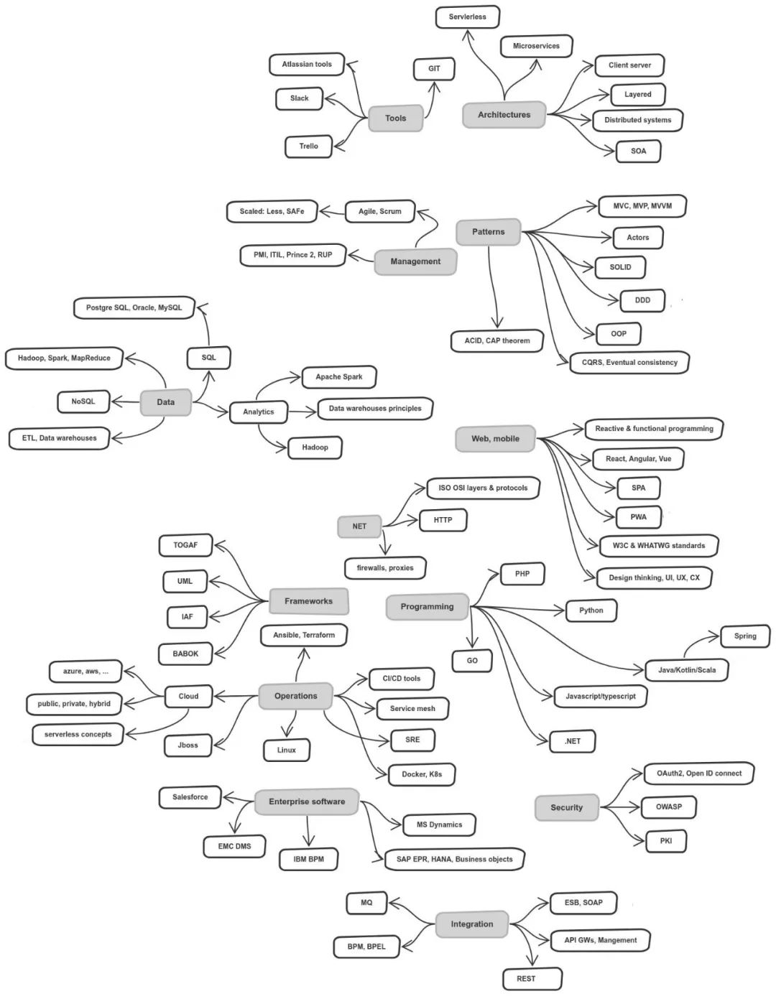

几年前有人问我：「你是怎么成为一名软件架构师的？」我们就此探讨了必备技能、经验，以及储备相关知识所需的时间和精力。除此之外，我也回顾了自己走过的路、使用或尝试过的技术，以及我从那些五花八门的工作中学到的东西。

                        **架构师技术路线图**

## **软件架构师是什么？**

在进行深层次的探讨之前，我们先来看两个定义：

- 软件架构师是指那些制定高级设计决策，并确定技术标准（包括软件编程标准、工具和平台）的软件专家。这之中的首席专家就是总架构师。（来源：Wikipedia: Software Architect）

- 软件架构是系统的基本组织构成，这种组织主要体现在其组件、组件之间的关系、组件与环境之间的关系，以及决定系统设计与演化的原则。（来源：Wikipedia: Software Architecture）

## **架构的「层级」**

架构主要可以抽象成以下几个「层级」。不同层级所需的技能也不同。尽管对层级的分类有很多种标准，但是我最喜欢把架构分成 3 个层级：

- 应用级：最低层级的架构。只关注单一的应用。层级低，但是很详细。这方面的交流一般是在一个开发团队内展开；

- 解决方案级：架构的中间层。关注一或多个满足业务需求的应用（也就是商业方案）。这之中有些设计是高层次的，但大部分还是低层次的设计。这种层级架构的交流就开始涉及多个团队了；

- 企业级：架构的最高层级。关注多个方案。这种架构的设计层次高且抽象，因此也需要方案级和应用级的架构师对此进行细化。这种层次的架构就需要多个组织进行沟通了。如果你想了解更多，可以参阅这个链接：https://github.com/justinamiller/EnterpriseArchitecture。

有时候，架构师也被看做不同工作组之间的粘合剂。以下是三个例子：

- 横向：在业务部和开发人员或是不同的开发团队之间架起沟通的桥梁；

- 纵向：在管理者和开发人员之间架起桥梁；

- 技术：将不同的技术或应用整合在一起。

## **软件架构师的日常**

要了解架构师的必备技能，我们得先知道架构师主要做什么。我认为架构师最重要的活动包括：

- 定义和确定所需的开发技术与平台；

- 定义开发标准，如编程标准、工具、审核流程、测试方法等；

- 对确定和理解业务需求提供支持；

- 设计系统并根据需求做出决策；

- 对架构定义、设计和决策进行讨论记录；

- 检查并审核架构与代码，比如检查前期确定的模式与编程标准是否被正确实施；

- 与其他部门和架构师合作；

- 对开发人员的引导及咨询；

- 将高级设计细化，并转化为较低级的设计。

注意：架构设计是一项持续性的工作，尤其是在敏捷软件开发过程中。因此，我们会一遍又一遍地重复这些工作。

## **软件架构师必备技能**

为了完成上面说的那些工作，架构师需要具备一些特定的技能。从我的个人经验、相关书籍和讨论中，我们可以将其总结为以下 10 项技能：设计、决策、简化、编程、记录、沟通、估算、平衡、咨询、市场。

接下来我将逐一介绍这些技能。

### **设计**

首先最重要也最难回答的问题就是「什么是好的设计」。我将从理论和实践两个层面进行阐述。就我的经验来说，两者兼备才是最好的。那我们先说一下理论层面吧：

- 了解基本的设计模式：模式是架构师开发可维护系统所需的最重要工具之一。基于这些模式，你可以把一些已经在其他问题上奏效的方案迁移到一些模式相同的新问题上。

	「Gang of Four」(GoF) 所著《Design Patterns: Elements of Reusable Object-Oriented Software》是所有从事软件开发的人的必读书。尽管这些模式发布于 20 多年前，它们仍是现代软件体系结构的基础。例如书中的模型-视图-控制器（Model-View-Controller，MVC）模式就被应用于许多领域，它同时也是一些新模式（如 MVVM）的基础；

- 再挖深一点，研究一下模式与反模式（anti-pattern）：如果你对 GoF 所写的模式具备全面的了解，那么你就可以学习更多的软件设计模式了，或者深挖你感兴趣的领域。在应用集成领域，我最喜欢的一本书是 Gregor Hohpe 编写的《企业集成模式》。当两个应用需要交换数据时，无论是来自一些遗留系统的老式文件交换还是现代微服务体系结构，这本书的内容都适用；

- 了解质量度量：定义架构还不算完，还要解释为什么要定义、应用并控制这些准则和编程标准。这样做是因为需要控制质量，满足一些非功能需求。我们想要的是一个可维护、可靠、可适应、安全、可测试、可扩展、可用的系统。而实现所有这些要求的方法就是有一个好的架构设计方法。你可以在维基百科上了解更多关于质量度量的信息。理论很重要，但是如果你不想成为一名活在象牙塔里的架构师，实践也同样重要，甚至更加重要；

- 尝试并理解不同的技术栈：我认为这是你成为更好架构师之路上最重要的一步。尝试新的技术栈，并了解其发展历程。这些不同的技术具有不同的设计理念和模式。只浏览 PPT 学不到太多东西，你需要自己去尝试并感受这项技术的喜与悲。

	架构师不仅要有广博的知识面，还要在一些领域有深厚的积累。重点不在于掌握所有的技术栈，而是对你所在领域最重要的技术有坚实的理解。你还可以尝试一些领域外的技术，例如，如果你对 SAP R/3 有很深的了解，你应该尝试一下 JavaScript，反之亦然。尽管如此，双方都会对 SAP S/4 Hana 的最新进展感到惊讶。例如，你可以自己尝试并免费参加 openSAP 的课程。保持好奇心，多尝试新事物，也可以尝试一些几年前不喜欢的东西；

- 分析和理解应用模式：查看任意当前框架（如 Angular）。你可以在实践中学习到很多模式（如 Observables），你还应该试着理解它是如何在框架中应用的，为什么要这样做。如果你是真正的专业人士，你还需要更深入地研究代码并了解它是如何实现的；

- 保持好奇心，关注用户群。

### **决策**

架构师需要制定决策，指引项目甚至整个公司的正确方向。

- 分清主次：不要在不重要的决策和工作上浪费时间，要学会分清主次。就我个人来说，我比较喜欢通过以下两个特征来判断一件事是否重要：

	- 概念完整性：如果你一开始决定了一个理念，坚持下去，即使有时候用不同的方法做会更好。这样整体概念就更清晰明确，提升了可理解性，也简化了维护过程。

	- 一致性：例如，如果你定义并应用了命名约定，那么它不是关于大写或小写的，而是以相同的方式应用于所有地方。

- 优先级：有些决定非常关键，如果没有及早采取合适的解决方案，很有可能给日后造成无法解决的问题。这对维护人员来说来说是一场噩梦，或者更糟的，开发人员在这个决策制定之前无法继续工作。在这种情况下，先做一个「糟糕」的决定甚至比没有决定更好。但是在这种情况发生之前，你要知道哪些决定是应该被优先处理的。有很多方法可以做到这一点。

	我建议先看看加权最短作业优先（WSJF）模型，它在敏捷软件开发中被广泛使用。尤其是时间临界和风险降低，对这二者的度量是评估架构决策优先级的关键；

- 认清自己的能力：不要在能力范围之外的事情上做决定。这很重要，因为如果不加以考虑，它可能会严重破坏你作为架构师的地位。为了避免这种情况，你应该和同事明确自己的职责和角色。如果有不止一个架构师，那么你应当只负责当前负责的架构层级。作为一个较低层级的架构师，你应该为更高层级的架构提出建议，而不是做出决策。此外，我建议你经常和同事一起检查重要的决定；

- 评估多种选择：在做决定时，总是要列出多个选项。在我参与的大多数案例中，都有不止一个可能的（优秀）选择。不好的选择主要有这两个特点：（1）看起来你没有完成好自己的工作；（2）有碍于作出正确的决定。定义度量后，你就可以根据事实（如许可证成本或成熟度）来比较各种选择，而不是通过直觉。这通常会让你做出更好、更可持续的决策。此外，将该决策推广到其他部门也会更容易。但是如果你没有正确评估选项，在最终讨论时你可能会失去一个重要的论据。

### **简化**

时刻记住奥卡姆剃刀原则，也就是简单即正义。我对这个原则的理解是这样的：如果你的解决方案是在做了很多假设的基础上提出来的，那么你的方案很可能是错的，也很可能会变得极其复杂。这个时候你就应该减少（简化）一些假设，以获得更好的解决方案。

- 多方位观察解决方案：为了简化解决方案，经常需要你调整对解决方案的观察角度。比如，你可以尝试通过自顶向下和自底向上的思考来获取解决方案。如果你有一个数据流或流程，那么首先考虑从左到右，然后再考虑从右到左。在简化过程中询问自己：「在完美的世界里，你的解决方案需要做什么修正吗？」，或者「某公司/某人会怎么做？」。这两个问题都可以帮助你按照奥卡姆剃刀原则来简化假设；

- 退一步：经过激烈而漫长的讨论后，常常会得到一些极其复杂的方案。永远不要把它们当做最终的结果。「退一步」的意思就是：再次从宏观角度看一下这个问题，当下的方案还说的通吗？然后再在抽象层面对方案进行重构。有时候暂停讨论第二天再继续是个不错的选择。至少对于我来说，我的大脑需要一些时间来处理信息，想出更好、更优雅和更简单的解决方案；

- 分而治之：把大问题分解成更小的问题，然后分别解决小问题，并验证这些小方案是否匹配。最后再退一步来看一下总体情况；

- 重构并非坏事：如果找不到更好的解决方案，那么修正一个复杂的解决方案也是不错的选择。如果某个解决方案问题很多，你可以稍后重新思考该方案，再将想到的新东西应用到该方案中。重构并非坏事，但是在你开始重构之前，请记住：（1）准备好足够的自动化测试，以确保系统的正常功能；（2）获得利益相关者的支持。要了解更多关于重构的知识，我建议阅读 Martin Fowler 写的《Refactoring. Improving the Design of Existing Code》。

### **编程**

即使作为企业级架构师（最抽象的架构层级），你仍然应该了解开发人员的日常工作。如果你不了解开发如何完成的，那你可能会面临两个主要问题：

1. 开发人员不接受你的说法；

1. 你不了解开发人员的挑战和需求。

开展副项目：做副项目的目的是尝试新技术和工具，从而发现目前和未来的开发方式。经验是观察、情感和假设的结合 (《Experience and Knowledge Management in Software Engineering》，Kurt Schneider 著)。阅读教程或对利弊的介绍当然好，但这只是「书本知识」。只有当你自己尝试时，你才能体验到开发人员的情绪，才能对事情好坏背后的原因做出假设。

使用一种技术的时间越长，你做出的假设就会越好。这会帮助你在日常工作中做出更好的决定。我刚开始编程时，并没有代码补全功能，只有一些可以加速开发的实用程序库。显然，把那时候的背景知识用在今天，我会做出错误的决定。现在我们有大量的编程语言、框架、工具、流程和实践。只有当你有经验，对主要趋势有粗略的了解时，你才能参与到讨论中来，并将开发引向正确的方向；

只尝试需要尝试的事情：你不可能尝试所有的事情，这根本是不可能的。你需要一个更结构化的方法。我最近发现了一个资源：ThoughtWorks 的技术雷达，他们将技术、工具、平台、语言和框架分为四类：采纳、试验、评估和暂缓。采纳表示「强烈建议业界采用这些技术」，试验表示「企业应当在风险可控的前提下在项目中尝试应用此项技术」，评估表示「它对企业的影响还需探索」，暂缓表示「谨慎行事」。有了这种分类方法，我们更容易获得新事物的概况，并更好地评估下一步要探索的趋势。

### **记录**

架构文档有时很重要，有时却不那么重要。例如，架构决策或代码指南是重要文档。在开始编程之前，通常需要初始文档，并且对此不断细化。因为代码也可以作为文档（如 UML 类图），所以有些文档可以自动生成。

- 代码整洁：好的代码本身就是最好的文档。好的架构师应该拥有辨别好坏代码的能力。Robert C. Martin 写的《Clean Code》就是这方面很好的学习资料。

- 在可能的情况下生成文档：系统变化很快，因此文档很难及时更新。无论是 API 还是以 CMDB 形式出现的系统环境：底层信息的变化往往太快，因此无法手动更新相应的文档。例如：如果你的 API 是模型驱动的，你就可以根据定义文件自动生成文档，或者直接从源代码生成文档。有很多工具可以帮你完成这项工作，我认为 Swagger 和 RAML 是很好的起点。

- 尽可能多记必需的东西，内容尽可能少：不管你需要记录什么（如决策文件），试着一次只关注一件事，只记录这件事的必要信息。丰富的文档很难阅读和理解，附加信息应保存在附录中。特别是决策文件，更重要的是要讲一个有说服力的故事，而不是抛出大量的论据。此外，这还能为你和你的同事节省大量时间，因为你们必须阅读这些文档。看看你过去做过的一些文档（源代码、模型、决策文件等），然后问自己以下问题：「用于理解该文件的所有必要信息都包括在内了吗？」、「哪些信息是真正需要的，哪些可以省略？」、「文档有红线吗？」

- 更多地了解架构框架：这一点也适用于所有其他「技术」类建议。我之所以把它放在这里，是因为像 TOGAF 或 Zachmann 这样的框架提供了「工具」，这些工具在文档站点上很重要，尽管它们的附加价值并不局限于文档。深入了解此类框架将教会你更系统地处理架构。

 

**推荐阅读：**

- 《[得先理解什么是架构](http://mp.weixin.qq.com/s?__biz=Mzg5Mjc3MjIyMA==&mid=2247554677&idx=1&sn=580574dcb7bd00b84732cd2ddb8efc8c&chksm=c03b5c66f74cd5701f65c3869497a68339771f42a3ef9652459f0519ebdb573b7983e586d408&scene=21#wechat_redirect)》

- 《[架构不是你理解的那样](http://mp.weixin.qq.com/s?__biz=Mzg5Mjc3MjIyMA==&mid=2247554614&idx=1&sn=a6e15599dd527ca6ae7d0f798a5e350e&chksm=c03b5c25f74cd533bb31d5bd28727009ea6aa7dce526df7644e49508023c123766e8a2315602&scene=21#wechat_redirect)》

 

