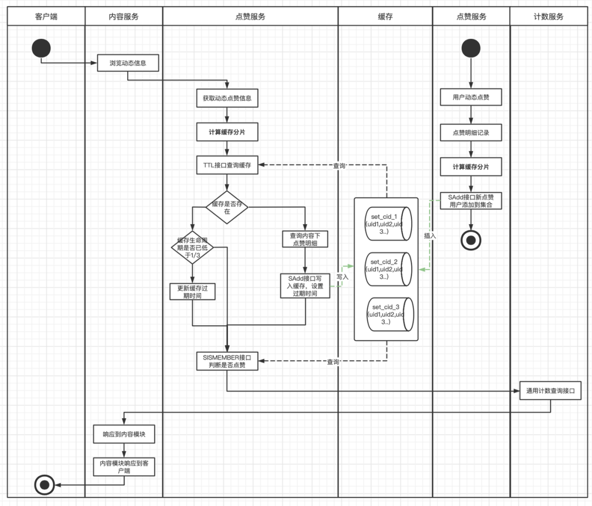

## **背景**

内容点赞业务在得物社区中是一个非常高频的业务场景，功能本身复杂度不高，但是业务场景多、QPS高、而且由于社区的用户体量，整体点赞的数据量非常大。其中最核心、对响应性能要求最高的主要是“用户是否点赞内容”和“内容点赞数”场景。

在得物社区中凡是有内容消费的场景，都会有上面两个点赞场景的处理，所以整体点赞业务的QPS在社区都是非常高的。当我们在刷各种Feed流时，每一次下滑，都需要对数十篇内容进行登录用户是否点赞状态的判断。作为基础业务，内容点赞业务的高性能响应，对上游内容场景的消费体验有极大的影响。

本文对得物社区的点赞业务如何做到高性能响应以及历史上在缓存使用上关于高性能、稳定性、低成本上的优化探索过程进行讲述，希望能给读者带来一些收获。

## **演进探索**

## **v1.0版本**

### **功能需求**

社区各种Feed流及内容详情页“登录用户是否已点赞内容” “内容被赞总数” “内容最新点赞用户列表”几个场景消费展示。

### **实现方案**

点赞业务整体的高性能是基于Redis+MySQL架构。MySQL做数据存储和查询支持，Redis撑起业务的高性能响应。在1.0版本中，服务架构还是单体PHP服务，技术方案上将动态下所有的点赞用户查询出来放到PHP数组里，然后序列化为Json字符串以Key/Value的方式存储到Redis中，当用户浏览内容时，取出缓存数据，反序列化Json为PHP数组，然后通过in_array和count方法判断是否已点赞及内容点赞数。在缓存的维护上，则是每一次有新用户点赞或取消赞则直接清除Redis。

缓存结构图下：


```plain text
cId => '[uid1,uid2,uid3...]'
```

流程图如下：


### **主要问题**

这个版本的方案存在比较多待优化点。

第一、缓存构造时要查询动态下所有点赞用户数据，数据量大，容易产生慢SQL，对DB和带宽都可能有比较大的压力。

第二、缓存存储数据结构上为Key/Value结构，每次使用时需先从Redis查询，再反序列化成PHP数组，in_array()和count()方法都有比较大的开销，尤其是查询热门动态时，对服务器的CPU和MEM资源都有一定浪费，对Redis也产生了比较大的网络带宽开销。

第三、缓存维护上，每次新增点赞都直接清除缓存，热门动态大量点赞操作下会出现缓存击穿，会造成大量DB回查操作。

## **v2.0版本**

大家都知道一些热点事件很容易在社区中发酵，得物社区自然也存在这种情况。在某一场热点事件中，得物社区瞬间出现多篇热点内容，大量用户进入得物社区浏览相关动态并点赞，从v1.0版本的点赞维护流程上可以看出执行缺陷，即每次有新点赞都会清除缓存！当有大量用户浏览热点动态，同时又有大量用户在点赞而导致缓存清除的场景下，缓存被击穿的风险非常高，这样会导致大量查询请求打到DB层，研发侧在评估风险之后，连夜进行了缓存改造。

### **功能需求**

1、解决热点内容缓存击穿的风险。

2、优化代码层面对缓存数据序列化和反序列化导致的服务器资源消耗。

### **实现方案**

这次改造，除了优化解决缓存击穿的风险外，也针对之前缓存本身的一些不足之处，思考了一些更高效的实现。在缓存数据结构上摒弃了之前的Key/Value结构，采用了集合结构。集合的特性保证集合中的用户ID不会出现重复，可以准确维护了动态下的点赞总数，通过查看用户是否在集合中，可以高效判断用户是否点赞内容。这样解决每次查询时需要从Redis中获取全部数据和每次需要代码解析Json的过程，Redis集合支持直接通过**SISMEMBER**和**SCARD**接口判断是否赞和计算点赞数，从而提升了整个模块的响应速度和服务负载。在缓存维护上，每次有新增点赞时，主动向集合中添加用户ID，并更新缓存过期时间。每次查询时，也同样会查询缓存的剩余过期时间，如果低于三分之一，就会重新更新过期时间，这样避免了热门动态有大量新增点赞动作时，出现缓存击穿的情况。

缓存结构如下：


```plain text
cid => [uid1,uid2,uid3...]
```

流程图如下：


### **主要问题**

在技术方案中，会将动态下全部的点赞记录全部查出，放入一个集合中，当动态是一个热门动态时，点赞用户量会非常大，此时集合变成了一个大Key，而大Key的清理对Redis的稳定性有比较大的影响，随时可能会因为缓存过期，而引起Redis的抖动，进而引起服务的抖动。并且每次查询出全部的点赞用户，容易产生慢SQL，对网络带宽也比较有压力。

## **v3.0版本**

### **功能需求**

1、解决V2.0版本中缓存大Key风险。

2、优化缓存重建时查询内容全部点赞用户产生的慢SQL场景。

### **实现方案**

在3.0版本中，对大Key进行了打散处理，对同一个动态下的点赞用户，进行打散分片再维护到缓存，每次操作缓存时先根据用户ID计算分片值，这样每个分片都具有更小的体积和更快的维护和响应速度。而点赞总数的获取，此时社区服务已经迁移到Go服务架构，我们也搭建了单独的计数服务，单独维护内容的被赞总数，节省了scard接口的消耗。

缓存结构如下：


```plain text
cid_slice1 => [uid1,uid11,uid111...] 
cid_slice2 => [uid2,uid22,uid222...] 
cid_slice3 => [uid3,uid33,uid333...] 
...
```

流程图如下：



### **主要问题**

如果仅仅从技术实现上看v3.0版本，似乎已经暂时达到了一个水平，在一定时间内也能正常支撑社区点赞业务的高性能响应。但是如果从业务角度和全局观念上去考虑，这个设计方案仍旧存在比较多的优化点。例如：

缓存分片中仍旧维护了被浏览动态下全部的点赞用户数据，消耗了非常大的Redis资源，也增加了缓存维护难度。缓存数据的有效使用率很低，推荐流场景下，用户浏览过的动态，几乎不会再次浏览到。

当前技术方案针对单篇内容进行设计，在各种Feed流场景中，查询任务在点赞服务里其实放大了十数倍。这种放大对服务器、Redis以及DB，都产生一定的资源消耗浪费。

一些点赞量特别多的历史动态，有人访问时均会重建缓存，重建成本高，但使用率不高。

缓存集合分片的设计维护了较多无用数数据，也产生了大量的Key，Key在Redis中同样是占用内存空间的。

... ...

总结一下，较高的服务器负载、Redis请求量、DB请求量。非常大的Redis资源使用(几十GB)。

所以我们需要一个更优的方案，解决优化以下现象：

1、Feed流场景下批量查询内容任务放大导致的服务器负载，Redis请求，DB请求放大现象。

2、缓存更高效的存储和使用，降低缓存整体的使用量。

3、缓存更高的命中率。

4、区分冷热数据。

### **实际Feed场景下的实现逻辑：**

批量查询动态点赞数据


## **V4.0版本**

### **功能需求**

结合实际业务场景，大部分场景上游服务都是批量判断是否点赞，社区的动态本身也存在一定的新鲜度(冷热)。对新缓存的要求是：

1、能解决Feed流场景下批量查询流量放大现象。

2、缓存数据区分冷热，减少无效存储（能在内容和点赞用户角度都区分冷热数据）。

3、缓存结构要简单易维护，使业务实现要清晰明了。

### **实现方案**

**设计思路**

1、批量查询任务之所以放大是因为之前的缓存是以内容为维度进行设计，新方案要以用户为维度进行设计。

2、旧方案中访问内容点赞数据会重建缓存，有些老旧内容重建缓存性价比低，而且内容下的点赞用户并不是一直活跃和会重新访问内容，新方案要等区分冷热数据，冷数据直接访问DB，不再进行缓存的重建/更新维护。

3、旧方案在维护缓存过期时间和延长过期时间的设计中，每次操作缓存都会进行ttl接口操作，QPS直接x2。新方案要避免ttl操作，但同时又可以维护缓存过期时间。

4、缓存操作和维护要简单，期望一个Redis接口操作能达到目的。

所以新方案Redis数据结构的选择中，能判断是否点赞、是否是冷热数据、是否需要延长过期时间，之前的集合是不能满足了，我们选择**H****ash表结构。**用户ID做Key，contentId做field，考虑到社区内容ID是趋势递增的，一定程度上coententID能代表数据的冷热，在缓存中只维护**一定时间和一定数量**的contentID，并且增加minCotentnID用于区分冷热数据，为了减少ttl接口的调用，还增加ttl字段用户判断缓存有效期和延长缓存过期时间。一举三得！

缓存结构如下：


```plain text
{
  "userId":{
    "ttl":1653532653,    //缓存新建或更新时时间戳
    "cid1":1,            //用户近一段时间点赞过的动态id
    "cid2":1,            //用户近一段时间点赞过的动态id
    "cidn":1,            //用户近一段时间点赞过的动态id
    "minCid":3540575,    //缓存中最小的动态id，用以区分冷热，
  }
}
```

- **在实际业务场景流程如下：**


通过流程图，我们可以清晰看到， 上游Feed流，一次批量查询请求，没有了循环逻辑，最优情况下，只有一次Redis操作，业务实现也非常简单明了。

- **优化结果**

优化前后Redis查询量QPS日常峰值下降了20倍。


优化前后接口平均RT下降了10倍。


优化前后DB查询量QPS日常峰值下降了6倍。


优化前后缓存节省了16G左右存储空间。


## **后续**

优化不会结束，技术不会停止，技术方案会随着业务的演进而演进。

## **总结**

本篇文章中对得物社区点赞业务缓存优化的探索演进做了相关历史背景和技术方案的解析，当前其中还有更多的细节。而这么多次版本的优化，都是根据实际的业务场景中出现的风险点以及需求不断摸索出来的，每个版本的方案也都不是完美方案，v4.0也不是最终方案，还需要开发人员也需要进一步思索，探索更优的技术方案。

并且随着业务的不断发展迭代，会涌现出更多的场景和困难，我们一直在优化探索的路上。

<br/>

**原文链接**： [https://mp.weixin.qq.com/s/ZIzeTIV-mhWFimc5S8N83Q](https://mp.weixin.qq.com/s/ZIzeTIV-mhWFimc5S8N83Q)

<br/>

