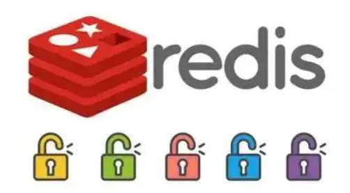
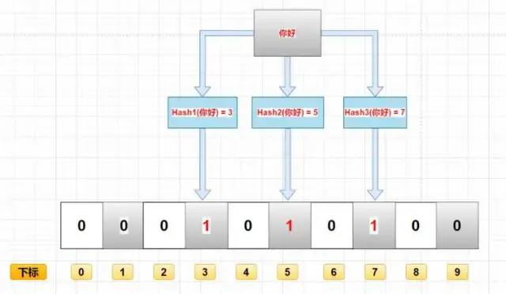
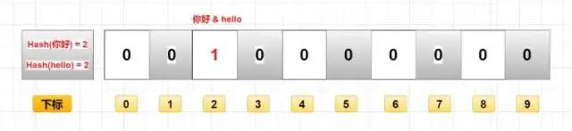

<br/>

## Redis网红面试题三连

- 面试题1：怎么解决缓存穿透问题的？

- 面试题2：说一下缓存击穿吧，你们是怎么解决的？

- 面试题3：那缓存雪崩说说你们是怎么解决的？



## 面试题1：怎么解决缓存穿透问题的？

缓存穿透：指缓存和数据库中都没有的数据，导致所有的请求都打到数据库上，然后数据库还查不到（如null），没法写缓存，造成数据库短时间线程数被打满而导致其他服务阻塞，最终导致线上服务不可用。此时缓存就好像被穿透了一样，起不到任何作用。

当然，使用缓存难免会有穿透的发生。

- 缓存容量有限，不可能去缓存所有数据，查询到未被缓存的数据就会发生穿透是正常情况。

- 互联网业务的数据访问模型一般是遵循二八原则的，即 20% 的数据为热点数据，80% 的数据是非热点不被常访问的数据。既然缓存容量有限，且20%的数据为热点数据，那我们可以利用有限的容量去缓存那 20% 的数据来保护我们的系统，至于80%非热点不常用的数据发生穿透就穿透了，数据库吃得住。

**那我们怎样来解决这种缓存穿透问题呢？**

- 接口参数校验：

防君子不防小人。在参数校验层加上参数合法性校验，如查询订单ID为20位随机值，正则核对一下ID长度是否规范，不规范地直接过滤掉。

- **设置空值：**

当访问缓存和DB都没有查询到值时，该key我们当做是恶意参数来看，可以将该key的空值写进缓存，设置较短的过期时间。

但是如果有大量的获取并不存在数据的穿透请求的话如恶意攻击，则会浪费缓存空间，如果这种null值过量的话，还会淘汰掉本身缓存存在的数据，这就会使我们的缓存命中率下降。

因此在使用设置空值方案时，我们要做好监控，预防缓存空间被过多null值占领造成的缓存空间浪费，如果这种数据量太大，就不再建议使用，那就使用另一种方案，即布隆过滤器。

- **布隆过滤器：**

布隆过滤器在查询缓存之前起到初步过滤作用，布隆过滤器存储所有可能访问的 key，将不存在的 key 直接过滤，存在的 key 再进一步查询缓存和数据库。

布隆过滤器的特点是判断不存在的，则一定不存在；判断存在的，大概率存在，但也有小概率不存在。并且这个概率是可控的，根据具体需求，我们可以让这个概率小幅降低或变高。


布隆过滤器由一个 bitSet 和 一组 Hash 函数（算法）组成，是一种空间效率极高的概率型算法和数据结构，通过二进制来进行数据存储。在初始化时，bitSet 的每一位被初始化为0。

当数据加入布隆过滤器集合时，流程如下：



- 经过K个哈希函数计算该数据，返回K个计算出的hash值

- 这些K个hash值映射到对应的K个二进制的数组下标

- 将K个下标对应的二进制数据改为1。

布隆过滤器查询一个key是否在集合中，流程如下：

- 经过K个哈希函数计算该数据，对应计算出的K个hash值

- 经过hash值找到对应的二进制的数组下标

- 如果存在其中一处位置的二进制数据是0，那么该数据不存在。若是都是1，该数据存在集合中（但由于存在Hash碰撞，判断数据存在时可能存在误判）。

**布隆过滤器的优缺点**

优势

- 因为存储的是二进制数据，因此占用的空间很小；

- 它的插入和查询速度是很是快的，时间复杂度是O（K），能够联想一下HashMap的过程；

- 保密性很好，由于自己不存储任何原始数据，只有二进制数据

缺点

- 存在误判

添加数据是经过计算数据的hash值，hash是存在碰撞的，也就是说，存在两个不一样的数据计算获得相同的hash值。



例如图中的你好和hello，假如最终算出hash值相同，那么他们会将同一个下标的二进制数据改成1。因此也无法确定key为你好和hello是否存在。

- 删除困难

如上，你好和hello的hash值相同，对应的数组下标也是同样的。如果想删除你好，即将坐标值改为0，可能会影响到其他key，比如是否会连hello都一块儿删了之类的。

## 面试题2：说一下缓存击穿吧，你们是怎么解决的？

> 缓存击穿：指缓存中没有但数据库中有的数据（一般是热点数据缓存时间到期），这时由于并发用户特别多，同时读缓存没读到数据，又同时去数据库去查，引起数据库压力瞬间增大，线上系统卡住。

**解决方案：**

**1、加互斥锁（mutex key）。**在并发的多个请求中，只有第一个请求线程能拿到锁并执行数据库查询操作，其他的线程拿不到锁就阻塞等着，等到第一个线程将数据写入缓存后，直接走缓存。

> 互斥锁

	缓存击穿后，多个线程会同时去查询数据库的这条数据，那么我们可以在第一个查询数据的请求上使用一个互斥锁来锁住它。

	其他的线程走到这一步拿不到锁就等着，等第一个线程查询到了数据，然后做缓存。后面的线程进来发现已经有缓存了，就直接走缓存。


```java
    static Lock reenLock = new ReentrantLock();
    public List<String> getData04() throws InterruptedException {
        List<String> result = new ArrayList<String>();
        // 从缓存读取数据
        result = getDataFromCache();
        if (result.isEmpty()) {
            if (reenLock.tryLock()) {
                try {
                    System.out.println("拿到锁了,从DB获取数据库后写入缓存");
                    // 从数据库查询数据
                    result = getDataFromDB();
                    // 将查询到的数据写入缓存
                    setDataToCache(result);
                } finally {
                    reenLock.unlock();// 释放锁
                }

            } else {
                result = getDataFromCache();// 先查一下缓存
                if (result.isEmpty()) {
                    System.out.println("我没拿到锁,缓存也没数据,先小憩一下");
                    Thread.sleep(100);// 小憩一会儿
                    return getData04();// 重试
                }
            }
        }
        return result;
    }
```

**2、热点数据不过期。**根据实际业务情况，在Redis中维护一个热点数据表，批量设为永不过期（如top1000），并定时更新top1000数据。

这种方式适用于比较极端的场景，例如流量特别特别大的场景，使用时需要考虑业务能接受数据不一致的时间，还有就是异常情况的处理，不要到时候缓存刷新不上，一直是脏数据，那就凉了。

## 面试题3：那缓存雪崩说说你们是怎么解决的？

缓存雪崩：大量的热点 key 设置了相同的过期时间，导致缓存在同一时刻全部失效，造成瞬时数据库请求量大、压力骤增，引起雪崩，甚至导致数据库被打挂。缓存雪崩其实有点像升级版的缓存击穿，缓存击穿是一个热点 key，缓存雪崩是一组热点 key。

**解决方案：**

**1、过期时间打散：**既然是大量缓存集中失效，那最容易想到就是让他们不集中生效。可以给缓存的过期时间加上一个随机值时间，使得每个 key 的过期时间分布开来，不会集中在同一时刻失效。

**2、热点数据不过期：**缓存永不过期，异步更新缓存数据。虽然不会出现雪崩效应，却无法保证数据的一致性。

**3、加互斥锁：**jvm锁机制、分布式锁机制都可以。该方式和缓存击穿一样，按 key 维度加锁，对于同一个 key，只允许一个线程去计算，其他线程原地阻塞等待第一个线程的计算结果，然后直接走缓存即可。

