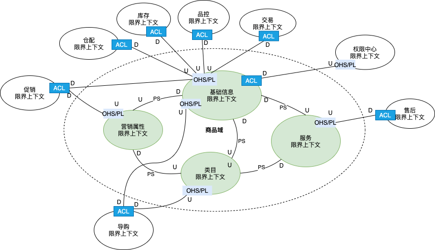
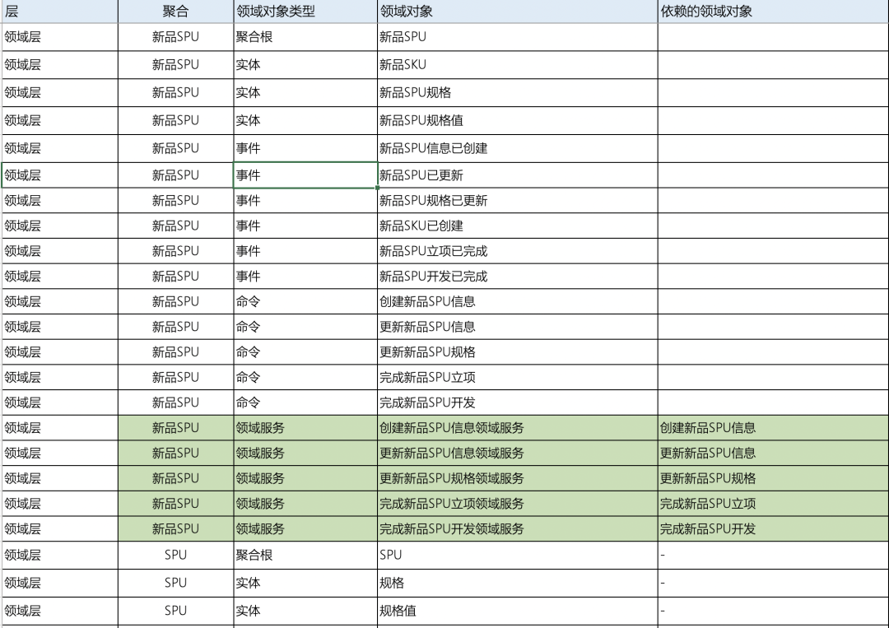
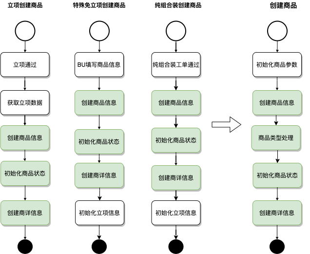
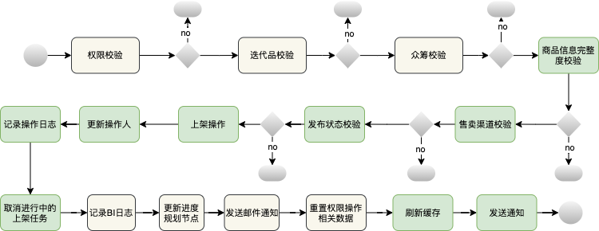
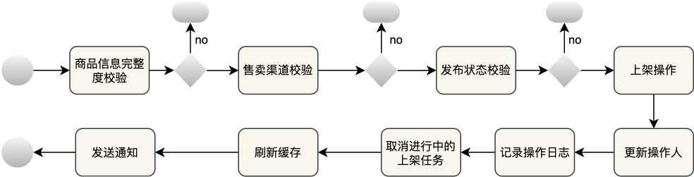
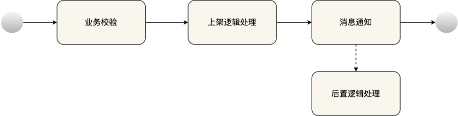
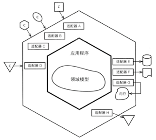
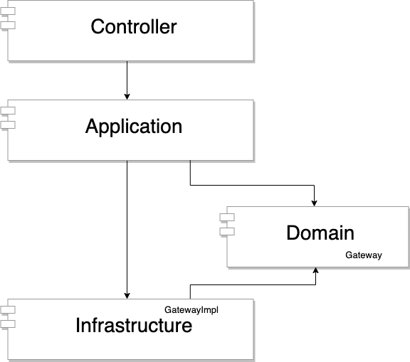
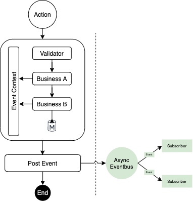
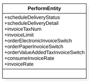

商品中心随着自身业务的发展，系统复杂度逐渐变高。在业务治理过程中，我们尝试引入了DDD来辅助进行现有业务的模型重建，并在此基础上完成了中台服务能力的沉淀和对外提供。通过将核心业务逻辑下沉内聚，降低调用方的业务复杂度，防范逻辑腐化。

## **1 前言**

商品中心业务主要包括商品、类目等核心数据维护，负责和支撑严选内部商品相关的业务协同。在业务的快速发展过程中，系统的复杂度也不断提升。原来的架构已经无法适应内外部的需求，因此从17年开始，商品中心逐步经历了管理后台拆分、商品中心服务化、商品数据迁移等工作，并且在不断优化，以适应严选日益增长的业务量。19年开始，严选开始进行中台化架构升级。我们尝试引入了DDD来辅助进行现有业务的模型重建，并在此基础上完成了中台服务能力的沉淀和对外提供。通过将核心业务逻辑下沉内聚，降低调用方的业务复杂度，防范逻辑腐化。当前，商品中心已经构建了一工作台一中台两个查询服务的系统架构。

本文将介绍中台服务建设的相关过程、踩坑记录，同时给需要进行类似尝试的开发童鞋一定的参考和借鉴。

## **2 系统的痛点有哪些？**

众所周知，软件系统总是在不知不觉之间变得庞大，如果没有及时干预，系统的脉络就会和毛线球一样难以解开。商品中心目前主要有以下几点突出问题：

### **2.1 业务逻辑重复**

当采用自然式的流程开发，在初期业务不复杂时，系统业务脉络还比较简单。一旦经历了多个版本以上的迭代，脚本式开发的代码不断增删内容，甚至出现同一段代码拷贝后微调了部分逻辑，造成逻辑的冗余，从而增加理解和迭代的成本。举例商品的创建链路：

1. 开发完成后自动创建商品

1. 工单审核后自动创建纯组合装商品

1. 直接创建特殊免立项商品

1. 采购迁移后台创建商品

因为前期没有从模型的能力视角进行设计，且由于商品创建的部分差异和中途经历了不同的同事开发等原因，结果是项目中存在多分类似又有一定差异的代码，导致维护变得越来越困难，出了一些漏改导致的BUG。

### **2.2 模块耦合太重**

商品工作台作为业务进行商品管理的入口服务，承担了大量业务协同和商品数据配置的内容。由于没有隔离，导致业务协同和商品管理的逻辑耦合太深，不利于各模块的复用和优化。

## **3 DDD简介**

领域驱动设计（domain-driven design），是指通过设计领域模型，来驱动软件设计，最终指导代码落地的过程。一个业务领域划分为若干个限界上下文（Bounded Context），领域模型处于各自的限界上下文之内。DDD的具有以下特点：

- **更明确的边界**

	DDD的设计原则，是使系统的边界更加清晰，让我们本能的进行软件系统的分而治之。这是其最具价值的地方，当我们把问题分的越小，它的解决也越简单。

- **更通用的语言**

	当边界确定后，边界内的术语（名词对象、动作等），在产品、开发、测试的共同努力下，将形成具有共识的通用语言。特别是可以在后续的迭代保证这些术语是通用的。这里特别提到了通用语言的确定不再只由开发人员来决定了，是业务相关人员的共识，也更能加深大家对领域模型的了解。

- **更内聚的逻辑**

	一个明确的问题域中，子问题都会落到边界内负责处理，逻辑更加内聚，对外界隔离。

作为业务研发人员，本质是通过技术更好实现业务价值。面对当前系统中的问题，我们希望DDD能在系统改造的过程中发挥它的作用。

## **4 系统改造之路**

商品中台服务搭建，核心思路是：**抽取核心业务逻辑->抽象流程->标准化能力。**

虽然是对现有业务的改造，但是在系统建模的流程上我们尽量趋向于从头开始设计。这样做的好处是：可以尽可能避免受到现有表结构设计的干扰。沿用DDD的经典步骤如下：

### **4.1 战略设计**

在这过程中，主要是明确系统的通用语言。例如我们在商品中心服务的设计过程中，我们明确了系统模型和行为，划分子域，并编制了限界上下文和上下文映射图，形成了包括产品和开发在内所普遍认可的通用语言。子域又分为几类：核心域、支撑子域、通用子域；其中核心域是整个业务域的主要成员。支撑域不是核心，负责一些具体的业务。如果支撑域可以适用整个系统，那么就变成通用域。商品中心主要通过两个步骤完成战略设计：

- **领域愿景说明（Domain Vision Statement）**

	由产品技术等人员阐述商品域的核心能力：商品板块负责商品管理：包括商品和SKU等核心数据维护、商品相关配置，负责和支撑严选内部商品相关的业务协同：包括新品开发全流程（新品立项、寻源、报改价、采购侧工单、包装设计、上线信息评审等）、售价变更、重新售卖等。

- **突出核心（Highlighted Core）**

	通过对业务的梳理，抽出核心模型：SPU、SKU、物理类目、配送区域、营销配置、售后地址、服务政策等，并将这些模型按聚合关系划分为四个子域。

	

### **4.2 战术设计**

战术设计是将战略设计进行具体化，这个过程中将明确各子域的聚合、实体、值对象、领域实践、领域服务等，不做详细展开，详细可参考《实现领域驱动设计》（沃恩•弗农 (Vaughn Vernon)） 。在上述阶段，可以通过OOAD（面向对象分析方法）、四色建模、事件风暴等方式。在我们的项目中，我们通过事件风暴识别领域事件、命令，并完成了边界、聚合的划分。

**事件风暴：**简单概括就是通过X主体，执行了A命令，产生了B事件的这样一个流程，来梳理核心的业务流程和规则，输出业务对象，并推导出相关的领域模型。常用模型如下：

- **Entity（实体）**每个实体是唯一的，允许状态发生变化，但是一定有唯一标识。

- **ValueObject（值对象）**值对象用于描述实体，值对象和实体的区别是不需要感知唯一标识。

- **Aggregate（聚合）**聚合是一种特殊的实体，是由一组与强相关的实体和值对象组合而成的。

- **Bounded Context（限界上下文）**用来封装通用语言和领域对象，通常一个子域对应一个限界上下文。

领域对象表梳理如下：

### **4.3 编码流程**

本节主要介绍商品中心在实施过程中对一些场景的改造方法。

**4.3.1 重复流程的抽象方法**

在代码改造中，可以发现有些分散在不同位置却干着相同流程的代码。对于这部分代码，我们需要抽象出业务流程，并对其进行逻辑的统一收拢。

严选的作为品牌电商，自营立项流程是我们区别行业所特有的业务，举例现状分析中提到的商品创建流程，通过三步骤（**梳理流程列表-->标记共同流程-->输出通用流程**），分析业务逻辑，找到核心链路如下：

**4.3.2 核心逻辑的抽象方法**

在改造中也会遇到流程较长的链路，我们需要获取到核心节点，排除非核心节点，从而输出该业务的链路。通过三个步骤进行：

- **梳理业务节点**

- **抓取关键节点**

在对链路分析后，按领域模型相关性，标记核心节点（绿色部分），形成简化版的节点图：

- **收敛逻辑**

在这个过程中，需要对节点进行重构，主要进行节点合并和节点异步化两块内容：

	- **节点合并：**校验节点，我们可以归位一个统一节点，实际业务操作的节点也按聚合合并。

	- **非阻塞流程异步化：**通过分析，其实有些操作是可以异步化的。例如：操作人、操作日志、上架任务的取消、缓存刷新等可以在消息通知订阅后处理，从而继续简化核心链路。

实际上核心逻辑被我们分解成了四个阶段：

通过这些过程，我们对核心流程进行了逻辑重构，从结果上看，核心逻辑下沉到中台服务内，减少接入方的逻辑处理和代码量，使维护性得到了较大的提升。在商品创建这个案例中，光代码量上就缩减了2/3左右，长远看，会降低未来迭代时逻辑梳理的时间和人力成本。

## **5 ****相关设计**

### **5.1 服务架构**

在严选中台建设初期，我们为后续的应用架构标准进行了激烈的讨论，对比经典四层架构、COLA（整洁结构）之间的优缺点。

虽然经典架构更直观，但鉴于COLA对领域模型为中心的设计，保证领域层的独立性，最终促成我们采用COLA架构作为统一的模版，和六边形架构类似，它的核心理念是：应用是通过端口与外部进行交互的，内部业务逻辑（应用层和领域模型）与外部资源（外部服务，数据库资源、消息中间件等）相互隔离，仅通过适配器进行交互。

有别于传统的用户界面、接口层、逻辑层、持久化层的从外到内的分层模型，这是种全新的思想，我们认为用户界面、数据库、消息等都属于平等的外部方，他们都需要通过端口和应用交互，COLA的思想中，更加突出了架构核心是领域模型。 

商品中台服务在此基础上的系统分层如下：

### **5.2 事件机制**

场景：修改SKU售价，被我们打包成一个具体的能力如下：

上述场景中，应用层调用“更新售价”的领域行为后，还要处理其他行为，等所有行为处理完成后事件才对外发送。因此我们的消息机制需要满足以下要求：

- **事件提交 **允许事件提交到当前场景

- **事件异步和控制 **指的是可以控制事件实际对外通知的时机

- **事件异常重试 **异常后支持重试实现业务补偿

消息初始化流程如下：

系统初始化逻辑：

1. 容器启动

1. 完成Listeners实例创建

1. 初始化EventBus事件总线

1. 从BeanFactory扫描所有Listeners

1. 注册Listeners到EventBus事件总线

实际消息处理流程：

在应用层处理完所有业务并完成事务提交后，系统将暂存在EventContext中的消息post到异步处理的eventBus中，由eventBus协调消息的投递和处理。

如果是内部消息，直接由订阅者处理，如果是外部消息，由订阅者通过MQ转发至外部。

当然，我们需要支持事件定制的消息异常处理机制，对于有需要重试的消息，允许在启动时注册重试处理器。

## **6 讨论**

在实践中，也发现一些问题和解决思路供大家参考

### **6.1 实体范围大小问题**

在设计中，我们存在把同一类属性归为一个实体，但是实际使用中，会发现对该实体的使用仍然是按模块的。例如履约实体：

设计之初，我们将商品的预约配送、发票开关、税率等都归为履约实体，但在实际应用中，实际还是按子业务配置，那么在对实体更新的处理逻辑中，需要过多关注属性覆盖等问题，这就是没有拆分完全，履约实体内其实可以再拆分为三个实体。因此设计时不光要考虑属性的相似性，更要结合业务场景进行设计。

### **6.2 模型的开发模式选择**

首先明确分类，因为这里会出现不同时期对贫血模型的定义歧义，导致大家理解的不同。

- **失血模型：**实体只有setter/getter

- **贫血模型：**domain ojbect包含了不依赖于持久化的业务逻辑

- **充血模型：**绝大多业务逻辑都应该被放在domain object里面(包括持久化逻辑)，而Service层应该是很薄的一层

- **胀血模型：**取消Service层，只剩下domain object和DAO两层，在domain object的domain logic上面封装事务。

在这种定义下，充血和贫血其实各有好处，本质上我认为依然负责领域模型包含业务的思想。我们采用贫血模式，在保留模型业务逻辑的同时，不希望引入持久化逻辑，兼顾开发接受度和模型的整洁度。

### **6.3 服务粒度**

微服务粒度建议按子域范围拆分。如果拆分太细，需要考虑分布式事务问题，增加了复杂度（特别是对于一些核心域有数据一致性要求的场景）。

## **7 结尾**

本文主要介绍了商品中心中台服务创建过程中的DDD实践思路、业务改造案例、服务架构设计、消息机制等内容。希望其中的一些类似案例和实施手段可以为后续其他产品线实践提供一个探索思路。

当然，后端服务的架构演进远非如此简单。在完成现有业务的改造后，依然会面临业务变更和新增业务的挑战，系统的模型也不是一成不变的，我们也依然需要对系统进行不断的自我更新以适应业务的发展。

 

